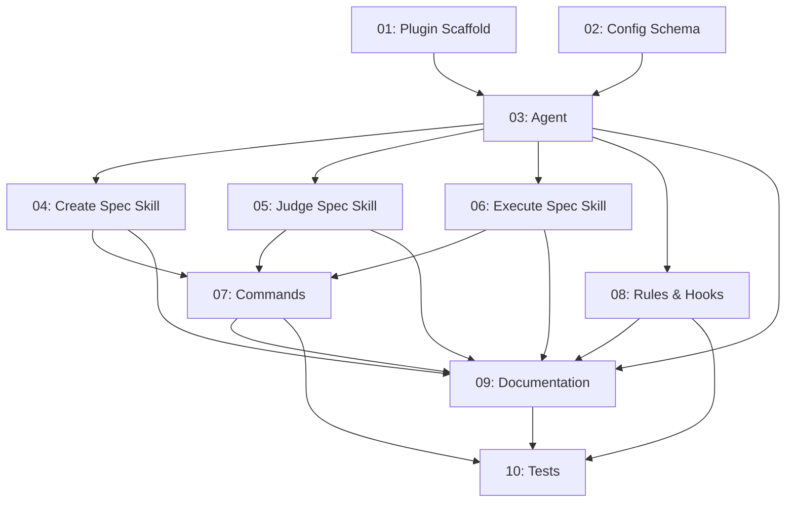

# Spec: zoto-spec-system

## Status
In Progress

## Overview

Build a standalone Cursor plugin called `zoto-spec-system` that provides a generic spec workflow system: plan, judge, and execute. The plugin is fully decoupled from CRUX — no CRUX notation, compression, or dependencies. Any repo can install it via the Cursor Marketplace to get structured planning, independent assessment, and guided execution with adversarial verification.

All plugin assets use the `zoto-` prefix (commands, agents, skills). The memory system is not included but the plugin documents how to extend it with a future CRUX memory plugin.

The plugin lives at `plugins/zoto-spec-system/` in this repo during development and is self-contained for extraction and marketplace submission.

## References

- **Cursor plugin spec**: https://cursor.com/docs/reference/plugins
- **Cursor plugins marketplace repo**: https://github.com/cursor/plugins (directory structure, `plugin.json` schema, `marketplace.json`)
- **Cursor plugin template**: https://github.com/cursor/plugin-template
- **Agent skills spec**: https://agentskills.io (SKILL.md format, frontmatter schema)
- **Source material to generalize from**: `.cursor/agents/crux-planner.md`, `.cursor/skills/crux-create-plan/`, `.cursor/skills/crux-judge-plan/`, `.cursor/skills/crux-execute-plan/`, `.cursor/commands/crux-plan.md`, `.cursor/commands/crux-judge.md`, `.cursor/commands/crux-execute.md`
- **Memory system design**: `docs/crux-memories.md` (for the extension guide — the memory system itself is NOT included in this plugin)

## Key Decisions

1. **Plugin name**: `zoto-spec-system`, display name "Spec System"
2. **Asset prefix**: `zoto-` for all commands, agents, and skills
3. **No CRUX dependency**: No references to CRUX.md, crux-utils, CRUX notation, or CRUX-specific tooling
4. **Memory system**: Not included. README documents how to add it later from a future plugin
5. **Configuration**: Consuming repos configure via `.zoto-spec-system/config.json`
6. **Plugin format**: Follows the `cursor/plugins` marketplace repo structure — `.cursor-plugin/plugin.json` manifest per https://github.com/cursor/plugins
7. **`unitOfWork`**: Configurable (default: `spec`). Consumers set to `prp`, `task`, `story`, etc.
8. **Specs directory**: Configurable (default: `specs/`). Consumer can override via config
9. **Spec file naming**: All files in a spec directory use `-[yyyymmdd]` suffix before `.md` extension
10. **Adversarial verification**: Mandatory during `/zoto-spec-execute` — fresh agent verifies each subtask's deliverables independently
11. **Execution report**: Written to plan directory as `execution-report-[feature]-[yyyymmdd].md` on completion

## Requirements

1. Plugin manifest (`.cursor-plugin/plugin.json`) follows the Cursor marketplace spec
2. Agent `zoto-spec-generator` handles plan, judge, and execute modes
3. Three skills: `zoto-create-spec`, `zoto-judge-spec`, `zoto-execute-spec`
4. Three commands: `/zoto-spec-create`, `/zoto-spec-judge`, `/zoto-spec-execute`
5. Integration rule teaches agents about the spec system
6. Hooks wire session start nudges
7. Config schema supports `unitOfWork`, `workDir`, `specsDir`, and extensibility
8. `/zoto-spec-judge` without args assesses the repo; with a plan path assesses that plan
9. `/zoto-spec-execute` includes adversarial verification per subtask and writes execution report
10. Plugin README includes memory system extension guide
11. Plugin is self-contained — no files outside `plugins/zoto-spec-system/`
12. All content is generic and repo-agnostic

## Subtask Manifest

| ID | File | Subagent | Dependencies | Phase | Status |
|----|------|----------|-------------|-------|--------|
| 01 | `subtask-01-spec-system-plugin-scaffold-20260403.md` | generalPurpose | — | 1 | Done |
| 02 | `subtask-02-spec-system-config-schema-20260403.md` | generalPurpose | — | 1 | Done |
| 03 | `subtask-03-spec-system-agent-20260403.md` | generalPurpose | 01, 02 | 2 | Done |
| 04 | `subtask-04-spec-system-create-spec-skill-20260403.md` | generalPurpose | 03 | 3 | Done |
| 05 | `subtask-05-spec-system-judge-spec-skill-20260403.md` | generalPurpose | 03 | 3 | Done |
| 06 | `subtask-06-spec-system-execute-spec-skill-20260403.md` | generalPurpose | 03 | 3 | Done |
| 07 | `subtask-07-spec-system-commands-20260403.md` | generalPurpose | 04, 05, 06 | 4 | Done |
| 08 | `subtask-08-spec-system-rules-hooks-20260403.md` | generalPurpose | 03 | 3 | Done |
| 09 | `subtask-09-spec-system-documentation-20260403.md` | generalPurpose | 03, 04, 05, 06, 07, 08 | 5 | Done |
| 10 | `subtask-10-spec-system-tests-20260403.md` | generalPurpose | 07, 08, 09 | 6 | Done |

## Subtask Dependency Graph

## Execution Order

### Phase 1 (Parallel)
| ID | Subagent | Description |
|----|----------|-------------|
| 01 | generalPurpose | Plugin scaffold — `.cursor-plugin/plugin.json`, directory structure, LICENSE |
| 02 | generalPurpose | Config schema — `.zoto-spec-system/config.json` format, defaults, validation |

### Phase 2 (after Phase 1)
| ID | Subagent | Description |
|----|----------|-------------|
| 03 | generalPurpose | Agent `zoto-spec-generator` — plan/judge/execute modes, config-driven, generic |

### Phase 3 (Parallel, after Phase 2)
| ID | Subagent | Description |
|----|----------|-------------|
| 04 | generalPurpose | Skill `zoto-create-spec` — guided plan creation workflow |
| 05 | generalPurpose | Skill `zoto-judge-spec` — repo and plan assessment with scoring rubric |
| 06 | generalPurpose | Skill `zoto-execute-spec` — phased execution, adversarial verification, execution report |
| 08 | generalPurpose | Rules and hooks — integration rule, session hooks, hooks.json |

### Phase 4 (after Phase 3)
| ID | Subagent | Description |
|----|----------|-------------|
| 07 | generalPurpose | Commands `/zoto-spec-create`, `/zoto-spec-judge`, `/zoto-spec-execute` |

### Phase 5 (after Phase 4)
| ID | Subagent | Description |
|----|----------|-------------|
| 09 | generalPurpose | README, CHANGELOG, memory extension guide |

### Phase 6 (after Phase 5)
| ID | Subagent | Description |
|----|----------|-------------|
| 10 | generalPurpose | Tests — plugin structure validation, config schema, content integrity, cross-references |

## Risk Assessment

| Risk | Likelihood | Impact | Mitigation |
|------|-----------|--------|------------|
| Plugin.json schema mismatch with Cursor spec | Low | Medium | Validate against `cursor/plugins` repo examples and agentskills.io spec (subtask 01) |
| CRUX leakage into plugin files during execution | Medium | Medium | Subtask 10 includes content integrity test; executing agents warned explicitly |
| Subtask 03 scope (heaviest single task) | Medium | High | Full source material provided; executing agent should reference all 7 source files |
| `zoto-` prefix collision with consuming repo assets | Low | Low | Documented as reserved prefix in README |
| Plugin removal/uninstall | Low | Low | Cleanup/uninstall guidance included in README (subtask 09) |

## Definition of Done
- [ ] All 10 subtasks completed
- [ ] Plugin directory is self-contained at `plugins/zoto-spec-system/`
- [ ] `.cursor-plugin/plugin.json` is valid and follows marketplace spec
- [ ] All commands, skills, agent use `zoto-` prefix consistently
- [ ] No references to CRUX, crux-utils, CRUX.md, or CRUX notation anywhere in the plugin
- [ ] Config schema documented with defaults and examples
- [ ] README includes memory system extension guide
- [ ] Plugin can be extracted to a standalone repo and submitted to marketplace
- [ ] All tests pass

## Execution Notes
[Filled in during/after execution]
