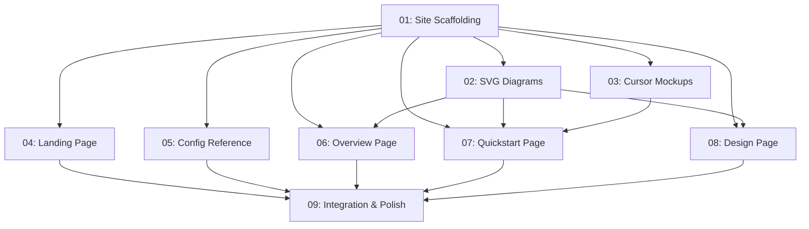

# Spec: github-pages-site

## Status
Executing

## Overview

Build a comprehensive GitHub Pages site for the `zoto-agents` monorepo at `zotoio.github.io/zoto-agents/`. The site uses plain HTML/CSS (no static site generator) with a dark developer theme, deployed via GitHub Actions CI/CD.

The initial focus is documenting how the `zoto-spec-system` plugin works — a step-by-step quickstart covering the full lifecycle (create → judge → execute → verify), a detailed design deep-dive with SVG architecture diagrams, and programmatically generated mockup images showing the system in use within Cursor IDE.

The site also includes a project landing page and a configuration reference. Future content (plugin catalog, contributing guide) can be added later on the same foundation.

## References

- **Repository**: https://github.com/zotoio/zoto-agents
- **Target URL**: https://zotoio.github.io/zoto-agents/
- **zoto-spec-system plugin**: `plugins/zoto-spec-system/`
- **Existing plugin docs**: `plugins/zoto-spec-system/README.md`, `plugins/zoto-spec-system/docs/`
- **Plugin config schema**: `plugins/zoto-spec-system/docs/config-schema.md`
- **Existing project docs**: `docs/add-a-plugin.md`
- **GitHub Pages docs**: https://docs.github.com/en/pages

## Key Decisions

1. **No static site generator**: Plain HTML/CSS/JS — zero build dependencies, no Node.js required for the site itself
2. **Site directory**: `site/` at the repo root, separate from plugin source code
3. **Dark developer theme**: Custom CSS with CSS custom properties — dark backgrounds, syntax-highlighted code blocks, GitHub dark mode aesthetic
4. **Code highlighting**: Prism.js loaded from CDN for syntax highlighting in documentation code samples
5. **Navigation**: Fixed sidebar on spec-system pages with a minimal top navigation bar — all static, no SPA framework
6. **SVG diagrams**: Pre-rendered SVG files for all diagrams — workflow lifecycle, agent/skill/command architecture, phase execution model
7. **Cursor IDE mockups**: SVG files styled to resemble Cursor IDE panels showing spec system commands in use — programmatically generated, not actual screenshots
8. **GitHub Actions deployment**: Workflow triggers on push to `main` when `site/**` files change, deploys using `actions/deploy-pages`
9. **Page structure**: Landing page + 4 spec-system documentation pages (overview, quickstart, design, configuration)
10. **Base path**: All internal links use relative paths or respect the `/zoto-agents/` base path for GitHub Pages project sites

## Requirements

1. Site loads with zero build step — open `site/index.html` locally or deploy as-is
2. Fully responsive layout (mobile, tablet, desktop)
3. Dark theme with consistent color palette across all pages
4. All spec-system documentation content is accurate to the current plugin implementation (v0.6.0)
5. Quickstart walks through the complete lifecycle: `/zoto-spec-create` → `/zoto-spec-judge` → `/zoto-spec-execute` → verification
6. SVG diagrams are clean, readable, and consistent in visual style
7. Cursor IDE mockups convincingly represent the Cursor interface showing spec system interactions
8. GitHub Actions workflow deploys automatically and only when site content changes
9. All cross-page links work correctly both locally and on GitHub Pages
10. Site passes basic accessibility checks (semantic HTML, alt text, keyboard navigation)
11. No external dependencies beyond Prism.js CDN for code highlighting

## Subtask Manifest

| ID | File | Subagent | Dependencies | Phase | Status |
|----|------|----------|-------------|-------|--------|
| 01 | `subtask-01-github-pages-site-scaffolding-20260406.md` | generalPurpose | — | 1 | Done |
| 02 | `subtask-02-github-pages-site-svg-diagrams-20260406.md` | generalPurpose | 01 | 2 | Done |
| 03 | `subtask-03-github-pages-site-cursor-mockups-20260406.md` | generalPurpose | 01 | 2 | Done |
| 04 | `subtask-04-github-pages-site-landing-page-20260406.md` | generalPurpose | 01 | 2 | Done |
| 05 | `subtask-05-github-pages-site-config-reference-20260406.md` | generalPurpose | 01 | 2 | Done |
| 06 | `subtask-06-github-pages-site-overview-page-20260406.md` | generalPurpose | 01, 02 | 3 | Done |
| 07 | `subtask-07-github-pages-site-quickstart-page-20260406.md` | generalPurpose | 01, 02, 03 | 3 | Done |
| 08 | `subtask-08-github-pages-site-design-page-20260406.md` | generalPurpose | 01, 02 | 3 | Done |
| 09 | `subtask-09-github-pages-site-integration-polish-20260406.md` | generalPurpose | 04, 05, 06, 07, 08 | 4 | Done |

## Subtask Dependency Graph

## Execution Order

### Phase 1
| ID | Subagent | Description |
|----|----------|-------------|
| 01 | generalPurpose | Site scaffolding — directory structure, CSS dark theme, HTML template, GitHub Actions workflow, Prism.js integration |

### Phase 2 (Parallel, after Phase 1)
| ID | Subagent | Description |
|----|----------|-------------|
| 02 | generalPurpose | SVG diagrams — workflow lifecycle, agent architecture, phase execution model |
| 03 | generalPurpose | Cursor IDE mockup SVGs — create-spec, judge-output, execute-progress panels |
| 04 | generalPurpose | Landing page — project overview, hero section, navigation to spec system docs |
| 05 | generalPurpose | Configuration reference page — config schema table, examples, defaults |

### Phase 3 (Parallel, after Phase 2)
| ID | Subagent | Description |
|----|----------|-------------|
| 06 | generalPurpose | Spec system overview page — what it is, why it exists, components, workflow summary |
| 07 | generalPurpose | Quickstart walkthrough — full lifecycle tutorial with code snippets and mockup screenshots |
| 08 | generalPurpose | Design deep-dive page — architecture, agents, skills, commands, hooks, dependency graphs |

### Phase 4 (after Phase 3)
| ID | Subagent | Description |
|----|----------|-------------|
| 09 | generalPurpose | JavaScript, navigation, cross-page link verification, responsive testing, final polish |

## Risk Assessment

| Risk | Likelihood | Impact | Mitigation |
|------|-----------|--------|------------|
| SVG diagrams inconsistent in style | Medium | Medium | Subtask 02 defines a shared color palette and style guide; subtask 09 verifies consistency |
| Cursor mockups look unconvincing | Medium | Low | Focus on structural accuracy (sidebar, panels, text) over pixel-perfect rendering |
| GitHub Pages base path breaks links | Medium | High | Subtask 01 establishes base path convention; subtask 09 verifies all links |
| Content drifts from plugin implementation | Low | Medium | Subtask content references actual plugin files; subtask 09 cross-checks |
| Prism.js CDN unavailable | Low | Low | Graceful degradation — code blocks remain readable without highlighting |
| Mobile layout breaks | Medium | Medium | CSS uses responsive breakpoints; subtask 09 tests at multiple viewports |

## Definition of Done
- [x] All 9 subtasks completed
- [x] Site is self-contained in `site/` directory
- [x] All pages render correctly locally (file:// protocol) and on GitHub Pages
- [x] Dark theme is visually consistent across all pages
- [x] All SVG diagrams render correctly and match the current plugin architecture
- [x] Cursor IDE mockups are included and referenced in quickstart
- [x] Quickstart covers full lifecycle: create → judge → execute → verify
- [x] GitHub Actions workflow deploys on push to main
- [x] All cross-page links work
- [x] Site is responsive (mobile, tablet, desktop)
- [x] Code samples have syntax highlighting via Prism.js

## Execution Notes

- **Executed**: 2026-04-06 07:45–08:22 UTC (36m 32s)
- **All 9 subtasks**: Done and adversarially verified
- **Subtask 02 required fix**: SVG files had invalid XML control characters and phase-execution.svg showed only 3 phases — both fixed and re-verified
- **Quality audit**: PASS with WARN (no SRI on CDN, robots.txt domain corrected)
- **Tests**: 28/28 pass, template validation clean
- **See**: `execution-report-github-pages-site-20260406.md` for full details
