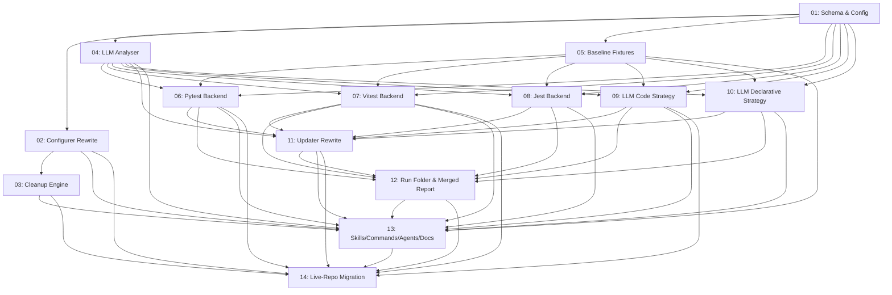

# Spec: Eval System v2

## Status
Ready for Review — subtask 13 re-Verified after fix-up cycle (2026-05-04)

## Overview

Refactor `plugins/zoto-eval-system/` and the live `evals/` backend in this monorepo to elevate generated eval coverage from formulaic shape checks to **meaningful, behaviour-level coverage** driven by an LLM analyser per primitive.

The refactor is anchored on five user-stated goals:

1. **LLM-driven generation** — every generated case is grounded in an LLM analysis of the primitive's source markdown (skill/command/agent/hook/rule). Prompts read like real user/agent input (`/cmd args` plus realistic follow-up turns). Fixture overlays are emitted only when the analyser justifies them.
2. **Extensive static tests** — pytest, vitest, or jest tests are derived from primitive intent (not boilerplate). The framework choice is repo-wide and made during `/zoto-eval-configure`. Switching framework cleans up the previous framework's assets.
3. **LLM strategy is exclusive** — `code` (vitest **or** jest test files importing `@cursor/sdk` directly) **or** `declarative` (the existing `evals.json` + central `runner.ts`). Switching strategy cleans up the other.
4. **Run folders with timestamps** — every backend writes a per-run report under `evals/_runs/<ts>/` validated against `templates/schema/result.schema.json`, plus a merged top-level `report.yml`.
5. **Functional, never example** — every shipped eval, template, and test is real and runnable. No placeholder-only assets remain in the repo after this work lands.

The work also dogfoods itself: the live monorepo migrates to the new schema as the final phase (this repo: `static.framework=vitest`, `llm.strategy=code`, `llm.codeFramework=vitest`).

## References

- Plugin root: `plugins/zoto-eval-system/`
- Live backend: `evals/` and `evals/_llm/`
- Configurable scripts: `scripts/eval-analyse.ts`, `scripts/eval-stamp.ts`, `scripts/eval-discover.ts`, `scripts/eval-cleanup-vendored.ts`, `scripts/eval-cleanup-sandboxes.ts`
- Schemas: `plugins/zoto-eval-system/templates/schema/{config,manifest,result,case-meta}.schema.json`
- Existing template trees: `templates/static/pytest/`, `templates/additional/{vitest,jest,bats}/`, `templates/llm/agent-sdk/`
- Live config: `.zoto-eval-system/config.json`, `.zoto-eval-system/manifest.yml`, `.zoto-eval-system/manifest.history.yml`
- Cursor SDK doc anchor: canonical pattern is `Agent.create({ apiKey, model, local: { cwd } }) → agent.send(prompt) → run.wait()`

## Key Decisions (locked, do not re-litigate)

| # | Decision | Choice |
|---|----------|--------|
| F | Test frameworks | Per-language: pytest is fixed for Python; user picks **vitest OR jest** for TypeScript (one TS framework only). Switching cleans up the other framework's stamped assets. |
| L | LLM strategy | **Exclusive per repo**: `code` (vitest/jest `*.test.ts` files importing `@cursor/sdk`) OR `declarative` (existing `evals.json` + central `runner.ts`). Switching cleans up the other strategy's case files / test files. |
| G | LLM generation timing | Subagent runs at `/zoto-eval-create` AND every targeted `/zoto-eval-update --apply`. Cached in `_meta.primitive_analysis` (source hash + summary). Prompts/assertions/fixtures co-evolve with the primitive's source. |
| B | Baseline fixtures | Single repo-wide `evals/fixtures/baseline/` minimal fake-workspace skeleton (`package.json`, `.cursor/`, `.zoto-eval-system/`, `.gitignore`, etc.). Copied into each case's tmp sandbox at run start. Per-case `fixtures.files[]` overlays only when the LLM analyser justifies them. |
| C | Config-change cleanup | **Hard delete with confirmation**: command-owned `askQuestion` lists every file that will be removed, requires user confirmation, then deletes. Manifest records the migration. |

## Requirements

1. Schemas (`config`, `manifest`, `result`) carry the new fields and per-backend report shape.
2. `/zoto-eval-configure` and `zoto-configure-evals` ask the new questions, emit a `cleanup_plan` for confirmation, and persist the new config.
3. A first-class cleanup engine deletes stale framework/strategy assets after explicit user confirmation.
4. An LLM analyser subagent produces realistic prompts, behavioural assertions, and (only when justified) fixture overlay paths for each primitive. Output is cached in `_meta.primitive_analysis`.
5. A repo-wide baseline fixture skeleton exists at `evals/fixtures/baseline/` and is copied into every case sandbox.
6. Pytest, vitest, and jest static backends each emit per-primitive test files derived from the LLM analyser payload and write `evals/_runs/<ts>/static.yml` validated against `result.schema.json`.
7. The LLM `code` strategy emits per-primitive `*.test.ts` files using `@cursor/sdk`. The `declarative` strategy keeps `evals.json` + `runner.ts` but consumes the LLM-enriched cases. Both write `evals/_runs/<ts>/llm.yml`.
8. `/zoto-eval-update --apply` re-invokes the analyser per drifted primitive and surgically refreshes generated cases while preserving `_meta.generated: false` user cases verbatim.
9. The orchestrator writes a top-level `evals/_runs/<ts>/report.yml` aggregating `static.yml` + `llm.yml`, all schema-valid.
10. Every skill, command, agent, plugin README, and `evals/_llm/README.md` teaches the new flow and field set.
11. The live monorepo is migrated under the new schema (vitest + LLM `code` + vitest) with a documented rerun procedure.

## Subtask Manifest

| ID | File | Subagent | Dependencies | Phase | Status |
|----|------|----------|-------------|-------|--------|
| 01 | `subtask-01-eval-system-v2-schema-config-20260503.md` | zoto-eval-configurer | — | 1 | Completed |
| 02 | `subtask-02-eval-system-v2-configurer-rewrite-20260503.md` | zoto-eval-configurer | 01 | 2 | Completed |
| 03 | `subtask-03-eval-system-v2-cleanup-engine-20260503.md` | zoto-eval-configurer | 01, 02 | 3 | Completed |
| 04 | `subtask-04-eval-system-v2-llm-analyser-20260503.md` | zoto-eval-generator | 01 | 2 | Completed |
| 05 | `subtask-05-eval-system-v2-baseline-fixtures-20260503.md` | zoto-eval-generator | 01 | 2 | Completed |
| 06 | `subtask-06-eval-system-v2-pytest-backend-20260503.md` | zoto-eval-generator | 01, 04, 05 | 4 | Completed |
| 07 | `subtask-07-eval-system-v2-vitest-backend-20260503.md` | zoto-eval-generator | 01, 04, 05 | 4 | Completed |
| 08 | `subtask-08-eval-system-v2-jest-backend-20260503.md` | zoto-eval-generator | 01, 04, 05 | 4 | Completed |
| 09 | `subtask-09-eval-system-v2-llm-code-strategy-20260503.md` | zoto-eval-generator | 01, 04, 05 | 4 | Completed |
| 10 | `subtask-10-eval-system-v2-llm-declarative-strategy-20260503.md` | zoto-eval-generator | 01, 04, 05 | 4 | Completed |
| 11 | `subtask-11-eval-system-v2-updater-rewrite-20260503.md` | zoto-eval-updater | 04, 06, 07, 08, 09, 10 | 5 | Completed |
| 12 | `subtask-12-eval-system-v2-run-folder-merged-report-20260503.md` | zoto-eval-executor | 06, 07, 08, 09, 10, 11 | 6 | Completed |
| 13 | `subtask-13-eval-system-v2-skills-commands-agents-docs-20260503.md` | zoto-plugin-manager | 02, 03, 04, 05, 06, 07, 08, 09, 10, 11, 12 | 7 | Completed |
| 14 | `subtask-14-eval-system-v2-live-repo-migration-20260503.md` | zoto-eval-configurer | 02, 03, 06, 07, 09, 11, 12, 13 | 8 | Completed |

## Subtask Dependency Graph

## Execution Order

Phases are derived from the dependency graph. Subtasks within a phase have no
dependencies on each other and may run in parallel. A phase starts only after
all subtasks in prior phases are complete.

### Phase 1 (Foundation, single)
| ID | Subagent | Description |
|----|----------|-------------|
| 01 | zoto-eval-configurer | Extend `config.schema.json`, `manifest.schema.json`, `result.schema.json` with `static.framework`, `llm.strategy`, `llm.codeFramework`, `framework`/`strategy` manifest snapshots, and per-backend report shape (`static.yml`, `llm.yml`, `report.yml`). |

### Phase 2 (Parallel, after Phase 1)
| ID | Subagent | Description |
|----|----------|-------------|
| 02 | zoto-eval-configurer | Rewrite `/zoto-eval-configure` flow + `zoto-configure-evals` skill to ask the new questions, persist new config, and emit a `cleanup_plan` for command-layer confirmation. |
| 04 | zoto-eval-generator | Implement the LLM-driven analyser (subagent + supporting script) that replaces/augments `scripts/eval-analyse.ts`. Caches results in `_meta.primitive_analysis`. Adds concurrency, fixture-replay, and TS↔Python parity gating. |
| 05 | zoto-eval-generator | Author the repo-wide baseline fixture skeleton at `templates/baseline-fixtures/` and wire `eval-stamp.ts` + runner sandbox setup to copy it before per-case overlay. |

### Phase 3 (after Phase 2)
| ID | Subagent | Description |
|----|----------|-------------|
| 03 | zoto-eval-configurer | Build `scripts/eval-cleanup-stale.ts` — given old vs new config, enumerate every file to delete (including the orphaned `templates/additional/bats/` tree), present via the configurer command's `askQuestion`, and execute on confirmation. |

### Phase 4 (Parallel, after Phase 2)
| ID | Subagent | Description |
|----|----------|-------------|
| 06 | zoto-eval-generator | Replace pytest template with a real per-primitive generator that consumes the analyser payload and writes `evals/_runs/<ts>/static.yml`. Exposes `pnpm run eval:static:pytest` for the orchestrator. |
| 07 | zoto-eval-generator | Promote `templates/additional/vitest/` to first-class `templates/static/vitest/`; emit per-primitive `*.test.ts` files; exposes `pnpm run eval:static:vitest` for the orchestrator. |
| 08 | zoto-eval-generator | Same shape as 07, for jest. Mutually exclusive at install time. Exposes `pnpm run eval:static:jest`. |
| 09 | zoto-eval-generator | New `templates/llm/code-cursor-sdk/` emitting per-primitive `*.test.ts` files using `@cursor/sdk` (via `evals/_llm/sdk-bridge.ts`). Owns the shared `evals/_llm/_user-case-guards.ts` helper. Reporter writes `evals/_runs/<ts>/llm.yml`. |
| 10 | zoto-eval-generator | Refactor `evals/_llm/runner.ts` declarative strategy to consume LLM-analyser-enriched `evals.json`; ensure all cases carry meaningful prompts/assertions/fixtures. Writes `llm.yml` matching the schema. |

### Phase 5 (after Phase 4)
| ID | Subagent | Description |
|----|----------|-------------|
| 11 | zoto-eval-updater | Rewrite `/zoto-eval-update --apply` to re-invoke the analyser per drifted primitive (gated on `source_hash`) and surgically refresh generated cases. Preserve `_meta.generated: false` user cases verbatim. Use `_user-case-guards.ts#isGeneratedFile` to gate code-strategy file overwrites. |

### Phase 6 (after Phase 5)
| ID | Subagent | Description |
|----|----------|-------------|
| 12 | zoto-eval-executor | Runner orchestration writes per-backend `static.yml` + `llm.yml` plus a top-level `evals/_runs/<ts>/report.yml` aggregating both. All three validate against `result.schema.json`. Owns the user-facing `eval`/`eval:full`/`eval:llm` script aliases that delegate to the per-backend `eval:static:*`/`eval:llm:*` scripts. Adds `runs.retention` config + `pnpm run eval:gc`. Drift hook calls subtask 11's rewritten `eval:update --check`. |

### Phase 7 (after Phase 6)
| ID | Subagent | Description |
|----|----------|-------------|
| 13 | zoto-plugin-manager | Update every skill, command, agent, plugin README, and `evals/_llm/README.md` to teach the new fields, LLM-generation step, and cleanup-on-config-change behaviour. |

### Phase 8 (after Phase 7)
| ID | Subagent | Description |
|----|----------|-------------|
| 14 | zoto-eval-configurer | Re-run `/zoto-eval-configure` against this monorepo with `static.framework=vitest`, `llm.strategy=code`, `llm.codeFramework=vitest`; dry-run cleanup; document the migration in the spec's execution report. Sole owner of live `evals/test_example.py` deletion (gated on `evals/test_meta_invariants.py` passing). |

## Risk Assessment

| Risk | Likelihood | Impact | Mitigation |
|------|-----------|--------|------------|
| LLM analyser output quality varies between primitives | Medium | High | Cache per-primitive analysis with `source_hash` and require human spot-review on at least three primitives (one skill, one command, one agent) per the Definition of Done. |
| Cleanup engine deletes user-authored test files | Low | High | Cleanup script enumerates files, the configurer command's `askQuestion` shows the full list, deletion only proceeds with explicit confirmation, and `_meta.generated: false` user cases are excluded from the deletion candidate list. |
| Vitest/jest reporter cannot serialise to `result.schema.json` shape | Medium | Medium | Implement a thin custom reporter that writes the schema directly rather than relying on built-in JSON output transformations. |
| `@cursor/sdk` API drift in `code` strategy templates | Medium | Medium | Pin `@cursor/sdk` version, snapshot the canonical pattern in the template README, and re-validate the pattern against `cursor-sdk` skill docs at execution time. |
| Live-repo migration breaks dogfood loop mid-flight | Medium | High | Stage migration in subtask 14 (last), require all backends green on a fresh-fixture repo first, dry-run cleanup before applying. |
| LLM-justified fixture overlays leak environment-specific data | Low | Medium | Analyser prompt explicitly forbids absolute paths, env-var values, or repo-specific identifiers in fixtures.files[]; per-case fixtures live only under the case's tmp sandbox. |
| LLM analyser cost & latency for bulk runs | Medium | High | Subtask 04 ships `analyser.concurrency` and `analyser.maxCallsPerInvocation` config knobs (defaults 4 / 50) plus a stderr cost summary at the end of each invocation. Operators can lower the limits or use `--target` to scope work. |
| Analyser non-determinism in CI | Medium | Medium | Subtask 04 adds `ZOTO_EVAL_ANALYSER_FIXTURE_DIR` env var that, when set, replays JSON payloads from a fixture directory instead of calling the LLM. Subtask 14's execution report captures the canonical fixture set so CI can pin to a deterministic snapshot. |
| TS↔Python `AnalyserPayload` mirror drift | Medium | Medium | Subtask 04 ships `scripts/check-analyser-payload-parity.ts` that diffs the TS type against the Python dataclass and exits non-zero on drift. Wired into subtask 04's DoD and re-run as a guard on every `eval:update --check`. |
| `@cursor/sdk` API surface drift in stamped templates | Medium | Medium | Subtask 09's templates import all SDK calls via a thin internal wrapper at `evals/_llm/sdk-bridge.ts` so a future SDK API change needs a one-place patch. The `cursor-sdk` skill is linked from the template README and from subtask 09's DoD as the runtime authority for canonical patterns. |
| `templates/additional/bats/` orphaned by the v2 framework set | Low | Low | Subtask 03's cleanup engine enumerates `templates/additional/bats/` for deletion (or relocation under `templates/_archive/` with a deprecation README). Subtask 13's CHANGELOG entry calls out the removal explicitly. |
| Run-folder retention unbounded (long-running CI accumulates `evals/_runs/<ts>/`) | Low | Medium | Subtask 12 adds a `runs.retention` config field (default: keep last 30) and a `pnpm run eval:gc` helper that the operator (or a CI cron) invokes to prune older run directories. |

## Definition of Done

User goals (verbatim) — every one must be observable in the shipped repo:

- [ ] **Goal 1**: Generated evals are generated with more LLM analysis — meaningful checks based on the md primitive files and their intent; prompt strings that resemble what a real user/agent would type (e.g. `/[command]` invocations with realistic arguments and follow-up turns); fixtures use a baseline dir copied to tmp, with case-specific additionals in eval.json **only where the LLM determined they are required**.
- [ ] **Goal 2**: Static tests are extensive — meaningful pytest, vitest, or jest tests based on each md primitive (not boilerplate shape checks). Choice of test framework happens during `/zoto-eval-configure`. Changing framework choice cleans up the previous framework's assets.
- [ ] **Goal 3**: LLM test strategy lets the user pick `code` (vitest OR jest, importing `@cursor/sdk` directly) or `declarative` (current `evals.json` + `runner.ts`).
- [ ] **Goal 4**: Output is in run folders with timestamps under `evals/_runs/<ts>/`, containing report files matching `templates/schema/result.schema.json`.
- [ ] **Goal 5**: All eval test-suite assets and tests are meaningful, functional — never examples.

Engineering-level acceptance:

- [ ] All 14 subtasks completed with deliverables checked.
- [ ] `pnpm run eval` runs the chosen static framework end-to-end and writes `evals/_runs/<ts>/static.yml` validating against `result.schema.json`.
- [ ] `pnpm run eval:full` runs the chosen LLM strategy and writes `evals/_runs/<ts>/llm.yml` validating against `result.schema.json`.
- [ ] `pnpm run eval` (or `eval:full`) emits a merged `evals/_runs/<ts>/report.yml` aggregating both backends, validating against the schema.
- [ ] `/zoto-eval-configure` correctly toggles framework and strategy and triggers cleanup with explicit user confirmation; manifest records the migration.
- [ ] LLM-generated cases are reviewed manually on at least three representative primitives (one skill, one command, one agent) and judged "realistic" by `zoto-eval-judge`.
- [ ] `/zoto-eval-update --check` exits 0 immediately after a fresh `/zoto-eval-create` on a representative repo.
- [ ] No linter errors introduced in modified files (`tsc --noEmit`, `ruff` for Python).
- [ ] Plugin `README.md` and `evals/_llm/README.md` reflect the new flow.
- [ ] No `example` or placeholder-only assets remain in `templates/`, `evals/`, or generated outputs.

## Execution Notes
[Filled in during/after execution]
