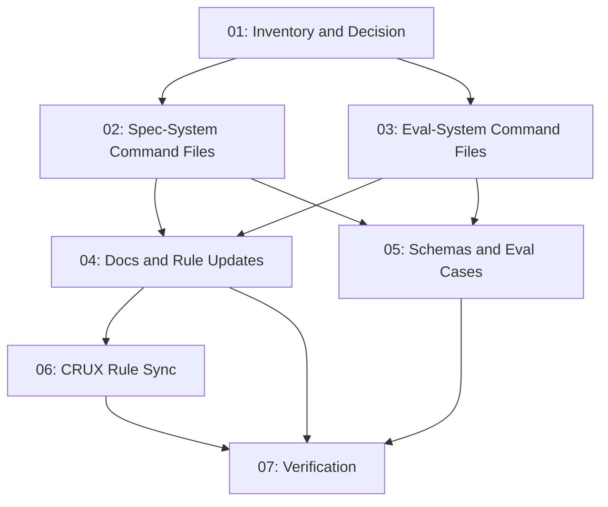

# Spec: Command Prefix Shortening (`zoto-*` → `z-*`)

## Status
Executed — Pending User Approval

## Overview

Abbreviate the **user-facing slash commands** shipped by the two zoto plugins so that `/zoto-spec-*` becomes `/z-spec-*` and `/zoto-eval-*` becomes `/z-eval-*`. The canonical command names move to the shorter form, while thin back-compat alias files keep the original `zoto-*` slashes working.

This is a surface-level rename — only command identifiers and references to them are touched. Plugin packages, skills, agents, workspace-local config dirs, and internal scripts keep their existing `zoto-*` naming because those are package/identity surfaces, not user prompts.

## Goal & Success Criteria

1. Every command currently invokable as `/zoto-spec-<verb>` is also invokable as `/z-spec-<verb>` with identical behaviour, and `/z-spec-<verb>` is the **canonical** name in docs, rules, agents, skills, and hook nudge messages.
2. Every command currently invokable as `/zoto-eval-<verb>` is also invokable as `/z-eval-<verb>` with identical behaviour, and `/z-eval-<verb>` is the **canonical** name in docs, rules, agents, skills, and hook nudge messages.
3. `node scripts/validate-template.mjs` and `node scripts/validate-skills.mjs` pass cleanly.
4. `pnpm test` (root + per-plugin) passes.
5. The `.cursor-plugin/marketplace.json` validator does not regress.
6. Old slash commands continue to dispatch the same workflow (no breaking change for existing rules, agent transcripts, or saved chats).

## Chosen Implementation Option

**Option 2 — Rename + back-compat alias** (recommended in the user request).

| Option | Description | Why not chosen |
|---|---|---|
| 1. Alias-only | Keep `zoto-*` files canonical, add `z-*` files that delegate | The user explicitly asked for *simpler* command names. Keeping `zoto-*` as canonical leaves docs and rules cluttered with the long form. |
| **2. Rename + alias (CHOSEN)** | Make `z-*` the canonical command files, leave thin alias files at `zoto-*` that forward `$ARGUMENTS` to the new canonical command's subagent + skill | Best balance: short canonical names everywhere docs/rules/agents/skills point, plus zero breakage for any existing reference, transcript, or muscle memory still using `/zoto-*`. |
| 3. Hard rename | Rename everything, no back-compat | Highest risk — would silently break `.cursor/rules/*.mdc`, hook session-start messages, GitHub Pages site, agent transcripts, and any external automation referring to `/zoto-*`. |

### Alias mechanics

Each alias file (e.g. `commands/zoto-spec-create.md`) contains:

- Frontmatter `name: zoto-spec-create` and a `description` that includes the phrase **"alias for `/z-spec-create`"** so command discovery still works.
- A short body that explicitly delegates: it spawns the **same subagent** (`zoto-spec-generator`) and invokes the **same skill** (`zoto-create-spec`) with `$ARGUMENTS` passed through, and ends with a one-line note pointing the user to `/z-spec-create` as the canonical name. The alias does NOT duplicate the entire instruction body — it sources the same agent/skill so behaviour cannot drift.
- All cross-references in the canonical file's "Related" section point to the new short names.

This keeps the alias surface minimal (one delegation per command, no instruction drift) while leaving every existing `/zoto-*` invocation working.

## Assumptions (made under `--yolo`)

These are the defaults the generator picked without asking the user. Each is reversible if the user disagrees during review.

1. **Canonical = short form.** New `/z-*` is the canonical name; old `/zoto-*` is the alias. (User request explicitly framed `z-*` as "simpler".)
2. **Aliases stay forever, not deprecated.** The spec does not add deprecation warnings or removal milestones — both names are first-class. A follow-up spec can deprecate later if desired.
3. **Plugin folder names, skill names, agent names, workspace-local config dirs, package.json scripts, internal class/function names, manifest YAML keys, and JSON Schema property names are NOT renamed** (see Out of Scope below).
4. **Hook session-start nudge messages** (e.g. *"Consider running `/zoto-spec-create` to organize"*) are updated to the new canonical short form, even though the hook config key `hooks.sessionStartNudge.message` itself is unchanged.
5. **Default config templates** that ship example `message: "...running /zoto-spec-create..."` are updated to the short form.
6. **GitHub Pages site (`site/*.html` and SVG mockups under `site/images/`)** displays the new canonical names. SVG mockups that show example slash commands are updated; if updating is non-trivial (e.g. embedded in a heavily-styled diagram), the SVG may keep the old name and add a small textual note in the page that hosts it. The verification subtask flags any SVG that could not be cleanly updated.
7. **Spec/exec-report files under `specs/**/`** are historical artefacts and are NOT rewritten. Eval analyser cache JSON under `.zoto/eval-system/cache/analyser/**` is regenerated on next run, so it is also left alone.
8. **Eval `manifest.yml` and `manifest.history.yml`** under `.zoto/eval-system/` are runtime state. The schema/scripts subtask (#05) verifies whether any persisted command names need migration; default assumption is they do not (the manifest tracks targets, not commands).
9. **No version bumps required.** Both plugin manifests stay on their current minor versions and add a `CHANGELOG.md` entry under "Unreleased" documenting the alias addition.
10. **CRUX rule files** (anything matching `*.crux.md` / `*.crux.mdc` or with `generated:` + `sourceChecksum:` frontmatter) are NEVER hand-edited — the source `.md` / `.mdc` is updated, then `crux-cursor-rule-manager` regenerates the derived file (subtask 07).

## Out of Scope (DO NOT change)

These surfaces are deliberately untouched. The verification subtask asserts that none of them have changed.

- **Plugin folder names**: `plugins/zoto-spec-system/`, `plugins/zoto-eval-system/`. These are package identities used by `pnpm --filter @zoto-agents/zoto-spec-system ...` and the marketplace manifest's `source` field.
- **Plugin manifest names**: the `name` field in `plugins/zoto-*-system/.cursor-plugin/plugin.json` and the matching entry in `.cursor-plugin/marketplace.json`.
- **Skill identifiers**: `zoto-create-spec`, `zoto-execute-spec`, `zoto-judge-spec`, `zoto-create-evals`, `zoto-configure-evals`, `zoto-execute-evals`, `zoto-judge-evals`, `zoto-update-evals`, `zoto-compare-evals`, `zoto-help-evals`, `zoto-advise-evals`, `zoto-eval-tooling`. Skill directory names and `name:` frontmatter stay as-is. The skill *content* may be edited where it documents user-facing commands.
- **Agent identifiers**: `zoto-spec-generator`, `zoto-spec-executor`, `zoto-spec-judge`, `zoto-eval-configurer`, `zoto-eval-generator`, `zoto-eval-executor`, `zoto-eval-judge`, `zoto-eval-updater`, `zoto-eval-comparer`, `zoto-eval-adviser`, `zoto-eval-analyser-subagent`. Agent files may be edited where they reference user-facing commands.
- **Workspace-local config dirs**: `.zoto/spec-system/`, `.zoto/eval-system/` (per `.cursor/rules/zoto-plugin-conventions.mdc`).
- **Internal `package.json` scripts**: `pnpm run eval`, `pnpm run eval:full`, `pnpm run spec-status-roundtrip`, etc. These do not contain the `zoto-spec-*` / `zoto-eval-*` literal command alias prefix and are unrelated.
- **Internal scripts and modules**: `scripts/eval-*.ts`, `scripts/validate-*.mjs`, plugin-local `scripts/*.ts`, JSON Schema files, log/runtime keys, manifest YAML keys, runtime classes/functions.
- **Existing spec history under `specs/**`** and execution reports — historical record.
- **Eval analyser cache JSON** under `.zoto/eval-system/cache/analyser/**` — regenerated on demand.
- **`pnpm-lock.yaml`** — package metadata, untouched.

If a file under one of these paths legitimately refers to a slash command (e.g. an agent file's body says "the user runs `/zoto-spec-create`"), the **command reference** is updated even though the file's identity (path/name) is not.

## Key Decisions

- **Decision 1 (Naming)**: Canonical command names become `/z-spec-<verb>` and `/z-eval-<verb>`. The legacy `/zoto-*` names remain functional via thin alias files indefinitely.
- **Decision 2 (Alias mechanism)**: Each alias file delegates to the same subagent and skill as its canonical counterpart so the implementation cannot drift. No instruction duplication.
- **Decision 3 (Documentation policy)**: Every README, CHANGELOG, AGENTS.md, plugin rule, integration rule, agent file, skill body, hook nudge message, and GitHub Pages page surfaces the **new canonical short name** as the primary form. Aliases are mentioned exactly once per plugin, in a "Back-compat aliases" table, so users can find them but they don't clutter prose.
- **Decision 4 (Validation contract)**: The plugin validator (`scripts/validate-template.mjs`) already enforces command frontmatter requirements (`name`, `description`); it does not enforce a name-prefix policy, so adding `z-spec-*` / `z-eval-*` files alongside `zoto-spec-*` / `zoto-eval-*` files passes without changes. Subtask 05 still audits the validator for any prefix-coupled checks.
- **Decision 5 (CHANGELOG cadence)**: Both plugin CHANGELOGs add a single "Unreleased — Renamed canonical slash commands to `z-spec-*` / `z-eval-*`; legacy `zoto-*` names remain via alias" entry; no version bump in this spec.

## Requirements

1. Create canonical command files at `plugins/zoto-spec-system/commands/z-spec-{create,execute,judge,init}.md` with the same instructions as the existing `zoto-spec-*` files.
2. Create canonical command files at `plugins/zoto-eval-system/commands/z-eval-{create,execute,configure,judge,update,compare,help,init,advise}.md` with the same instructions as the existing `zoto-eval-*` files.
3. Convert every existing `zoto-spec-*.md` and `zoto-eval-*.md` command file into a thin alias that delegates to its `z-*` counterpart.
4. Update every cross-reference to slash commands in the locations listed under "In Scope".
5. Regenerate any CRUX-compressed rule output whose source rule was edited.
6. Validate (template, skills, plugin tests, root tests) and verify both old and new names resolve.

## In Scope (files to touch)

- `plugins/zoto-spec-system/commands/zoto-spec-{create,execute,judge,init}.md` — converted to aliases
- `plugins/zoto-spec-system/commands/z-spec-{create,execute,judge,init}.md` — new canonical files
- `plugins/zoto-eval-system/commands/zoto-eval-{create,execute,configure,judge,update,compare,help,init,advise}.md` — converted to aliases
- `plugins/zoto-eval-system/commands/z-eval-{create,execute,configure,judge,update,compare,help,init,advise}.md` — new canonical files
- `plugins/zoto-spec-system/{README.md,CHANGELOG.md}` and `plugins/zoto-eval-system/{README.md,CHANGELOG.md}`
- `plugins/zoto-spec-system/rules/zoto-spec-system.mdc`, `plugins/zoto-eval-system/rules/zoto-eval-system.mdc`
- `plugins/zoto-spec-system/agents/*.md`, `plugins/zoto-eval-system/agents/*.md` (body-level command references)
- `plugins/zoto-spec-system/skills/*/SKILL.md`, `plugins/zoto-eval-system/skills/*/SKILL.md` (body-level command references; skill *names* unchanged)
- `plugins/zoto-spec-system/skills/*/evals/evals.json`, `plugins/zoto-eval-system/skills/*/evals/evals.json` (cases that hard-code slash-command prompts/expected_output)
- `plugins/zoto-spec-system/hooks/zoto-session-start.{ts,mjs}`, `plugins/zoto-eval-system/hooks/zoto-eval-session-start.{ts,mjs}` (default nudge message strings)
- `plugins/zoto-spec-system/templates/init-config.yml`, `plugins/zoto-eval-system/templates/init-config.yml` (commented example messages)
- `plugins/zoto-spec-system/docs/*.md`, `plugins/zoto-eval-system/templates/baseline-fixtures/.zoto/eval-system/config.yml` (example messages only)
- `plugins/zoto-spec-system/templates/schema/*.json`, `plugins/zoto-eval-system/templates/schema/*.json` (only places that hard-code command names in `description` or `examples`)
- `AGENTS.md`, `.cursor/agents/zoto-plugin-manager.md`, `.cursor/rules/zoto-plugin-conventions.mdc` (slash-command references)
- `docs/zoto-eval-system.md`
- `site/index.html`, `site/spec-system/*.html`, and `site/images/{diagrams,mockups}/*.svg` where slash commands appear in displayed text
- `scripts/eval-stamp.ts` and `plugins/zoto-eval-system/scripts/eval-update.ts` — only the **error message strings** that reference `/zoto-eval-configure` etc., not function names or imports
- Root `package.json`: no changes expected (verified)
- `.cursor-plugin/marketplace.json`: no changes expected (verified — the manifest does not list individual commands)

### Verified-clean surfaces (no slash-command literals at spec time)

The independent assessment confirmed the following surfaces contain **no** `/zoto-spec-*` or `/zoto-eval-*` slash-command literals as of 2026-05-06; they are excluded from the rename sweep but the verification subtask should sanity-re-check post-edits:

- Root `README.md` — only `[zoto-spec-system](plugins/...)` and `[zoto-eval-system](plugins/...)` link paths, plus `cd plugins/zoto-spec-system` shell hints. No slash commands.
- `.cursor-plugin/marketplace.json` — only plugin `name` (`zoto-spec-system`, `zoto-eval-system`) and `source` paths. No slash commands.
- Root `package.json` — script names (`pnpm test`, `pnpm validate`, etc.) carry no `zoto-*-*` slash literal.

The Inventory & Decision subtask produces an exhaustive enumerated change list before any file is edited.

## Subtask Manifest

| ID | File | Subagent | Dependencies | Phase | Status |
|----|------|----------|-------------|-------|--------|
| 01 | `subtask-01-command-prefix-shortening-inventory-and-decision-20260506.md` | crux-platform-architect | — | 1 | Pending |
| 02 | `subtask-02-command-prefix-shortening-spec-commands-20260506.md` | crux-software-engineer | 01 | 2 | Pending |
| 03 | `subtask-03-command-prefix-shortening-eval-commands-20260506.md` | crux-software-engineer | 01 | 2 | Pending |
| 04 | `subtask-04-command-prefix-shortening-docs-and-rules-20260506.md` | docs-sync-agent | 02, 03 | 3 | Pending |
| 05 | `subtask-05-command-prefix-shortening-schemas-and-evals-20260506.md` | crux-software-engineer | 02, 03 | 3 | Pending |
| 06 | `subtask-06-command-prefix-shortening-crux-sync-20260506.md` | crux-cursor-rule-manager | 04 | 4 | Pending |
| 07 | `subtask-07-command-prefix-shortening-verification-20260506.md` | integrity-expert | 04, 05, 06 | 5 | Pending |

## Subtask Dependency Graph

## Execution Order

Phases are derived from the dependency graph. Subtasks within a phase have no dependencies on each other and may run in parallel.

### Phase 1
| ID | Subagent | Description |
|----|----------|-------------|
| 01 | crux-platform-architect | Inventory every slash-command reference, confirm Option 2 rename strategy, produce the concrete change list that subsequent phases consume |

### Phase 2 (after Phase 1)
| ID | Subagent | Description |
|----|----------|-------------|
| 02 | crux-software-engineer | Create canonical `z-spec-*` command files; convert legacy `zoto-spec-*` files into thin alias delegates |
| 03 | crux-software-engineer | Create canonical `z-eval-*` command files; convert legacy `zoto-eval-*` files into thin alias delegates |

### Phase 3 (after Phase 2)
| ID | Subagent | Description |
|----|----------|-------------|
| 04 | docs-sync-agent | Update READMEs, CHANGELOGs, `AGENTS.md`, `.cursor/rules/*.mdc`, plugin rules, agent body text, skill body text, hook nudge messages, marketplace metadata sanity check, and `site/` HTML / SVG so the new canonical names are primary |
| 05 | crux-software-engineer | Audit and update schema files, skill `evals/evals.json` cases, validation scripts, eval orchestration error messages — anywhere a literal slash command appears outside of running prose |

### Phase 4 (after Phase 3)
| ID | Subagent | Description |
|----|----------|-------------|
| 06 | crux-cursor-rule-manager | Regenerate any `.crux.md` / `.crux.mdc` files whose source rule was edited in subtask 04 — preserves the source-of-truth contract from `.cursor/rules/_CRUX-RULE.mdc` |

### Phase 5 (after Phase 4)
| ID | Subagent | Description |
|----|----------|-------------|
| 07 | integrity-expert | Run `node scripts/validate-template.mjs`, `node scripts/validate-skills.mjs`, `pnpm test`, plugin-local tests; manually resolve a sample of `/z-spec-create`, `/z-eval-help` to prove canonical paths work; resolve a sample of `/zoto-spec-create`, `/zoto-eval-help` to prove aliases work; confirm Out-of-Scope surfaces are unchanged |

## Definition of Done

- [ ] All seven subtasks completed and their `.status.yml` files set to `state: completed`
- [ ] `plugins/zoto-spec-system/commands/` contains exactly **8 files** — 4 canonical (`z-spec-{create,execute,judge,init}.md`) plus 4 alias (`zoto-spec-{create,execute,judge,init}.md`)
- [ ] `plugins/zoto-eval-system/commands/` contains exactly **18 files** — 9 canonical (`z-eval-{init,configure,create,update,execute,judge,compare,help,advise}.md`) plus 9 alias (`zoto-eval-{init,configure,create,update,execute,judge,compare,help,advise}.md`)
- [ ] `node scripts/validate-template.mjs` exits 0
- [ ] `node scripts/validate-skills.mjs` exits 0
- [ ] `pnpm test` exits 0
- [ ] No file under "Out of Scope" has been modified (architect reviews `git diff`)
- [ ] CHANGELOGs updated for both plugins
- [ ] CRUX-compressed outputs regenerated for any source rule that changed
- [ ] At least one explicit aliasing test (manual or scripted) confirms `/zoto-spec-create` and `/z-spec-create` dispatch the same workflow

## Execution Notes

_To be filled in during/after execution._
