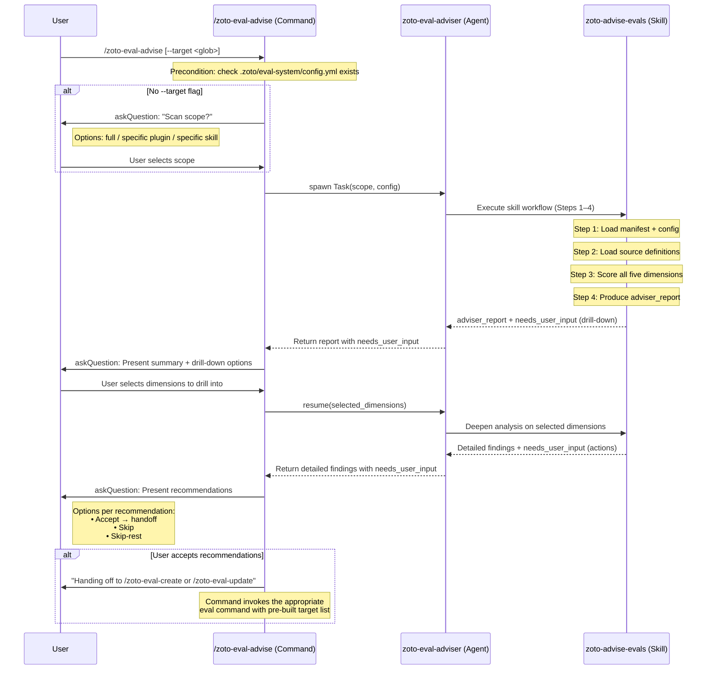

# Eval Adviser — Architecture Design

**Spec**: Eval Adviser  
**Subtask**: 01 — Architecture & Gap Taxonomy Design  
**Author**: crux-platform-architect  
**Date**: 2026-05-06

---

## 1. Overview

The eval adviser is a new eval-system component that assesses **coverage gaps** in a repository's eval suite. Where the existing judge critiques the *quality of a completed run* (post-hoc analysis of results), the adviser critiques the *breadth and depth of the eval suite itself* — answering "what tests are missing?" rather than "how did the last run perform?"

### Positioning Within the Eval System

| Component | Input | Output | Question Answered |
|-----------|-------|--------|-------------------|
| **Judge** | `_runs/<ts>/llm.yml`, logs | Enriched `llm.yml` with `judge:` block | "How strong are the results?" |
| **Adviser** | Manifest, config, SKILL.md, evals.json, agent/command definitions | Structured gap report (`adviser_report`) | "What tests are missing?" |

The adviser reads source definitions and eval files but never reads run artefacts. The judge reads run artefacts but never modifies eval definitions. They are complementary and non-overlapping.

---

## 2. Gap Analysis Taxonomy

The adviser evaluates coverage across five dimensions. Each dimension has detection criteria, a scoring method, and severity classification.

### 2.1 Trigger-Phrase Coverage

**What it measures**: Whether blackbox eval cases exist that verify skills activate on the expected trigger phrases documented in their `SKILL.md` description.

**Detection criteria**:

1. For each skill target in the manifest, load `SKILL.md` and extract the `description` field from frontmatter plus any "When to Use" / "Use when" section.
2. Extract trigger phrases — action verbs, domain nouns, and recognisable patterns that should route a user's request to this skill (e.g. "scaffold a new plugin", "compress memory", "create eval").
3. Load the skill's `evals/evals.json` and examine each case's `prompt` field.
4. A trigger phrase is **covered** if at least one eval case's prompt contains it (case-insensitive substring or semantic match).
5. A trigger phrase is **uncovered** if no eval case exercises it.

**Scoring**:

| Coverage % | Severity | Label |
|------------|----------|-------|
| 80–100% | `ok` | Adequate |
| 50–79% | `warn` | Partial coverage |
| 0–49% | `critical` | Major gap |

**Per-target score**: `covered_phrases / total_phrases × 100`

**Examples of gaps**:
- Skill description says "Use when compressing or decompressing memory files" but no eval prompt mentions "decompress".
- Skill handles three use cases in its "When to Use" section but only one has an eval case.

### 2.2 Schema Validation Coverage

**What it measures**: Whether eval cases for commands and agents include assertions that validate output structure — required YAML fields, correct types, expected block shapes.

**Detection criteria**:

1. For each command/agent target in the manifest, identify its expected output contract:
   - Commands: check frontmatter `description` and the "What happens" section for structural promises (e.g. "writes config.yml", "appends judge: block", "produces manifest.yml").
   - Agents: check for `needs_user_input` schema compliance, output file writes, structured report shapes.
2. Load the target's eval files and scan `assertions[]` for structural keywords: "exists", "contains key", "validates against", "has field", "YAML", "JSON", "schema", "block", "section".
3. A structural contract is **covered** if at least one assertion checks it.
4. A structural contract is **uncovered** if no assertion validates the output shape.

**Scoring**:

| Coverage % | Severity | Label |
|------------|----------|-------|
| 80–100% | `ok` | Adequate |
| 50–79% | `warn` | Partial coverage |
| 0–49% | `critical` | Major gap |

**Per-target score**: `structural_assertions / identified_contracts × 100`

**Examples of gaps**:
- A command that "writes `.zoto/eval-system/config.yml`" has no assertion checking the file exists or validates against `config.schema.json`.
- An agent whose description mentions `needs_user_input` output has no assertion checking the `needs_user_input` block structure.

### 2.3 Regression Baseline Coverage

**What it measures**: Whether eval cases produce results that are comparable over time — using deterministic graders and soft-metric baselines suitable for detecting subtle regressions across model versions.

**Detection criteria**:

1. For each target with eval files, load all eval cases from `evals.json`.
2. Classify each case's assertions by grader strength:
   - **Strong**: `llm-judge` with a rubric, `regex` with a pattern, `tool-called` with specific tool name — these produce deterministic, comparable signals.
   - **Moderate**: `contains` with strings >= 4 characters — partially comparable but fragile.
   - **Weak**: `contains` with strings < 4 characters, vague assertions without specific patterns — not suitable for regression detection.
3. Flag targets where:
   - All cases use only weak graders (no regression baseline possible).
   - No case has an `llm-judge` grader (missing nuanced quality assessment).
   - No case includes soft-metric thresholds (verbosity, confidence, accuracy bounds).

**Scoring**:

| Condition | Severity | Label |
|-----------|----------|-------|
| >= 1 `llm-judge` + >= 1 `regex`/`tool-called` | `ok` | Strong baseline |
| >= 1 `regex`/`tool-called` but no `llm-judge` | `warn` | Partial baseline |
| Only `contains` graders (any length) | `critical` | No regression baseline |

**Per-target score**: Qualitative (strong / partial / none) based on grader mix.

**Examples of gaps**:
- A skill's evals rely entirely on `contains` checks for short strings like "ok" or "done" — no meaningful regression signal.
- No eval case uses `llm-judge` to assess response quality, so subtle degradations (e.g. less helpful explanations after model change) go undetected.

### 2.4 Context Citation Verification

**What it measures**: Whether agents/skills that should produce `start:end:path` code references have eval cases asserting citation presence and format.

**Detection criteria**:

1. For each agent/skill target, scan the definition file for citation requirements:
   - Explicit mentions of `start:end:path`, "code reference", "citation", "cite".
   - The help skill (`zoto-help-evals`) has a documented "Citation contract" — this is the canonical example.
2. If a target has citation requirements, load its eval cases and check for:
   - Assertions mentioning "cite", "citation", "reference", "`start:end:path`", "code-reference syntax".
   - `regex` graders matching the `\d+:\d+:.+` pattern.
3. A citation-producing target is **covered** if at least one assertion validates citation format.
4. A citation-producing target is **uncovered** if no assertion checks citations.
5. Targets without citation requirements are **exempt** (not scored).

**Scoring**:

| Coverage % | Severity | Label |
|------------|----------|-------|
| 100% of citation-required targets covered | `ok` | Adequate |
| 50–99% | `warn` | Partial coverage |
| 0–49% | `critical` | Major gap |

**Per-target score**: Binary (covered / uncovered) since citation is either tested or not.

**Examples of gaps**:
- The help skill documents a "Citation contract" requiring `start:end:path` syntax, but no eval case asserts that citations appear in the output.
- An agent's description says it "cites the README" but eval assertions only check for content, not citation format.

### 2.5 Status Checklist Completeness

**What it measures**: Whether spec-executing agents have eval cases verifying that deliverable checklists are fully resolved (all items checked off).

**Detection criteria**:

1. Identify targets related to spec execution: agents/skills with "spec" in their id or path, especially `zoto-execute-spec`, `zoto-spec-executor`.
2. Scan their definitions for checklist-related behaviour:
   - "Deliverables Checklist", "Definition of Done", "tick completed", "[x]", "status tracking".
3. Load eval cases and check for assertions about:
   - Checklist completion state ("all items checked", "checklist complete", "[x]").
   - Status file updates ("status.md", "status.yml", "execution-report").
4. A checklist-producing target is **covered** if assertions verify completion state.
5. Targets not involved in spec execution or checklist management are **exempt**.

**Scoring**:

| Coverage % | Severity | Label |
|------------|----------|-------|
| 100% of checklist-producing targets covered | `ok` | Adequate |
| 50–99% | `warn` | Partial coverage |
| 0–49% | `critical` | Major gap |

**Per-target score**: Binary (covered / uncovered).

**Examples of gaps**:
- The spec executor creates execution reports with deliverable checklists, but no eval case asserts that checklists end with all items `[x]`.
- Status file updates are promised but no assertion checks the final status.

---

## 3. Interaction Model

The adviser follows the established hybrid askQuestion contract. The command owns all user interaction; the agent/skill communicates via `needs_user_input`.

### 3.1 Component Layers

```
┌──────────────────────────────────────────────────┐
│  /zoto-eval-advise  (Command)                    │
│  • Owns askQuestion                              │
│  • Pre-collects scope (full scan vs targeted)    │
│  • Drives resume loop                            │
│  • Routes handoff to /zoto-eval-create or        │
│    /zoto-eval-update                             │
└──────────────┬───────────────────────────────────┘
               │ spawn via Task tool
               ▼
┌──────────────────────────────────────────────────┐
│  zoto-eval-adviser  (Agent)                      │
│  • Uses zoto-advise-evals skill                  │
│  • Never calls askQuestion                       │
│  • Returns needs_user_input at breakpoints       │
└──────────────┬───────────────────────────────────┘
               │ follows skill workflow
               ▼
┌──────────────────────────────────────────────────┐
│  zoto-advise-evals  (Skill)                      │
│  • Reads manifest, config, source definitions    │
│  • Scores five gap dimensions                    │
│  • Produces structured adviser_report            │
│  • Never calls askQuestion                       │
└──────────────────────────────────────────────────┘
```

### 3.2 Conversation Flow (Mermaid Sequence Diagram)



### 3.3 Breakpoint Design

The adviser has two natural `needs_user_input` breakpoints (matching the judge's single-breakpoint pattern but extended for the multi-turn navigation model from the help command):

**Breakpoint 1 — Summary drill-down** (after initial scan):

```yaml
needs_user_input:
  reason: "Gap scan complete. Which dimensions should I analyse in detail?"
  questions:
    - id: drill-down
      prompt: |
        Coverage scan found gaps in 3 of 5 dimensions.
        Which would you like to drill into?
      options:
        - id: trigger-phrases
          label: "Trigger-phrase coverage (2 skills with critical gaps)"
        - id: schema-validation
          label: "Schema validation coverage (1 command with critical gap)"
        - id: regression-baselines
          label: "Regression baseline coverage (3 skills with warn-level gaps)"
        - id: all
          label: "All dimensions with gaps"
        - id: done
          label: "No drill-down — show recommendations now"
      allow_multiple: true
```

**Breakpoint 2 — Action recommendations** (after drill-down):

```yaml
needs_user_input:
  reason: "Detailed analysis complete. How should I proceed with recommendations?"
  questions:
    - id: action
      prompt: |
        I recommend 4 actions:
        1. Create new trigger-phrase evals for skills: zoto-compare-evals, zoto-help-evals
        2. Add schema assertions to command: zoto-eval-configure
        3. Strengthen graders for 3 skills (replace contains with llm-judge)
        4. Add citation assertions for zoto-help-evals
      options:
        - id: accept-all
          label: "Accept all — hand off to /zoto-eval-create and /zoto-eval-update"
        - id: walk
          label: "Walk each recommendation individually"
        - id: create-only
          label: "Only hand off new coverage to /zoto-eval-create"
        - id: update-only
          label: "Only hand off strengthening to /zoto-eval-update"
        - id: none
          label: "No action — report only"
```

---

## 4. Assessment Rubric

### 4.1 Per-Dimension Scoring

Each dimension produces a score object:

```yaml
dimension: <dimension-id>
score: <0-100>          # coverage percentage (or qualitative mapping)
severity: ok | warn | critical
targets_scanned: <int>  # total targets evaluated for this dimension
targets_exempt: <int>   # targets not applicable to this dimension
targets_covered: <int>  # targets with adequate coverage
targets_gapped: <int>   # targets with gaps
```

### 4.2 Severity Thresholds (Unified)

| Severity | Meaning | Score Range | Action Urgency |
|----------|---------|-------------|----------------|
| `ok` | Coverage is adequate | 80–100% (or qualitative "strong") | None |
| `warn` | Partial coverage — some gaps | 50–79% (or qualitative "partial") | Recommended |
| `critical` | Major coverage gap | 0–49% (or qualitative "none") | Strongly recommended |

### 4.3 Aggregate Score

The overall assessment is the **worst severity across all non-exempt dimensions**:

```
aggregate_severity = max(dimension_severities)
```

Where `critical > warn > ok`.

Rationale: a single critical gap in any dimension represents a meaningful coverage risk. This matches the judge's approach of flagging individual anomalies rather than averaging them away.

### 4.4 Qualitative-to-Quantitative Mapping (Dimensions 2.3–2.5)

Some dimensions score per-target qualitatively. The mapping to percentages for the dimension-level rollup:

| Qualitative | Numeric | Used in rollup as |
|-------------|---------|-------------------|
| strong / covered | 100 | Covered target |
| partial | 50 | Half-covered target |
| none / uncovered | 0 | Gapped target |

Dimension score = `mean(per_target_numeric_scores)` across non-exempt targets.

---

## 5. Interface Contract — Gap Report Schema

The skill produces a structured `adviser_report` as its primary output. This is the contract between the skill and the agent/command layers.

### 5.1 Full Report Schema

```yaml
adviser_report:
  version: 1
  analysed_at: <ISO 8601>
  scope:
    mode: full | targeted
    target_glob: <string | null>  # null when mode=full
    config_path: .zoto/eval-system/config.yml
    manifest_path: .zoto/eval-system/manifest.yml
  
  summary:
    targets_scanned: <int>
    targets_with_gaps: <int>
    aggregate_severity: ok | warn | critical
    dimensions:
      trigger_phrases:
        severity: ok | warn | critical
        score: <0-100>
      schema_validation:
        severity: ok | warn | critical
        score: <0-100>
      regression_baselines:
        severity: ok | warn | critical
        score: <0-100>
      citation_verification:
        severity: ok | warn | critical
        score: <0-100>
      checklist_completeness:
        severity: ok | warn | critical
        score: <0-100>

  dimensions:
    - id: trigger_phrases
      label: "Trigger-Phrase Coverage"
      severity: ok | warn | critical
      score: <0-100>
      targets_scanned: <int>
      targets_exempt: <int>
      targets_covered: <int>
      targets_gapped: <int>
      findings:
        - target_id: <manifest target id>
          target_path: <path>
          severity: ok | warn | critical
          score: <0-100>
          detail: <string>
          covered_phrases:
            - phrase: <string>
              eval_case_id: <int>
          uncovered_phrases:
            - phrase: <string>
              source: <"description" | "when_to_use">

    - id: schema_validation
      label: "Schema Validation Coverage"
      severity: ok | warn | critical
      score: <0-100>
      targets_scanned: <int>
      targets_exempt: <int>
      targets_covered: <int>
      targets_gapped: <int>
      findings:
        - target_id: <manifest target id>
          target_path: <path>
          severity: ok | warn | critical
          score: <0-100>
          detail: <string>
          covered_contracts:
            - contract: <string>
              assertion_text: <string>
          uncovered_contracts:
            - contract: <string>
              source_section: <string>

    - id: regression_baselines
      label: "Regression Baseline Coverage"
      severity: ok | warn | critical
      score: <0-100>
      targets_scanned: <int>
      targets_exempt: <int>
      targets_covered: <int>
      targets_gapped: <int>
      findings:
        - target_id: <manifest target id>
          target_path: <path>
          severity: ok | warn | critical
          score: strong | partial | none
          detail: <string>
          grader_breakdown:
            llm_judge_count: <int>
            regex_count: <int>
            tool_called_count: <int>
            contains_strong_count: <int>   # contains with >= 4 char strings
            contains_weak_count: <int>     # contains with < 4 char strings

    - id: citation_verification
      label: "Context Citation Verification"
      severity: ok | warn | critical
      score: <0-100>
      targets_scanned: <int>
      targets_exempt: <int>
      targets_covered: <int>
      targets_gapped: <int>
      findings:
        - target_id: <manifest target id>
          target_path: <path>
          severity: ok | warn | critical
          score: <0 | 100>
          detail: <string>
          citation_requirement_source: <string>
          has_citation_assertion: <boolean>

    - id: checklist_completeness
      label: "Status Checklist Completeness"
      severity: ok | warn | critical
      score: <0-100>
      targets_scanned: <int>
      targets_exempt: <int>
      targets_covered: <int>
      targets_gapped: <int>
      findings:
        - target_id: <manifest target id>
          target_path: <path>
          severity: ok | warn | critical
          score: <0 | 100>
          detail: <string>
          checklist_requirement_source: <string>
          has_checklist_assertion: <boolean>

  recommendations:
    - id: <slug>
      dimension: <dimension-id>
      target_id: <manifest target id>
      severity: warn | critical
      action: create | update
      description: <human-readable recommendation>
      handoff:
        command: /zoto-eval-create | /zoto-eval-update
        args:
          target: <glob or target path>
          mode: <create-specific | update-specific flags>
```

### 5.2 Compact Summary (for `needs_user_input` prompts)

When constructing the `needs_user_input` prompt text, the skill summarises the report into a human-readable string, not the full YAML. The full report is available for the command to reference if the user wants details.

---

## 6. Handoff Protocol

Each recommendation in the gap report maps to exactly one eval-system command. The mapping is deterministic — no ambiguity.

### 6.1 Action Mapping

| Recommendation Type | Target State | Handoff Command | Arguments |
|---------------------|-------------|-----------------|-----------|
| Missing eval cases for a skill/command/agent | No eval file exists, or eval file exists but missing cases for uncovered dimension | `/zoto-eval-create` | Pre-collected target list with the specific targets needing new cases |
| Weak graders need strengthening | Eval cases exist but use weak `contains` graders | `/zoto-eval-update --target <glob> --apply` | Targeted update to regenerate cases with stronger graders |
| Missing assertion types (schema, citation, checklist) | Eval cases exist but lack assertions for specific dimensions | `/zoto-eval-update --target <glob> --apply` | Targeted update; the analyser payload is refreshed to include the missing assertion types |
| New trigger-phrase coverage needed | Skill eval exists but prompts don't exercise all trigger phrases | `/zoto-eval-update --target <glob> --apply` | Targeted update to add new cases covering uncovered phrases |

### 6.2 Decision Rules

```
IF target has no eval_files in manifest:
    → /zoto-eval-create (target needs initial scaffolding)

ELSE IF target has eval_files but cases need NEW coverage:
    → /zoto-eval-update --target <target.path> --apply
       (updater will regenerate with enriched analyser payload)

ELSE IF target has eval_files but existing cases have weak graders:
    → /zoto-eval-update --target <target.path> --apply
       (updater refreshes analyser payload → stronger grader suggestions)
```

### 6.3 Handoff Execution

The command layer executes handoffs, not the agent/skill. The flow:

1. Skill produces `recommendations[]` in the `adviser_report`.
2. Agent returns the report with `needs_user_input` for action selection.
3. Command presents recommendations via `askQuestion`.
4. User selects which recommendations to apply.
5. Command groups accepted recommendations by handoff command:
   - All `/zoto-eval-create` recommendations → single `/zoto-eval-create` invocation with the union of targets.
   - All `/zoto-eval-update` recommendations → single `/zoto-eval-update --target <combined-glob> --apply` invocation.
6. If both create and update are needed, command runs create first (since update requires existing eval files), then update.

### 6.4 Handoff Data Shape

The command passes accepted recommendations to the target command as structured context:

```yaml
adviser_handoff:
  source: /zoto-eval-advise
  accepted_recommendations:
    - id: <slug>
      target_id: <manifest target id>
      dimension: <dimension-id>
      action: create | update
  create_targets:     # targets that need /zoto-eval-create
    - <target_id>
  update_targets:     # targets that need /zoto-eval-update
    - glob: <target path glob>
      reason: <short description>
```

---

## 7. Configuration

The adviser reads from `.zoto/eval-system/config.yml`. No new top-level config keys are required for MVP — the adviser uses existing discovery config (`discoveryTargets`, `skillsRoots`, `evalsDir`, `ignore`).

Future configuration (post-MVP, not in scope for this spec):

```yaml
# adviser:
#   dimensions:
#     - trigger_phrases
#     - schema_validation
#     - regression_baselines
#     - citation_verification
#     - checklist_completeness
#   severity_overrides: {}
```

---

## 8. File Layout

### New Files

| Path | Type | Purpose |
|------|------|---------|
| `plugins/zoto-eval-system/agents/zoto-eval-adviser.md` | Agent | Agent definition with `needs_user_input` pattern |
| `plugins/zoto-eval-system/skills/zoto-advise-evals/SKILL.md` | Skill | Five-dimension analysis workflow |
| `plugins/zoto-eval-system/skills/zoto-advise-evals/evals/evals.json` | Evals | >= 3 test cases with assertions |
| `plugins/zoto-eval-system/commands/zoto-eval-advise.md` | Command | `askQuestion` + resume loop |

### Modified Files

| Path | Change |
|------|--------|
| `plugins/zoto-eval-system/rules/zoto-eval-system.mdc` | Add `/zoto-eval-advise` to Available Commands |
| `plugins/zoto-eval-system/README.md` | Add Adviser section |
| `plugins/zoto-eval-system/CHANGELOG.md` | Add adviser entry |
| `plugins/zoto-eval-system/.cursor-plugin/plugin.json` | Version bump |

### Files Read (not modified)

| Path | Used For |
|------|----------|
| `.zoto/eval-system/config.yml` | Discovery config, ignore globs |
| `.zoto/eval-system/manifest.yml` | Target list, eval file paths, content hashes |
| `plugins/*/skills/*/SKILL.md` | Trigger phrases, citation requirements |
| `plugins/*/skills/*/evals/evals.json` | Existing eval cases and assertions |
| `plugins/*/commands/*.md` | Output contracts for schema validation |
| `plugins/*/agents/*.md` | Output contracts, citation requirements |

---

## 9. Constraints and Non-Goals

### Constraints

- The adviser **never modifies** eval files, manifest, or config — it only reads and reports.
- The adviser **never calls `askQuestion`** — all user interaction is routed through the command.
- The adviser **never reads run artefacts** (`_runs/`, `llm.yml`, `static.yml`) — that is the judge's domain.
- The adviser must complete its initial scan in a single skill invocation (no multi-spawn).
- Recommendations must be deterministic — same input produces same recommendations.

### Non-Goals (Explicitly Out of Scope)

- Generating eval cases directly (that is `/zoto-eval-create`'s job).
- Modifying existing eval cases (that is `/zoto-eval-update`'s job).
- Assessing run quality or soft metrics (that is the judge's job).
- Custom dimension plugins or user-defined gap analysis rules (future enhancement).
- Cross-repository analysis (the adviser operates within a single workspace).

---

## 10. Design Decisions Log

| Decision | Rationale |
|----------|-----------|
| Single skill, not five | Matches `zoto-judge-evals` pattern; dimensions are logical steps within one workflow, reducing spawn overhead. |
| Two breakpoints | Balances interactivity (user can drill down) against conversation length. More breakpoints would make simple runs tedious. |
| Aggregate = worst severity | A single `critical` gap matters regardless of other dimension scores. Averaging would hide critical gaps. |
| Read-only analysis | Clear separation of concerns — adviser diagnoses, create/update treat. Prevents accidental mutation. |
| Deterministic recommendations | Each gap maps to exactly one action. No ambiguity reduces user confusion and enables future automation. |
| No new config keys | MVP uses existing discovery config. Config surface grows only when proven necessary. |
