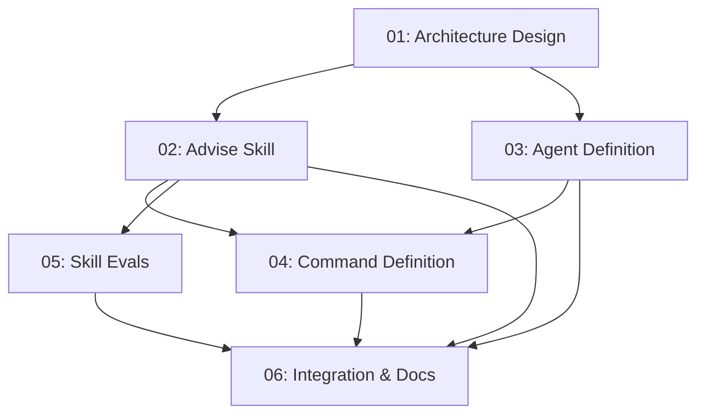

# Spec: Eval Adviser

## Status
Completed

## Overview

Add an interactive **evals adviser** to the `zoto-eval-system` plugin that assesses and maintains testing coverage across a codebase. The adviser agent drives a multi-turn conversation with the user (via the command's `askQuestion` loop) to identify gaps in eval coverage, detect regression risks across model changes, and recommend concrete improvements.

Unlike the existing **judge** (which critiques a completed eval run's *results*), the adviser critiques the eval suite's *coverage of the codebase* — answering "what tests are missing?" rather than "how did the last run perform?"

### Focus Areas

1. **Blackbox trigger-phrase tests** — Skills without tests verifying they activate on expected phrases
2. **Agent command output validation** — Commands/agents without schema-correctness tests for their outputs
3. **Regression baselines** — Missing comparability safeguards for detecting subtle behaviour changes across model versions
4. **Context citation verification** — Tests ensuring agents produce required `start:end:path` code references
5. **Status checklist completeness** — Tests verifying subtask deliverables checklists are fully checked off

### Interaction Model

The adviser follows the existing eval-system hybrid askQuestion contract:
- **Command** (`/zoto-eval-advise`) owns all `askQuestion` calls
- **Agent** (`zoto-eval-adviser`) uses the `zoto-advise-evals` skill and returns `needs_user_input` at natural breakpoints
- **Skill** (`zoto-advise-evals`) performs analysis and produces structured findings

The conversation flow:
1. Command collects initial scope (full scan vs targeted plugin/skill)
2. Adviser scans codebase and eval coverage, returns gap report with `needs_user_input`
3. Command presents findings, user chooses drill-down areas
4. Adviser deepens analysis on selected areas, proposes actions
5. User approves → handoff to `/zoto-eval-create` or `/zoto-eval-update`

## Key Decisions

- **Single skill** (`zoto-advise-evals`): All analysis dimensions live in one skill with step-by-step workflow, matching the `zoto-judge-evals` pattern. Dimensions are logical steps within the skill, not separate skills.
- **Complementary to judge**: Adviser assesses *coverage gaps* (what tests are missing); judge assesses *run quality* (how did existing tests perform). No overlap.
- **Actionable handoffs**: Recommendations resolve to concrete actions — hand off to `/zoto-eval-create` for new coverage or `/zoto-eval-update` for strengthening existing cases.
- **Gap taxonomy**: Five dimensions (trigger phrases, schema validation, regression baselines, citation verification, checklist completeness) with severity scoring per dimension.
- **Multi-turn interaction**: Not a one-shot report — the adviser progressively deepens based on user choices at each `needs_user_input` breakpoint.

## Requirements

1. New agent `zoto-eval-adviser` in `plugins/zoto-eval-system/agents/`
2. New skill `zoto-advise-evals` in `plugins/zoto-eval-system/skills/`
3. New command `/zoto-eval-advise` in `plugins/zoto-eval-system/commands/`
4. Skill evals (`evals/evals.json`) with >= 3 test cases and assertions
5. Agent/skill must NOT call `askQuestion` — use `needs_user_input` pattern
6. Command must drive interactive conversation via `askQuestion` + resume loop
7. Plugin rule (`zoto-eval-system.mdc`) updated to include the new command
8. Plugin README updated with adviser section
9. Plugin CHANGELOG updated
10. All validation scripts pass (`validate-template.mjs`, `validate-skills.mjs`, `pnpm test`)

## Subtask Manifest

Every subtask is listed here with its file, assigned agent, dependencies, and phase.
Subtask IDs are numbered in dependency order — lower IDs never depend on higher IDs.

| ID | File | Subagent | Dependencies | Phase | Status |
|----|------|----------|-------------|-------|--------|
| 01 | `subtask-01-eval-adviser-architecture-design-20260506.md` | crux-platform-architect | — | 1 | Complete |
| 02 | `subtask-02-eval-adviser-advise-skill-20260506.md` | crux-software-engineer | 01 | 2 | Complete |
| 03 | `subtask-03-eval-adviser-agent-definition-20260506.md` | crux-software-engineer | 01 | 2 | Complete |
| 04 | `subtask-04-eval-adviser-command-definition-20260506.md` | crux-software-engineer | 02, 03 | 3 | Complete |
| 05 | `subtask-05-eval-adviser-skill-evals-20260506.md` | crux-software-engineer | 02 | 3 | Complete |
| 06 | `subtask-06-eval-adviser-integration-docs-20260506.md` | crux-platform-architect | 02, 03, 04, 05 | 4 | Complete |

## Subtask Dependency Graph

## Execution Order

Phases are derived from the dependency graph. Subtasks within a phase have no
dependencies on each other and may run in parallel. A phase starts only after
all subtasks in prior phases are complete.

### Phase 1 (Sequential)
| ID | Subagent | Description |
|----|----------|-------------|
| 01 | crux-platform-architect | Architecture design, gap taxonomy, interaction model, and assessment rubric |

### Phase 2 (Parallel)
| ID | Subagent | Description |
|----|----------|-------------|
| 02 | crux-software-engineer | Implement `zoto-advise-evals` skill (`SKILL.md`) |
| 03 | crux-software-engineer | Implement `zoto-eval-adviser` agent definition |

### Phase 3 (Parallel)
| ID | Subagent | Description |
|----|----------|-------------|
| 04 | crux-software-engineer | Implement `/zoto-eval-advise` command definition |
| 05 | crux-software-engineer | Write skill evals for `zoto-advise-evals` |

### Phase 4 (Sequential)
| ID | Subagent | Description |
|----|----------|-------------|
| 06 | crux-platform-architect | Plugin integration, documentation updates, and validation |

## Definition of Done
- [x] All subtasks completed
- [x] All tests passing (the project's test suite)
- [x] No linter errors in modified files
- [x] Documentation updated as needed
- [x] Validation scripts pass (`validate-template.mjs`, `validate-skills.mjs`)
- [x] New command listed in eval system rule
- [x] Skill evals have >= 3 test cases with assertions

## Rollback Plan

If this feature is rejected post-implementation, remove the following new files and revert modifications:

### Files to Remove
- `plugins/zoto-eval-system/agents/zoto-eval-adviser.md`
- `plugins/zoto-eval-system/skills/zoto-advise-evals/SKILL.md`
- `plugins/zoto-eval-system/skills/zoto-advise-evals/evals/evals.json`
- `plugins/zoto-eval-system/commands/zoto-eval-advise.md`

### Files to Revert
- `plugins/zoto-eval-system/rules/zoto-eval-system.mdc` (remove `/zoto-eval-advise` from Available Commands)
- `plugins/zoto-eval-system/README.md` (remove Adviser section)
- `plugins/zoto-eval-system/CHANGELOG.md` (remove adviser entry)
- `plugins/zoto-eval-system/.cursor-plugin/plugin.json` (revert version bump)

## Execution Notes

Executed 2026-05-06T21:01–21:17 AEST. All 6 subtasks completed across 4 phases with no blockers. Validation: 50/50 eval-system tests pass, 12/12 skills valid, both template validators pass, zero linter errors. One pre-existing spec-system timeout (unrelated). See `execution-report-eval-adviser-20260506.md` for full details.
