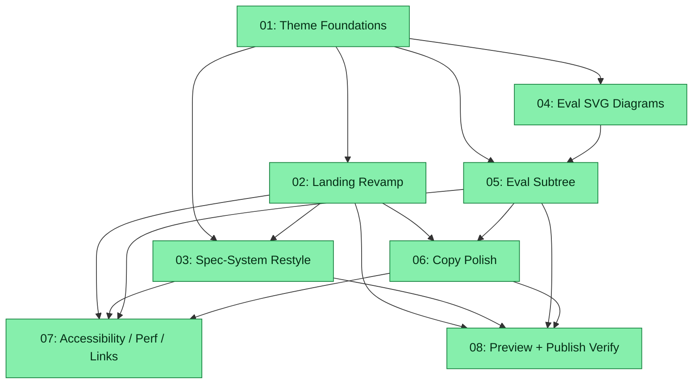

# Spec: Site Evals + Matrix Revamp

## Status
Completed

> Judge verdict — first pass (2026-05-06): **Approve**, score **4.33 / 5**. Six non-blocking findings applied (Phase 2/3 split for `style.css` write serialisation; UTF-8 / katakana clarification on the rain alphabet; `id="plugins"` anchor wired; subtask 06 reframed as voice alignment; Lighthouse mobile target relaxed to ≥75; canonical Matrix palette mapping table added to subtask 04).
>
> Judge verdict — second pass (2026-05-06, fresh adversarial review): **Approve**, score **4.5 / 5**. Three additional findings applied: (i) the `--charcoal-*` alias-bridge plan was misaligned with where the tokens live (inline in `site/index.html`, not in `site/css/style.css`) — subtask 01 D01 / DoD updated to drop the alias-in-style.css plan, subtask 02 owns the inline-block migration explicitly, subtask 03 D03 is now a verification sweep, and Decision #4 / the Risk Assessment row are rewritten accordingly; (ii) subtask 06 D02 / D03 "sweep for ..." wording tightened to a defensive `git grep` verification because no current README contains the banned words; (iii) subtask 07 D08 Lighthouse mobile gate split cleanly into `< 70 blocks / 70–74 warn / ≥ 75 clean` so the integrity-expert always has an actionable verdict path. Assessment: [`zoto-judge-assessment-site-evals-matrix-revamp-20260506.md`](zoto-judge-assessment-site-evals-matrix-revamp-20260506.md).

## Overview

Revamp the GitHub Pages site under `site/` to (a) cover **both** plugins shipped from this monorepo as peers, (b) adopt a Matrix trailing-code visual theme site-wide, (c) sharpen the copy without claiming any one plugin is "flagship", and (d) keep the plugin READMEs, top-level `README.md`, and marketplace descriptions consistent with the new positioning.

Today the site is single-plugin: `site/index.html` headlines the spec-system as the "Flagship Plugin", and only `site/spec-system/{index,quickstart,configuration,design}.html` exists. The eval-system has shipped (it is in `.cursor-plugin/marketplace.json` and has a fully written `plugins/zoto-eval-system/README.md`) but has no presence on the public site.

This spec is **docs and website only** — no plugin source, schema, template, or runtime change. Everything lives under `site/`, the two plugin `README.md` files, the top-level `README.md`, and `.cursor-plugin/marketplace.json`. CRUX-generated files are not edited.

## References

- **Site root**: `site/` (landing + `site/spec-system/`, plus `site/css/style.css`, `site/js/main.js`, `site/404.html`, `site/robots.txt`, `site/images/`)
- **Existing site spec (do not modify)**: `specs/20260406-github-pages-site/spec-github-pages-site-20260406.md` — reuse conventions, do not edit it
- **Plugin source-of-truth docs**:
  - `plugins/zoto-eval-system/README.md`, `CHANGELOG.md`, `agents/`, `commands/`, `skills/`, `rules/`, `templates/`, `templates/schema/`
  - `plugins/zoto-spec-system/README.md`, `CHANGELOG.md`
- **Voice / positioning sources**: `README.md`, `AGENTS.md`, `CRUX.md`
- **Marketplace manifest**: `.cursor-plugin/marketplace.json`
- **Plugin conventions**: `.cursor/rules/zoto-plugin-conventions.mdc` (workspace-local plugin config = `.zoto/eval-system/`)
- **Deploy workflow**: `.github/workflows/deploy-pages.yml` (triggers on `site/**` push to `main`)

## Key Decisions

1. **Parallel trees, not shared partials.** Keep `site/spec-system/` and add a parallel `site/eval-system/` tree (`index.html`, `quickstart.html`, `configuration.html`, `design.html`). The repo is plain static HTML/CSS/JS with no template engine — introducing a partial system (Eleventy, Nunjucks, server-side includes) would explode the toolchain for two pages of nav/footer dedup. Trade-off: ~60 lines of HTML chrome are duplicated per page; mitigated by keeping the chrome thin and centralising every visual token in `site/css/style.css` plus shared behaviour in `site/js/main.js`. Revisit when a third plugin lands.
2. **Matrix rain as a `<canvas>` module, gated.** Render falling glyphs in a single full-bleed `<canvas>` placed behind content (`position: fixed; inset: 0; z-index: -1`). Drive it with `requestAnimationFrame`, throttle to ~30 fps, pause on `document.visibilitychange === "hidden"`, and **disable entirely** when `window.matchMedia('(prefers-reduced-motion: reduce)').matches`. Implement as `site/js/matrix-rain.js`, loaded with `defer`. Falls back to the existing charcoal surfaces when JS is off or motion is reduced.
3. **Rain placement = full-bleed on landing + 404, low-opacity backdrop on docs.** Landing and `404.html` get the full visual; docs pages keep the rain at ≤10% alpha (CSS `opacity` on the canvas wrapper) so body copy stays WCAG AA readable. A single `body` class (`matrix-rain-strong` vs `matrix-rain-soft`) toggles intensity.
4. **Matrix CSS tokens replace charcoal-era values.** Introduce `--matrix-*` custom properties in `site/css/style.css` (`--matrix-bg: #000`, `--matrix-surface: #0a0f0a`, `--matrix-text: #c8ffc8`, `--matrix-text-dim: #6a8a6a`, `--matrix-accent: #00ff7f`, `--matrix-accent-hover: #5cffaf`, `--matrix-grid: #1a3a1a`) and reassign the existing `--color-*` semantic tokens to the Matrix palette so every consumer that reads `--color-bg-primary` / `--color-text-primary` / etc. picks up the new look without a per-rule rename. The actual `--charcoal-*` consumers in the repo are inline overrides under `body.landing-charcoal { --charcoal-*: …; }` in `site/index.html` only — subtask 02 owns that landing-page rewrite and migrates the inline block directly to `--matrix-*` (or to `--color-*` semantic names) rather than introducing a `--charcoal-*` → `--matrix-*` alias bridge in `style.css`. Body copy uses `#c8ffc8` on `#000` (verified ≥ 7:1 contrast).
5. **PrismJS overrides, not theme swap.** Layer a Matrix-flavoured CSS override file (`site/css/prism-matrix.css`) over the existing `prism-tomorrow` CDN load — keeps the CDN footprint identical and sidesteps a Prism build step. Tokens: keywords / strings / functions in cool greens, comments dimmed.
6. **Logo retreatment, not replacement.** Recolour the existing pixel-block SVG (`site/images/logo.svg`) to the Matrix palette and add a subtle CRT scanline `<filter>`; re-export `logo.png`. Geometry preserved for brand continuity.
7. **Equal-billing landing.** Replace the "Flagship Plugin" section with a two-card plugin grid (`.plugin-grid`) where each card has plugin name, version badge, one-line pitch, primary CTA into that plugin's docs subtree, and three quick-link chips (Quickstart / Design / Configure). Hero refreshed: tagline becomes "Plan and verify your specs. Generate and update your evals.", description rewritten to position both plugins. Meta tags (`<title>`, `og:*`, `twitter:*`, `<meta name="description">`) updated to cover both plugins.
8. **Copy voice = punchy, technical, no hype.** Drop "flagship" everywhere. Keep technical precision (no over-claiming on what the eval-system or spec-system does). Top-level `README.md` table of plugins gets the same voice pass; plugin READMEs are swept for the same wording (e.g. opening sentences, marketplace `description` fields).
9. **Eval-system docs subtree mirrors spec-system structure.** `index.html` (overview / when to use), `quickstart.html` (lifecycle: init → configure → create → update → execute → judge / advise / compare), `configuration.html` (schema-grounded reference), `design.html` (architecture, agents/commands/skills, askQuestion-driven config, static + LLM backends, `_meta.generated` contract, `report.yml` / cross-run compare). All workspace paths point at **`.zoto/eval-system/`** per the conventions rule.
10. **Validation = local tooling, no new CI gate.** Use `pa11y` (CLI, accessibility), `linkinator` (broken links), and a manual reduced-motion smoke test (`prefers-reduced-motion: reduce` via DevTools). Lighthouse pass is reported once but not gated. Local preview = `python3 -m http.server 8080` from `site/`. The existing `.github/workflows/deploy-pages.yml` already publishes from `site/**` on `main`; this spec does not change it.

## Requirements

1. Landing page presents `zoto-spec-system` and `zoto-eval-system` as peers with no "flagship" wording or single-plugin highlight anywhere on the site.
2. A complete `site/eval-system/` documentation subtree exists with at minimum `index.html`, `quickstart.html`, `configuration.html`, `design.html`, mirroring `plugins/zoto-eval-system/README.md` and the plugin's commands / agents / skills.
3. Site-wide Matrix trailing-code theme is applied: animated falling-glyphs canvas (respecting `prefers-reduced-motion: reduce`), Matrix CSS tokens, PrismJS override, retinted logo / favicon. Body copy and links pass WCAG AA contrast.
4. Hero, section blurbs, plugin cards, CTAs, and 404 copy are rewritten — punchy, benefit-led, technically accurate.
5. Plugin READMEs (`plugins/zoto-spec-system/README.md`, `plugins/zoto-eval-system/README.md`) and the top-level `README.md` are swept for the new voice; "flagship" and other one-plugin-highlight language is removed.
6. Marketplace `description` fields in `.cursor-plugin/marketplace.json` are reviewed for parity with the new positioning.
7. All cross-page links resolve, every page passes `pa11y`, and the matrix rain pauses under `prefers-reduced-motion: reduce`.
8. The existing GitHub Pages workflow (`.github/workflows/deploy-pages.yml`) still publishes successfully.
9. No CRUX-generated files are edited (`*.crux.md`, `*.crux.mdc`, files with `generated:` + `sourceChecksum:`/`sourceUrl:` frontmatter, or files carrying the "Generated file - do not edit!" banner).
10. No JS framework is introduced (vanilla JS only). No backend / runtime change to either plugin.

## Subtask Manifest

| ID | File | Subagent | Dependencies | Phase | Status |
|----|------|----------|-------------|-------|--------|
| 01 | `subtask-01-site-evals-matrix-revamp-theme-foundations-20260506.md` | crux-software-engineer | — | 1 | Done |
| 02 | `subtask-02-site-evals-matrix-revamp-landing-revamp-20260506.md` | crux-software-engineer | 01 | 2 | Done |
| 03 | `subtask-03-site-evals-matrix-revamp-spec-system-restyle-20260506.md` | crux-software-engineer | 01, 02 | 3 | Done |
| 04 | `subtask-04-site-evals-matrix-revamp-eval-svg-diagrams-20260506.md` | crux-software-engineer | 01 | 2 | Done |
| 05 | `subtask-05-site-evals-matrix-revamp-eval-subtree-20260506.md` | crux-platform-architect | 01, 04 | 3 | Done |
| 06 | `subtask-06-site-evals-matrix-revamp-copy-polish-20260506.md` | crux-platform-architect | 02, 05 | 4 | Done |
| 07 | `subtask-07-site-evals-matrix-revamp-accessibility-perf-links-20260506.md` | integrity-expert | 02, 03, 05, 06 | 5 | Done |
| 08 | `subtask-08-site-evals-matrix-revamp-preview-publish-verify-20260506.md` | crux-software-engineer | 02, 03, 05, 06 | 5 | Done |

> **Serialisation note (per judge finding 1):** Subtask 02 may add `.plugin-grid` / `.plugin-card` rules to `site/css/style.css` if `.featured-card` does not generalise; subtask 03 should not need to write `style.css` after the fresh-judge `--charcoal-*` re-architecture (subtask 03 D03 is now a verification sweep rather than an alias removal). The S02 → S03 dependency edge is retained as a defensive serialisation against any residual concurrent write to `site/css/style.css`. The graph and Execution Order below reflect this.

## Subtask Dependency Graph

## Execution Order

### Phase 1
| ID | Subagent | Description |
|----|----------|-------------|
| 01 | crux-software-engineer | Matrix CSS token set, falling-glyphs canvas module with reduced-motion + visibility guards, PrismJS override, retinted logo / favicon |

### Phase 2 (Parallel, after Phase 1)
| ID | Subagent | Description |
|----|----------|-------------|
| 02 | crux-software-engineer | Landing-page revamp: drop "Flagship", peer plugin grid, refreshed meta tags + hero copy |
| 04 | crux-software-engineer | Eval-system SVG diagrams + Cursor IDE mockups (lifecycle, run/report flow, `/canvas` compare, askQuestion config flow) |

### Phase 3 (Parallel, after Phase 2)
| ID | Subagent | Description |
|----|----------|-------------|
| 03 | crux-software-engineer | Re-skin existing `site/spec-system/*.html` to the Matrix theme without changing IA; verify (sweep) no `--charcoal-*` references remain anywhere in `site/` |
| 05 | crux-platform-architect | `site/eval-system/` subtree: `index`, `quickstart`, `configuration`, `design` HTML pages sourced from `plugins/zoto-eval-system/README.md` + plugin assets |

### Phase 4 (after Phase 3)
| ID | Subagent | Description |
|----|----------|-------------|
| 06 | crux-platform-architect | Cross-cutting copy polish across top-level `README.md`, both plugin READMEs, and marketplace `description` fields — opening-paragraph voice alignment plus a sweep for any one-plugin-highlight wording |

### Phase 5 (Parallel, after Phase 4)
| ID | Subagent | Description |
|----|----------|-------------|
| 07 | integrity-expert | Axe / pa11y, contrast, reduced-motion smoke, `linkinator` broken-link sweep, Lighthouse pass (mobile Performance: < 70 blocks, 70–74 warn, ≥ 75 clean — full-bleed canvas in scope) |
| 08 | crux-software-engineer | `site/README.md` local-preview docs + GitHub Pages publish smoke test |

## Risk Assessment

| Risk | Likelihood | Impact | Mitigation |
|------|-----------|--------|------------|
| Matrix rain canvas hurts mobile perf | Medium | High | 30 fps cap, visibility-paused, reduced-motion fully off, low-DPR draw on mobile, measured in subtask 07 |
| Body copy contrast drops below WCAG AA | Medium | High | Token palette designed for ≥7:1 on `#c8ffc8 / #000`; subtask 07 runs axe and a manual contrast check |
| Spec-system pages look broken mid-restyle (token rename) | Low | Medium | Spec-system pages already consume `--color-*` semantic tokens, which subtask 01 reassigns to the Matrix palette in one step. The only `--charcoal-*` consumers are inline overrides in `site/index.html`, owned end-to-end by subtask 02. Subtask 03 verifies the cross-tree sweep is clean. |
| Eval-system docs drift from `plugins/zoto-eval-system/README.md` | Medium | Medium | Subtask 05 cites README sections by `start:end:path` in design notes; subtask 06 cross-checks during the polish pass |
| Marketplace description churn breaks downstream tooling | Low | Medium | Keep wire format intact (`name`, `source`, `description`) — only `description` text changes; subtask 06 limits edits to wording |
| GitHub Pages workflow stops publishing because of canvas script | Low | Medium | Workflow only watches `site/**` and runs no build step; subtask 08 verifies a deploy preview after merge |
| HTML duplication between parallel trees diverges over time | Medium | Low | Centralise visual changes in CSS / JS; flag a future "shared partials" subtask if a 3rd plugin appears |

## Definition of Done

- [ ] Landing page presents both plugins as peers; the word "flagship" appears nowhere on the site or in plugin READMEs.
- [ ] `site/eval-system/{index,quickstart,configuration,design}.html` all exist, mirror `plugins/zoto-eval-system/README.md`, and link to / from the landing page.
- [ ] Matrix trailing-code theme is applied site-wide, respects `prefers-reduced-motion: reduce`, and passes WCAG AA on body copy and links.
- [ ] Hero / section copy is rewritten to be more engaging without losing technical precision; no single-plugin highlight remains.
- [ ] Marketplace `description` fields, top-level `README.md`, and both plugin READMEs are consistent with the new positioning.
- [ ] All site pages pass `linkinator` link check, `pa11y` accessibility check, and a local preview smoke test; the GitHub Pages workflow still publishes successfully.
- [ ] No CRUX-generated files were edited; source files were edited and CRUX outputs regenerated where applicable.
- [ ] All eval-system documentation paths reference `.zoto/eval-system/` (not legacy `.zoto-eval-system/`).
- [ ] No JS framework was introduced; no plugin source / schema / template / runtime was changed.

## Execution Notes

### Phase 5 Execution (resumed 2026-05-07)

- **Subtasks 01–06**: Completed in prior session (2026-05-06), all verified
- **Subtask 07** (integrity-expert): Fixed 26 HTML accessibility errors across 9 files, verified contrast ratios, motion-respect and tab-visibility guards, link integrity (30 links, 0 broken), skip-to-content contrast fix. Findings documented in `findings-accessibility-perf-links.md`.
- **Subtask 08** (crux-software-engineer): Created `site/README.md` and `site/sitemap.xml`, verified GitHub Pages workflow, recorded smoke test results. Required one fix round to record smoke test in Execution Notes.
- **Final verification**: 125/127 tests passed (2 pre-existing timeouts), 0 linter errors, onStop check clean (33 checked, 0 critical)
- **Execution report**: `execution-report-site-evals-matrix-revamp-20260506.md`
