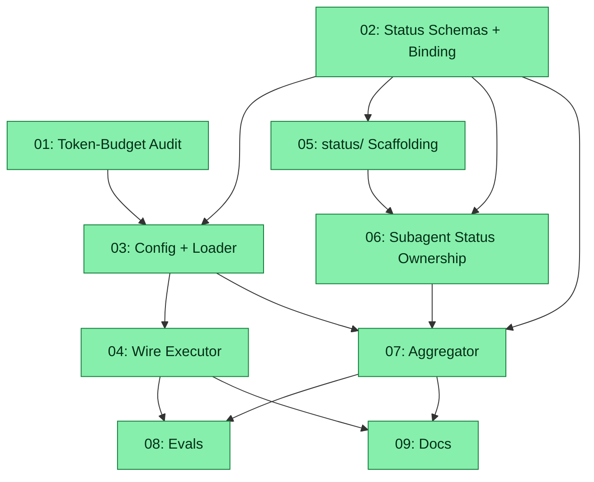

# Spec: Spec System Live Status & No-Restart Token Budget

## Status
Completed

## Overview

Evolve `plugins/zoto-spec-system/` so that:

1. **Token budgets for every spec-system subagent (`zoto-spec-generator`, `zoto-spec-executor`, `zoto-spec-judge`) live in a file** under `.zoto/spec-system/config.yml` — a single source of truth that long-running coordinators **re-read on every poll iteration** so changes apply to the next spawned subagent **without restarting the executor**.
2. **Each subtask in a spec gets a paired pair of status files** under `{specsDir}/<spec>/status/` that the assigned subagent owns and writes to as it works (`subtask-NN-...status.md` for humans, `subtask-NN-...status.yml` for machines, schema-validated and 1:1 bound).
3. **A top-level aggregator (a backgrounded `tsx scripts/spec-aggregator.ts --watch` process started by `zoto-spec-executor` for the spec's lifetime, with `--once` and `--validate-only` modes for resume / out-of-process polling)** rebuilds `status.md` + `status.yml` at the spec root every time a subagent's `.status.yml` changes, and surfaces blocked / failed subtasks promptly. The executor LLM never imports the loop; it shells out to the script.
4. **Two JSON Schemas under `plugins/zoto-spec-system/templates/schema/`** (`spec-status.schema.json`, `subtask-status.schema.json`) plus an extended `config.schema.json` carry the new fields. Each markdown block in a `.status.md` maps 1:1 to a schema field via HTML-comment block markers (`<!-- status:<field-id>:start --> ... <!-- status:<field-id>:end -->`) so the binding is parser-friendly and round-trippable.

The work is dogfooded: the live monorepo gets a starter `.zoto/spec-system/config.yml` with sensible defaults and a `status/` directory scaffolded for any future spec.

## References

- Plugin root: `plugins/zoto-spec-system/`
- Existing config (sparse): `plugins/zoto-spec-system/templates/config.json` (internal default carrier), `plugins/zoto-spec-system/docs/config-schema.md`, `plugins/zoto-spec-system/docs/example-config.yml`
- Existing schemas in this repo (style anchor): `plugins/zoto-eval-system/templates/schema/{config,manifest,result,case-meta,cleanup-plan}.schema.json`
- Existing spec dir as shape reference: `specs/20260503-eval-system-v2/`
- Per-run metadata pattern (style anchor): `evals/_runs/<ts>/.run-meta.json` + `report.yml`
- Spec-system source files to update:
  - Agents: `plugins/zoto-spec-system/agents/{zoto-spec-generator,zoto-spec-executor,zoto-spec-judge}.md`
  - Skills: `plugins/zoto-spec-system/skills/{zoto-create-spec,zoto-execute-spec,zoto-judge-spec}/SKILL.md`
  - Commands: `plugins/zoto-spec-system/commands/{zoto-spec-create,zoto-spec-execute,zoto-spec-judge}.md`
  - Rule: `plugins/zoto-spec-system/rules/zoto-spec-system.mdc`
  - Hook: `plugins/zoto-spec-system/hooks/zoto-session-start.ts`
  - Plugin manifest: `plugins/zoto-spec-system/.cursor-plugin/plugin.json`
- Repo-level `AGENTS.md` (subagent allocation table)

## Key Decisions (locked, do not re-litigate)

| # | Decision | Choice |
|---|----------|--------|
| P | Path convention | All zoto plugins put their workspace-local config under `.zoto/<plugin-suffix>/` where `<plugin-suffix>` is the plugin name with the leading `zoto-` stripped (e.g. `plugins/zoto-spec-system/` → `.zoto/spec-system/`, `plugins/zoto-eval-system/` → `.zoto/eval-system/`). The `.zoto/` directory is the shared root for all per-plugin runtime state. The convention is documented in `.cursor/rules/zoto-plugin-conventions.mdc` (subtask 09) and is mandatory for every new plugin. Migrating the existing `.zoto/eval-system/` directory is **out of scope** for this spec — it is queued as a follow-up spec. |
| C | Config location | `.zoto/spec-system/config.yml` (YAML; under the new `.zoto/<plugin-suffix>/` convention from decision P). No new sibling files. Schema lives at `plugins/zoto-spec-system/templates/schema/config.schema.json`; the internal default carrier `plugins/zoto-spec-system/templates/config.json` (JSON) supplies baseline values when keys are absent. |
| TB | Token-budget shape | Per-role under `subagents.<role>.tokenBudget` plus an inheritance fallback `subagents.default.tokenBudget`. Roles: `generator`, `executor`, `judge`, `subtask`. Token budget is **advisory metadata** that the executor passes into each spawned `Task` agent's prompt so the spawned agent self-regulates; Cursor's `Task` API has no native token-budget arg today, so the executor records the budget in the spawned subagent's `.status.yml` and the agent acknowledges it in its first heartbeat. |
| L | Live reload | The backgrounded `spec-aggregator --watch` process re-reads `.zoto/spec-system/config.yml` at the **top of every aggregator poll iteration** (default `aggregator.pollIntervalMs: 1500`). The executor LLM also re-resolves the per-spawn budget by shelling out to a thin `tsx scripts/spec-spawn-prefix.ts --role <role> ...` CLI, which calls the same loader internally. The first read after the file's mtime advances logs a single `config_reloaded` event into the spec-root `status.yml`. No file watchers — pure mtime check on a shallow path keeps it portable across platforms and inside `Task` sandboxes. |
| S | State files per subtask | Two files per subtask under `{specsDir}/<spec>/status/`: `subtask-NN-<feature>-<name>-<yyyymmdd>.status.md` (human, block-marked) and `.status.yml` (machine, schema-validated). The original `subtask-NN-...md` stays **immutable spec content** — execution-time state moves to the status pair. Existing specs continue to work; status files are additive and absent for legacy specs. |
| B | MD↔YML binding | HTML-comment block markers in the `.status.md` (`<!-- status:checklist:start --> ... <!-- status:checklist:end -->`) carry exactly the subset of fields the schema declares. A small `tsx` round-trip helper (`scripts/spec-status-roundtrip.ts`, vendored under `plugins/zoto-spec-system/scripts/`) parses md → yml and renders yml → md so either side can rebuild the other. The yml is the authoritative store; the md is a generated rendering with the schema-bound blocks editable in place. |
| A | Aggregator runtime | A single CLI, `plugins/zoto-spec-system/scripts/spec-aggregator.ts`, with three modes: `--watch` (default during `/zoto-spec-execute` — the executor LLM backgrounds it for the spec's lifetime), `--once` (one-shot rebuild for dashboards / `--resume`), and `--validate-only` (CI gate, no spec-root writes). Pure mtime scan over `status/*.status.yml`; emits a debounced rebuild every `aggregator.pollIntervalMs` (default 1500 ms) when any source file mtime advances. The CLI is the only owner of the loop; there is no in-process Node loop inside the executor LLM. |
| AV | Aggregator output | `{specsDir}/<spec>/status.md` + `{specsDir}/<spec>/status.yml` at the spec root, schema-validated against `spec-status.schema.json`. Same block-marker convention as subtask status files. |
| F | Failure / blocker surfacing | Aggregator promotes any subtask with `state: blocked` or `state: failed` into a top-level `blockers[]` array in `status.yml` and a `## Blockers` block in `status.md`, with link-style references to the offending `subtask-NN-...status.md`. |
| BU | No-restart contract | The "no-restart" guarantee covers config keys consumed at the **top of each aggregator iteration**: `subagents.*.tokenBudget`, `subagents.*.model`, `aggregator.pollIntervalMs`, `aggregator.debounceMs`, `aggregator.enabled`, `spec.parallelLimit`. Other keys (`unitOfWork`, `specsDir`, `workDir`, `hooks.*`, `extensions.*`) require a fresh `/zoto-spec-execute` invocation and are documented as such. **Token budget changes apply to the next spawned subagent without restarting the executor.** The contract is asserted by an eval (subtask 08). |

## Requirements

1. `plugins/zoto-spec-system/templates/schema/config.schema.json` exists, follows the eval-system style ($id, draft-07, descriptions, defaults), and adds the `subagents.*.tokenBudget` and `aggregator.*` fields.
2. `plugins/zoto-spec-system/templates/config.json` populates safe defaults (`subagents.default.tokenBudget: 200000`, `aggregator.pollIntervalMs: 1500`, `aggregator.debounceMs: 250`).
3. `plugins/zoto-spec-system/templates/schema/spec-status.schema.json` and `subtask-status.schema.json` exist, are draft-07-valid, and define every field referenced by the `.status.md`/`.status.yml` pair.
4. The md↔yml binding is documented (block-marker convention) in a single canonical place — `plugins/zoto-spec-system/docs/status-schema.md` — and a `tsx` round-trip helper validates it.
5. The `zoto-create-spec` skill scaffolds `{specsDir}/<spec>/status/` with one `.status.md` + `.status.yml` per subtask, populated from the subtask's Deliverables Checklist.
6. The `zoto-execute-spec` skill instructs each spawned subagent to own its two status files, write a heartbeat at start, tick checklist items as work completes, and emit a final `state: completed | blocked | failed`.
7. The backgrounded `spec-aggregator --watch` process reloads `.zoto/spec-system/config.yml` and rescans `status/*.status.yml` every `aggregator.pollIntervalMs` ms; rebuilds the spec-root `status.md` + `status.yml` when any source mtime advances. The executor LLM starts this process at `/zoto-spec-execute` start and signals it on cancellation.
8. The standalone `plugins/zoto-spec-system/scripts/spec-aggregator.ts` script supports `--once` (one-shot rebuild), `--watch` (loop with the same poll/debounce semantics — used by the executor), and `--validate-only` (CI gate, no spec-root writes) so `--resume`, dashboards, and CI can drive aggregation.
9. Token-budget changes in `.zoto/spec-system/config.yml` take effect on the **next spawned subagent** (asserted by an eval) without restarting the executor.
10. README, the rule (`zoto-spec-system.mdc`), `docs/config-schema.md`, and `AGENTS.md` are updated to reference the new config keys, status pair, and aggregator behaviour.

## Subtask Manifest

| ID | File | Subagent | Dependencies | Phase | Status |
|----|------|----------|-------------|-------|--------|
| 01 | `subtask-01-spec-system-live-status-token-budget-audit-20260506.md` | crux-software-engineer | — | 1 | Done |
| 02 | `subtask-02-spec-system-live-status-status-schemas-20260506.md` | crux-platform-architect | — | 1 | Done |
| 03 | `subtask-03-spec-system-live-status-config-loader-20260506.md` | crux-software-engineer | 01, 02 | 2 | Done |
| 04 | `subtask-04-spec-system-live-status-executor-wiring-20260506.md` | crux-software-engineer | 03 | 3 | Done |
| 05 | `subtask-05-spec-system-live-status-status-scaffold-20260506.md` | crux-software-engineer | 02 | 2 | Done |
| 06 | `subtask-06-spec-system-live-status-subagent-status-ownership-20260506.md` | crux-software-engineer | 02, 05 | 3 | Done |
| 07 | `subtask-07-spec-system-live-status-aggregator-20260506.md` | crux-software-engineer | 02, 03, 06 | 4 | Done |
| 08 | `subtask-08-spec-system-live-status-evals-20260506.md` | crux-software-engineer | 04, 07 | 5 | Done |
| 09 | `subtask-09-spec-system-live-status-docs-20260506.md` | crux-platform-architect | 04, 07 | 5 | Done |

## Subtask Dependency Graph

## Execution Order

Phases are derived from the dependency graph. Subtasks within a phase have no
dependencies on each other and may run in parallel. A phase starts only after
all subtasks in prior phases are complete.

### Phase 1 (Parallel)
| ID | Subagent | Description |
|----|----------|-------------|
| 01 | crux-software-engineer | Confirm via `rg` that no token-budget keys exist in the plugin today; produce a short (≤ 50 lines) memo locking the per-role config shape, the resolution algorithm, the spawn-role mapping, and the no-restart contract. |
| 02 | crux-platform-architect | Author `spec-status.schema.json` and `subtask-status.schema.json` (draft-07), document the md↔yml block-marker binding in `plugins/zoto-spec-system/docs/status-schema.md`, and extend `config.schema.json` with the `subagents.*` and `aggregator.*` blocks. |

### Phase 2 (after Phase 1)
| ID | Subagent | Description |
|----|----------|-------------|
| 03 | crux-software-engineer | Implement the config loader (`plugins/zoto-spec-system/src/config-loader.ts`) with mtime-based live reload, populate `templates/config.json` with safe defaults, and add the no-restart loader unit test. |
| 05 | crux-software-engineer | Update `zoto-create-spec` skill to scaffold `{specsDir}/<spec>/status/` with one paired `.status.md` + `.status.yml` per subtask, populated from each subtask's Deliverables Checklist via the round-trip helper. |

### Phase 3 (after Phase 2)
| ID | Subagent | Description |
|----|----------|-------------|
| 04 | crux-software-engineer | Wire `/zoto-spec-execute`, `zoto-spec-executor`, and `zoto-execute-spec` to the live loader: ship a thin `tsx scripts/spec-spawn-prefix.ts` CLI that the executor LLM shells out to per spawn (it calls the loader internally), document the no-restart contract in agent / skill / command files, and pass the resolved per-role token budget into each spawned subagent prompt. Also document the legacy-spec branch (specs without `status/` skip the aggregator wiring). |
| 06 | crux-software-engineer | Update `zoto-execute-spec` (and the executor agent definition) so each spawned subagent owns and updates its two status files: heartbeat on start, tick checklist items as work completes, finalize with `state: completed \| blocked \| failed`. |

### Phase 4 (after Phase 3)
| ID | Subagent | Description |
|----|----------|-------------|
| 07 | crux-software-engineer | Implement the aggregator as the standalone `plugins/zoto-spec-system/scripts/spec-aggregator.ts` (`--once` / `--watch` / `--validate-only`). The executor LLM backgrounds the `--watch` mode for the spec's lifetime — there is no separate in-process loop. Rebuilds `status.md` + `status.yml` at the spec root, surfaces blocked/failed subtasks. |

### Phase 5 (after Phase 4)
| ID | Subagent | Description |
|----|----------|-------------|
| 08 | crux-software-engineer | Add evals: config no-restart token-budget propagation, status-pair round-trip (md↔yml), aggregator surfacing of blocked/failed subtasks, schema validation. |
| 09 | crux-platform-architect | Update `plugins/zoto-spec-system/README.md`, `rules/zoto-spec-system.mdc`, `docs/config-schema.md`, `docs/example-config.yml`, and `AGENTS.md` to document the new config keys, status pair, aggregator behaviour, and no-restart contract. Bump plugin version. |

## Definition of Done
- [ ] All subtasks completed and adversarially verified
- [ ] `.zoto/spec-system/config.yml` schema includes `subagents.*` and `aggregator.*` blocks; defaults populated in `plugins/zoto-spec-system/templates/config.json` (internal default carrier)
- [ ] `spec-status.schema.json` and `subtask-status.schema.json` exist, are draft-07-valid, and round-trip via the helper script
- [ ] Spec creation scaffolds `status/` with the paired files for every subtask
- [ ] Spawned subagents own and update their `.status.md` + `.status.yml` during execution
- [ ] Aggregator rebuilds spec-root `status.md` + `status.yml` on every status-pair change and surfaces blocked/failed subtasks promptly
- [ ] Token-budget changes in `.zoto/spec-system/config.yml` apply to the next spawned subagent without restarting the executor (asserted by eval)
- [ ] README, rule, AGENTS.md, and skill / agent / command files updated
- [ ] No linter errors in modified files
- [ ] Plugin tests pass (`pnpm --filter @zoto-agents/zoto-spec-system test`)

## Execution Notes
[Filled in during/after execution]
