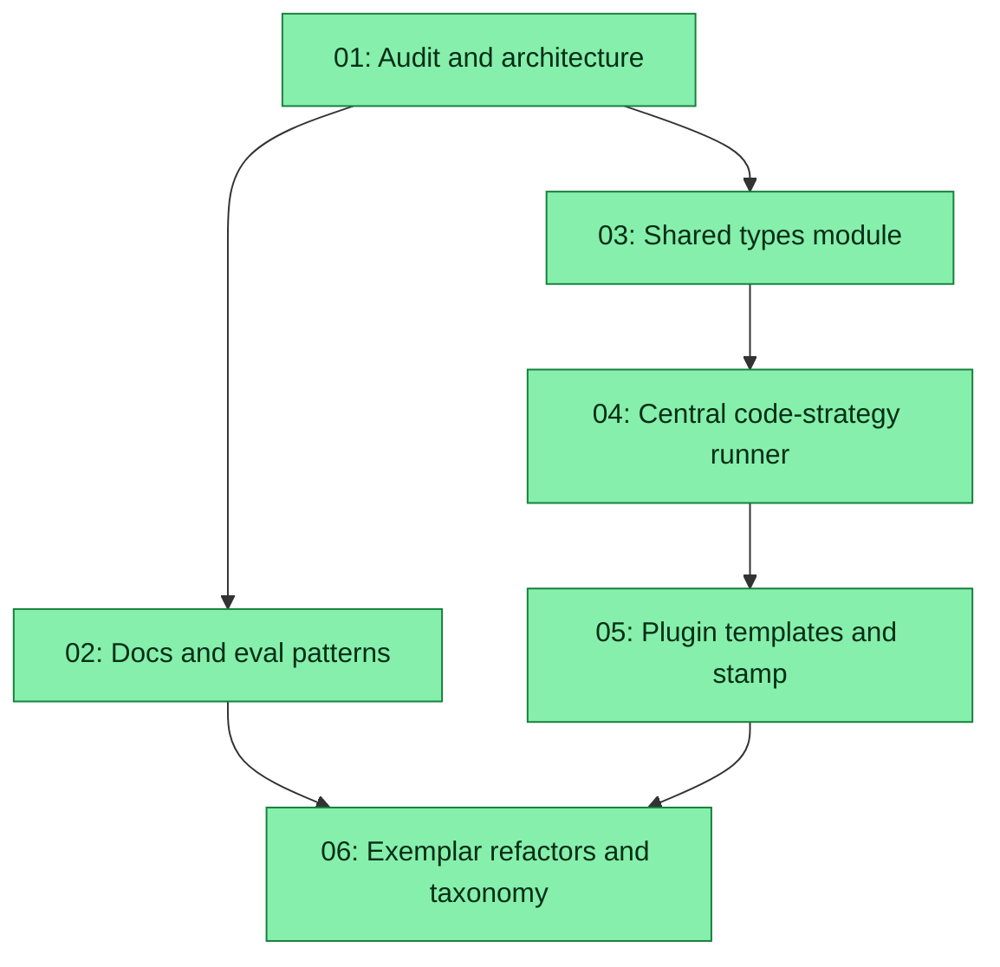

# Spec: Refactor LLM Eval Approach (Dual Strategy + Shared Types)

## Status
**Completed** — executed 2026-05-08 (67m). All 6 subtasks verified. See `execution-report-refactor-llm-eval-approach-20260508.md`.

## Overview

Unify and de-duplicate the host monorepo’s LLM evaluation surfaces across:

- **`plugins/zoto-eval-system/`** — templates that stamp code-strategy tests, schema/manifest contracts, plugin README and tooling.
- **`evals/`** — `evals/llm/*.test.ts` (Vitest, `@cursor/sdk` “code” strategy) and `evals/_llm/*` (declarative JSON runner, `runner.ts`, `case.ts`, graders, `update.ts`).
- **Root scripts** — `scripts/eval-stamp.ts`, `scripts/eval-discover.ts`, `scripts/eval-analyse.ts`, cleanup/bootstrap helpers.
- **Documentation** — `plugins/zoto-eval-system/README.md`, and repo-level `AGENTS.md` / docs only where they explain eval architecture for agents.

Today, every stamped `evals/llm/test_*.test.ts` repeats the same `CaseDefinition` interface and almost identical `describe` / sandbox / grader loop (from `plugins/zoto-eval-system/templates/llm/code-cursor-sdk/per-primitive-test.ts.tmpl`), while `evals/_llm/case.ts` already defines **`EvalCase`** for the declarative path. The goal is a **single coherent type story**, **one centralized execution harness** for code-strategy files, and **first-class support for both** declarative JSON (existing locations under `plugins/zoto-eval-system/evals/**/*.json`, consumed via `.zoto/eval-system/manifest.yml` + discovery) **and** hand-authored or stamped Vitest tests—without forcing an either/or choice.

**Note on `common.js`:** The user mentioned `common.js`; this repo standard is **TypeScript** (`.ts`) with ESM `import`/`export`. Shared types MUST live in **`.ts`** modules (e.g. under `evals/llm/_shared/` and/or `evals/_llm/`), compiled/run via `tsx` / Vitest — not hand-written `common.js`, unless a future build step emits JS for a specific consumer (out of scope unless subtask 05 discovers a hard requirement).

## Key Decisions

- **Decision 1 (Dual framework):** Keep **`eval:llm:declarative`** (`evals/_llm/runner.ts --full`) and **`eval:llm:code`** (`vitest` on `evals/llm/`) as complementary backends. Manifest/discovery (`.zoto/eval-system/manifest.yml`, `scripts/eval-discover.ts`) remains authoritative for **which** primitives have evals; codegen may emit or refresh **code** tests from analyser output while JSON cases remain the source for **declarative** runs where configured.
- **Decision 2 (Types):** Introduce or consolidate a **single exported “case shape”** for the code-strategy harness. Prefer extending or aliasing **`EvalCase` / `DeclarativeGraderConfig`** from `evals/_llm/case.ts` (or a thin `evals/llm/_shared/eval-case.ts` that re-exports and narrows for Vitest) so stamped tests do not redefine `CaseDefinition` inline. Document the relationship between **`id: string`** (code tests) and **`id: number | string`** (declarative loader).
- **Decision 3 (Boilerplate):** Replace per-file copy-paste loops with a **shared runner factory** (e.g. `runLlmCodeSuite({ targetId, cases, ... })` in `evals/llm/_shared/`) invoked by thin test files; `per-primitive-test.ts.tmpl` emits only **imports + `CASES` constant + one `describe` call** (or JSON load + call).
- **Decision 4 (Commands vs simple checks):** **Command** evals (`test_command_*.test.ts`) prioritize **Vitest + SDK** with **inline multi-step prompts** (`follow_ups`, branching tool usage) that mirror real transcripts—not large JSON blobs that re-encode SDK semantics. **High-volume, low-branch** assertions (e.g. “skill triggers on phrase X”) move toward **declarative JSON** under `plugins/zoto-eval-system/evals/` or table-driven generation, with **spec prompts** (this spec-system’s own patterns) feeding future **eval consumer** / analyser examples. Exact split per primitive is refined in subtask 01–02 and executed in subtask 06.
- **Decision 5 (Plugin + host parity):** `scripts/eval-stamp.ts`, `plugins/zoto-eval-system/scripts/eval-update.ts`, and templates under `plugins/zoto-eval-system/templates/llm/**` stay aligned so regenerated files never reintroduce duplicate interfaces.

## Requirements

1. **Shared types / boilerplate reduction:** Central module(s) for case/case-meta/grader types; eliminate repeated `CaseDefinition` in each `evals/llm/test_*.test.ts` (via template + one-time migration).
2. **Dual framework support:** Document and preserve JSON/declarative artifacts in their established locations; keep code-driven tests where appropriate; avoid duplicating execution logic across `evals/llm/*.test.ts`.
3. **Commands vs simple checks:** Command evals use realistic multi-step Vitest flows; bulk simple checks lean declarative or generated; capture **spec prompt** examples for future codegen (eval updater / analyser).
4. **Docs:** Update `plugins/zoto-eval-system/README.md` (and minimal `AGENTS.md` pointers if eval strategy for agents changes).
5. **Verification:** `pnpm run eval:llm:code` and `pnpm run eval:llm:declarative` (or documented subsets) remain valid entrypoints; CI/static validators unchanged unless intentionally extended.

## Canonical paths (inventory anchors)

| Area | Paths |
|------|--------|
| Code-strategy tests | `evals/llm/test_*.test.ts`, `evals/llm/_shared/*`, `evals/llm/vitest.config.ts` |
| Declarative backend | `evals/_llm/runner.ts`, `evals/_llm/case.ts`, `evals/_llm/update.ts`, `evals/_llm/graders/*` |
| Host scripts | `scripts/eval-stamp.ts`, `scripts/eval-discover.ts`, `scripts/eval-analyse.ts`, `scripts/eval-cleanup-stale.ts` |
| Workspace manifest | `.zoto/eval-system/manifest.yml`, `manifest.history.yml`, `config.yml` |
| Plugin eval JSON | `plugins/zoto-eval-system/evals/**/*.json` |
| Templates | `plugins/zoto-eval-system/templates/llm/code-cursor-sdk/*`, `agent-sdk/*`, `templates/schema/*` |
| Plugin updater | `plugins/zoto-eval-system/scripts/eval-update.ts` |

## Subtask Manifest

| ID | File | Subagent | Dependencies | Phase | Status |
|----|------|----------|--------------|-------|--------|
| 01 | `subtask-01-refactor-llm-eval-approach-audit-architecture-20260508.md` | crux-platform-architect | — | 1 | Done |
| 02 | `subtask-02-refactor-llm-eval-approach-docs-patterns-20260508.md` | crux-platform-architect | 01 | 2 | Done |
| 03 | `subtask-03-refactor-llm-eval-approach-shared-types-20260508.md` | crux-software-engineer | 01 | 2 | Done |
| 04 | `subtask-04-refactor-llm-eval-approach-central-runner-20260508.md` | crux-software-engineer | 03 | 3 | Done |
| 05 | `subtask-05-refactor-llm-eval-approach-plugin-templates-20260508.md` | crux-software-engineer | 04 | 4 | Done |
| 06 | `subtask-06-refactor-llm-eval-approach-exemplar-taxonomy-20260508.md` | crux-software-engineer | 02, 05 | 5 | Done |

## Subtask Dependency Graph



## Execution Order

### Phase 1
| ID | Subagent | Description |
|----|----------|-------------|
| 01 | crux-platform-architect | Audit current duplication, JSON vs code boundaries, and record target architecture + open questions |

### Phase 2 (parallel)
| ID | Subagent | Description |
|----|----------|-------------|
| 02 | crux-platform-architect | Documentation and command-vs-declarative playbook |
| 03 | crux-software-engineer | Implement shared type exports and align with `evals/_llm/case.ts` |

### Phase 3
| ID | Subagent | Description |
|----|----------|-------------|
| 04 | crux-software-engineer | Centralize Vitest execution harness; thin per-target tests |

### Phase 4
| ID | Subagent | Description |
|----|----------|-------------|
| 05 | crux-software-engineer | Update plugin templates, `eval-stamp`, `eval-update` paths, regression selftests |

### Phase 5
| ID | Subagent | Description |
|----|----------|-------------|
| 06 | crux-software-engineer | Apply taxonomy to representative primitives; validate dual entrypoints |

## Definition of Done

- [x] All subtasks completed
- [x] `pnpm test` / plugin validators pass for touched packages (62/62 eval-system tests pass)
- [x] No new linter errors in modified files
- [x] `evals/llm` tests no longer duplicate the full SDK runner loop (shared harness in use — zero inline `CaseDefinition` remaining)
- [x] Declarative and code-strategy documented in plugin README with correct script names
- [x] `zoto-spec-judge` assessment at `assessment-refactor-llm-eval-approach-20260508.md` (user-approved 2026-05-08)

## Execution Notes

**Status scaffolding:** After subtasks exist, generate `status/*.status.{md,yml}` via one of:

```bash
# From repo root — absolute spec-dir (required when using pnpm --filter, which sets cwd to the plugin package)
pnpm --filter @zoto-agents/zoto-spec-system run spec-status-roundtrip -- scaffold --spec-dir "$(pwd)/specs/20260508-refactor-llm-eval-approach"
```

```bash
# From repo root — script resolves paths against cwd
pnpm exec tsx plugins/zoto-spec-system/scripts/spec-status-roundtrip.ts scaffold --spec-dir specs/20260508-refactor-llm-eval-approach
```

The root `package.json` does not define `spec-status-roundtrip`; prefer **`pnpm exec tsx ...`** from the repo root or **`--spec-dir "$(pwd)/specs/...`** with `--filter`.

**Manifest vs status files:** The **Subtask Manifest** `Status` column is planning shorthand (`Pending` until work starts). During `/z-spec-execute`, treat `status/*.status.{md,yml}` under this spec directory as the live checklist and agent state; refresh the manifest column only if you maintain it manually for visibility.

**Judge:** After user approval, `/z-spec-judge` writes `assessment-[feature-name]-[yyyymmdd].md` in this directory. This spec: `assessment-refactor-llm-eval-approach-20260508.md` (2026-05-08).
