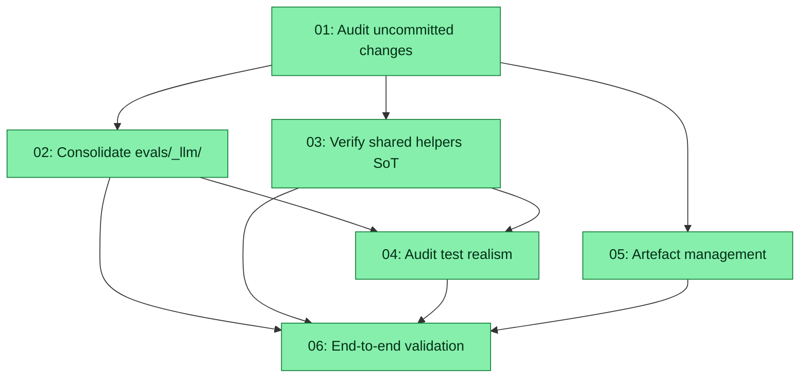

# Spec: Rationalise Eval System (Post-Refactor Cleanup)

## Status
Completed

## Overview

Stabilise and consolidate the LLM eval surfaces after the **completed** dual-strategy refactor (`specs/20260508-refactor-llm-eval-approach/`, executed 2026-05-08). That spec relocated the declarative engine into `plugins/zoto-eval-system/engine/` and introduced a centralised `code`-strategy harness in `evals/llm/_shared/`. Six follow-up commits then tightened grader rigour (regex tightening, `contains → llm-judge` migration).

Today there are **169 modified files (-24 068 / +7 630)** uncommitted plus ~130 untracked run directories and 24 analyser cache files cluttering the working tree. The architecture is right; the remaining cost is **incoherence at the seams**: a duplicate `evals/_llm/sandbox.ts`, template imports that still target the host path instead of the engine alias, stale doc references, missing gitignore entries, and unverified end-to-end behaviour.

This spec is **cleanup, not redesign**. Goals:

1. Audit the 169 uncommitted changes for coherence (orphans, dangling references, drift) — no code edits, just a written audit.
2. Reduce `evals/_llm/` to **selftests + thin re-export shims** (no engine code, no duplicates).
3. Verify `evals/llm/_shared/` is the single source of truth for the code-strategy harness — no scattered helpers.
4. Sanity-check that representative test files are realistic and standalone-readable (single-pass review, no bulk rewrites).
5. Wire artefact management — gitignore patterns for `evals/_runs/` and `.zoto/eval-system/cache/`, retention via existing `eval-gc`, and verify the new `eval-cleanup-stale-check` workflow.
6. End-to-end validation — `pnpm run eval:llm:code`, plugin validators, sandbox/SDK selftests, no broken imports.

The output is a clean working tree (or a clean diff after one commit) with one obvious place for each piece of the eval system, ready for routine use.

## Key Decisions

- **Decision 1 (Engine location is fixed):** The declarative engine (`runner.ts`, `sdk-bridge.ts`, `update.ts`, `writer.ts`, `manifest-snapshot.ts`, `compare.ts`, `metrics.ts`, `case.ts`, `sandbox.ts`, graders, `_user-case-guards.ts`, `analyser-payload.ts`) lives at `plugins/zoto-eval-system/engine/` and is consumed via the `#eval-engine/*` Vitest alias and direct `plugins/zoto-eval-system/engine/*.js` imports from scripts. **No reversal.** Any host-tree copy that is not a thin re-export shim is a defect.
- **Decision 2 (`evals/_llm/` minimal scope):** This directory keeps only:
  - **Selftests / smoke tests** — `sandbox.selftest.ts`, `sandbox.smoke.ts`, `sdk-bridge.selftest.ts`, `analyser.cache.selftest.ts`, `runner-validate-enriched.test.ts`, `_user-case-guards.test.ts`.
  - **Re-export shims** — `case.ts` (already a shim), `_user-case-guards.ts` (already a shim).
  - **Python parity** — `types.py`.
  - **README** — points at the engine and lists the remaining files.
  - The duplicate `evals/_llm/sandbox.ts` becomes a re-export shim of `#eval-engine/sandbox.js` **or** is deleted in favour of consumers importing from the engine directly. Subtask 02 picks the shim variant to keep selftest paths stable; downstream consumers migrate to `#eval-engine/sandbox.js` where convenient.
- **Decision 3 (Code-strategy SoT):** `evals/llm/_shared/` is the single home for code-strategy helpers (`code-strategy-case.ts`, `run-code-strategy-suite.ts`, `sandbox-helpers.ts`, `setup.ts`, `zoto-llm-reporter.ts`). Stamped tests import only from `./_shared/*` and `#eval-engine/*` — never from `../../_llm/*` or `../../plugins/zoto-eval-system/*`. The 43 stamped tests already follow this; subtask 03 verifies and locks the contract.
- **Decision 4 (Test realism is incremental):** Subtask 04 is a **read-only audit** of 5–7 representative test files (commands, agents, skills, hooks). It produces a written list of any cases whose prompts are unrealistic or graders are weak. **It does not bulk-rewrite cases** — those are tracked as follow-up work in the audit and addressed via the existing `/z-eval-update` and grader-tightening workflows already used in the recent 7 commits.
- **Decision 5 (Artefact retention via existing tooling):** `eval-gc` already exists (`pnpm run eval:gc`, `eval:gc:apply`). `runs.retention` already exists in the config schema. Subtask 05 wires the gitignore, documents retention defaults, and verifies the new `.github/workflows/eval-cleanup-stale-check.yml` blocks merges on drift. No new tooling is built.
- **Decision 6 (No bulk re-stamp):** Re-stamping all 43 tests purely to refresh stale doc-comments is out of scope. Subtask 03 fixes path references in **templates** and **the host-side helpers**; the next routine `eval-stamp` run will refresh emitted comments organically.

## Requirements

1. **Coherence audit** — A single audit document in this spec directory listing every inconsistency in the 169 uncommitted changes, with severity (blocker / cleanup / cosmetic) and the subtask that addresses each. Read-only deliverable.
2. **`evals/_llm/` minimal** — After subtask 02, the directory contains only the files listed in Decision 2. No duplicate `sandbox.ts` implementation. All template imports point at `#eval-engine/*` or the appropriate shim.
3. **`evals/llm/_shared/` single SoT** — All 43 `evals/llm/test_*.test.ts` files use `defineLlmCodeEval` + `CodeStrategyCaseDefinition`. No file imports from `../../_llm/*` directly except the documented sandbox shim consumers.
4. **Test realism findings** — A written audit (not a rewrite) covering at least 5 representative test files across kinds (command, agent, skill, hook). Calls out unrealistic prompts, weak graders, and unreadable test files for follow-up.
5. **Artefact management** — `.gitignore` ignores `evals/_runs/` (with a tracked `.gitkeep`) and `.zoto/eval-system/cache/` (with a tracked `.gitkeep`). README documents `runs.retention` (default 30) and the `eval-gc` cadence. The new workflow `.github/workflows/eval-cleanup-stale-check.yml` runs on PRs and exits 2 on drift.
6. **End-to-end validation** — `pnpm run eval:llm:code` passes (or skips coherently on missing `CURSOR_API_KEY`); `pnpm run eval:list`, `eval:analyser-parity-check`, `eval:sandbox-selftest`, `eval:cleanup-stale -- --check`, `validate-template`, `validate-skills` all pass; no broken imports remain in the codebase.

## Canonical paths (inventory anchors)

| Area | Paths |
|------|--------|
| Code-strategy tests | `evals/llm/test_*.test.ts`, `evals/llm/vitest.config.ts` |
| Code-strategy shared SoT | `evals/llm/_shared/{code-strategy-case,run-code-strategy-suite,sandbox-helpers,setup,zoto-llm-reporter}.ts` |
| `evals/_llm/` minimal contents | `case.ts` (shim), `_user-case-guards.ts` (shim), `sandbox.selftest.ts`, `sandbox.smoke.ts`, `sdk-bridge.selftest.ts`, `analyser.cache.selftest.ts`, `runner-validate-enriched.test.ts`, `_user-case-guards.test.ts`, `types.py`, `README.md` |
| Plugin engine (canonical) | `plugins/zoto-eval-system/engine/*.ts`, `plugins/zoto-eval-system/engine/graders/*` |
| Host scripts | `scripts/eval-{stamp,discover,analyse,orchestrate,cleanup-stale,cleanup-sandboxes,cleanup-vendored,gc,migrate-legacy}.ts` |
| Templates | `plugins/zoto-eval-system/templates/llm/code-cursor-sdk/*` |
| Workspace state | `.zoto/eval-system/{config.yml,manifest.yml,manifest.history.yml,cache/}`, `evals/_runs/` |
| CI | `.github/workflows/eval-cleanup-stale-check.yml` |

## Subtask Manifest

| ID | File | Subagent | Dependencies | Phase | Status |
|----|------|----------|--------------|-------|--------|
| 01 | `subtask-01-rationalise-eval-system-audit-uncommitted-20260516.md` | crux-platform-architect | — | 1 | Done |
| 02 | `subtask-02-rationalise-eval-system-consolidate-evals-_llm-20260516.md` | crux-software-engineer | 01 | 2 | Done |
| 03 | `subtask-03-rationalise-eval-system-verify-shared-helpers-20260516.md` | crux-software-engineer | 01 | 2 | Done |
| 04 | `subtask-04-rationalise-eval-system-audit-test-realism-20260516.md` | crux-platform-architect | 02, 03 | 3 | Done |
| 05 | `subtask-05-rationalise-eval-system-artifact-management-20260516.md` | crux-software-engineer | 01 | 3 | Done |
| 06 | `subtask-06-rationalise-eval-system-end-to-end-validation-20260516.md` | crux-software-engineer | 02, 03, 04, 05 | 4 | Done |

## Subtask Dependency Graph



## Execution Order

### Phase 1
| ID | Subagent | Description |
|----|----------|-------------|
| 01 | crux-platform-architect | Read-only audit of all 169 uncommitted changes. Produces `audit-rationalise-eval-system-20260516.md` listing inconsistencies + severity + owning subtask. |

### Phase 2 (parallel — different surfaces)
| ID | Subagent | Description |
|----|----------|-------------|
| 02 | crux-software-engineer | Reduce `evals/_llm/` to the minimal set in Decision 2; replace the duplicate `sandbox.ts` with a shim or migrate consumers; fix template imports. |
| 03 | crux-software-engineer | Verify `evals/llm/_shared/` is the single source of truth; fix the two known stale-path doc references (`scripts/eval-analyse.ts` comment, `test_skill_zoto-configure-evals.test.ts` assertion text). |

### Phase 3 (parallel — independent)
| ID | Subagent | Description |
|----|----------|-------------|
| 04 | crux-platform-architect | Read 5–7 representative test files (one per kind) and write a realism + standalone-readability audit. No bulk rewrites. |
| 05 | crux-software-engineer | Update `.gitignore`, add `.gitkeep` placeholders, document retention in plugin README, verify `eval-cleanup-stale-check.yml` is correctly wired. |

### Phase 4
| ID | Subagent | Description |
|----|----------|-------------|
| 06 | crux-software-engineer | Run all eval validators end-to-end; confirm no broken imports; produce a one-page validation report at `validation-rationalise-eval-system-20260516.md`. |

## Definition of Done

- [x] All subtasks completed
- [x] `pnpm run eval:llm:code` passes (or skips coherently when `CURSOR_API_KEY` is unset)
- [x] `pnpm run validate-template` and `pnpm run validate-skills` pass
- [x] `pnpm run eval:cleanup-stale -- --check` exits 0 (no drift)
- [x] `pnpm run eval:list`, `eval:analyser-parity-check`, `eval:sandbox-selftest` all succeed
- [x] No file in `evals/_llm/` outside Decision 2's allow-list
- [x] No `evals/llm/test_*.test.ts` declares an inline `interface CaseDefinition` — resolved: 33 files updated to import `CodeStrategyCaseDefinition` from `_shared/code-strategy-case.js`.
- [x] `.gitignore` covers `evals/_runs/` and `.zoto/eval-system/cache/`
- [x] No linter errors introduced in modified files
- [x] Audit (`audit-…20260516.md`), realism findings (`audit-test-realism-…20260516.md`), and validation report (`validation-…20260516.md`) all present in the spec directory
- [x] `zoto-spec-judge` assessment present at `assessment-rationalise-eval-system-20260516.md` (after user approval)

## Execution Notes

**Status scaffolding:** After subtasks exist, generate `status/*.status.{md,yml}` via:

```bash
pnpm exec tsx plugins/zoto-spec-system/scripts/spec-status-roundtrip.ts scaffold --spec-dir specs/20260516-rationalise-eval-system
```

**Manifest vs status files:** The **Subtask Manifest** `Status` column is planning shorthand (`Pending` until work starts). During `/z-spec-execute`, treat `status/*.status.{md,yml}` under this spec directory as the live checklist.

**Out of scope (deferred):**
- Bulk rewrite of unrealistic test cases — tracked in subtask 04's audit, addressed later via `/z-eval-update` and per-target grader tightening (the same workflow used in the recent 7 commits).
- New eval tooling — `eval-gc` and `eval-cleanup-stale` already exist; subtask 05 only wires/documents them.
- Reverting any decision from the completed `20260508-refactor-llm-eval-approach` spec.

**Working-tree note:** This spec assumes the 169 uncommitted changes will be committed (or staged) once subtasks 01–05 are done. Subtask 06 verifies the final state. The intent is **one or two clean commits**, not a rebase or history rewrite.
