# Architecture & abstraction review — `zoto-eval-system`

**Subtask:** 03 (Architecture & Abstraction Review) of the Eval Plugin Implementation & Application Review spec
**Authoritative source tree:** `/home/andrewv/.cursor/plugins/local/zoto-eval-system/`
**Shipping path:** `plugins/zoto-eval-system/` (hollow today — see subtask 02; out of scope here)
**Prior inputs consumed:** `findings-01-inventory.md`, `spec-eval-plugin-review-20260523.md`
**Reviewer mode:** read-only — no source, schema, template, or run-artefact mutations.

---

## 0. Findings ledger

| # | Theme | Title | Severity | Confidence | Effort | Recommendation |
|---|-------|-------|----------|-----------|--------|----------------|
| 1 | Layer model | Configurer / generator / updater agents are 70-line shims around their skills | minor | high | S | Collapse agent into skill OR have agent stop restating skill content |
| 2 | Layer model | Workflow router + 3 alias commands are same-payload delegates | minor | high | S | Keep `/z-eval-workflow` only; demote start/jump/operator to README aliases |
| 3 | Layer model | `zoto-eval-analyser-subagent` has no slash-command surface | info | high | M | Add `/z-eval-analyse` OR document explicitly that CLI is the contract |
| 4 | Declarative vs code | Two parallel stamping pipelines + duplicated graders + duplicated runtime models within `code-cursor-sdk/` itself | **major** | high | L | **Deprecate `code` strategy**; promote `declarative` + extend AnalyserPayload-driven runner to cover `code` use-cases |
| 5 | Static framework | 3-framework matrix with `static.framework == llm.codeFramework` constraint excludes `pytest+code` entirely | minor | high | M | Treat vitest/jest as one TS bucket; document pytest+declarative as the only fully-supported axis |
| 6 | Mutual-exclusion model | Strategy/framework switch requires cleanup_plan + manual `eval:cleanup-stale` + `_meta.invalidate` stamp + cache turn-over | major | medium | L | If finding #4 lands: most of this ceremony evaporates; otherwise namespace stamped assets per strategy so coexistence is safe |
| 7 | Manifest design | `manifest.history.yml` is write-only — no consumer reads or parses it | minor | high | S | Remove the file (and `historyPath` config key) OR add a real consumer (`eval:history` CLI / drift-over-time analytics) |
| 8 | Cache layer | Coarse invalidation (whole-cache flip on framework/strategy switch) despite framework-agnostic analyser prompt | minor | medium | M | Narrow invalidation to entries whose `kind` actually depends on the changed dimension; or document the over-invalidation as intentional |
| 9 | Schema sprawl | `case-meta.schema.json` is a 60-line inner object that ought to be `$ref`'d from result/analyser schemas; `needs-user-input.schema.json` is plugin-generic | info | high | S | Inline `case-meta` as `definitions/caseMeta` in the two consumer schemas; relocate `needs-user-input` to a shared monorepo schemas root |
| 10 | Hard-coded contracts | `update.preserveUserAuthoredCases` / `update.writeMetaMarker` are `const: true` in schema, commented in init template, AND defended in agents/skills with refusal gates — three layers of muscle for an immutable invariant | minor | high | S | Remove the schema keys + init lines; keep only the runtime refusal gate (or delete entirely if schema enforces) |
| 11 | Adviser vs judge symmetry | Adviser "regression baselines" dimension and judge "weak graders" dimension scrutinise the same `grader_reports` shape from opposite ends of the run lifecycle | info | medium | M | Extract a shared `grader-coverage scoring` library; keep two front-ends (pre/post hoc) with one scoring core |

**Severity legend** — `info` documents a smell worth tracking but not blocking; `minor` is a publish-friction issue; `major` is a publish-blocker for clarity/maintainability; `blocker` reserves for actively unsafe behaviour (none discovered in this subtask).

**Confidence legend** — `high` = backed by direct citation into source; `medium` = inference from documented behaviour + partial source; `low` = speculative (none used here).

**Effort legend** — `S` ≤ 1 day for an engineer with context; `M` 1–3 days; `L` > 3 days, often spanning multiple commits / schema migrations / regeneration runs.

---

## 1. Architecture diagrams

### 1a. Current command → agent → skill → engine flow

```mermaid
flowchart TD
  subgraph "Commands (13)"
    INIT[/z-eval-init/]
    HELP[/z-eval-help/]
    WF[/z-eval-workflow/]
    START[/z-eval-start/]
    JUMP[/z-eval-jump/]
    OP[/z-eval-operator/]
    CFG[/z-eval-configure/]
    CREATE[/z-eval-create/]
    UPDATE[/z-eval-update/]
    EXEC[/z-eval-execute/]
    JUDGE[/z-eval-judge/]
    CMP[/z-eval-compare/]
    ADV[/z-eval-advise/]
  end

  subgraph "Agents (8)"
    A_CFG[zoto-eval-configurer]
    A_GEN[zoto-eval-generator]
    A_UPD[zoto-eval-updater]
    A_EXE[zoto-eval-executor]
    A_JDG[zoto-eval-judge]
    A_CMP[zoto-eval-comparer]
    A_ADV[zoto-eval-adviser]
    A_ANA[zoto-eval-analyser-subagent]
  end

  subgraph "Skills (9)"
    S_CFG[zoto-configure-evals]
    S_CRE[zoto-create-evals]
    S_UPD[zoto-update-evals]
    S_EXE[zoto-execute-evals]
    S_JDG[zoto-judge-evals]
    S_CMP[zoto-compare-evals]
    S_ADV[zoto-advise-evals]
    S_HLP[zoto-help-evals]
    S_TLG[zoto-eval-tooling]
  end

  subgraph "Engine (host-stamped scripts/* + plugins/zoto-eval-system/engine/*)"
    ENG_MS[manifest-snapshot.ts]
    ENG_GUARDS[_user-case-guards.ts]
    ENG_STAMP[eval-stamp.ts]
    ENG_UPD[scripts/eval-update.ts]
    ENG_RUNd[evals/_llm/runner.ts]
    ENG_RUNc[evals/llm/vitest.config.ts]
    ENG_GC[scripts/eval-gc.ts]
    ENG_CLN[scripts/eval-cleanup-stale.ts]
  end

  subgraph "Templates"
    T_PYT[static/pytest/*]
    T_VIT[static/vitest/*]
    T_JES[static/jest/*]
    T_DEC[llm/agent-sdk/*]
    T_COD[llm/code-cursor-sdk/*]
    T_SCH[schema/*.schema.json]
  end

  INIT --> T_SCH
  WF -.askQuestion.-> START
  WF -.askQuestion.-> CFG
  START -.delegate verbatim.-> WF
  JUMP -.delegate verbatim.-> WF
  OP   -.delegate verbatim.-> WF
  HELP --> S_HLP

  CFG --> A_CFG --> S_CFG --> ENG_MS
  CREATE --> A_GEN --> S_CRE --> ENG_STAMP
  CREATE --> A_GEN --> S_CRE --> T_DEC
  CREATE --> A_GEN --> S_CRE --> T_COD
  CREATE --> A_GEN --> S_CRE --> T_PYT
  UPDATE --> A_UPD --> S_UPD --> ENG_GUARDS
  UPDATE --> A_UPD --> S_UPD --> ENG_UPD
  EXEC --> A_EXE --> S_EXE --> ENG_RUNd
  EXEC --> A_EXE --> S_EXE --> ENG_RUNc
  JUDGE --> A_JDG --> S_JDG
  CMP --> A_CMP --> S_CMP
  ADV --> A_ADV --> S_ADV

  A_ANA -.invoked by eval:analyse CLI.-> ENG_STAMP
  S_TLG -.docs surface only.-> ENG_STAMP

  CFG -.cleanup_plan.-> ENG_CLN
  EXEC -.post-run drift.-> ENG_UPD
```



### 1b. Recommended simplified flow (post-review)

> Reflects findings #1, #2, #4, #6, #7, #9, #10, #11.

```mermaid
flowchart TD
  subgraph "Commands (8 — 3 aliases dropped, /z-eval-analyse promoted)"
    INIT[/z-eval-init/]
    HELP[/z-eval-help/]
    WF[/z-eval-workflow/]
    CFG[/z-eval-configure/]
    CREATE[/z-eval-create/]
    UPDATE[/z-eval-update/]
    EXEC[/z-eval-execute/]
    JUDGE[/z-eval-judge/]
    CMP[/z-eval-compare/]
    ADV[/z-eval-advise/]
    ANA[/z-eval-analyse/]
  end

  subgraph "Agents (4 — configurer/generator/updater agents merged into skills)"
    A_RUN[runtime agents: judge, comparer, adviser, analyser]
  end

  subgraph "Skills (8 — configurer/generator/updater own their workflow end-to-end)"
    S_CFG[zoto-configure-evals]
    S_CRE[zoto-create-evals]
    S_UPD[zoto-update-evals]
    S_EXE[zoto-execute-evals]
    S_JDG[zoto-judge-evals]
    S_CMP[zoto-compare-evals]
    S_ADV[zoto-advise-evals]
    S_HLP[zoto-help-evals]
  end

  subgraph "Engine"
    ENG_MS[manifest-snapshot.ts]
    ENG_GUARDS[_user-case-guards.ts]
    ENG_STAMP[eval-stamp.ts]
    ENG_UPD[scripts/eval-update.ts]
    ENG_RUN[evals/_llm/runner.ts  -- declarative only]
    ENG_GC[scripts/eval-gc.ts]
    ENG_CLN[scripts/eval-cleanup-stale.ts]
    ENG_SCORE[grader-coverage scoring  -- shared by adviser+judge]
  end

  subgraph "Templates (declarative-only LLM)"
    T_PYT[static/pytest/*]
    T_TS[static/typescript/*   -- vitest|jest unified]
    T_DEC[llm/agent-sdk/*       -- now covers sandbox+follow_ups]
    T_SCH[schema/*.schema.json  -- 5 schemas: config, manifest, result, analyser-payload, cleanup-plan]
  end

  INIT --> T_SCH
  WF -.askQuestion.-> CFG
  HELP --> S_HLP
  CFG --> S_CFG --> ENG_MS
  CREATE --> S_CRE --> ENG_STAMP
  UPDATE --> S_UPD --> ENG_GUARDS
  EXEC --> S_EXE --> ENG_RUN
  JUDGE --> A_RUN --> ENG_SCORE
  ADV --> A_RUN --> ENG_SCORE
  CMP --> A_RUN
  ANA --> A_RUN --> ENG_STAMP

  CFG -.cleanup_plan.-> ENG_CLN
  EXEC -.post-run drift.-> ENG_UPD
```

Changes:

- 13 commands → 10 (drop `/z-eval-start`, `/z-eval-jump`, `/z-eval-operator` aliases; promote `/z-eval-analyse`).
- 8 agents → 4 (configurer/generator/updater agents fold into their skills; runtime agents stay because their job is genuinely orchestration on top of a workflow skill).
- 9 skills → 8 (`zoto-eval-tooling` becomes README anchor; no separate SKILL.md needed once `/z-eval-analyse` surfaces the CLI).
- 7 schemas → 5 (inline `case-meta` into `result` + `analyser-payload`; relocate `needs-user-input` to a monorepo-shared location).
- Static framework matrix collapses pytest + one TS bucket; LLM strategy matrix collapses to declarative only.
- Adviser + judge share a `grader-coverage` scoring core.

---

## 2. Theme-by-theme findings

> Each theme uses **Finding → Rationale → Recommendation → Trade-off**. Every claim cites the local plugin tree (`/home/andrewv/.cursor/plugins/local/zoto-eval-system/`).

### 2.1 Layer model — command → agent → skill → engine → templates

#### Finding 1 — Configurer / generator / updater agents are 70-line shims around their skills

The configurer agent describes a Step-0 refusal gate, a snapshot read, a cross-field validation pass, and a `cleanup_plan` emission — every single one of which is *also* in the configurer skill it wraps:

```19:48:/home/andrewv/.cursor/plugins/local/zoto-eval-system/agents/zoto-eval-configurer.md
### Immutable `update` flags — reject **before** any config write

Upstream may mistakenly forward `preserveUserAuthoredCases: false` and/or `writeMetaMarker: false` in the bundled answers. **Before** you read `manifest-snapshot`, merge questionnaire fields, invoke the skill's write path, or touch `.zoto/eval-system/config.yml`, inspect **every** mirror of those keys present in the Task payload:
```

```43:60:/home/andrewv/.cursor/plugins/local/zoto-eval-system/skills/zoto-configure-evals/SKILL.md
### Step 0: Immutable `update` flags — refuse before any read/write

Inspect the bundled answers **before** reading the manifest snapshot, **before** merging fields below, and **before** writing `.zoto/eval-system/config.yml`, appending `manifest.history.yml`, emitting a `cleanup_plan`, or stamping `_meta.primitive_analysis.invalidate`.
```

The same is true of the generator agent versus `zoto-create-evals` skill — the agent enumerates the same 11-step procedure the skill already documents in detail:

```29:46:/home/andrewv/.cursor/plugins/local/zoto-eval-system/agents/zoto-eval-generator.md
### Generate Mode (zoto-create-evals skill) — `/z-eval-create`

Expect the Task prompt from `/z-eval-create` to include pre-collected approval lists (which skills, commands, agents, hooks to scaffold — defaults already resolved by the command).

1. Confirm config exists; if not, `needs_user_input` — do not prompt inline.
2. Run ``pnpm run eval:discover`` via the `explore` subagent.
...
```

And the updater agent restates the skill's dispatcher table verbatim:

```28:38:/home/andrewv/.cursor/plugins/local/zoto-eval-system/agents/zoto-eval-updater.md
For each `added` or `modified` target:

1. **Refresh analyser payload** — call `runAnalyser({ target, invalidate: true })` from ``pnpm run eval:analyse``. Bypassed under `--no-analyser`, or **`CI=true` without `--with-analyser`** (uses payloads from `.zoto/eval-system/cache/analyser/`).
2. **Read manifest snapshot** — `plugins/zoto-eval-system/engine/manifest-snapshot.ts#readManifestSnapshot()` returns the active `static.framework` and `llm.strategy`.
3. **Dispatch per-framework / per-strategy regeneration**:
```

##### Rationale
Cursor's subagent architecture is genuinely useful when the agent does something the skill does not — orchestration across skills, persistent state, or model-pinning for specific phases. Here, all three "workflow" agents pin to `claude-opus-4-6` (cf. each agent frontmatter `model:` field) and then re-narrate their single skill. There is no orchestration, no multi-skill choreography, no model-precedence sleight of hand that needs an agent layer. The cost is double-maintenance: any change to the configure / create / update behaviour requires updating both files in lockstep, and the duplication encourages drift between the two narrations.

##### Recommendation
Collapse `zoto-eval-configurer`, `zoto-eval-generator`, and `zoto-eval-updater` agent files. Keep the model-pinning hint at the **skill** level (Cursor supports per-skill model selection via Task tool model override; if not, surface model preference in the skill's frontmatter as documentation). The slash command spawns the skill directly via Task. This drops 3 × ~70-line files and removes a class of drift bugs.

##### Trade-off
Cursor's subagent model pins a `model:` slug at agent grain — collapsing the agent removes the per-phase model-selection knob (currently `claude-opus-4-6` on all three). If the team values that knob (e.g. cheaper model for configure, premium for analyser), keep the agent but **strip its body to a 5-line shim** that names the skill and the model, and lets the skill own all behaviour. The recommendation should specifically *not* be "delete agent and inline skill into command" — Cursor commands are markdown-only prompts and cannot host the kind of structured workflow that `zoto-update-evals` describes.

---

#### Finding 2 — `/z-eval-workflow` + 3 alias commands are same-payload delegates

`/z-eval-start`, `/z-eval-jump`, and `/z-eval-operator` are byte-near-identical wrappers around `/z-eval-workflow`. Their "Delegate routing semantics" sections are word-for-word duplicates:

```26:33:/home/andrewv/.cursor/plugins/local/zoto-eval-system/commands/z-eval-start.md
### Delegate routing semantics

After Preconditions succeed:

1. Resolve **`plugins/zoto-eval-system/commands/z-eval-workflow.md`** — fall back to the same relative path under the installed Eval System plugin mirror (for example **`~/.cursor/plugins/zoto-eval-system/commands/z-eval-workflow.md`**) when the host workspace does not ship the monorepo tree.
2. Execute **Probe**, **Lifecycle router**, and **Resolution** from that file **without omission or reinterpretation**, exactly as if the operator had invoked **`/z-eval-workflow`**.
```

```26:33:/home/andrewv/.cursor/plugins/local/zoto-eval-system/commands/z-eval-jump.md
### Delegate routing semantics

After Preconditions succeed:

1. Resolve **`plugins/zoto-eval-system/commands/z-eval-workflow.md`** — fall back to the same relative path under the installed Eval System plugin mirror (for example **`~/.cursor/plugins/zoto-eval-system/commands/z-eval-workflow.md`**) when the host workspace does not ship the monorepo tree.
2. Execute **Probe**, **Lifecycle router**, and **Resolution** from that file **without omission or reinterpretation**, exactly as if the operator had invoked **`/z-eval-workflow`**.
```

```26:33:/home/andrewv/.cursor/plugins/local/zoto-eval-system/commands/z-eval-operator.md
### Delegate routing semantics

After Preconditions succeed:

1. Resolve **`plugins/zoto-eval-system/commands/z-eval-workflow.md`** — fall back to the same relative path under the installed Eval System plugin mirror (for example **`~/.cursor/plugins/zoto-eval-system/commands/z-eval-workflow.md`**) when the host workspace does not ship the monorepo tree.
2. Execute **Probe**, **Lifecycle router**, and **Resolution** from that file **without omission or reinterpretation**, exactly as if the operator had invoked **`/z-eval-workflow`**.
```

The rule explicitly catalogues all four as a single routing surface:

```13:16:/home/andrewv/.cursor/plugins/local/zoto-eval-system/rules/zoto-eval-system.mdc
- `/z-eval-start` — operator jump into the evaluator workflow; after verifying config.yml, load `commands/z-eval-workflow.md` and apply Probe → Lifecycle router → Resolution verbatim (no subagents; read-only).
- `/z-eval-jump` — same read-only delegation as `/z-eval-start`; use when docs or runbooks call for an explicit "jump" verb.
- `/z-eval-operator` — same read-only delegation as `/z-eval-start`; use when runbooks or ops docs want an explicit operator entry label.
- `/z-eval-workflow` — canonical lifecycle routing specification; one `askQuestion` maps lifecycle stage → next `/z-eval-*` command (no subagents; read-only).
```

##### Rationale
The aliases were defended on the basis that runbooks and docs want different verbs ("start", "jump", "operator"). Cursor's command catalogue surface does not benefit from synonym sprawl: every command must be enumerated in the rule, the plugin help command, the README, and any onboarding doc. Four entries for one behaviour multiplies the surface a new operator must scan before realising three of them are alibis for the canonical one. This is the *opposite* of the ergonomic intent — discoverability is hurt by repetition, not helped.

##### Recommendation
Keep `/z-eval-workflow` only. Delete `z-eval-start.md`, `z-eval-jump.md`, `z-eval-operator.md`. Mention "Some runbooks call this 'start the evaluator' — that's `/z-eval-workflow`" in the README and the rule file.

##### Trade-off
External documentation written by operators may already reference `/z-eval-start` etc. The migration cost is one CHANGELOG entry + a README redirect note. If the team has shipped runbooks that already use these aliases, the safer middle ground is to keep ONE alias (`/z-eval-start` — most ergonomically common) and drop the other two. That still cuts 50% of the alias surface, recovers most of the discoverability win, and avoids churn for any in-flight runbook.

---

#### Finding 3 — `zoto-eval-analyser-subagent` has no slash-command surface

The analyser is the most expensive LLM call path (one call per primitive on every create, and on every drifted primitive on update). It is invoked by `pnpm run eval:analyse` via `@cursor/sdk` and has its own dedicated agent file:

```1:5:/home/andrewv/.cursor/plugins/local/zoto-eval-system/agents/zoto-eval-analyser-subagent.md
---
name: zoto-eval-analyser-subagent
description: System prompt for the LLM-driven primitive analyser invoked by `pnpm run eval:analyse`. Not surfaced to humans — driven by the eval-system stamp/update flows via @cursor/sdk. Produces a strict JSON AnalyserPayload (templates/schema/analyser-payload.schema.json) per primitive (skill / command / agent / hook / rule).
---
```

…but no `/z-eval-analyse` slash command exists. Operators wishing to refresh the analyser cache for a single primitive must shell out to the host CLI directly.

##### Rationale
Every other lifecycle stage has a 1:1 slash command (`/z-eval-init`, `/z-eval-configure`, `/z-eval-create`, `/z-eval-update`, `/z-eval-execute`, `/z-eval-judge`, `/z-eval-compare`, `/z-eval-advise`, `/z-eval-help`). The analyser breaks that pattern silently — a new operator who reads the README's "Lifecycle walk-through" section finds no surface for "I want to refresh the analyser cache for this one primitive without running the whole create/update dance". The skill `zoto-eval-tooling` documents the CLI as a workaround, but that puts the LLM cost surface behind a "tooling" door instead of a first-class lifecycle door.

##### Recommendation
Either (a) add `/z-eval-analyse [<target-id>]` that wraps `pnpm run eval:analyse -- <target-id>` (small command — preflight + delegate) **or** (b) document explicitly in the README and rule that "the analyser has no slash command — use `pnpm run eval:analyse` directly; it's intentionally low-level". Option (a) is preferred for surface consistency.

##### Trade-off
Adding a slash command grows the surface from 13 → 14. If the team has decided that 13 is already at the upper edge of "easy to remember", combining this with finding #2 (drop 3 alias commands) yields 11 → 11 — same count, better coverage.

---

### 2.2 Declarative vs code LLM strategy (the centre of this review)

#### Finding 4 — Two parallel stamping pipelines + internal duplication within `code-cursor-sdk/` itself

The README puts the split front and centre as a "use case" decision:

```204:214:/home/andrewv/.cursor/plugins/local/zoto-eval-system/README.md
### Side-by-side comparison

| Aspect | `declarative` (JSON) | `code` (Vitest/Jest) |
|--------|---------------------|---------------------|
| **Case storage** | `evals.json` files under plugin `evals/` directories (e.g. `plugins/zoto-eval-system/evals/commands/*.json`) | Stamped `evals/llm/test_*.test.ts` files |
| **Runner script** | `pnpm run eval:llm:declarative` | `pnpm run eval:llm:code` |
| **Under the hood** | `tsx evals/_llm/runner.ts --full` | `vitest run --config evals/llm/vitest.config.ts` |
| **Validation** | `validateEnriched()` rejects placeholder prompts and missing `_meta.primitive_analysis` | Relies on stamp-time quality (no runtime pre-gate) |
| **Best for** | Low-branch deterministic checks; bulk primitive coverage | Multi-step prompts with `follow_ups`; complex sandbox setups; command evals needing inline test logic |
| **Update path** | `pnpm run eval:update --apply` → `surgicallyReplaceGeneratedCases()` | `pnpm run eval:update --apply` → `stampLlmCodeStrategy()` re-stamps entire test file |
| **User-authored safety** | Case-level: `_meta.generated === true` check before mutation | File-level: `// _meta.generated: true` first-line marker |
```

And the dispatcher in the updater skill confirms the parallel runtime paths:

```83:99:/home/andrewv/.cursor/plugins/local/zoto-eval-system/skills/zoto-update-evals/SKILL.md
### Step 5: Dispatch regeneration

The dispatcher reads the manifest snapshot and routes per-primitive payloads to the framework-specific helpers:
...
| `llm.strategy` | helper |
|---|---|
| `code` | `regenerateLlmCode()` → `stampLlmCodeStrategy()` |
| `declarative` | `regenerateLlmDeclarative()` → surgical `evals.json` edits via `json-source-map` + `buildDeclarativeStampedCase()` |
```

The cost of carrying both is documented in `templates/llm/`:

| Subtree | Files (~) | Lines |
|---------|-----------|-------|
| `templates/llm/agent-sdk/*` (declarative) | 12 | ~1906 |
| `templates/llm/code-cursor-sdk/*` (code) | 19 | ~1645 |
| **Total LLM-strategy templates** | **31** | **~3551** |

Inside `code-cursor-sdk/` itself there is *another* layer of duplication: graders ship twice. The unscoped `graders/` directory is a standalone copy of the declarative grader, while the parallel `_shared/graders/` directory is a re-export from `evals/_llm/graders/`:

```17:30:/home/andrewv/.cursor/plugins/local/zoto-eval-system/templates/llm/code-cursor-sdk/graders/contains.ts.tmpl
// _meta.generated: true
/**
 * `contains` grader for the `code`-strategy LLM evals.
 *
 * Standalone copy of `evals/_llm/graders/contains.ts` stamped into
 * `evals/llm/_shared/graders/contains.ts`. Behaviour is identical; the
 * copy exists so the `code` strategy does not depend on the
 * declarative-runtime module graph.
 */
import type { GraderReport } from "./common.js";

export interface ContainsGraderConfig {
  type: "contains";
  needle: string;
  caseInsensitive?: boolean;
}
```

```1:13:/home/andrewv/.cursor/plugins/local/zoto-eval-system/templates/llm/code-cursor-sdk/_shared/graders/contains.ts.tmpl
// _meta.generated: true
/**
 * Re-export of the canonical `contains` grader.
 *
 * Stamped at `<host-repo>/evals/llm/_shared/graders/contains.ts` by
 * subtask 09's stamper. The implementation lives at
 * `evals/_llm/graders/contains.ts`; this re-export keeps the per-test
 * import path stable (`./_shared/graders/contains.js`) so a future
 * grader-surface change is a one-place patch.
 */
export { contains } from "../../../_llm/graders/contains.js";
export type { ContainsGraderConfig } from "../../../_llm/graders/contains.js";
```

There are two different "code" deployments — one standalone (independent of declarative module graph) and one re-export (depends on `evals/_llm/`). No README or skill text disambiguates which the stamper actually emits. This is itself a sign the abstraction has run out of road.

The AnalyserPayload schema already supports the very features the README cites as "use `code` for these":

```79:131:/home/andrewv/.cursor/plugins/local/zoto-eval-system/templates/schema/analyser-payload.schema.json
"follow_ups": {
  "type": "array",
  "minItems": 1,
  "items": { "type": "string", "minLength": 1 },
  "description": "Optional ordered list of natural follow-up turns that exercise multi-turn flows (`askQuestion` answers, refinement prompts, etc.). Omit when the scenario is single-turn. Same realism constraints as `prompt` apply."
},
"fixtures": {
  "type": "object",
  "required": ["files"],
  "additionalProperties": false,
  "description": "Per-case fixture overlay applied on top of the repo-wide baseline (subtask 05). Emit ONLY when the analyser determines the case requires per-case workspace state beyond the baseline. When omitted (or when `files: []`), the stamper writes `fixtures.files: []` and refuses to invent overlays elsewhere.",
...
"expected_filesystem": {
  "type": "object",
  "additionalProperties": false,
  "description": "Optional declarative filesystem expectation evaluated by the runner's per-case sandbox snapshot diff. Use sparingly — prefer behavioural assertions over byte-exact filesystem checks.",
```

In other words: the declarative payload format already supports `follow_ups`, `fixtures` (with `expected_filesystem` diffs), and arbitrary `assertions[]` — which are exactly the three use cases the README's "use `code` when" playbook calls out:

```235:248:/home/andrewv/.cursor/plugins/local/zoto-eval-system/README.md
### Playbook: when to use each strategy

**Use `code` (Vitest/SDK scenarios) when:**

- Evaluating **commands** that require multi-step agent interactions with `follow_ups`
- Testing requires a **sandbox setup** (pre-populating files, asserting post-condition diffs)
- You need inline test logic — conditional grading, custom fixtures, or assertions beyond pattern matching
- The eval benefits from Vitest's `describe`/`it` structure for grouping related scenarios

**Use `declarative` (JSON tables) when:**
```

The only genuine `code`-only capabilities in that list are:

1. **Inline conditional grading / custom fixtures** beyond pattern matching — and even that is partially served by the `llm-judge` grader in the declarative path.
2. **Vitest's describe/it structure for grouping** — purely a developer ergonomics preference, not a capability.

##### Rationale (strategy-deprecation rubric)

| Criterion | Weight | `declarative` | `code` | Winner |
|-----------|--------|---------------|--------|--------|
| Maintenance cost (templates + dispatcher) | High | 1906 LOC, single runner | 1645 LOC + internal grader duplication, 2 reporters, 2 setup files, vitest+jest configs | declarative |
| Prompt size per case (analyser stamps both equivalently) | High | Same — both consume `AnalyserPayload` | Same | tie |
| User reach today (which cases need each) | Critical | All non-multi-turn, non-sandboxed cases; analyser payload already covers `follow_ups` + `fixtures` + `expected_filesystem` | Genuinely needed only when an operator wants Vitest-native `describe/it` block grouping or inline test code beyond `llm-judge` | declarative |
| Regression risk if we deprecate `code` | Critical | n/a (kept) | Migration must re-stamp existing `*.test.ts` cases as declarative rows; user-authored `*.test.ts` files (no `// _meta.generated: true` first line) stay sovereign | low-medium |
| Drift-detection complexity | Medium | Single shape (`evals.json` rows with `_meta`) | Two shapes (case-level + file-level marker); the case + file guards each have their own helper in `_user-case-guards.ts` | declarative |
| Onboarding friction | Medium | "Edit the JSON" mental model | "Read this `*.test.ts`, find the generated block, modify it without losing the marker" | declarative |
| Validation gate | Medium | `validateEnriched()` runtime pre-flight | "Relies on stamp-time quality (no runtime pre-gate)" — README's own words | declarative |

`declarative` wins or ties every rubric criterion that matters for a v0.4.0 publish target. The `code` strategy's *one* honest advantage is the ergonomics of "I want my LLM evals to look like normal Vitest tests" — a real consideration for teams already deeply invested in Vitest workflows, but **not** load-bearing enough to justify the duplication tax across templates, runner, dispatcher, validator, drift classifier, and `_user-case-guards.ts` helpers.

##### Recommendation
**Deprecate `llm.strategy: "code"`** for v0.4.0. Concretely:

1. **v0.4.0**: emit a deprecation warning when `config.yml` sets `llm.strategy: "code"`. Keep the runtime helpers working but document the migration path.
2. **v0.4.x**: ship a one-shot `pnpm run eval:migrate-llm-strategy` script that rewrites `code`-strategy `*.test.ts` files into declarative case rows by parsing the generated marker + body. Requires the analyser to re-run on each affected primitive (cache hits, no fresh LLM cost).
3. **v0.5.0**: remove `llm.strategy` from `config.schema.json` (always declarative). Drop `templates/llm/code-cursor-sdk/*`. Drop `stampLlmCodeStrategy()`, `regenerateLlmCode()`. Drop the case-level vs file-level dual guard model in `_user-case-guards.ts` (case-level only). Drop the static-framework vs llm-codeFramework cross-field rule in the configurer.
4. Extend the declarative runner to honour the `AnalyserPayload.cases[].fixtures` + `expected_filesystem` blocks at run time so the "needs sandbox setup" use case migrates without loss.
5. Extend the declarative runner with a `--describe-it` reporter mode for teams that want Vitest-like grouping in the run output (a presentation choice, not a separate strategy).

##### Trade-off

The honest counter-argument: any team that has *already* invested in `llm.strategy: "code"` and shipped user-authored `*.test.ts` files alongside generated ones now has to migrate. The `_meta.generated === true` (case-level) and `// _meta.generated: true` (file-level) contracts make the migration mechanically safe — user-authored test files keep working (no marker → never overwritten → keep running under Vitest as plain tests) and user-authored cases in `evals.json` keep working unchanged. The actual cost is a one-shot re-stamp of generated `*.test.ts` files into `evals.json` rows, which the analyser cache already supports without fresh LLM spend.

There is a real risk that some host repo has chosen `code` strategy *because* it wanted to drop inline JavaScript / custom matcher logic into the test body that the declarative payload cannot express. Mitigation: ship the deprecation in v0.4.0 with a 6-month soft-deprecation window before deletion in v0.5.0, and during the window add a `code → declarative` audit report that lists any test file containing logic the migration cannot express (call out the file + line for manual replatform). Operators who depend on inline TS logic at that level are vanishingly rare based on the README's own playbook framing.

If the team is not yet ready to commit to deprecation in v0.4.0, the **fallback recommendation** is "simplify within both": fix the internal grader duplication inside `code-cursor-sdk/` (pick re-export OR standalone, not both), unify the reporter contracts so vitest/jest reporters can share a single base, and document which of the two grader layouts the stamper actually emits. That recovers ~30% of the maintenance-cost asymmetry without dropping a user-facing capability.

---

### 2.3 Static framework choice (pytest | vitest | jest)

#### Finding 5 — Three-framework matrix with `static.framework == llm.codeFramework` rule excludes `pytest+code` entirely

The cross-field rule is documented in the config schema:

```26:33:/home/andrewv/.cursor/plugins/local/zoto-eval-system/templates/schema/config.schema.json
"static": {
  "type": "object",
  "additionalProperties": true,
  "description": "Static-analysis backend configuration. `framework` is the active framework for this repo. Python primitives always use pytest regardless of this value, but the field is recorded uniformly so the manifest snapshot is consistent. For TS primitives, the value selects between vitest and jest. Switching the framework is a config-changing operation handled by the cleanup engine (subtask 03).",
  "properties": {
    "framework": {
      "type": "string",
      "enum": ["pytest", "vitest", "jest"],
      "default": "pytest",
      "description": "Active static framework for the repo. Cross-field rule (enforced at runtime by the configurer): when `llm.strategy === \"code\"`, `static.framework` must equal `llm.codeFramework`."
```

…and again in the codeFramework field description:

```52:58:/home/andrewv/.cursor/plugins/local/zoto-eval-system/templates/schema/config.schema.json
"codeFramework": {
  "type": "string",
  "enum": ["vitest", "jest"],
  "default": "vitest",
  "description": "TS test framework used by `llm.strategy=\"code\"`. Only meaningful when `llm.strategy === \"code\"`. Cross-field rule (enforced at runtime by the configurer): when `llm.strategy === \"code\"`, this value must equal `static.framework`."
}
```

The matrix of legal pairs is therefore:

| `static.framework` | `llm.strategy=declarative` | `llm.strategy=code` |
|--------------------|---------------------------|---------------------|
| `pytest` | ✅ | ❌ (cross-field rule) |
| `vitest` | ✅ | ✅ (codeFramework=vitest) |
| `jest` | ✅ | ✅ (codeFramework=jest) |

The schema documents that "Python primitives always use pytest regardless of this value" — so for any monorepo with mixed Python + TS primitives, `static.framework` is partially a fiction (Python skills use pytest no matter what the field says).

##### Rationale
The three-framework matrix is sold as flexibility, but in practice:

- **pytest** is the documented default and the inventory subtask shows it's the only one with a `_reporter.py.tmpl` + `conftest.py.tmpl` baseline (305 + 465 LOC).
- **vitest** and **jest** are near-identical structurally (185 LOC `per-primitive-test.ts.tmpl` for vitest, 169 for jest; both have `setup.ts.tmpl` and `*.config.ts.tmpl` and reporter files of comparable size).
- The vitest↔jest duality exists because some host repos already use one or the other and the plugin avoids forcing a switch. Neither offers a capability the other lacks for the kind of assertions the eval suite stamps.

##### Recommendation
Keep `pytest` as a first-class default. Treat `vitest` and `jest` as a single "TypeScript runner" bucket internally — the per-framework template directories can share a `static/typescript/` parent with framework-specific config overlays. The schema can keep `framework: vitest|jest` for cosmetic config-write reasons; the *stamper* should treat both as one code path emitting framework-specific config snippets only at the very edge.

##### Trade-off
Real teams sometimes prefer one runner over the other for tooling reasons (Vitest's HMR, Jest's snapshot ergonomics). Collapsing them at the stamper level does not remove operator choice — they still pick `vitest` vs `jest` in config — it merely removes the maintenance tax of carrying two near-identical template trees. If the team wants to keep them fully separate (status quo), this finding stays at `minor` severity: it's a cleanup opportunity, not a correctness issue.

---

### 2.4 Mutual-exclusion model

#### Finding 6 — Strategy/framework switching is a heavy ceremony

Switching `static.framework` or `llm.strategy` triggers:

1. `/z-eval-configure` interactive flow with `askQuestion` per field.
2. Configurer reads the manifest snapshot via `engine/manifest-snapshot.ts#readManifestSnapshot()`:

```40:48:/home/andrewv/.cursor/plugins/local/zoto-eval-system/agents/zoto-eval-configurer.md
4. Diff the chosen config against the **canonical** manifest snapshot in the payload (`old_snapshot` from `readManifestSnapshot`). Use `old_snapshot.discoveryTargets` as the recorded catalogue list and `old_snapshot.effectiveDiscoveryTargets` (raw `config.yml` override when present) when classifying which manifest rows fall outside active discovery — do not rely on the manifest block alone when YAML has narrowed kinds. Ignore tooling-only catalogue noise: paths dropped from `eval_files` in the snapshot already exclude phantom `*.eval.json` and stale `plugins/*/evals/*.json` rows. Treat live `config.ignore` as authoritative when the manifest block omits `ignore`. Echo the Task overwrite decision in your final summary when the payload pre-authorized it. Group entries by reason:
   - `framework-switch` — previous static framework's fingerprint + every stamped test file.
   - `strategy-switch` — previous LLM strategy's case rows / `*.test.ts` files.
   - `removed-target` — generated eval JSON orphaned by `ignore` / `discoveryTargets` changes (including tooling-only `*.eval.json` / phantom plugin `evals/*.json` catalogue paths).
```

3. Emits a `cleanup_plan` (179-line dedicated schema — see finding #9).
4. Stamps `_meta.primitive_analysis.invalidate = true` on every generated case row across all `eval_files[]`.
5. Command runs `askQuestion` for the cleanup confirmation.
6. Shells out to `pnpm run eval:cleanup-stale -- --apply`.
7. Operator must then re-run `/z-eval-create` to stamp the new strategy's assets.

The full ceremony spans four files (configurer agent + skill + cleanup-plan schema + cleanup engine script) and is, in the README's own words, the reason both halves of the cross-field rule exist:

```225:233:/home/andrewv/.cursor/plugins/local/zoto-eval-system/README.md
### Switching strategies

Strategies are mutually exclusive. Switching requires cleanup of the old strategy's artifacts:

```bash
pnpm run eval:cleanup-stale --apply   # removes artifacts from the previous strategy
```

##### Rationale
The ceremony exists because the two strategies' stamped assets coexist messily — leaving a `*.test.ts` from the old `code` strategy lying around when a host switches to `declarative` would leave dangling cases that look genuine. A clean migration is a real concern.

But notice **what makes the cleanup hard in the first place**: each strategy claims the *same* canonical artefact paths (`evals/_llm/` for declarative, `evals/llm/` for code). If each strategy stamped under a clearly-namespaced directory (e.g. `evals/_llm-declarative/` vs `evals/_llm-code/`), parallel artefacts would be harmless and the cleanup engine would only need to flip `package.json` script entries to point at the active strategy's runner.

##### Recommendation

**If finding #4 lands and `code` is deprecated**, this entire ceremony collapses to "rename a directory once, then never again". This is the strongest argument for #4 — finding #4's deprecation removes the *most expensive* operational complexity in the plugin.

**If `code` survives**, the recommendation is to namespace stamped output per strategy so coexistence is safe (`framework-switch` and `strategy-switch` groups in cleanup-plan.schema.json become rare migration ops, not routine config flips). Combine with `report.yml` carrying a top-level `report.strategy` marker so the comparer and judge can distinguish parallel-strategy runs.

##### Trade-off
Namespacing stamped output per strategy widens the host-repo footprint by a directory per active strategy. Most host repos will only ever use one strategy, so the footprint cost is paid by the rare multi-strategy installation — which is exactly the case where the namespace pays off most. The migration cost is a one-time path-rename across templates and dispatcher helpers, much smaller than the current `cleanup-stale` engine. This trade-off is conditional on whether finding #4 lands first; if it does, this finding becomes obsolete.

---

### 2.5 Manifest design (`manifest.yml` + `manifest.history.yml`)

#### Finding 7 — `manifest.history.yml` is write-only — no code path reads or parses it

The history file is written from at least 3 narrators:

```40:40:/home/andrewv/.cursor/plugins/local/zoto-eval-system/templates/llm/agent-sdk/update.ts.tmpl
const HISTORY_PATH = join(REPO_ROOT, ".zoto", "eval-system", "manifest.history.yml");
```

```186:190:/home/andrewv/.cursor/plugins/local/zoto-eval-system/templates/llm/agent-sdk/update.ts.tmpl
/** Append-only multi-doc YAML: extend at EOF only — never rewrite earlier documents. */
function appendManifestHistorySnapshot(absPath: string, doc: Record<string, unknown>): void {
  const yamlBody = YAML.stringify(doc);
  mkdirSync(dirname(absPath), { recursive: true });
  if (!existsSync(absPath)) {
```

```108:108:/home/andrewv/.cursor/plugins/local/zoto-eval-system/skills/zoto-update-evals/SKILL.md
- APPEND the new manifest snapshot to `.zoto/eval-system/manifest.history.yml` (append-only — never compacted).
```

But there is **no read consumer** anywhere in the plugin. Grep for read patterns against the history file returned no hits — only writes. The only mention of *reading* it is the help skill's narrative "summarise the latest entry" — and that summary is identical to the *current* `manifest.yml` (the latest entry is by definition the snapshot just written there).

The drift detection path explicitly does *not* read history — it diffs current discovery against the live `manifest.yml`'s `discovery_config` snapshot:

```52:52:/home/andrewv/.cursor/plugins/local/zoto-eval-system/skills/zoto-update-evals/SKILL.md
### Step 1: Load manifest, config, and snapshot

Read `.zoto/eval-system/config.yml` and `.zoto/eval-system/manifest.yml`. Record `previous_ref = manifest.git_ref`. Compute `current_ref = git rev-parse HEAD`. Call `readManifestSnapshot()` for the active `static.framework` / `llm.strategy` / `llm.codeFramework`.
```

##### Rationale
"Append-only audit log" sounds defensible — and it is, as long as someone reads it. Today, no one does. The file grows linearly with every create / update / configure invocation, has no retention policy (unlike `_runs/` which has `runs.retention`), and is gitignored or partially tracked depending on `.gitignore` semantics in each host repo. It's a category of file the plugin *insists* should exist (it's the only file allowed alongside `config.yml` in the configurer's write list — see `agents/zoto-eval-configurer.md` line 69) but never consults.

##### Recommendation

Two viable paths — pick one, not both:

**A) Remove the file.** Drop `historyPath` from `config.schema.json`, `templates/init-config.yml`, `templates/config.json`. Drop `appendManifestHistorySnapshot` from `update.ts.tmpl`. Drop the "append-only" requirement from agents/skills. Drop the line in `rules/zoto-eval-system.mdc`. The current state (`manifest.yml`) and the git log (`git_ref` field) together already capture everything the history file pretends to preserve.

**B) Add a real consumer.** Ship `pnpm run eval:history` (and a `/z-eval-history` slash command) that renders the history as a chronological diff of `discovery_config` and `targets[]` so operators can answer "when did this skill stop being covered?" or "how did our `static.framework` flip over time?". Add `history.retention` to `config.schema.json` so the file is bounded.

##### Trade-off

Option A is faster and removes a misleading abstraction. Option B preserves the audit trail in a way users can actually consume. The choice depends on whether the team has any concrete use case for historical manifest comparison; if not, A is strictly better. The "preserve for unforeseen future use" argument is the weakest possible defence for a file every contributor must remember not to break — *future use* is a feature request that should be tracked, not a justification for present complexity.

---

### 2.6 Cache layer (`.zoto/eval-system/cache/`)

#### Finding 8 — Cache invalidation is coarse-grained for a framework-agnostic analyser prompt

The cache lives at `.zoto/eval-system/cache/analyser/<source_hash>.json` and is invalidated in two ways:

1. `source_hash` change (the source primitive's normalised content changed) — narrow, correct.
2. `_meta.primitive_analysis.invalidate = true` flag set by the configurer when `static.framework` OR `llm.strategy` switches:

```140:147:/home/andrewv/.cursor/plugins/local/zoto-eval-system/skills/zoto-configure-evals/SKILL.md
### Step 5: Cache invalidation for the LLM analyser (subtask 04)

When `oldSnapshot.static.framework !== newConfig.static.framework` OR `oldSnapshot.llm.strategy !== newConfig.llm.strategy`, every cached `_meta.primitive_analysis` block in generated eval JSON is now potentially stale (the analyser's prompt depends on the active framework + strategy).

This skill stamps `_meta.primitive_analysis.invalidate = true` on every generated case row in:

- `oldSnapshot.evalFiles` (canonical filtered list from `readManifestSnapshot` — real manifest-backed assets only).
- Each skill's `evals/evals.json` enumerated under `skillsRoots`.
```

The cache is genuinely valuable — empirically this repo has 32 cached analyser JSONs (`.zoto/eval-system/cache/analyser/*.json` count from a snapshot inspection), each representing one avoided LLM call per future create/update cycle.

The over-invalidation argument: the AnalyserPayload schema is *framework-agnostic*:

```40:48:/home/andrewv/.cursor/plugins/local/zoto-eval-system/templates/schema/analyser-payload.schema.json
"kind": {
  "type": "string",
  "enum": ["skill", "command", "agent", "hook", "rule"],
  "description": "Primitive kind. Drives which template (subtasks 06-10) consumes this payload. The analyser MUST tailor prompt style and assertion vocabulary to the kind (commands speak `/cmd …`, agents speak natural English requests, hooks speak about phase events, etc.)."
},
```

The payload describes scenarios, prompts, follow-ups, fixtures, assertions — none of which differ by `static.framework`. The `static.framework` only affects how the STAMPER renders the payload into a test file, not what the analyser produces. So invalidating the entire cache on a `static.framework` switch is paying for re-analysis the stamper would have ignored anyway.

`llm.strategy` is closer to a real invalidation trigger — the analyser may bias prompts/assertions to be more naturally idiomatic for `code`-strategy stamping vs `declarative`. But this is a soft bias (system prompt nuance), not a hard contract change.

##### Rationale
The over-invalidation pattern is the cautious-default position: when in doubt, re-run the LLM. That's defensible when the analyser cost is small per-primitive and a framework switch is rare. It becomes expensive when a host has 50+ primitives and re-runs all of them after a config flip the operator might have done by accident.

##### Recommendation

Either (a) **narrow invalidation** so `static.framework` switches do not invalidate analyser entries (the analyser is framework-agnostic), only `llm.strategy` does; or (b) **document the coarse invalidation** as intentional and recommend operators run `pnpm run eval:update --no-analyser` after framework flips to opt into cache reuse explicitly.

Option (a) requires reading the analyser source prompt to confirm it really is framework-agnostic — if any framework hints leak into the prompt, the over-invalidation is correct. (This is best verified by `zoto-eval-engineer` since it's a code question rather than an architecture one.)

##### Trade-off
Narrowing invalidation accepts a small risk: if a future analyser prompt change *does* introduce framework dependency, the cache will silently serve stale entries until `source_hash` changes. The mitigation is to bump `analyser_version` (already a cache-key component per `analyser-payload.schema.json` line 25-29) on every analyser-prompt edit, which forces full invalidation correctly.

---

### 2.7 Schema sprawl (7 schemas)

#### Finding 9 — `case-meta.schema.json` is an inner object; `needs-user-input.schema.json` is plugin-generic

The 7 schemas at `templates/schema/*.schema.json`:

| File | Lines | Role | Used by |
|------|------:|------|---------|
| `config.schema.json` | 152 | `.zoto/eval-system/config.yml` validation | configurer, init template |
| `manifest.schema.json` | 99 | `.zoto/eval-system/manifest.yml` validation | manifest snapshot, create/update |
| `result.schema.json` | 159 | `static.yml` / `llm.yml` / `report.yml` validation | runner, compare, judge |
| `case-meta.schema.json` | 64 | `_meta` block on generated cases | runtime guard on every case mutation |
| `analyser-payload.schema.json` | 149 | LLM analyser output contract | analyser subagent, eval-analyse CLI |
| `cleanup-plan.schema.json` | 179 | configurer ↔ cleanup engine cross-process contract | configurer, eval-cleanup-stale |
| `needs-user-input.schema.json` | 67 | structured user-input escalation from subagent → command | every skill/agent that returns `needs_user_input` |

The first 5 schemas (config / manifest / result / case-meta / analyser-payload) are intra-plugin contracts; `cleanup-plan` is the cross-process contract; `needs-user-input` is generic enough that it appears (verbatim or near-verbatim) in other plugins in this monorepo (e.g. spec-system's mid-flight escalation pattern documented in AGENTS.md).

`case-meta.schema.json` is unusual in size and shape — 64 lines describing a single inner object (`_meta`) that *also* appears as an embedded property of `result.schema.json` (per-case rows) and `analyser-payload.schema.json` (`_meta.primitive_analysis.summary` etc.). Today its three consumers each redeclare or partially redeclare the same shape:

- `result.schema.json` describes per-case row shape independently (lines 113-156) but does not validate `_meta`.
- `analyser-payload.schema.json` describes `_meta.primitive_analysis` indirectly via the analyser-payload contract (lines 30-58).
- `case-meta.schema.json` validates the `_meta` block on `evals.json` rows at runtime.

##### Rationale
Schema sprawl is not a numerical problem (7 vs 5 schemas is not by itself a smell). The actual problem is **schema overlap**: `case-meta.schema.json` and the inner-`_meta`-blocks of `result.schema.json` / `analyser-payload.schema.json` redeclare the same shape across three files. Drift between them is a latent bug surface.

`needs-user-input.schema.json` is unusual the other way: it's plugin-generic. It describes a Cursor subagent escalation pattern, not anything eval-system-specific. Other plugins in the same monorepo (spec-system) implement essentially the same pattern with their own internal schema.

##### Recommendation

1. **Inline `case-meta` as `$defs` / `definitions`** in `result.schema.json` and `analyser-payload.schema.json`, then `$ref` from `evals.json` row validators. Drop `case-meta.schema.json` as a standalone file. The 64 lines become ~30 lines of definition reused across two consumers.

2. **Relocate `needs-user-input.schema.json`** to a monorepo-shared schemas root (e.g. `schemas/needs-user-input.schema.json` at repo root, or `.cursor/schemas/`). Update every plugin's references via `$ref`. The benefit is a single canonical shape for subagent → command escalation across the whole monorepo.

Both changes are subtask-07-coordinated — schema contract consistency is owned there. Flag these for cross-reference.

##### Trade-off

Inlining `case-meta` as `$defs` couples the two consumer schemas — a change to `_meta` semantics must update both. Today they're already coupled (every case row in `evals.json` and per-case row in `result.yml` carries `_meta`), so the coupling is real but unstated. Making it explicit via `$ref` makes it loud (visible at validation time) instead of quiet (drift detectable only when a downstream runtime error fires).

Relocating `needs-user-input.schema.json` requires every consumer plugin (spec-system, etc.) to either symlink, copy, or `$ref` the new canonical path. The migration is one-shot per plugin; the win is a single shape across the monorepo for subagent escalations.

---

### 2.8 Hard-coded contracts

#### Finding 10 — Three layers of muscle defend the same immutable invariant

`update.preserveUserAuthoredCases` and `update.writeMetaMarker` are simultaneously:

1. Schema-enforced as `const: true`:

```128:139:/home/andrewv/.cursor/plugins/local/zoto-eval-system/templates/schema/config.schema.json
"preserveUserAuthoredCases": {
  "type": "boolean",
  "const": true,
  "default": true,
  "description": "Hard-coded contract — user-authored cases are never mutated."
},
"writeMetaMarker": {
  "type": "boolean",
  "const": true,
  "default": true,
  "description": "Hard-coded contract — every generated case gets a _meta marker."
},
```

2. Documented in the init template:

```79:81:/home/andrewv/.cursor/plugins/local/zoto-eval-system/templates/init-config.yml
#   preserveUserAuthoredCases: true       # hard-coded contract — do not change
#   writeMetaMarker: true                 # hard-coded contract — do not change
```

3. Defended by a Step-0 refusal gate in *both* the configurer agent AND skill:

```19:30:/home/andrewv/.cursor/plugins/local/zoto-eval-system/agents/zoto-eval-configurer.md
### Immutable `update` flags — reject **before** any config write
...
- If **either** flag is **`false`**, treat that as a **contract breach**: respond with an explicit refusal; both flags are **hard-coded `true`** and are not operator-configurable.
- In that refusal path, **do not** call the skill to perform a config write, **do not** rewrite `.zoto/eval-system/config.yml`, **do not** emit a `cleanup_plan`, **do not** append `manifest.history.yml`, and **do not** stamp manifest rows — stop after the refusal message so the command can repair the payload.
```

```43:58:/home/andrewv/.cursor/plugins/local/zoto-eval-system/skills/zoto-configure-evals/SKILL.md
### Step 0: Immutable `update` flags — refuse before any read/write
...
If **either** flag is present and **`false`**, that is an upstream contract breach — both values are hard-coded **`true`** and are not operator-configurable
```

##### Rationale
Three layers (schema, init template documentation, runtime refusal) defending the same invariant is belt-and-suspenders-and-rope. The `const: true` in the schema already makes any `false` value fail validation — by the time the runtime gate runs, AJV would have already rejected it. The runtime gate exists in case upstream forwarders bypass schema validation (a real concern given the configurer skill says "check every mirror including `answers.update.*`, `bundledAnswers.update.*`, `configureAnswers.update.*`" — these are sub-object wrappers that schema validation may miss).

But the *user-facing* footprint is the init template's two lines, which are commented-out. A new operator reading the init template sees two configurable knobs labelled "hard-coded contract — do not change" — which is more confusing than enlightening. If they're hard-coded, they shouldn't appear as config keys at all. The cleanest model is "the schema doesn't even have these fields; the runtime always behaves this way".

##### Recommendation

Pick ONE source of truth:

**Option A (preferred):** Remove `update.preserveUserAuthoredCases` and `update.writeMetaMarker` from `config.schema.json` and from `init-config.yml`. Keep the runtime refusal gate as the only defence. AJV's `additionalProperties: true` on `update` (line 116 of config.schema.json is actually `additionalProperties: false`, see below) — so option A also requires checking that the schema does not currently reject *absent* fields. Reading `config.schema.json` lines 115–149, `update` is `additionalProperties: false`, which means *unknown* fields are rejected but *missing* fields default to the schema default `true`. So removing the two keys from the schema means the runtime gate becomes the sole source of truth, which is what the agents/skills already advertise.

**Option B:** Keep all three layers but remove the commented lines from the init template — a key with `const: true` should not be advertised as configurable. Add a short README paragraph documenting the runtime contract instead.

##### Trade-off
Option A is more disruptive but cleaner: it removes config noise that new operators must learn to ignore. The runtime refusal gate already exists and is well-documented — losing the schema's `const: true` defence costs nothing because nothing legal could ever set the values.

Option B is the conservative choice: it keeps the defence in depth but stops misleading new operators into thinking the fields are tunable. Option B is the recommendation if the team values the schema-level defence (e.g. for CI YAML linters that read `config.yml` outside the plugin's runtime).

---

### 2.9 Adviser vs judge symmetry

#### Finding 11 — Adviser and judge inspect the same `grader_reports[]` shape from opposite ends of the run lifecycle

Adviser scores five dimensions including "Regression baselines":

```411:418:/home/andrewv/.cursor/plugins/local/zoto-eval-system/README.md
| Dimension | What it checks |
|-----------|---------------|
| **Trigger-phrase coverage** | Do eval prompts exercise the trigger phrases declared in `SKILL.md`? |
| **Schema validation** | Do assertions validate output structure contracts (e.g. `needs_user_input` shape)? |
| **Regression baselines** | Is the grader mix strong enough for regression detection? |
| **Citation verification** | Do citation-producing targets have citation assertions? |
| **Checklist completeness** | Do spec-executing targets verify checklist completion? |
```

Judge scores grader strength:

```24:29:/home/andrewv/.cursor/plugins/local/zoto-eval-system/agents/zoto-eval-judge.md
3. Analyse:
   - **Coverage**: assertions in eval files vs grader reports in the run.
   - **Grader strength**: short/ambiguous `contains` strings, missing `llm-judge` rubrics.
   - **Soft metrics**: verbosity > 2, confidence < 0.4, accuracy < 0.5, duration outliers > 2σ.
```

The README's own comparison table makes the symmetry explicit:

```437:443:/home/andrewv/.cursor/plugins/local/zoto-eval-system/README.md
| | Adviser (`/z-eval-advise`) | Judge (`/z-eval-judge`) |
|---|---|---|
| **When** | Before running | After a completed run |
| **Reads** | Source definitions + eval files | Run artefacts (`llm.yml`, logs) |
| **Answers** | "What tests are missing?" | "How did the tests perform?" |
| **Output** | Gap report + create/update recommendations | Soft-metric annotations in `llm.yml` |
```

So both look at *the same grader inventory* (which graders are wired up against which assertions). The difference is only the data source: adviser reads `evals.json` eval-file rows, judge reads `result.yml` per-case `grader_reports[]` rows in finished runs.

##### Rationale

The duplication of taxonomy is reasonable — "what graders cover this assertion?" is a question worth asking both at design time (adviser) and after execution (judge). What is *not* reasonable is having two completely independent scoring engines for the same question, each maintained separately. A change to the "weak grader" rubric in one will eventually drift from the other.

##### Recommendation

Extract a shared `engine/grader-coverage.ts` library that:

1. Reads a `cases[]` array (no matter the source).
2. Produces a `coverage_report` block with per-case grader strength, missing-grader flags, and weak-grader notes.
3. Is consumed by `zoto-advise-evals` skill at design time (cases from `evals.json`) and by `zoto-judge-evals` skill at runtime (cases from `result.yml`).

The pre-hoc vs post-hoc framing stays — the **input** differs (eval files vs run artefacts), the **scoring core** unifies.

##### Trade-off

Extraction risks coupling two skills via a shared dependency they may eventually want to evolve separately. The mitigation is to keep the shared library scoped tightly to "grader strength scoring" — leave the other 4 adviser dimensions (trigger-phrase, schema validation, citation, checklist) in the adviser-only path, and leave soft-metric outlier detection in the judge-only path. The shared core is the narrow strip where the two agents genuinely speak the same language.

If the team prefers to keep the agents fully independent, this finding stays at `info` severity — it's a future cleanup opportunity, not a current correctness problem.

---

## 3. Cross-references to other Phase-2 subtasks

- **Subtask 04 (Surface Ergonomics):** finding #2 (alias collapse) and finding #3 (analyse slash command) interact directly with the 13-command surface count and the `/z-eval-help` routing rule. Coordinate the alias deletion with the rule edit in `rules/zoto-eval-system.mdc`.
- **Subtask 05 (Code Quality):** finding #4's deprecation recommendation will create concrete code-deletion candidates in `update.ts.tmpl`, `_user-case-guards.ts`, dispatcher helpers, and templates/llm/code-cursor-sdk/. Treat findings-03 #4 as the architecture rationale; subtask 05 owns the actual code-impact enumeration.
- **Subtask 06 (Token/Quality Performance):** finding #8 (cache invalidation granularity) directly informs the cost map. The 32 cached analyser entries observed in this repo establish a concrete baseline; subtask 06 should multiply by per-call token cost to quantify the over-invalidation hit.
- **Subtask 07 (Schema & Contract Consistency):** finding #9 (case-meta merge + needs-user-input relocation) and finding #10 (hard-coded contract field removal) are schema-level edits owned by subtask 07. This subtask flags them; subtask 07 produces the actual schema diff plan.
- **Subtask 09 (Publish Readiness Roadmap):** every `major`-severity finding here (4, 6) and every `minor` with a `high`-confidence label is a candidate for the v0.4.0 cut. The strategy deprecation (finding #4) is the single most disproportionate architecture-simplification opportunity in the plugin.

---

## 4. Strategy-deprecation verdict

**Recommendation: deprecate `llm.strategy: "code"` in v0.4.0 with removal in v0.5.0.**

The rubric in finding #4 is decisive: `declarative` wins or ties every load-bearing criterion (maintenance, prompt size, user reach, regression risk, drift complexity, onboarding, validation gate). The `code` strategy's one honest advantage — Vitest-native `describe/it` ergonomics — is a presentation choice the declarative runner can replicate via reporter options without forking the case shape, the dispatcher, the user-case-guards, the stamper, the templates, or the schema.

The migration path is mechanically safe because the existing `_meta.generated` contract already isolates generated artefacts from user-authored ones at both case and file granularity. A one-shot re-stamp from `*.test.ts` blocks to `evals.json` rows during the deprecation window uses the analyser cache (zero fresh LLM cost) and preserves user-authored test files untouched.

The recommended sequencing in finding #4 (v0.4.0 deprecation warning → v0.4.x migration script → v0.5.0 removal) accommodates any host repo that has already adopted `code` strategy without forcing same-release upheaval.
