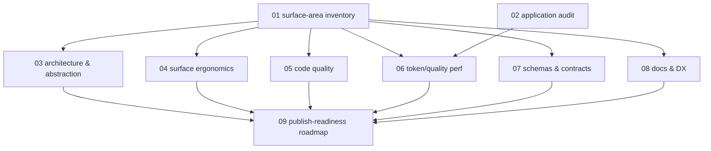

# Spec: Eval Plugin Implementation & Application Review

## Status
In Progress (execution started 2026-05-23 12:46:23 UTC)

## Judge Remediation Log

Post-judge fixes applied to address findings in `assessment-eval-plugin-review-20260523.md`:

- **HIGH (#1)** — Agent-existence gap resolved by authoring two new specialist agents (`zoto-eval-architect`, `zoto-eval-engineer`) under `.cursor/agents/` and updating the `AGENTS.md` Available Agents table + Spec Execution allocation table. The 9 subtasks are now re-assigned 3 / 3 / 3 across `zoto-plugin-manager`, `zoto-eval-architect`, and `zoto-eval-engineer` — all of which have backing `.md` files.
- **MEDIUM (#2)** — Subtask 09 dependencies trimmed to `03–08`; redundant `S01 → S09` and `S02 → S09` edges removed from the mermaid graph (transitively implied).
- **MEDIUM (#3)** — Pre-declared `Severity: blocker` lines softened to "expected blocker — confirm via subtask 02 audit" in subtasks 02 and 09.
- **MEDIUM (#4)** — Spec-system config-default fallback documented in Key Decisions.
- **LOW (#5)** — Read-only authorisation acknowledgement added to subtask 05's Testing Strategy for the two validation scripts.
- **LOW (#7)** — Cross-layer type-equality check in subtask 07 reworded to a contract-equivalence semantic check.
- **LOW (#8)** — Line citation in subtask 08 corrected (`line ~7` → `line 7`).
- **INFO (#9)** — `docs-sync-agent` non-use documented in Key Decisions.
- **INFO (#11)** — Explicit "no-copy gate" elevated to DoD in subtasks 02 and 09.

## Overview

End-to-end review of the **`zoto-eval-system`** plugin — both its own implementation
and the way it is currently applied to this `zoto-agents` monorepo — to identify
redundant or illogical decisions, simplification opportunities, developer-ergonomics
gaps, LLM token-usage and quality-reliability concerns, and the gating items that
stand between today's state and a publish-ready cut.

This is a **REVIEW spec, not a feature build**. Each subtask produces analysis
findings and a prioritised remediation plan with rationale. No code commits are
expected during execution unless explicitly pre-approved by the user (see
"Execution Defaults"). The consolidating subtask (09) produces the unified
publish-readiness roadmap that downstream work — a possible v0.4.0 cut — can
draw from.

### Source-of-truth note for executing agents

The plugin is split across two locations and **all reviewers must read both**:

- **In-monorepo path**: `plugins/zoto-eval-system/` — currently contains only
  `node_modules/` and `templates/`. This is the "shipping" path the marketplace
  manifest is meant to point at.
- **Local development copy** (authoritative content): `/home/andrewv/.cursor/plugins/local/zoto-eval-system/`
  — contains the full plugin: `agents/`, `skills/`, `commands/`, `rules/`,
  `hooks/`, `templates/`, `README.md`, `CHANGELOG.md`, `LICENSE`, `.cursor-plugin/plugin.json`.

The gap between these two locations is itself a finding (subtask 02). Reviewers
should treat the **local copy** as the source for implementation review and the
**in-monorepo copy + `.zoto/eval-system/` directory** as the source for
application/integration review.

## Key Decisions

- **Review-only scope**: Subtasks deliver written analysis + remediation
  recommendations. Direct code changes are out-of-scope for this spec; a
  follow-up implementation spec will action the consolidated roadmap from
  subtask 09.
- **Strategy deprecation is on the table**: If subtask 03 (architecture) or
  subtask 06 (token/quality performance) find that the `declarative` vs `code`
  LLM-strategy split is net-negative, recommendations may include deprecating
  one strategy. Both must be evaluated against concrete rubric criteria
  (maintenance cost, prompt size, user reach, regression risk).
- **Plugin source-of-truth resolution is a finding, not an action**: The empty
  in-monorepo `plugins/zoto-eval-system/` is treated as a documented gap to
  close, not as a hidden defect to silently fix. Subtask 02 owns the gap
  analysis; subtask 09 owns the resolution plan.
- **Run-artefact accumulation is a flag, not a cleanup**: 336 directories under
  `evals/_runs/` (vs default `runs.retention: 30`) is reported by subtask 02
  but no `pnpm run eval:gc -- --apply` is executed during this spec.
- **Agent allocation uses available specialists, not Planned roles**: This spec
  routes every subtask to an **Available** agent per the AGENTS.md status
  column. Two new eval-system specialists (`zoto-eval-architect`,
  `zoto-eval-engineer`) were authored alongside this spec to back the
  architecture / ergonomics / performance / code / schema / application work.
  Plugin-meta concerns (component inventory, documentation, publish-readiness)
  route to `zoto-plugin-manager`. **No subtask uses `generalPurpose`**, and no
  subtask targets a **Planned** (not-yet-authored) agent
  (`crux-platform-architect`, `crux-software-engineer`, `integrity-expert`,
  `docs-sync-agent`).
- **Spec-system config defaults are in effect**: No `.zoto-spec-system/config.json`
  exists in this repo, so the executor uses built-in defaults (`specsDir: specs`,
  etc.). This dependency is surfaced explicitly so reviewers know which knobs
  are operative.
- **`docs-sync-agent` is intentionally unused for this spec**: The review is
  read-only with respect to source files, so post-source-change doc-sync is
  not relevant. The roadmap (subtask 09) may flag doc-sync as a recommendation
  for the follow-up implementation spec.

## Requirements

1. Catalogue every plugin component (agent, skill, command, rule, hook, template, schema) with role, line-count, and call-graph relationships.
2. Audit how the plugin is applied in this repo: `.zoto/eval-system/config.yml`, `manifest.yml` (if present), `evals/`, `evals/_runs/`, host `package.json` script integration, and the in-monorepo vs local-copy gap.
3. Identify redundant or illogical decisions across architecture, surface area, schemas, and templates with a concrete rationale per finding.
4. Identify simplification opportunities (collapsible layers, removable abstractions, unifiable schemas, deprecatable strategies).
5. Evaluate developer ergonomics across the lifecycle: init → configure → create → update → execute → judge → compare → advise.
6. Quantify or estimate LLM token usage and quality-reliability across the analyser, judge, declarative, and code paths; assess caching effectiveness and model-precedence sanity.
7. Verify schema and contract consistency across all 7 schemas and the hard-coded contracts (`update.preserveUserAuthoredCases`, `update.writeMetaMarker`).
8. Verify documentation quality (README, CHANGELOG, plugin rule, error messages) against publish standards.
9. Produce a publish-readiness gap report with a prioritised remediation roadmap, severity-ranked findings, and a target-state checklist.

## Subtask Manifest

| ID | File | Subagent | Dependencies | Phase | Status |
|----|------|----------|--------------|-------|--------|
| 01 | `subtask-01-eval-plugin-review-surface-area-inventory-20260523.md` | zoto-plugin-manager | — | 1 | Done |
| 02 | `subtask-02-eval-plugin-review-application-audit-20260523.md` | zoto-eval-engineer | — | 1 | Done |
| 03 | `subtask-03-eval-plugin-review-architecture-abstraction-20260523.md` | zoto-eval-architect | 01 | 2 | Done |
| 04 | `subtask-04-eval-plugin-review-surface-ergonomics-20260523.md` | zoto-eval-architect | 01 | 2 | Done |
| 05 | `subtask-05-eval-plugin-review-code-quality-20260523.md` | zoto-eval-engineer | 01 | 2 | Done |
| 06 | `subtask-06-eval-plugin-review-token-quality-performance-20260523.md` | zoto-eval-architect | 01, 02 | 2 | Done (verified after retry) |
| 07 | `subtask-07-eval-plugin-review-schema-contract-consistency-20260523.md` | zoto-eval-engineer | 01 | 2 | Done |
| 08 | `subtask-08-eval-plugin-review-documentation-dx-20260523.md` | zoto-plugin-manager | 01 | 2 | Done |
| 09 | `subtask-09-eval-plugin-review-publish-readiness-roadmap-20260523.md` | zoto-plugin-manager | 03, 04, 05, 06, 07, 08 | 3 | Done |

Dependency rationale: 09 depends transitively on 01 (via every Phase-2 subtask) and on 02 (via 06). The explicit edges are limited to the Phase-2 dimensional reviews to keep the graph minimal.

Agent allocation (3 / 3 / 3 split across Available specialists):

| Agent | Subtasks |
|-------|----------|
| `zoto-plugin-manager` | 01 (inventory), 08 (docs/DX), 09 (publish-readiness) |
| `zoto-eval-architect` | 03 (architecture), 04 (ergonomics), 06 (token/quality) |
| `zoto-eval-engineer` | 02 (application audit), 05 (code quality), 07 (schemas/contracts) |

## Subtask Dependency Graph

## Execution Order

### Phase 1 (Parallel — foundational scoping)

| ID | Subagent | Description |
|----|----------|-------------|
| 01 | zoto-plugin-manager | Inventory & taxonomy of every plugin component (agents, skills, commands, rules, hooks, templates, schemas). Becomes shared reference for all Phase 2 subtasks. |
| 02 | zoto-eval-engineer | Audit of how the plugin is applied in this repo plus the in-monorepo vs local-copy gap analysis. Surfaces concrete state (manifest presence, run-folder count, evals tree contents, host script wiring). |

### Phase 2 (Parallel — dimensional reviews, after Phase 1)

| ID | Subagent | Description |
|----|----------|-------------|
| 03 | zoto-eval-architect | Architecture & abstraction review: declarative-vs-code split, mutual-exclusion model, layer boundaries (commands → agents → skills → engine → templates), schema overlap. |
| 04 | zoto-eval-architect | Surface ergonomics: 13 commands incl. same-delegation aliases, askQuestion/needs_user_input contract, help-routing rule, error messages. |
| 05 | zoto-eval-engineer | Code quality: stamping engine, `_user-case-guards`, update.ts, hook script, validation pipeline, dead code, duplicated helpers. |
| 06 | zoto-eval-architect | LLM token + quality reliability: analyser concurrency/maxCalls, model precedence, prompt sizes, caching effectiveness, judge cost, declarative validateEnriched vs code stamping. |
| 07 | zoto-eval-engineer | Schema & contract consistency: 7 schemas (config, manifest, result, case-meta, analyser-payload, cleanup-plan, needs-user-input), hard-coded contracts, drift rules. |
| 08 | zoto-plugin-manager | Documentation & DX: README quality, CHANGELOG hygiene, eval-system rule, error-message tone, onboarding happy-path friction, plugin-meta surface (LICENSE, marketplace entry, plugin.json). |

### Phase 3 (Consolidation — after Phase 2)

| ID | Subagent | Description |
|----|----------|-------------|
| 09 | zoto-plugin-manager | Publish-readiness audit consolidating all prior findings. Produces severity-ranked remediation roadmap, marketplace-readiness checklist (using `zoto-plugin-manager`'s Mode 4 submission criteria), and target-state definition. |

## Definition of Done

- [ ] All 9 subtasks completed with deliverables file under their subtask directory.
- [ ] Subtask 01 inventory is referenced (cited) by Phase-2 subtasks where applicable.
- [ ] Each Phase-2 subtask produces a findings document with at minimum: severity classification, rationale, citation back to source code, and proposed remediation.
- [ ] Subtask 09 publishes a unified remediation roadmap with: severity-grouped findings, prioritised order, effort estimate (S/M/L), publish-blocker flag.
- [ ] No code files outside `specs/20260523-eval-plugin-review/` are modified.
- [ ] No `evals/`, `manifest.yml`, or `marketplace.json` mutations.
- [ ] Spec status moves to `Ready for Review` only after the auto-spawned `zoto-spec-judge` assesses ≥ 4.0 (or user explicitly accepts a lower verdict).

## Execution Defaults (sensible-default authorisation, applied unless overridden)

These defaults were ratified at spec creation in lieu of explicit answers to the
five open questions. Any executor may treat them as binding unless the user
amends them at execute-time.

1. **Direct fixes**: Analysis-only. No code changes. All remediation lives in subtask 09's roadmap.
2. **Strategy deprecation**: Recommendations may include deprecation of one LLM strategy if rationale is rigorous (cost-of-maintenance, prompt-size, user reach, regression risk).
3. **Source-of-truth gap**: Treat `plugins/zoto-eval-system/` empty state vs local copy as a publish-blocker gap to close; subtask 02 quantifies, subtask 09 plans the resolution.
4. **Publish target**: Readiness gap report only. Version-bump (e.g. 0.3.1 → 0.4.0) is deferred to a follow-up implementation spec.
5. **Run accumulation**: 336 run directories are flagged in subtask 02 as a cleanup item; no `eval:gc` is run.

## Open Questions Flagged at Spec Creation

These were noted to the user; defaults are applied above. Override at execution time if needed.

1. Should subtask 09 be authorised to apply trivial fixes (e.g. add the missing `marketplace.json` entry, prune `_runs/`)?
2. Is the `declarative` vs `code` strategy split intentional permanent design, or a candidate for consolidation?
3. Is the empty in-monorepo `plugins/zoto-eval-system/` directory an intentional "local-dev only" arrangement, or unintended drift to be closed before publish?
4. Is the desired output a publish-ready cut (with version bump) or a readiness gap report only?
5. Is the 336-run accumulation under `evals/_runs/` expected normal usage or a state-cleanup item?

## Execution Notes
[Filled in during/after execution — see `zoto-execute-report-eval-plugin-review-20260523.md`]
