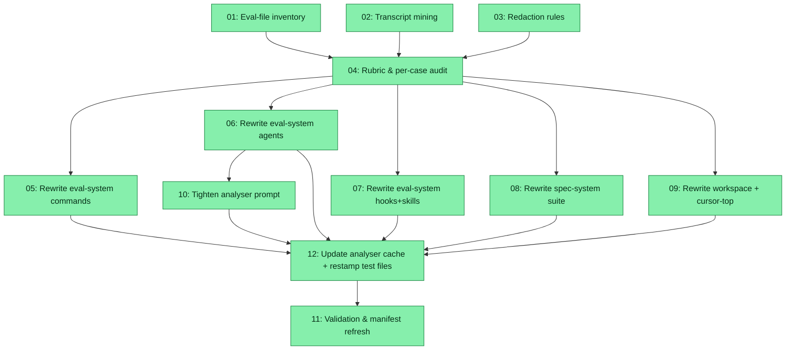

# Spec: Eval Prompt Realism Audit & Rewrite

## Status
Completed

## Overview

The repository ships 48 in-scope eval files (47 eligible for rewrite + 1 byte-preserve verify) across `plugins/zoto-eval-system/evals/`, `plugins/zoto-eval-system/skills/*/evals/`, `plugins/zoto-spec-system/evals/`, `plugins/zoto-spec-system/skills/*/evals/`, `plugins/zoto-cursor-top/skills/*/evals/`, `.cursor/evals/`, and `.cursor/skills/zoto-create-plugin/evals/`. A large fraction of stamped cases — especially those generated by `zoto-eval-analyser-subagent` against commands and agents — read as **internal-mechanic tests**, not realistic Cursor usage. Typical anti-patterns observed:

- Bare command prompts (`/z-eval-create`) for non-precondition paths.
- Assertions that reach into agent internals (`Available transcripts show zero askQuestion tool emissions from the generator`, `The spawned Task named zoto-eval-generator referenced the zoto-create-evals skill`, `Inside the generator flow the assistant invoked pnpm run eval:discover`) rather than user-visible outcomes (artefacts, exit codes, on-screen guidance text, manifest rows).
- Agent prompts written as third-person operator narration rather than the parent-command-style natural-English request the analyser contract documents.
- Hook prompts that drift toward abstract description rather than concrete Cursor lifecycle events.

The analyser system prompt at `plugins/zoto-eval-system/agents/zoto-eval-analyser-subagent.md` already documents the realism contract (kind-specific prompt style, behavioural assertions, forbidden placeholder vocabulary, the per-kind table) — the existing stamped output simply predates the strict version of that contract. This spec audits every in-scope eval case, mines real Cursor agent transcripts under `~/.cursor/projects/home-andrewv-git-cursor-zoto-agents/agent-transcripts/` for authentic prompt seeds, rewrites prompts and assertions in place across all generated cases (preserving the `_meta.generated: true` contract and every user-authored case verbatim), and tightens the analyser system prompt with explicit anti-patterns so the next `pnpm run eval:update --apply --with-analyser` cannot undo the realism work.

## Key Decisions

- **KD-1 Realism rubric.** Each case is scored across four axes: (a) prompt-realism — does it read like a real Cursor user message; (b) invocation-shape — `/cmd <realistic args>` for commands, natural-English delegation for agents, lifecycle-event descriptions for hooks, upstream-agent-style messages for skills; (c) assertion-realism — user-visible outcomes over internal mechanics; (d) coverage — at least one case per documented capability. The rubric extends, not replaces, the analyser prompt's existing "Realism checklist".

- **KD-2 Bare-command exception register.** Bare command prompts (e.g. `/z-eval-create`) remain ONLY when the case explicitly exercises a precondition-abort path (e.g. missing `.zoto/<plugin>/config.yml`) or "command invoked with no args" is a documented capability of the command. Every other bare-command case is rewritten to include realistic flags / arguments. The register lives in `audit/realism-rubric.md` and lists every case that retains a bare prompt with the justification (case id + capability cited).

- **KD-3 Contract-assertion exception list.** Internal-mechanic assertions may remain ONLY when they encode a hard contract: `_meta.generated: true` (case marker), `// _meta.generated\: true` / `# _meta.generated\: True` (file marker, line 1, with backwards-compat scan over the first 20 lines per `_user-case-guards.ts`), exact precondition refuse messages, analyser schema invariants (`schema_version: 1`, 64-hex `source_hash` pattern, colon-prefixed `target_id`, `additionalProperties: false` rejection of surplus keys), and the append-only nature of `manifest.history.yml`. Additional contractual families: `fixture_justifications[]` cardinality (when `fixtures.files[]` is non-empty, `fixture_justifications[]` MUST be present with the same element count in the same order — analyser hard rule 6; downstream stamper refuses unjustified overlays); comparer `/canvas` template byte-equality (assertions of the form "instructions block forwarded to `/canvas` is byte-equal to `plugins/zoto-eval-system/templates/canvas/compare-prompt.md.tmpl`" encode the analyser source's target-specific contract for `agent:zoto-eval-comparer`); `needs_user_input` payload-shape assertions mirroring `plugins/zoto-eval-system/templates/schema/needs-user-input.schema.json`; Cursor hooks contract (exit code 0, stdout being valid JSON, the documented `additional_context` key shape, and early-return `{}` on refused branches). Every other internal-mechanic assertion is rewritten to a user-visible outcome.

- **KD-4 Transcript-mining seed strategy.** Real prompt seeds come from `~/.cursor/projects/home-andrewv-git-cursor-zoto-agents/agent-transcripts/<uuid>/<uuid>.jsonl`. Each JSONL line is a turn; `role:"user"` entries with a `<cursor_commands>` block or a leading `/cmd` token identify the invoked command. Where a target has zero transcript coverage, the spec uses README / SKILL.md `## Usage` synthesis as a fallback and flags the gap in `audit/eval-case-audit.md` so a human can curate later.

- **KD-5 Redaction pass before commit.** Before any extracted transcript text lands in an eval JSON it passes through a documented redaction pass: absolute home paths (`/home/<user>/…`, `/Users/<user>/…`, `C:\<user>\…`) are normalised to `~/…` or `<repo-root>/…`; emails, GitHub usernames, API tokens (`gh_pat_*`, `sk-*`, `ghp_*`), CURSOR_API_KEY values, third-party customer / machine identifiers, and `.env` value lines are stripped. The rules live in `audit/redaction-rules.md` and ship as a tiny Node helper at `audit/redact.ts` so the rewrite subtasks call the same function.

- **KD-6 Analyser prompt strengthening, no `analyser_version` bump.** The analyser system prompt gains an explicit "Forbidden internal-mechanic vocabulary" section, a "Bare-command exception register" rule, and worked rewrite examples drawn from the audit. `analyser_version` is **not** bumped because that would invalidate every cached payload and force the next `eval:update --apply` to re-analyse and possibly overwrite the curated Phase 3 rewrites with fresh model output. The strengthened prompt instead guards future analyses of new or changed primitives; the Phase 3 rewrites remain canonical for current state. The analyser's own eval JSON (`plugins/zoto-eval-system/evals/agents/zoto-eval-analyser-subagent.json`) gains new assertions that probe the new anti-patterns so regressions surface at eval time.

- **KD-7 Per-suite parallel rewrites.** Rewrites are sharded by plugin × kind into disjoint file sets so Phase 3 subtasks run in parallel (executor honours `spec.parallelLimit = 4`). Every rewrite subtask consumes the same machine-readable `audit/eval-rewrites.json` for its slice and refreshes `_meta.last_updated` per case; `_meta.generated_by` stays as the existing stable string `"zoto-update-evals"` (per user decision 2026-05-25 — stability and `pnpm run eval:update --check` round-trip safety were prioritised over per-spec grep-able provenance; this rewrite is tracked via `_meta.last_updated` alone, with the spec audit trail serving as the cross-reference). `_meta.source_hash` is preserved verbatim per Subtask 05's "Source-hash recomputation rule" — see KD-9 / Subtask 11 for why preserving it keeps the validation gates exit 0.

- **KD-8 User-authored cases are byte-preserved.** Any case lacking `_meta` or with `_meta.generated !== true` (notably the older `evals[]` rows in `plugins/zoto-eval-system/skills/zoto-create-evals/evals/evals.json`, `plugins/zoto-cursor-top/skills/zoto-cursor-top-monitor/evals/evals.json`, `.cursor/skills/zoto-create-plugin/evals/evals.json`) is left exactly as it stands today. The rewrite subtasks include a guard step that diffs preserved rows post-write to prove no byte changed.

- **KD-9 Validation gates.** After every rewrite suite and again at the end of the spec, three gates MUST exit 0: `pnpm run eval:list`, `pnpm run eval -- --collect-only`, `pnpm run eval:update --check`. The first proves the manifest still enumerates every target; the second proves every backend can collect the rewritten cases; the third proves the rewrites preserve source-hash freshness (no drift). A new entry is appended to `.zoto/eval-system/manifest.history.yml` and the snapshot at `.zoto/eval-system/manifest.yml` is refreshed in the final subtask only.

## Requirements

1. **Scope coverage.** The audit and rewrite cover every JSON eval file under `plugins/zoto-eval-system/evals/{commands,agents,hooks}/`, `plugins/zoto-eval-system/skills/*/evals/evals.json`, `plugins/zoto-spec-system/evals/{commands,agents,hooks}/`, `plugins/zoto-spec-system/skills/*/evals/evals.json`, `plugins/zoto-cursor-top/skills/*/evals/evals.json`, `.cursor/evals/{commands,agents,hooks}/`, and `.cursor/skills/zoto-create-plugin/evals/evals.json`. The inventory subtask MUST enumerate every file and confirm zero misses against the manifest.
2. **Transcript-seeded prompts.** Every rewritten command and agent prompt MUST cite either (a) a real transcript uuid as its seed (post-redaction) or (b) the README / SKILL.md `## Usage` section that supplied the synthetic seed. The audit report records the citation per case.
3. **Assertion realism.** Every rewritten assertion MUST be a user-visible outcome OR appear on the contract-assertion exception list (KD-3) with the contract cited.
4. **`_meta` contract preservation.** Cases without `_meta.generated: true` MUST be byte-preserved. Cases with `_meta.generated: true` MUST retain the marker and refresh `source_hash`, `last_updated`, and `generated_by`.
5. **Schema preservation.** Each rewritten file MUST continue to validate against the existing eval-system shape contracts: the central command / agent / hook files keep `target_id` plus `cases[]`, and the per-skill files keep `skill_name` plus the mixed `evals[]` block where present. No file is restructured.
6. **Analyser prompt hardened.** `plugins/zoto-eval-system/agents/zoto-eval-analyser-subagent.md` MUST gain an explicit "Forbidden internal-mechanic vocabulary" list with the worst observed anti-patterns and at least two worked examples (before / after). `analyser_version` MUST NOT change.
7. **Manifest and history.** `.zoto/eval-system/manifest.yml` is refreshed exactly once (final subtask) and `.zoto/eval-system/manifest.history.yml` gains exactly one new appended entry. No prior entry is mutated.
8. **Three-gate validation.** `pnpm run eval:list`, `pnpm run eval -- --collect-only`, and `pnpm run eval:update --check` MUST all exit 0 at the end of the spec, with the exit logs captured in the execution report.

## Subtask Manifest

| ID | File | Subagent | Dependencies | Phase | Status |
|----|------|----------|-------------|-------|--------|
| 01 | `subtask-01-eval-prompt-realism-audit-eval-file-inventory-20260525.md` | explore | — | 1 | Completed |
| 02 | `subtask-02-eval-prompt-realism-audit-transcript-mining-20260525.md` | generalPurpose | — | 1 | Completed |
| 03 | `subtask-03-eval-prompt-realism-audit-redaction-rules-20260525.md` | generalPurpose | — | 1 | Completed |
| 04 | `subtask-04-eval-prompt-realism-audit-rubric-and-rewrites-20260525.md` | generalPurpose | 01, 02, 03 | 2 | Completed (partial accepted) |
| 05 | `subtask-05-eval-prompt-realism-audit-rewrite-eval-system-commands-20260525.md` | generalPurpose | 04 | 3 | Completed |
| 06 | `subtask-06-eval-prompt-realism-audit-rewrite-eval-system-agents-20260525.md` | generalPurpose | 04 | 3 | Completed |
| 07 | `subtask-07-eval-prompt-realism-audit-rewrite-eval-system-hooks-and-skills-20260525.md` | generalPurpose | 04 | 3 | Completed |
| 08 | `subtask-08-eval-prompt-realism-audit-rewrite-spec-system-suite-20260525.md` | generalPurpose | 04 | 3 | Completed |
| 09 | `subtask-09-eval-prompt-realism-audit-rewrite-workspace-and-cursor-top-20260525.md` | generalPurpose | 04 | 3 | Completed |
| 10 | `subtask-10-eval-prompt-realism-audit-tighten-analyser-prompt-20260525.md` | generalPurpose | 06 | 4 | Completed |
| 12 | `subtask-12-eval-prompt-realism-audit-update-analyser-cache-and-restamp-20260525.md` | generalPurpose | 05, 06, 07, 08, 09, 10 | 4b | Completed |
| 11 | `subtask-11-eval-prompt-realism-audit-validation-and-manifest-refresh-20260525.md` | shell | 05, 06, 07, 08, 09, 10, 12 | 5 | Completed |

## Subtask Dependency Graph

## Execution Order

Phases are derived from the dependency graph. Subtasks within a phase have no
dependencies on each other and may run in parallel. A phase starts only after
all subtasks in prior phases are complete. The executor honours
`spec.parallelLimit = 4` (default) within each phase.

### Phase 1 (Parallel)
| ID | Subagent | Description |
|----|----------|-------------|
| 01 | explore | Enumerate every in-scope eval JSON; classify per-file container shape (`cases[]` + `target_id` vs `evals[]` + `skill_name`/`command_name`/…) and per-case generated/user-authored split. Reconcile against `.zoto/eval-system/manifest.yml` `targets[].eval_files`. |
| 02 | generalPurpose | Mine Cursor agent transcripts under `~/.cursor/projects/home-andrewv-git-cursor-zoto-agents/agent-transcripts/` for real user prompts that invoked each in-scope command / agent. Emit `audit/transcript-index.json`. |
| 03 | generalPurpose | Define redaction rules (home paths, emails, tokens, API keys, machine IDs, env values, third-party customer names) and ship `audit/redact.ts` helper for the rewrite subtasks. |

### Phase 2 (after Phase 1)
| ID | Subagent | Description |
|----|----------|-------------|
| 04 | generalPurpose | Author `audit/realism-rubric.md` (rubric, bare-command exception register, contract-assertion exception list) and produce `audit/eval-case-audit.md` plus the machine-readable `audit/eval-rewrites.json` keyed by file path → per-case rewrite payload. |

### Phase 3 (after Phase 2, parallel up to `spec.parallelLimit`)
| ID | Subagent | Description |
|----|----------|-------------|
| 05 | generalPurpose | Rewrite `plugins/zoto-eval-system/evals/commands/*.json` (13 files). |
| 06 | generalPurpose | Rewrite `plugins/zoto-eval-system/evals/agents/*.json` (8 files). |
| 07 | generalPurpose | Rewrite `plugins/zoto-eval-system/evals/hooks/*.json` (1 file) + `plugins/zoto-eval-system/skills/*/evals/evals.json` (9 files). |
| 08 | generalPurpose | Rewrite `plugins/zoto-spec-system/evals/{commands,agents,hooks}/*.json` (4 + 3 + 1) + `plugins/zoto-spec-system/skills/*/evals/evals.json` (3 files). |
| 09 | generalPurpose | Rewrite `.cursor/evals/{commands,agents,hooks}/*.json` (4 files) + `.cursor/skills/zoto-create-plugin/evals/evals.json` + verify `plugins/zoto-cursor-top/skills/zoto-cursor-top-monitor/evals/evals.json` (byte-preserve — user-authored). |

### Phase 4 (after Phase 3, depends specifically on 06)
| ID | Subagent | Description |
|----|----------|-------------|
| 10 | generalPurpose | Strengthen `plugins/zoto-eval-system/agents/zoto-eval-analyser-subagent.md` with a "Forbidden internal-mechanic vocabulary" section, bare-command exception register, and worked before/after examples. Do **NOT** bump `analyser_version`. Re-edit only the new analyser-vocab assertions in `plugins/zoto-eval-system/evals/agents/zoto-eval-analyser-subagent.json` (Phase 3's S06 rewrites of the case prompts remain canonical). |

### Phase 4b (after Phase 4)
| ID | Subagent | Description |
|----|----------|-------------|
| 12 | generalPurpose | Update cached analyser payloads under `.zoto/eval-system/cache/analyser/*.json` so their `cases[].prompt` / `assertions[]` / `expected_output` / `follow_ups` mirror the Phase 3 + S10 rewrites (envelope fields preserved verbatim). Then run `pnpm run eval:update --apply --no-analyser --overwrite` to force re-stamp of `evals/llm/test_*.test.ts` (and `evals/test_*.test.ts` if applicable) past their first-line `// _meta.generated: true` guard. MUST NOT touch `.zoto/eval-system/manifest.yml` / `manifest.history.yml` (Subtask 11 owns the manifest refresh). |

### Phase 5 (after Phase 4b)
| ID | Subagent | Description |
|----|----------|-------------|
| 11 | shell | Run `pnpm run eval:list`, `pnpm run eval -- --collect-only`, `pnpm run eval:update --check` and confirm exit 0. If `--check` reports drift, run `pnpm run eval:update --apply --no-analyser` to refresh `_meta.source_hash` / `_meta.last_updated` using cached analyser payloads (analyser version unchanged per KD-6), then re-run `--check`. Refresh `.zoto/eval-system/manifest.yml` snapshot and append exactly one entry to `.zoto/eval-system/manifest.history.yml`. Capture all command outputs in the execution report. |

## Definition of Done
- [x] Every in-scope eval file is enumerated in `audit/eval-inventory.md` and reconciled against `.zoto/eval-system/manifest.yml`.
- [x] `audit/transcript-index.json` exists and maps every in-scope command/agent target to at least one transcript-uuid seed OR a documented `synthetic_seed: readme|skill-usage` fallback.
- [x] `audit/redaction-rules.md` documents every redaction rule and `audit/redact.ts` exports a pure `redact(text: string): string` helper the rewrite subtasks consume.
- [x] `audit/realism-rubric.md`, `audit/eval-case-audit.md`, and `audit/eval-rewrites.json` exist with one entry per in-scope case.
- [x] Every rewritten case retains `_meta.generated: true` and carries a refreshed `last_updated`; `generated_by` remains `"zoto-update-evals"` and `source_hash` is preserved per Subtask 05's "Source-hash recomputation rule".
- [x] Every user-authored case (no `_meta` or `_meta.generated !== true`) is byte-identical to its pre-spec state; subtasks 05–09 record a diff-empty proof.
- [x] `plugins/zoto-eval-system/agents/zoto-eval-analyser-subagent.md` has a "Forbidden internal-mechanic vocabulary" section with ≥ 2 worked before/after examples; `analyser_version` is unchanged.
- [x] `pnpm run eval:list` exits 0.
- [x] `pnpm run eval -- --collect-only` exits 0.
- [x] `pnpm run eval:update --check` exits 0.
- [x] `.zoto/eval-system/manifest.yml` is refreshed exactly once and `.zoto/eval-system/manifest.history.yml` gains exactly one new appended entry.
- [x] Execution report captures all three gate exit logs and the redaction rule citations used per rewrite suite.

## Execution Notes

Resume completed 2026-05-25. S10 guard assertions re-applied after S11/S12 cache restamp; S12 cache mapping fixed (case-id not prompt-first). S04 bare-command register gap accepted (partial) — live eval JSON authoritative. Execution report: `execution-report-eval-prompt-realism-audit-20260525.md`. Final gates all exit 0; `analyser_version` unchanged.
