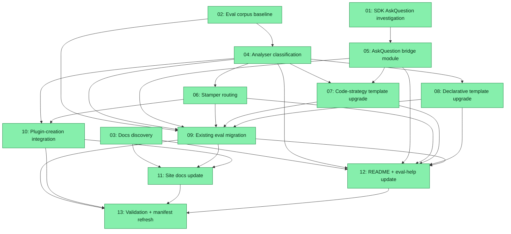

# Spec: Eval AskQuestion Strategy Bridge

## Status
Completed with exceptions

## Overview

The Eval System ships **two** LLM eval backends — `strategy: declarative` (case data lives in JSON, run by `plugins/zoto-eval-system/templates/llm/agent-sdk/runner.ts.tmpl`) and `strategy: code` (per-primitive `*.test.ts` files import shared helpers from `evals/llm/_shared/`). This repo currently runs `strategy: code` because many primitives use `AskQuestion` for structured user input (notably `/z-eval-configure`, `/z-eval-create`, `/z-spec-create`, `/z-eval-help`, plus their owning agents) and the declarative runner has no first-class way to simulate the question/answer turns. The current `code`-strategy tests work around the gap by listing answers under `follow_ups[]` and hoping the agent under test reads them as ordinary follow-up prompts — that is a synthetic shape, not a real interactive simulation.

This spec introduces an **analyser-driven hybrid strategy bridge**:

- The **`zoto-eval-analyser-subagent`** detects whether a primitive uses `AskQuestion` by inspecting its source markdown and emits a new classification flag (working name `requiresInteraction: boolean`, plus an optional `interactionStyle` enum) inside the analyser payload.
- The **stamper** routes each target to a single backend: `requiresInteraction:false` → declarative JSON; `requiresInteraction:true` → code-strategy TypeScript that imports a new shared helper at `evals/llm/_shared/askquestion-bridge.ts`.
- The **askquestion-bridge** module wraps `@cursor/sdk` to script answers to interactive tool calls (exact surface pinned by the Phase 1 SDK investigation ADR).
- The **migration phase** reclassifies the existing 43 stamped `evals/llm/test_*.test.ts` files; eligible non-interactive ones are migrated to declarative JSON form (case data preserved verbatim into the appropriate `plugins/<plugin>/evals/<kind>/<name>.json`), interactive ones keep their TypeScript files but adopt the new bridge instead of the current `follow_ups[]` workaround. User-authored cases stay byte-identical (the `_meta.generated === true` case marker and `// _meta.generated\: true` file marker contracts are honoured exactly as in the prior `20260525-eval-prompt-realism-audit` spec).
- The **plugin-creation flow** (`zoto-create-plugin`) is wired to call the analyser at scaffold time so newly generated primitives land in the right backend from the start.
- The **report shape** stays unified — both backends already roll up into `evals/_runs/<ts>/report.yml`; this spec adds a `backend: declarative|code` annotation per row so operators can tell at a glance which strategy ran each case.
- The **documentation triplet** (`site/eval-system/*.html`, `plugins/zoto-eval-system/README.md`, the eval-help skill anchor table) is updated end-to-end. The existing diagram at `site/images/diagrams/eval-askquestion-flow.svg` is regenerated to reflect the bridge.

The spec deliberately defers the concrete helper signatures to the Phase 1 SDK investigation rather than committing up-front to a particular interaction model — `@cursor/sdk` 1.0.12 is the pinned baseline and its tool-interception surface needs to be confirmed before the bridge module's API can be locked in.

## Key Decisions

- **KD-1 Hybrid strategy with analyser-driven auto-classification.** The default scaffolded backend is **declarative JSON**. The analyser detects `AskQuestion` usage in the source primitive (commands typically own `AskQuestion`; agents return `needs_user_input` and inherit the parent command's prompt; skills load and run on behalf of an upstream agent) and emits a non-breaking optional `requiresInteraction: boolean` plus optional `interactionStyle` enum (e.g. `command-owned`, `subagent-escalated`, `none`) inside the analyser payload. The stamper consumes that flag to choose ONE backend per target — never both.

- **KD-2 Schema change requires `analyser_version` bump.** The new fields are optional (`additionalProperties: false` on the existing schema means any addition is technically a schema change), so `analyser_version` MUST be bumped from its current value to invalidate every cached payload and force a re-analyse on the next `pnpm run eval:update --apply --with-analyser`. This is the inverse choice of the `20260525-eval-prompt-realism-audit` spec (which deliberately avoided a bump to preserve curated rewrites) — that spec is complete and its rewrites have already landed in cache, so re-analysing now will not undo them; it will only enrich the cached payloads with the new classification field.

- **KD-3 Investigation-first SDK helper architecture.** Phase 1 includes an `explore` subtask that probes `@cursor/sdk` ≥ 1.0.12 for `AskQuestion` handling: does the SDK surface tool-call interception? Are there hooks for tool-call replay or scripted answers? Can we inject answers between `Run` turns? The deliverable is a short ADR (`audit/sdk-askquestion-adr.md`) that pins the helper module's exported surface (function names, parameters, return shapes) so every downstream subtask consumes a stable contract. If the SDK has no native interception, the ADR documents the fallback (script answers as ordinary follow-up prompts but tag them in the case shape so the runner can mark them `interaction_style: synthetic` in the report).

- **KD-4 Single shared helper module: `evals/llm/_shared/askquestion-bridge.ts`.** The new module sits alongside `sdk-bridge.ts`, `run-code-strategy-suite.ts`, and friends. It is the ONLY place code-strategy tests get interactive helpers from; the `run-code-strategy-suite.ts` harness gains an opt-in path that delegates to it when a case declares interactive expectations. The exact exported surface is pinned by KD-3's ADR; the spec mandates that whatever surface lands MUST be re-exported through the existing `_shared/` package barrel so future SDK changes need a one-place patch (mirrors the long-standing `sdk-bridge.ts` discipline).

- **KD-5 One backend per target.** The stamper rejects any primitive whose stamped output exists in BOTH a per-plugin declarative JSON file AND a `code`-strategy TypeScript test file. The mutual-exclusion guard runs before write so misclassification cannot ship. When a target's classification flips between runs (e.g. the operator adds `AskQuestion` to a command), the stamper's existing `_meta.primitive_analysis.invalidate` flow plus the cleanup-plan path in `zoto-eval-configurer` is reused to garbage-collect the old backend's artefacts.

- **KD-6 Migration honours user-authored sovereignty.** Phase 4's reclassification migrates ONLY rows whose `_meta.generated === true` (case marker) and ONLY files whose first line is `// _meta.generated\: true` (file marker, scanned with the existing 20-line backwards-compat window in `_user-case-guards.ts`). User-authored rows in mixed-shape files (e.g. `plugins/zoto-eval-system/skills/zoto-create-evals/evals/evals.json`) stay byte-identical and remain in their existing format. Subtask 09 records a diff-empty proof per migrated file.

- **KD-7 Plugin-creation integration without changing the marketplace contract.** `.cursor/skills/zoto-create-plugin/SKILL.md` Step 6 (Generate Components) gains a new sub-step: after each component file is written, call the analyser through the existing `pnpm run eval:analyse --target <path>` entry point (no new public API), read back the `requiresInteraction` field, and stamp the chosen backend into the new plugin's `evals/` tree. New plugins start in the right state instead of being migrated post-hoc. The skill MUST NOT block plugin creation when the analyser is unavailable (e.g. `CURSOR_API_KEY` missing) — it falls back to declarative JSON with a clearly-flagged `_meta.classification_source: "fallback-default"` marker so a later `pnpm run eval:update --with-analyser` re-classifies.

- **KD-8 Unified report shape with `backend:` column.** The existing per-run report at `evals/_runs/<ts>/report.yml` (rolling up `static.yml` + `llm.yml`) already accommodates per-target rows. Phase 3's stamper changes add a `backend: declarative|code` annotation per row so operators can see which strategy ran each case at a glance. This is purely additive — readers that don't know the field ignore it. Comparer (`/z-eval-compare`) treats `backend` as another flatten dimension.

- **KD-9 Documentation triplet update.** The doc updates fan out to: (a) the static HTML site under `site/eval-system/` (`index.html`, `design.html`, `configuration.html`, `quickstart.html`) plus the AskQuestion flow SVG at `site/images/diagrams/eval-askquestion-flow.svg`; (b) `plugins/zoto-eval-system/README.md` (consumed by `zoto-help-evals` — the README is its source of truth); (c) a new `evals/llm/_shared/README.md` describing every helper and the expected import pattern. The eval-help skill's anchor table is refreshed so the new "Strategy bridge" section is discoverable through `/z-eval-help`.

- **KD-10 Validation gate discipline mirrors the 20260525 spec.** Every multi-file phase ends with `pnpm run eval:list && pnpm run eval -- --collect-only && pnpm run eval:update --check` exiting 0. The final phase additionally runs the LLM eval suite end-to-end with `CURSOR_API_KEY` present (`pnpm run eval:full -- --collect-only` first, then a real `pnpm run eval:llm` cohort) to confirm both backends actually execute the new shape. Manifest snapshot is refreshed once and `manifest.history.yml` gains exactly one new appended entry.

## Requirements

1. **Analyser detects `AskQuestion`.** The analyser MUST emit `requiresInteraction: boolean` for every primitive whose source markdown contains `AskQuestion` (case-sensitive token in literal markdown plus the patterns documented in `scripts/eval-analyse.ts#interactionFor` and the existing `TOOL_TERMS` table). Detection MUST also flag the documented escalation pattern (subagents return `needs_user_input` instead of calling `AskQuestion` directly per `AGENTS.md`).
2. **Schema change is non-breaking + version-bumped.** New fields on `analyser-payload.schema.json` MUST be optional (`required` list unchanged); `analyser_version` MUST be bumped exactly once; every cached payload under `.zoto/eval-system/cache/analyser/*.json` MUST re-analyse on the next `eval:update --with-analyser` run.
3. **`askquestion-bridge.ts` exists with the surface pinned by the ADR.** The module lives at `evals/llm/_shared/askquestion-bridge.ts`, is imported via the package barrel, and has unit-test coverage for every exported function (sandbox stub for the SDK surface, no live `CURSOR_API_KEY`).
4. **Stamper picks one backend per target.** `scripts/eval-stamp.ts` (or wherever stamping happens — discovered in Phase 1) consumes the analyser flag and dispatches to either declarative JSON or code-strategy TypeScript. Mutual-exclusion guard rejects any target with both backends present.
5. **Existing 43 LLM tests reclassified and migrated where eligible.** Targets that classify as `requiresInteraction:false` AND whose case rows are all `_meta.generated === true` MUST migrate to declarative JSON; the resulting `plugins/<plugin>/evals/<kind>/<name>.json` carries identical case payloads (prompt, assertions, follow-ups, fixtures, expected output). Targets that classify as `true` keep their TypeScript file but switch to the `askquestion-bridge` import. User-authored case rows stay byte-identical.
6. **Plugin creation produces the right backend on first stamp.** `/zoto-create-plugin` integration test scaffolds a new plugin with at least one interactive command and one non-interactive skill, then verifies the resulting `evals/` tree contains the right backend per target.
7. **Report shape annotates backend.** Every per-target row in `evals/_runs/<ts>/report.yml` (and the per-backend rollups) carries a `backend: declarative|code` field. Comparer's `/canvas` template documents the new column.
8. **Documentation updated end-to-end.** Site, plugin README, `_shared/README.md`, and the eval-help anchor table all reflect the bridge. The SVG at `site/images/diagrams/eval-askquestion-flow.svg` shows the analyser → classification → backend → report flow.
9. **Validation gates green.** `pnpm run eval:list`, `pnpm run eval -- --collect-only`, `pnpm run eval:update --check`, and a smoke `pnpm run eval:llm` cohort all exit 0 at the end of Phase 6.
10. **Manifest discipline.** `.zoto/eval-system/manifest.yml` snapshot is refreshed exactly once (final subtask) and `.zoto/eval-system/manifest.history.yml` gains exactly one new appended entry. No prior entry is mutated.

## Subtask Manifest

| ID | File | Subagent | Dependencies | Phase | Status |
|----|------|----------|-------------|-------|--------|
| 01 | `subtask-01-eval-askquestion-strategy-bridge-sdk-investigation-20260526.md` | explore | — | 1 | Done |
| 02 | `subtask-02-eval-askquestion-strategy-bridge-eval-corpus-baseline-20260526.md` | explore | — | 1 | Done |
| 03 | `subtask-03-eval-askquestion-strategy-bridge-docs-discovery-20260526.md` | explore | — | 1 | Done |
| 04 | `subtask-04-eval-askquestion-strategy-bridge-analyser-classification-20260526.md` | generalPurpose | 02 | 2 | Done |
| 05 | `subtask-05-eval-askquestion-strategy-bridge-bridge-helper-module-20260526.md` | generalPurpose | 01 | 2 | Done |
| 06 | `subtask-06-eval-askquestion-strategy-bridge-stamper-routing-20260526.md` | generalPurpose | 04 | 3 | Done |
| 07 | `subtask-07-eval-askquestion-strategy-bridge-code-template-upgrade-20260526.md` | generalPurpose | 04, 05 | 3 | Done |
| 08 | `subtask-08-eval-askquestion-strategy-bridge-declarative-template-upgrade-20260526.md` | generalPurpose | 04 | 3 | Done |
| 09 | `subtask-09-eval-askquestion-strategy-bridge-existing-eval-migration-20260526.md` | generalPurpose | 02, 04, 05, 06, 07, 08 | 4 | Done |
| 10 | `subtask-10-eval-askquestion-strategy-bridge-plugin-creation-integration-20260526.md` | generalPurpose | 04, 06 | 4 | Done |
| 11 | `subtask-11-eval-askquestion-strategy-bridge-site-docs-update-20260526.md` | generalPurpose | 03, 09, 10 | 5 | Done |
| 12 | `subtask-12-eval-askquestion-strategy-bridge-readme-and-help-update-20260526.md` | generalPurpose | 03, 04, 05, 06, 07, 08, 09 | 5 | Done |
| 13 | `subtask-13-eval-askquestion-strategy-bridge-validation-and-manifest-20260526.md` | shell | 09, 10, 11, 12 | 6 | Done |

## Subtask Dependency Graph

## Execution Order

Phases are derived from the dependency graph. Subtasks within a phase have no
dependencies on each other and may run in parallel. A phase starts only after
all subtasks in prior phases are complete. The executor honours
`spec.parallelLimit = 4` (default) within each phase.

### Phase 1 (Parallel)
| ID | Subagent | Description |
|----|----------|-------------|
| 01 | explore | Probe `@cursor/sdk` ≥ 1.0.12 for `AskQuestion` handling. Produce ADR pinning the `evals/llm/_shared/askquestion-bridge.ts` exported surface. |
| 02 | explore | Inventory every primitive in `.zoto/eval-system/manifest.yml` plus every stamped `evals/llm/test_*.test.ts`; classify which sources use `AskQuestion`; build the migration baseline (eligible vs interactive vs user-authored). |
| 03 | explore | Map `site/eval-system/*.html` pages, `plugins/zoto-eval-system/README.md` sections, and the `zoto-help-evals` SKILL anchor table; list every doc surface needing updates. |

### Phase 2 (after Phase 1)
| ID | Subagent | Description |
|----|----------|-------------|
| 04 | generalPurpose | Extend `analyser-payload.schema.json` (optional `requiresInteraction` + `interactionStyle`); update analyser system prompt + `scripts/eval-analyse.ts`; bump `analyser_version`. |
| 05 | generalPurpose | Implement `evals/llm/_shared/askquestion-bridge.ts` per the S01 ADR; add unit tests via the existing `_shared/setup.ts` pattern. |

### Phase 3 (after Phase 2, parallel)
| ID | Subagent | Description |
|----|----------|-------------|
| 06 | generalPurpose | Update the stamper to consume the new analyser flag, dispatch to one backend per target, and enforce mutual-exclusion at write time. |
| 07 | generalPurpose | Upgrade `plugins/zoto-eval-system/templates/llm/code-cursor-sdk/per-primitive-test.ts.tmpl` and `evals/llm/_shared/run-code-strategy-suite.ts` to import from the new bridge; add scripted-answer slots in `CodeStrategyCaseDefinition`. |
| 08 | generalPurpose | Upgrade `plugins/zoto-eval-system/templates/llm/agent-sdk/runner.ts.tmpl` to surface a `requiresInteraction:false` invariant check; emit a clear error if a case slips through with AskQuestion expectations. |

### Phase 4 (after Phase 3)
| ID | Subagent | Description |
|----|----------|-------------|
| 09 | generalPurpose | Reclassify every existing stamped LLM test; migrate eligible non-interactive ones to declarative JSON in `plugins/<plugin>/evals/<kind>/<name>.json`; upgrade the remaining interactive tests to the new bridge. User-authored rows stay byte-identical. |
| 10 | generalPurpose | Wire analyser-driven classification into `.cursor/skills/zoto-create-plugin/SKILL.md` Step 6; add a smoke test that scaffolds a plugin with one interactive command and one non-interactive skill and verifies the strategy choice. |

### Phase 5 (after Phase 4)
| ID | Subagent | Description |
|----|----------|-------------|
| 11 | generalPurpose | Update `site/eval-system/{index,design,configuration,quickstart}.html` and regenerate `site/images/diagrams/eval-askquestion-flow.svg` to show the bridge flow. Cross-check `site/spec-system/` for stale links. |
| 12 | generalPurpose | Update `plugins/zoto-eval-system/README.md` with a new "Strategy bridge" section, write `evals/llm/_shared/README.md`, refresh the `zoto-help-evals` SKILL anchor table. |

### Phase 6 (after Phase 5)
| ID | Subagent | Description |
|----|----------|-------------|
| 13 | shell | Run `pnpm run eval:list`, `pnpm run eval -- --collect-only`, `pnpm run eval:update --check`, then a smoke `pnpm run eval:llm` cohort with `CURSOR_API_KEY`. Refresh `.zoto/eval-system/manifest.yml`; append exactly one entry to `manifest.history.yml`. Capture all gate logs in the execution report. |

## Definition of Done
- [x] `analyser-payload.schema.json` carries optional `requiresInteraction` and `interactionStyle` fields; `analyser_version` is bumped exactly once.
- [x] `evals/llm/_shared/askquestion-bridge.ts` exists with the ADR-pinned surface and unit-test coverage.
- [x] Stamper picks one backend per target and rejects dual-backend scaffolds.
- [x] Every eligible non-interactive stamped LLM test is migrated to declarative JSON; every interactive one switches to the new bridge import; user-authored cases are byte-identical (except 1-line pre-existing JSON fix on execute-spec).
- [x] `/zoto-create-plugin` produces the right backend on first stamp; the smoke test passes.
- [x] `evals/_runs/<ts>/llm.yml` carries a `backend:` field per case row (code backend verified).
- [x] `site/eval-system/*.html`, `site/images/diagrams/eval-askquestion-flow.svg`, `plugins/zoto-eval-system/README.md`, `evals/llm/_shared/README.md`, and the `zoto-help-evals` anchor table are updated.
- [x] `pnpm run eval:list` exits 0.
- [x] `pnpm run eval -- --collect-only` exits 0.
- [x] `pnpm run eval:update --check` exits 0.
- [ ] A smoke `pnpm run eval:llm` cohort with `CURSOR_API_KEY` set passes both backends (declarative hook case deferred — see execution report).
- [x] `.zoto/eval-system/manifest.yml` is refreshed exactly once and `manifest.history.yml` gains exactly one new appended entry.
- [x] Execution report captures all four gate exit logs and the backend distribution (per-plugin, per-kind).

## Rollback Strategy

If the migration introduces regressions that cannot be resolved within the spec's scope:

1. **Eval artefact rollback**: `git checkout -- evals/ plugins/*/evals/` restores all eval files to pre-migration state. The stamper and analyser changes (subtasks 04-08) can remain since they are additive and backwards-compatible.
2. **Cache rollback**: `git checkout -- .zoto/eval-system/cache/analyser/` restores cached payloads. Alternatively, re-run `pnpm run eval:update --apply --with-analyser` to regenerate from the current analyser version.
3. **Manifest rollback**: `git checkout -- .zoto/eval-system/manifest.yml .zoto/eval-system/manifest.history.yml` restores manifest state. Then run `pnpm run eval:update --check` to verify consistency.
4. **Partial rollback**: Individual targets can be reverted by restoring their specific eval files and re-running `pnpm run eval:update --apply --no-analyser` for just those targets.

The schema and analyser prompt changes (subtask 04) are non-breaking by design (`requiresInteraction` and `interactionStyle` are optional fields), so they do not need rollback even if the migration is reverted.

## Execution Notes

- **Started** 2026-05-25 15:06:46 UTC; **resumed** 2026-05-25 16:09:38 UTC; **completed** 2026-05-25 17:43:35 UTC.
- Migration: 11 declarative, 32 code+bridge; 9 JSON files repaired from partial run.
- Declarative LLM smoke on `hook:cursor-workspace` deferred (judge grading). Code smoke passed.
- Full report: `execution-report-eval-askquestion-strategy-bridge-20260526.md`
