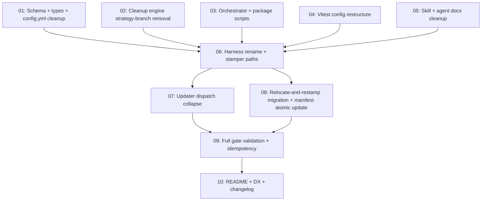

# Spec: Eval — Single LLM Backend & Co-located Test Restructure

## Status
Completed

## Overview

The current eval system splits LLM evals into two backends — `code` (stamped `evals/llm/test_*.test.ts` files using `defineLlmCodeEval`) and `declarative` (JSON case files under `plugins/*/evals/{commands,agents,hooks}/` and `.cursor/evals/{commands,agents,hooks}/`) — controlled by a global `llm.strategy` config field plus a per-target backend hint computed in `scripts/eval-stamp.ts` (`resolveLlmPerTargetBackend`). In practice this split is a thin veneer: **every stamped TS file is structurally identical** (`const CASES: CodeStrategyCaseDefinition[] = [...]` → `defineLlmCodeEval({ ... })`) and the **JSON case files have the same shape** wrapped in a different file extension. The feature that originally justified the code/declarative split — scripted `askQuestion` answers via `interactions.answers` — is imported but unused in every stamped per-primitive test today; only the harness's own unit tests under `evals/llm/_shared/*.test.ts` exercise it.

This spec collapses the strategy split into a **single TS-everywhere co-located eval architecture**:

- **All primitives EXCEPT skills** — commands, agents, hooks on both plugin-side (`plugins/
/`) and workspace-side (`.cursor/`) — get their eval at **`<kind>/evals/<name>.test.ts`** co-located adjacent to the source markdown / JSON.
- **Skills are exempt** — they keep `skills/<name>/evals/evals.json` per the Cursor Agent Skills spec ([evaluating-skills.mdx#L20](https://github.com/agentskills/agentskills/blob/5d4c1fda3f786fff826c7f56b6cb3341e7f3a911/docs/skill-creation/evaluating-skills.mdx#L20)). `skills-ref validate` must continue to pass against every skill in this repo.
- **Single LLM emitter**: the harness in `evals/llm/_shared/run-code-strategy-suite.ts` (renamed to a non-strategy module) becomes the only LLM emitter. The analyser's `requiresInteraction` flag stays — it controls whether the runner pre-scripts AskQuestion answers vs single `sendPrompt`. Same harness either way; the flag just toggles the runtime branch.
- **Schema cleanup**: drop `llm.strategy` and `llm.codeFramework` from `templates/schema/config.schema.json`. Keep `static.framework` (still useful for host repos that run non-eval pytest/jest suites).
- **Cleanup engine**: drop the `strategy-switch` branch from `templates/schema/cleanup-plan.schema.json` and the matching code path in `scripts/eval-cleanup-stale.ts`. Framework-switch cleanup (vitest ↔ jest for the static side) remains.
- **Relocation**: 16 JSON case files + 32 LLM TS files + 4 static-stamped vitest files (= 52 stamped artefacts; the user-quoted count of 48 omits the 4 static-stamped pilots already at `evals/test_*.test.ts`) relocate to the new co-located paths, preserving case content verbatim. Every move passes through a strict `_meta.generated === true` gate before any delete. The 14 skill `evals.json` files are never touched.

This repo IS the dogfood / source-of-truth — no production host repo uses this layout yet, so one-shot migration is acceptable. No deprecation alias for `llm.strategy` is required.

## Motivation

1. **Maintenance**: keeping two backend code paths (stamper, updater, cleanup, orchestrator, manifest snapshot) doubles the surface area for every new analyser feature, while the structural difference between the two outputs is zero.
2. **Author DX**: a plugin author who adds a new command/agent/hook today has to ask "code or declarative?" before running `/z-eval-create`. After this restructure: drop the primitive, run `/z-eval-create`, a co-located `<kind>/evals/<name>.test.ts` appears. No strategy choice.
3. **Co-location**: eval lives next to the source it tests. Easier discovery, easier review, easier deletion when a primitive is removed.
4. **Single source of truth for skills**: the Cursor Agent Skills spec mandates `skills/<name>/evals/evals.json`. Today we *also* emit `evals/llm/test_skill_*.test.ts` for 10 of 14 skills — duplicating coverage. After the restructure, skill `evals.json` is the only skill eval source.

## Goals

1. **Zero-strategy schema**: `config.schema.json` and `cleanup-plan.schema.json` contain no reference to `llm.strategy` or `llm.codeFramework`. The cross-field rule between `llm.strategy` and `static.framework` is removed entirely.
2. **Single LLM stamper output path**: every non-skill primitive's eval lands at `<kind>/evals/<name>.test.ts` co-located adjacent to source; `resolveLlmPerTargetBackendPaths` and `assertNoConflictingLlmStrategy` collapse into a single path computation.
3. **Verbatim case preservation**: every case in the 52 stamped artefacts that move retains its prompt, assertions, fixtures, and `_meta.*` markers byte-for-byte after relocation. User-authored cases (`_meta.generated !== true`) MUST NOT be mutated by any `--apply` step.
4. **Manifest fidelity**: `.zoto/eval-system/manifest.yml` reflects every new co-located path; `manifest.history.yml` gains exactly one append-only entry documenting the move and timestamping the strategy-field drop.
5. **`skills-ref validate` stays green** across every skill in this repo, and the 14 skill `evals.json` files are byte-identical before and after this spec.
6. **Validation gates pass**: `pnpm run eval:list`, `pnpm run eval:update --check`, the static (vitest) collect across the new co-located paths, and `pnpm run eval -- --collect-only` against the new LLM suite all exit 0 at the end of the spec.
7. **Plugin-author DX documented**: README + a dedicated DX section explain that a new command/agent/hook eval is "drop the primitive, run `/z-eval-create`, and a co-located TS file appears" — no strategy / framework choice required.

## Non-Goals

- **Skill evals shape change.** Skills keep `evals.json`. No TS sidecar is added adjacent to any skill `evals.json`. The Cursor Agent Skills spec governs skill evals, full stop.
- **Static backend removal.** `static.framework` (pytest / vitest / jest) stays. Host repos that have non-eval test suites continue to choose their static framework. Per-primitive static stamping (the partial pilot at `evals/test_*.test.ts`) is *folded into* the new co-located TS file or removed where the target is a skill — but the concept of a static backend remains.
- **`requiresInteraction` removal.** The analyser flag stays. It controls the runtime branch (scripted AskQuestion answers vs single sendPrompt) inside the unified harness. The flag is **not** a backend selector.
- **`preserveUserAuthoredCases` / `writeMetaMarker` config loosening.** Both remain hard-coded `const true` in `config.schema.json`. The relocation explicitly enforces these contracts — every `--apply` move passes through a strict `_meta.generated === true` gate before any delete.
- **Backward compatibility shim.** No `llm.strategy` deprecation alias. One-shot migration of this repo's config is acceptable.
- **Host-repo migration tooling.** No external repo uses this layout yet, so there is no public migration story to write. If a host adopts this plugin later, the README will tell them to upgrade in one shot.

## Key Decisions

- **KD-1 Skill exemption is absolute.** The 14 skill `evals.json` files at `skills/<name>/evals/evals.json` are byte-preserved across the entire spec. No subtask may touch them. `scripts/validate-skills.mjs` MUST exit 0 before and after the migration with identical output (modulo the wrapper script's own timestamp).

- **KD-2 Single co-located path per primitive.** Every non-skill primitive emits exactly one eval file. The path is **`<kind>-dir>/evals/<name>.test.ts`** where `<kind>-dir>` is the directory holding the source primitive: `plugins/
/commands/`, `plugins/
/agents/`, `plugins/
/hooks/`, `.cursor/commands/`, `.cursor/agents/`, or `.cursor/hooks/`. For workspace hooks the file is `.cursor/hooks/evals/hooks.test.ts` (one shared file for the hook bundle, matching the source `.cursor/hooks.json`).

- **KD-3 Harness rename, hard cutover, no semantic change.** `evals/llm/_shared/run-code-strategy-suite.ts` is renamed to **`evals/llm/_shared/run-llm-suite.ts`**. The exported entry point becomes **`defineLlmEval`** — no deprecated `defineLlmCodeEval` re-export. Pre-migration stamped files break until subtask 08 restamps them; this is accepted as the cleaner end state. `CodeStrategyCaseDefinition` is renamed to **`LlmCaseDefinition`**. The harness logic (case loading, `interactions.answers` scripted-answer branch, `requiresInteraction` runtime selection) is unchanged.

- **KD-4 Skills lose their LLM TS coverage at the move boundary.** The 10 existing `evals/llm/test_skill_*.test.ts` files are deleted as part of the migration. Skill evals are JSON-only after this spec. If a future skill needs LLM-style coverage (scripted askQuestion or multi-turn assertions), the host extends the skill's `evals.json` — the runner is already JSON-aware via the declarative path, which is folded into the unified harness as the JSON-loader branch.

- **KD-5 Static stamped pilots: 2 relocate, 2 delete.** Of the 4 stamped static-Vitest files at `evals/test_*.test.ts`: `test_agent_agent_zoto-eval-analyser-subagent.test.ts` and `test_agent_agent_zoto-plugin-manager.test.ts` relocate to `plugins/zoto-eval-system/agents/evals/zoto-eval-analyser-subagent.test.ts` and `.cursor/agents/evals/zoto-plugin-manager.test.ts` respectively, folding any unique static-only assertions into the new co-located LLM file. `test_skill_skill_zoto-create-plugin.test.ts` and `test_skill_skill_zoto-help-evals.test.ts` are deleted (skill primitives have no TS sidecar — coverage moves entirely to the existing skill `evals.json`).

- **KD-6 `requiresInteraction` stays, governs runtime branch only.** The analyser continues to emit `requiresInteraction: true | false` per primitive. The unified harness reads this flag and either: (a) `true` → load `interactions.answers` and use `runCaseWithScriptedAnswers` (the existing AskQuestion bridge), or (b) `false` → single `agent.send(prompt)` + grade the response. No file-shape difference; same `<kind>/evals/<name>.test.ts`.

- **KD-7 Strict `_meta.generated === true` gate before every delete.** The migration script reads every old artefact, validates `_meta?.generated === true` (case-level for JSON, the file-level marker `// _meta.generated: true` for TS — both per `_user-case-guards.ts`), and only then writes the new file + deletes the old. If a case lacks the marker, the migration aborts that specific target with a fatal error and writes a `.spec-blocker.json` log entry. **No --force flag.** User-authored content cannot be lost by any path.

- **KD-8 Manifest atomic update + invalidation stamp.** `manifest.yml` and `manifest.history.yml` are updated **in the same subtask as the file moves** (subtask 08). Every cached analyser payload at `.zoto/eval-system/cache/analyser/*.json` whose `discovery_config` references the dropped `llm.strategy` / `llm.codeFramework` gets `_meta.primitive_analysis.invalidate=true` stamped on it, forcing the next `/z-eval-update --apply --with-analyser` to re-analyse from source. The history entry records: timestamp, spec id, "strategy-collapse-and-colocate", and a path-old → path-new mapping for every moved file.

- **KD-9 Validation is mandatory, both internal and via spec-judge.** Subtask 09 runs the four gates: `pnpm run eval:list`, `pnpm run eval:update --check`, the new co-located vitest collect (`pnpm run eval -- --collect-only` or replacement), and `node scripts/validate-skills.mjs`. All must exit 0. The standard spec-execution `zoto-spec-judge` pass then independently verifies no user-authored mutation occurred and the migration is idempotent (re-running the migration script produces zero diff).

- **KD-10 Vitest config restructure: root-level include with co-location globs.** `evals/vitest.config.ts` is repointed to `root: repoRoot` and `include: ["**/evals/*.test.ts", "evals/*.test.ts"]` with `exclude` extended to skip `evals/llm/_shared/**` and `node_modules`, `_runs`, `fixtures`. The LLM-specific `evals/llm/vitest.config.ts` is removed in favour of a single unified config; the LLM YAML reporter (`zoto-llm-reporter.ts`) and the static reporter (`zoto-eval-reporter.ts`) both consume the same Vitest event stream and partition emit by file-path pattern (LLM files match `<kind>/evals/<name>.test.ts` — co-located; static smoke matches `evals/smoke-static-eval.test.ts`).

## Requirements

1. **Scope coverage** — the migration handles exactly:
   - 32 LLM TS files: `evals/llm/test_{kind}_{name}.test.ts` (10 skill + 11 agent + 11 command — the 11 commands include `z-eval-{advise,configure,create,execute,help,judge,update,workflow}`, `z-spec-{create,execute,judge}`; the 11 agents include `zoto-eval-{adviser,architect,comparer,configurer,engineer,executor,generator,judge,updater}`, `zoto-spec-{generator,judge}`).
   - 16 declarative JSON: `plugins/zoto-eval-system/evals/{commands,agents,hooks}/*.json` (7 files), `plugins/zoto-spec-system/evals/{commands,agents,hooks}/*.json` (3 files), `plugins/zoto-cursor-top/evals/{commands,agents}/*.json` (2 files), `.cursor/evals/{commands,agents,hooks}/*.json` (4 files).
   - 4 static-stamped Vitest: `evals/test_{agent_agent,skill_skill}_*.test.ts` (per KD-5).
   - 14 skill `evals.json` — **byte-preserved, never touched**.

2. **Strict `_meta.generated === true` gate** — every move/delete in the migration validates the marker per `plugins/zoto-eval-system/engine/_user-case-guards.ts` (`isGeneratedCase` for JSON cases, `isGeneratedFile` for TS line-1 marker). No mutation of user-authored cases.

3. **Schema fields dropped** — `templates/schema/config.schema.json` MUST NOT contain `llm.strategy` or `llm.codeFramework` after subtask 01. The cross-field rule between `llm.strategy` and `static.framework` is removed. `templates/schema/cleanup-plan.schema.json` MUST NOT contain the `"strategy-switch"` enum value or the `from/to` strategy fields after subtask 02. `update.preserveUserAuthoredCases` and `update.writeMetaMarker` remain `const: true`.

4. **`skills-ref validate` parity** — `node scripts/validate-skills.mjs` exit code AND output (modulo timestamps) MUST be identical before subtask 01 and after subtask 09.

5. **`eval:update --check` exit 0** — the updater (post-subtask 07 dispatch collapse + post-subtask 08 migration) MUST exit 0, proving no drift between manifest and on-disk file paths.

6. **Vitest collect exit 0** — the new co-located vitest config picks up every relocated `<kind>/evals/<name>.test.ts` plus `evals/smoke-static-eval.test.ts`, and `vitest --run --reporter=basic --testNamePattern='^x$'` (a "collect only" surrogate) exits 0 with the expected file count printed.

7. **Manifest history append-only** — `manifest.history.yml` grows by exactly one entry across this spec. No existing entry is rewritten.

8. **Cached analyser invalidation stamp** — every cache file under `.zoto/eval-system/cache/analyser/*.json` whose payload's `discovery_config` snapshot references the old `llm.strategy` / `llm.codeFramework` gets `_meta.primitive_analysis.invalidate = true` set. The next `/z-eval-update --apply --with-analyser` must re-analyse those primitives from source.

9. **Docs reflect new layout** — `plugins/zoto-eval-system/README.md` documents the co-located layout; a new section (or a dedicated `docs/plugin-author-co-location.md`) walks through "how do I add a new command/agent/hook eval?" with the new flow; a new repo-root `CHANGELOG.md` is created AND `plugins/zoto-eval-system/CHANGELOG.md` is updated — both gain a single entry describing this restructure with a clear "BREAKING — `llm.strategy` and `llm.codeFramework` removed" header.

10. **Idempotency** — re-running the migration script after a clean migration produces zero file diff and zero manifest diff. The migration is a one-shot operation, but re-runs MUST be safe.

## Subtask Manifest

| ID | File | Subagent | Dependencies | Phase | Status |
|----|------|----------|-------------|-------|--------|
| 01 | `subtask-01-eval-single-backend-colocated-restructure-schema-cleanup-20260526.md` | zoto-eval-engineer | — | 1 | Pending |
| 02 | `subtask-02-eval-single-backend-colocated-restructure-cleanup-engine-20260526.md` | zoto-eval-engineer | — | 1 | Pending |
| 03 | `subtask-03-eval-single-backend-colocated-restructure-orchestrator-scripts-20260526.md` | zoto-eval-engineer | — | 1 | Pending |
| 04 | `subtask-04-eval-single-backend-colocated-restructure-vitest-config-20260526.md` | zoto-eval-engineer | — | 1 | Pending |
| 05 | `subtask-05-eval-single-backend-colocated-restructure-docs-cleanup-20260526.md` | zoto-eval-architect | — | 1 | Pending |
| 06 | `subtask-06-eval-single-backend-colocated-restructure-stamper-paths-20260526.md` | zoto-eval-engineer | 01, 02, 03, 04, 05 | 2 | Pending |
| 07 | `subtask-07-eval-single-backend-colocated-restructure-updater-dispatch-20260526.md` | zoto-eval-engineer | 06 | 3 | Pending |
| 08 | `subtask-08-eval-single-backend-colocated-restructure-migration-20260526.md` | zoto-eval-engineer | 06 | 3 | Pending |
| 09 | `subtask-09-eval-single-backend-colocated-restructure-validation-20260526.md` | zoto-eval-engineer | 07, 08 | 4 | Pending |
| 10 | `subtask-10-eval-single-backend-colocated-restructure-docs-changelog-20260526.md` | zoto-plugin-manager | 09 | 5 | Pending |

## Subtask Dependency Graph

## Execution Order

Phases are derived from the dependency graph. Subtasks within a phase have no dependencies on each other and may run in parallel. A phase starts only after all subtasks in prior phases are complete. The executor honours `spec.parallelLimit = 4` (default) within each phase.

### Phase 1 (Parallel — foundations)

| ID | Subagent | Description |
|----|----------|-------------|
| 01 | zoto-eval-engineer | Drop `llm.strategy` / `llm.codeFramework` from `config.schema.json`; clean `analyser-payload.ts` types and `manifest-snapshot.ts` helpers; migrate `.zoto/eval-system/config.yml` + fixture configs. |
| 02 | zoto-eval-engineer | Remove `"strategy-switch"` branch from `cleanup-plan.schema.json`; collapse strategy split in `scripts/eval-cleanup-stale.ts` (`enumerateLlmStrategyAssets`); update cleanup tests. |
| 03 | zoto-eval-engineer | Simplify `scripts/eval-orchestrate.ts` to a single `eval:llm` flow; drop `eval:llm:declarative` from root `package.json`; keep `eval:llm:code` renamed to `eval:llm`. |
| 04 | zoto-eval-engineer | Restructure `evals/vitest.config.ts` to root at repo with include globs `**/evals/*.test.ts` + `evals/*.test.ts`; remove `evals/llm/vitest.config.ts`; verify reporters partition correctly. |
| 05 | zoto-eval-architect | Cleanup user-facing strategy language in `zoto-configure-evals` SKILL.md, analyser/generator/updater/executor/configurer agent docs, and `z-eval-{configure,execute}` command docs. |

### Phase 2 (after Phase 1 — engine emit path)

| ID | Subagent | Description |
|----|----------|-------------|
| 06 | zoto-eval-engineer | Rename `defineLlmCodeEval` → `defineLlmEval` and `run-code-strategy-suite.ts` → `run-llm-suite.ts`; rewrite `scripts/eval-stamp.ts` `resolveLlmPerTargetBackendPaths` to emit `<kind>/evals/<name>.test.ts`; remove `stampLlmDeclarativeStrategy` and `assertNoConflictingLlmStrategy`; skills auto-route to existing `evals.json` (no TS sidecar). |

### Phase 3 (after Phase 2 — drift collapse + relocation, parallel)

| ID | Subagent | Description |
|----|----------|-------------|
| 07 | zoto-eval-engineer | Collapse `engine/update.ts` strategy dispatch (`regenerateLlmCode` / `regenerateLlmDeclarative` → single `regenerateLlm`); update `llmCodeTestPathForTarget` → `llmTestPathForTarget` with new co-located path; update drift detection patterns. |
| 08 | zoto-eval-engineer | Write `scripts/eval-relocate-migration.ts`; walk 16 JSON + 32 LLM TS + 4 static-stamped files; emit new co-located TS verbatim; strict `_meta.generated === true` gate before any delete; update `manifest.yml` atomically; append history entry; stamp `_meta.primitive_analysis.invalidate=true` on cached analyser payloads. |

### Phase 4 (after Phase 3 — validation)

| ID | Subagent | Description |
|----|----------|-------------|
| 09 | zoto-eval-engineer | Run `pnpm run eval:list`, `pnpm run eval:update --check`, vitest collect across new co-located paths, `node scripts/validate-skills.mjs`; verify migration idempotency (re-run zero diff); capture exit logs in execution notes. |

### Phase 5 (after Phase 4 — docs)

| ID | Subagent | Description |
|----|----------|-------------|
| 10 | zoto-plugin-manager | Update `plugins/zoto-eval-system/README.md` with new co-located layout; add plugin-author DX section ("how to add a new eval"); append a single BREAKING `CHANGELOG.md` entry. |

## Definition of Done

- [x] All 10 subtasks completed (per their individual Definition of Done sections)
- [x] `node scripts/validate-skills.mjs` exits 0; output diff against baseline is empty (modulo wrapper timestamps)
- [x] `pnpm run eval:list` exits 0 and enumerates every target with co-located paths in `eval_files[]`
- [x] `pnpm run eval:update --check` exits 0 (no drift) — note: 5 pre-existing SKILL.md drifts unrelated to this spec; layout_drift_count: 0
- [x] Vitest collect picks up every relocated `<kind>/evals/*.test.ts` plus `evals/smoke-static-eval.test.ts`
- [x] `evals/llm/test_*.test.ts` directory contains only `_shared/` (harness + unit tests); no per-primitive files remain
- [x] `plugins/
/evals/{commands,agents,hooks}/` directories are removed (only `plugins/
/skills/<s>/evals/` remain — JSON, untouched)
- [x] `.cursor/evals/{commands,agents,hooks}/` directories are removed; `.cursor/skills/<s>/evals/` retained (JSON, untouched)
- [x] `manifest.yml` lists every target with new co-located `eval_files[]` entries
- [x] `manifest.history.yml` grew by exactly 1 append-only entry
- [x] `.zoto/eval-system/cache/analyser/*.json` invalidation stamp set on every entry whose discovery_config referenced the dropped strategy fields
- [x] Re-running `scripts/eval-relocate-migration.ts` produces zero file diff and zero manifest diff
- [x] `zoto-spec-judge` adversarial pass (run by the spec executor in the standard flow) confirms no user-authored content was mutated and the migration is idempotent
- [x] No linter errors in modified TS files
- [x] Repo-root `CHANGELOG.md` created with a single new entry tagged BREAKING for `llm.strategy` / `llm.codeFramework` removal
- [x] `plugins/zoto-eval-system/CHANGELOG.md` updated with the same BREAKING entry

## Execution Notes

Executed 2026-05-26 11:00:30 – 14:06:04 UTC (~3h 6m) across 5 phases, 10 subtasks. All gates green (subtask 09 captured full validation output). Quality audit verdict: WARN (one stale comment fixed post-audit in `engine/case.ts`). No blockers encountered.
