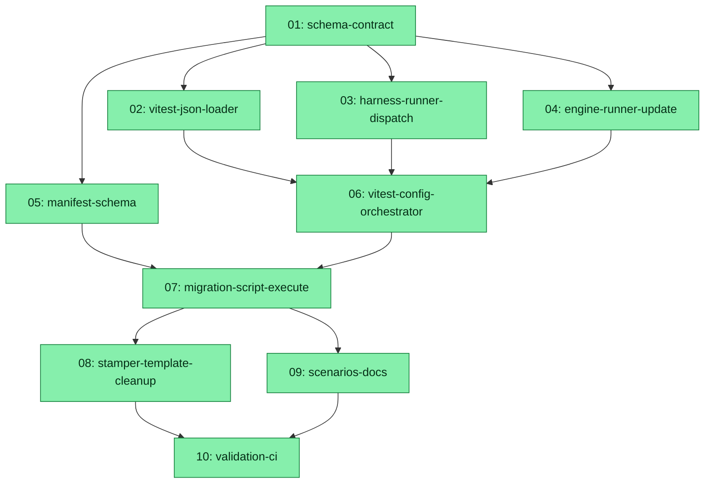

# Spec: Evals JSON-First Migration with `runner` Discriminator

## Status
Completed

## Overview

Unify the eval system around a **single JSON-first format** for every non-skill primitive (commands, agents, hooks) and central JSON files. The current dual-track layout — co-located `.test.ts` LLM evals next to a parallel declarative JSON path — is collapsed into one canonical JSON shape with a typed `runner` escape hatch for cases that need imperative TypeScript.

Skill evals remain untouched (their JSON shape is fixed by the Cursor Agent Skills spec). A custom Vitest plugin (Vite-level `resolveId` + `load`) loads co-located `*.json` eval files natively as Vitest suites — no ephemeral shim files on disk — preserving test-explorer integration, reporters, and parallel execution. A `runner` field on a JSON case marks that case as imperative: the declarative grader is skipped and execution is delegated to a `.test.ts` file with a typed `RunnerParams` contract. Multi-primitive scenarios live as single TS files under `evals/scenarios/<scenario-name>.test.ts`, and `/z-eval-create` ships a skipped example file on init.

The migration is destructive: every existing co-located `.test.ts` LLM eval (all files matching `plugins/*/{commands,agents,hooks}/evals/*.test.ts` and `.cursor/{commands,agents,hooks}/evals/*.test.ts`; discovered dynamically via glob) is rewritten to `<name>.json` and the TS originals are deleted. Stamper templates, the engine `update.ts` regenerate path, manifest schema, orchestrator scripts, and documentation are all updated in lockstep.

## Key Decisions

- **KD-1 — Single JSON schema for non-skill primitives.** One canonical schema covers commands/agents/hooks with `target_id` + `cases[]`. A case is either a *declarative* case (current shape: `prompt`, `assertions`, `graders`, `fixtures`, `expected_filesystem`, etc.) or a *runner* case carrying only `id`, `runner` (relative path to a `.test.ts`), and `parameters` (typed payload). The discriminator is the presence of the `runner` field. Skill `evals/evals.json` files keep their Cursor-spec shape (`skill_name` + `evals[]`) and are out of scope for this spec.
- **KD-2 — `RunnerParams` typed contract.** A TypeScript interface `RunnerParams` (exported from `evals/llm/_shared/runner-params.ts`) defines the payload passed to runner TS files. Initial fields: `targetId: string`, `caseId: string`, `parameters: Record<string, unknown>`, plus a `context` object exposing the SDK bridge, sandbox helper, model id, and reporter hooks. Runner TS files export a default `(params: RunnerParams) => Promise<RunnerResult>` function. The contract is mirrored in `templates/schema/runner-params.schema.json` for JSON validation and is documented in the eval-system README.
- **KD-3 — Custom Vitest JSON loader via Vite plugin.** Implement `evals/llm/_shared/vitest-json-loader.ts` as a Vite plugin (`resolveId` + `load`) that recognises non-skill `**/evals/*.json` paths and synthesises an in-memory ES module per file calling `defineLlmEval()` with the parsed cases. No `.tmp.ts` files are written to disk. The plugin is wired into `evals/vitest.config.ts`. Vitest's existing test discovery is extended via `include: ['**/evals/*.json']` plus a `transformFilter`-style guard so skill `evals/evals.json` files are excluded.
- **KD-4 — `defineLlmEval` dispatches runner cases.** When the harness encounters a case with `runner`, the per-case `it()` body skips declarative grading entirely: it resolves `runner` relative to the JSON file, dynamically imports the target `.test.ts`, asserts a default export of type `(p: RunnerParams) => Promise<RunnerResult>`, awaits it with the typed payload, and records the result through the existing `reportCase` API. The declarative engine runner (`engine/runner.ts`) skips runner-only cases with a `requiresVitest=true` log line and otherwise leaves discovery intact.
- **KD-5 — Multi-primitive scenarios at `evals/scenarios/<name>.test.ts`.** Single-file TS scenarios live directly under `evals/scenarios/` (no subdirectories). A skipped example `evals/scenarios/_example-multi-primitive.test.ts` ships with `/z-eval-create` so new repos see the pattern. The example uses `describe.skip` / `xit` and is documented in the README.
- **KD-6 — Migration of all co-located `.test.ts` files in one pass.** A one-shot script (`scripts/eval-migrate-ts-to-json.ts`) discovers ALL matching files dynamically via glob (across `plugins/zoto-eval-system/`, `plugins/zoto-spec-system/`, `plugins/zoto-cursor-top/`, and `.cursor/`). It uses the TypeScript compiler API to parse each existing co-located `.test.ts` LLM eval, extract the `CASES` literal verbatim, capture `targetId`/`modelId`/`judgeModel`/`caseTimeoutMs` from the `defineLlmEval()` call, write the equivalent `<name>.json`, and delete the original `.test.ts`. The script is idempotent (re-running on already-migrated files is a no-op), reports a per-file pass/fail table, and **logs extraction failures to a migration audit rather than silently producing corrupt output**. Files that cannot be parsed are left un-migrated with a deprecation warning. Manifest `eval_files` entries are rewritten to the new `.json` paths in the same run.
- **KD-7 — Stamper templates: TS template removed, JSON template universal.** Delete `plugins/zoto-eval-system/templates/llm/code-cursor-sdk/per-primitive-test.ts.tmpl`. `scripts/eval-stamp.ts#stampLlmTarget` writes `<kind>/evals/<name>.json` for commands/agents and `<hooks-dir>/evals/hooks.json` for hooks. Skill stamping is unaffected. The three existing JSON templates (`command-evals/evals.json.tmpl`, `agent-evals/evals.json.tmpl`, `hook-evals/evals.json.tmpl`) become canonical and gain an inline commented example of a `runner` case.
- **KD-8 — Unified orchestrator (single JSON-driven path).** Remove the `eval:llm` script (its config target `evals/llm/vitest.config.ts` does not exist anyway) and consolidate the orchestrator (`scripts/eval-orchestrate.ts`) onto `evals/vitest.config.ts`. The orchestrator no longer splits LLM vs static into two Vitest invocations; both are partitioned by the existing path-based reporter classifiers (`isStaticEvalPath` / `isLlmCoLocatedPath`). The declarative `engine/runner.ts` remains available for `--list` and `--judge-only` plumbing only.
- **KD-9 — Manifest schema enforces `.json` for non-skill primitives.** `templates/schema/manifest.schema.json` is updated so `eval_files` entries for commands/agents/hooks/skills MUST end in `.json`. Scenario files (`evals/scenarios/*.test.ts`) are tracked outside the manifest. `eval:update:check` flags any remaining `.test.ts` co-located eval as critical drift (exit code 2).
- **KD-10 — README + skill help update the canonical text.** The eval-system README gains an "Advanced TS escape hatch" section with the inline runner-case example. `plugins/zoto-eval-system/skills/zoto-help-evals/SKILL.md` (and other skill docs referencing `.test.ts` LLM evals) get refreshed bullets. The CHANGELOG records the breaking change. The `zoto-create-evals` skill is updated so `/z-eval-create` copies the scenario template.

## Requirements

1. Every non-skill primitive eval is stored as `<name>.json` co-located beside the primitive (`commands/evals/`, `agents/evals/`, `hooks/evals/`) — no `.test.ts` LLM eval files remain after migration.
2. Skill evals (`plugins/*/skills/<name>/evals/evals.json`, `.cursor/skills/*/evals/evals.json`) are unchanged in schema, location, or tooling.
3. A JSON case containing **only** `id`, `runner` (relative `.test.ts` path), and `parameters` (typed payload) is supported and skips declarative grading.
4. A typed `RunnerParams` interface and matching JSON Schema define the runner contract.
5. A custom Vitest plugin loads non-skill `**/evals/*.json` as test suites in-memory (no shim files written to disk).
6. The harness `defineLlmEval()` dispatches runner cases by dynamically importing and invoking the referenced TS file's default export with `RunnerParams`.
7. The declarative `engine/runner.ts` skips runner-only cases cleanly and continues to operate for `--list` / `--judge-only` flows.
8. `evals/scenarios/<scenario>.test.ts` is the canonical location for multi-primitive scenarios; one TS file per scenario.
9. `/z-eval-create` scaffolds a skipped example scenario (`evals/scenarios/_example-multi-primitive.test.ts`) into the host repo and the README documents the pattern.
10. All existing co-located `.test.ts` LLM evals (discovered dynamically via glob across `plugins/zoto-eval-system/`, `plugins/zoto-spec-system/`, `plugins/zoto-cursor-top/`, and `.cursor/`) are migrated to JSON in one pass; manifest `eval_files` entries are rewritten to the corresponding `.json` paths.
11. The TS stamper template at `plugins/zoto-eval-system/templates/llm/code-cursor-sdk/per-primitive-test.ts.tmpl` is deleted and `scripts/eval-stamp.ts#stampLlmTarget` writes `.json`.
12. `engine/update.ts` regeneration writes JSON; drift detection compares JSON checksums for non-skill primitives.
13. The `eval:llm` package.json script is removed; the orchestrator uses the unified `evals/vitest.config.ts`.
14. `manifest.schema.json` constrains non-skill `eval_files` entries to `.json` extensions.
15. README + skill docs + CHANGELOG reflect the change; `eval:update:check` flags any residual `.test.ts` eval as critical drift.

## Subtask Manifest

| ID | File | Subagent | Dependencies | Phase | Status |
|----|------|----------|--------------|-------|--------|
| 01 | `subtask-01-evals-json-first-migration-schema-contract-20260527.md` | generalPurpose | — | 1 | Completed |
| 02 | `subtask-02-evals-json-first-migration-vitest-json-loader-20260527.md` | generalPurpose | 01 | 2 | Completed |
| 03 | `subtask-03-evals-json-first-migration-harness-runner-dispatch-20260527.md` | generalPurpose | 01 | 2 | Completed |
| 04 | `subtask-04-evals-json-first-migration-engine-runner-update-20260527.md` | generalPurpose | 01 | 2 | Completed |
| 05 | `subtask-05-evals-json-first-migration-manifest-schema-20260527.md` | generalPurpose | 01 | 2 | Completed |
| 06 | `subtask-06-evals-json-first-migration-vitest-config-orchestrator-20260527.md` | generalPurpose | 02, 03, 04 | 3 | Completed |
| 07 | `subtask-07-evals-json-first-migration-migration-script-execute-20260527.md` | generalPurpose | 05, 06 | 4 | Completed |
| 08 | `subtask-08-evals-json-first-migration-stamper-template-cleanup-20260527.md` | generalPurpose | 07 | 5 | Completed |
| 09 | `subtask-09-evals-json-first-migration-scenarios-docs-20260527.md` | generalPurpose | 07 | 5 | Completed |
| 10 | `subtask-10-evals-json-first-migration-validation-ci-20260527.md` | generalPurpose | 08, 09 | 6 | Completed |

## Subtask Dependency Graph

## Execution Order

### Phase 1 (sequential — foundation)
| ID | Subagent | Description |
|----|----------|-------------|
| 01 | generalPurpose | Define unified JSON schema (`runner` discriminator), `RunnerParams` TS interface + JSON Schema, `LlmCaseDefinition` extension, `EvalCase` extension. |

### Phase 2 (after Phase 1 — four-way parallel build-out)
| ID | Subagent | Description |
|----|----------|-------------|
| 02 | generalPurpose | Implement the Vite plugin that loads non-skill `**/evals/*.json` as in-memory Vitest suites. |
| 03 | generalPurpose | Extend `defineLlmEval` to dispatch runner cases via dynamic import of the referenced `.test.ts`. |
| 04 | generalPurpose | Update `engine/runner.ts` and `engine/case.ts` to recognise/skip runner-only cases and validate the new shape. |
| 05 | generalPurpose | Update `manifest.schema.json` to enforce `.json` extensions for non-skill `eval_files` and add `case.schema.json`. |

### Phase 3 (after Phase 2)
| ID | Subagent | Description |
|----|----------|-------------|
| 06 | generalPurpose | Wire the JSON loader into `evals/vitest.config.ts`, remove `eval:llm`, update orchestrator + reporter path classifiers. |

### Phase 4 (after Phase 3)
| ID | Subagent | Description |
|----|----------|-------------|
| 07 | generalPurpose | Build and run the `.test.ts` → `.json` migration script for all 38 files; rewrite manifest `eval_files`; commit migrated JSON. |

### Phase 5 (after Phase 4 — parallel)
| ID | Subagent | Description |
|----|----------|-------------|
| 08 | generalPurpose | Delete the TS stamper template; update `scripts/eval-stamp.ts` + `engine/update.ts` to stamp and regenerate JSON. |
| 09 | generalPurpose | Add `evals/scenarios/_example-multi-primitive.test.ts` template + `/z-eval-create` install hook; refresh README, CHANGELOG, and skill docs. |

### Phase 6 (after Phase 5)
| ID | Subagent | Description |
|----|----------|-------------|
| 10 | generalPurpose | Run `eval:list`, `eval:update:check`, full Vitest suite, validators; add CI assertion forbidding co-located `.test.ts` LLM evals; final cleanup. |

## Rollback Strategy

The migration (subtask 07) is destructive — all `.test.ts` LLM eval files are deleted and replaced by `.json`. Three mitigation layers:

1. **Pre-migration safety net:** The migration script supports `--keep-ts` which writes JSON without deleting TS originals. Run this first to validate output before committing to `--apply`.
2. **Feature-branch checkpoint:** All migration changes land in a single commit on a feature branch. If the Vite plugin or unified config has subtle defects (detected during subtask 10 validation), `git revert <migration-commit>` restores the prior state cleanly.
3. **Post-merge revert:** If issues surface after merge, the single-commit structure allows a clean `git revert` on main. The old TS files are fully reconstructible from git history and the manifest entries are trivially re-pointed.

The migration audit (`migration-audit-20260527.md`) captures every file's status. Files that fail AST extraction are left un-migrated (see subtask 07 failure handling) so the repo remains functional even on partial migration.

## Definition of Done

- [x] All 10 subtasks completed with paired `.status.md` + `.status.yml` marked `state: completed`
- [x] No co-located `*.test.ts` LLM eval files remain anywhere under `plugins/*/{commands,agents,hooks}/evals/`, `.cursor/{commands,agents,hooks}/evals/`
- [x] Every non-skill primitive has a co-located `<name>.json` (or `hooks.json` for hooks) with `_meta.generated: true` where appropriate
- [x] Migration audit shows 0 skipped files (all discovered `.test.ts` files successfully migrated)
- [x] `pnpm eval` and `pnpm eval:full` succeed (or skip gracefully without `CURSOR_API_KEY`) using only the unified `evals/vitest.config.ts`
- [x] `pnpm eval:update:check` reports zero critical drift
- [x] `pnpm eval:list` enumerates every migrated `.json` file
- [x] `scripts/validate-template.mjs`, `scripts/validate-skills.mjs`, and `pnpm test` all pass
- [x] Eval-system README has an "Advanced TS escape hatch" section with a working `runner` example
- [x] `evals/scenarios/_example-multi-primitive.test.ts` exists in the host repo template AND is copied by `/z-eval-create` on init
- [x] CHANGELOG.md records the breaking change
- [x] `manifest.schema.json` rejects non-`.json` entries for non-skill primitives (smoke-tested with an invalid fixture)

## Execution Notes

**Completed 2026-05-29 12:18 UTC.** All 10 subtasks executed and independently verified by fresh `zoto-spec-judge` agents. See `execution-report-evals-json-first-migration-20260527.md` for full detail.

- 38/38 co-located `.test.ts` LLM evals migrated to `.json` (0 failed, 0 skipped per `migration-audit-20260527.md`).
- Final validation green: `pnpm test` (cursor-top 86/86, eval-system 128/128, spec-system 132/132), validate-template/skills 0, `eval:update:check` 0 (zero critical drift), `eval:list` 0, Vitest CI run 951 passed / 270 skipped.
- All 12 Definition-of-Done items confirmed and ticked; spec-root onStop consistency gate clean for this spec.
- Subtask 10 required two fix-list rounds (open D06/D08 + status consistency; then a DOD06 skill-frontmatter drift from this spec's own subtask-09 doc edits), each routed back to the assigned `generalPurpose` subagent and re-verified.
- Follow-ups (non-blocking, cross-subtask engine/stamper territory): (1) `eval:update --apply` UA+generated merge should emit valid JSON; (2) the static stamper (`writeVitestIfChanged`) should not clobber a present unified config; (3) `eval:update --apply` with the analyser needs network reachability — `--no-analyser` is the offline/CI fallback.
