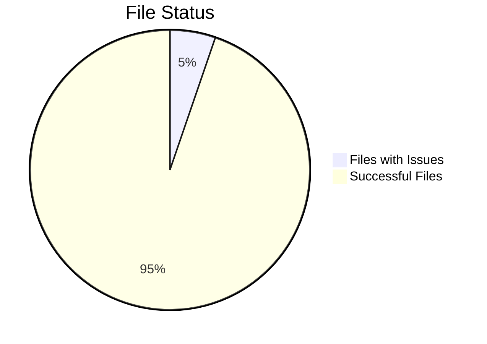
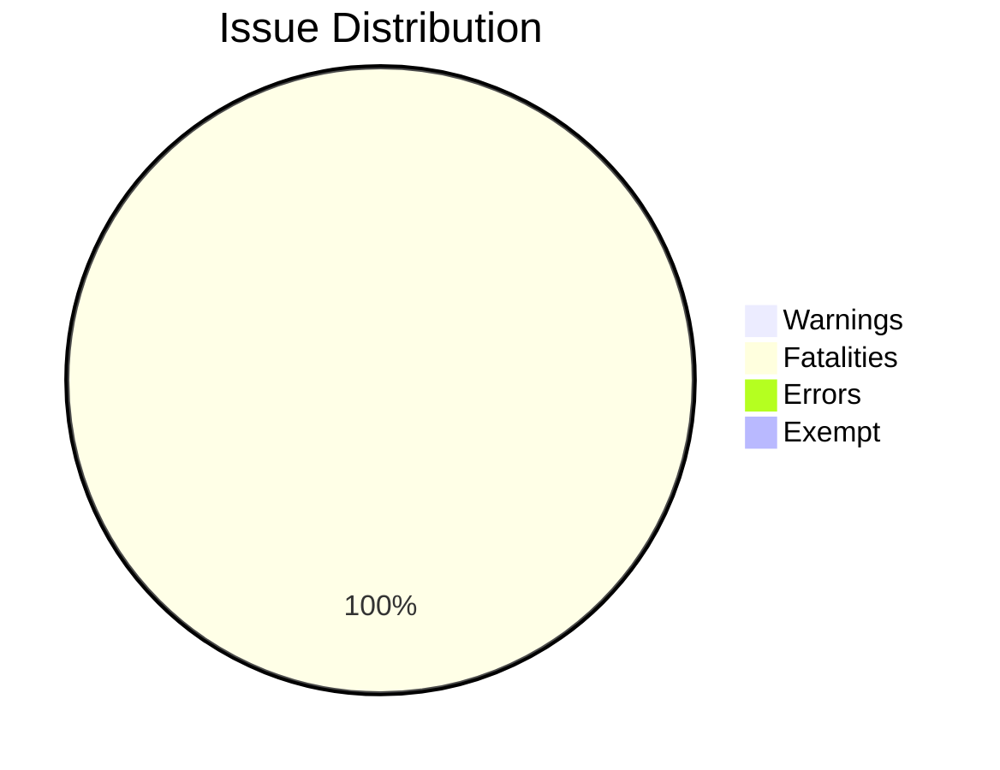
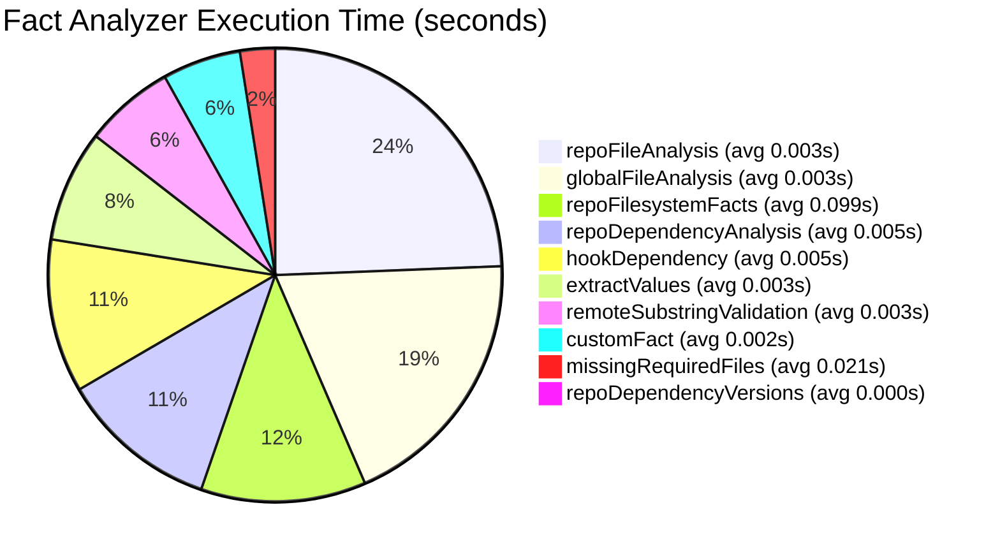

# X-Fidelity Analysis Report
Generated for:  on 2026-04-04 22:56 GMT+1100

## Executive Summary

This report presents the results of an X-Fidelity analysis conducted on the repository ``. The analysis identified **1 total issues**, including:
- 0 warnings
- 1 fatalities
- 0 errors
- 0 exempt issues

Out of 19 total files, 18 (94.7%) have no issues. The analysis was conducted using X-Fidelity version 5.8.0 and took approximately 2.18 seconds to complete.

## Repository Overview

### File Status

### Issue Distribution

## Top Rule Failures

The following chart shows the most frequent rule failures detected in the analysis:

```mermaid
gantt
    title Top Rule Failures
    dateFormat X
    axisFormat %s
    section Rule Failures
    outdatedFramework-global :0, 1
```

## Files with Most Issues

The following chart shows which files have the most issues:

```mermaid
gantt
    title Files with Most Issues
    dateFormat X
    axisFormat %s
    section Files
    REPO_GLOBAL_CHECK :0, 1
```

## Fact Metrics Performance

### Execution Count

```mermaid
gantt
    title Fact Analyzer Execution Count
    dateFormat X
    axisFormat %s
    section Execution Count
    globalFileAnalysis :0, 60
    repoFileAnalysis :0, 60
    remoteSubstringValidation :0, 20
    customFact :0, 20
    extractValues :0, 20
    repoDependencyAnalysis :0, 20
    hookDependency :0, 20
    repoDependencyVersions :0, 1
    repoFilesystemFacts :0, 1
    missingRequiredFiles :0, 1
```

### Execution Time (seconds)

## Top 5 Critical Issues (AI Analysis)

No AI-powered critical issues analysis available. Consider enabling the OpenAI plugin for enhanced issue prioritization and detailed recommendations.

## Other Global Issues

- **outdatedFramework-global** (fatality): Core framework dependencies do not meet minimum version requirements! Please update your dependencies to the required versions.
  - `typescript` (5.9.3 → 5.0.0) in `plugins/zoto-spec-system/package.json:18`

## All Issues

The following sections contain all issues found in the analysis, grouped by rule. Each issue has a unique anchor that allows direct linking from the VSCode extension.

### Outdated Framework Global (1 issue)

This rule applies globally to the repository:

- **outdatedFramework-global** (fatality): Core framework dependencies do not meet minimum version requirements! Please update your dependencies to the required versions.
  - `typescript` (5.9.3 → 5.0.0) in `plugins/zoto-spec-system/package.json:18`

#### Individual Issues

#### Issue #1: outdatedFramework-global

🔥 **FATAL**

**Scope:** 📦 Repository-wide  
**Manifest:** `plugins/zoto-spec-system/package.json` (Line 18)  
**Rule:** `outdatedFramework-global`  

**Description:**  
Core framework dependencies do not meet minimum version requirements! Please update your dependencies to the required versions.

---

