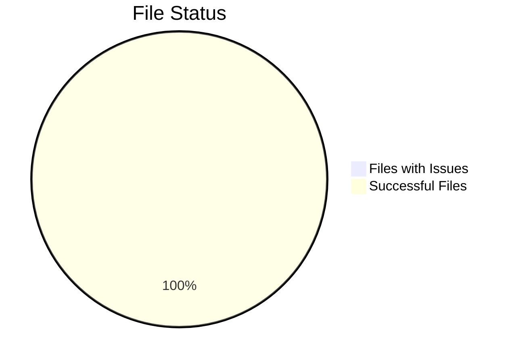
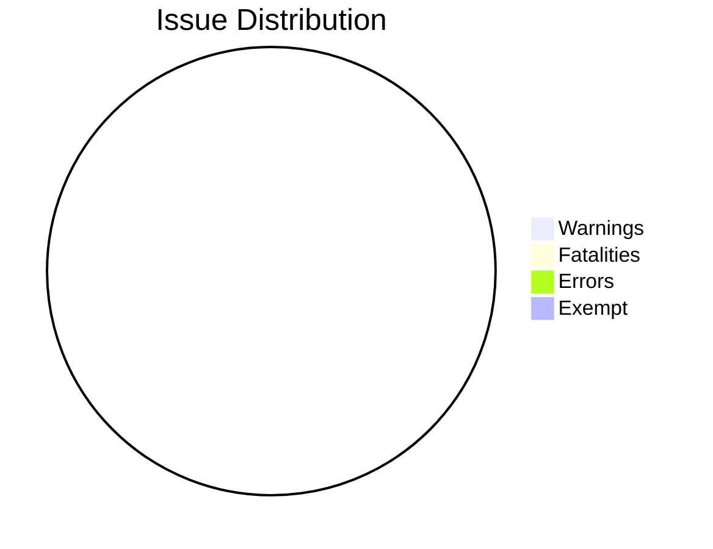
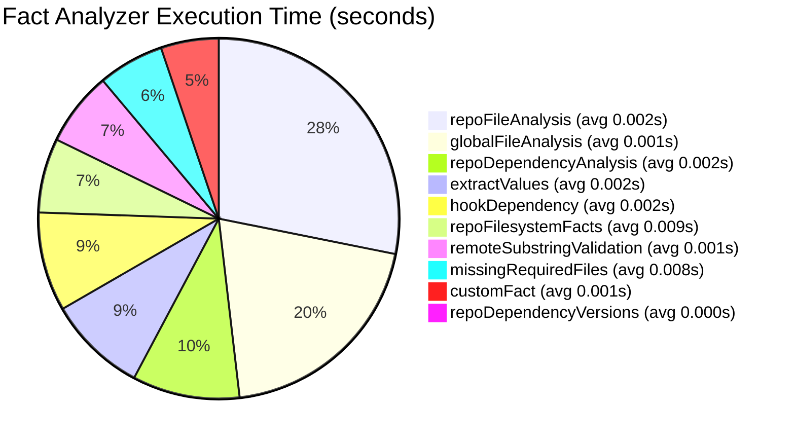

# X-Fidelity Analysis Report
Generated for:  on 2026-04-04 18:56 GMT+1100

## Executive Summary

This report presents the results of an X-Fidelity analysis conducted on the repository ``. The analysis identified **0 total issues**, including:
- 0 warnings
- 0 fatalities
- 0 errors
- 0 exempt issues

Out of 7 total files, 7 (100.0%) have no issues. The analysis was conducted using X-Fidelity version 5.8.0 and took approximately 0.07 seconds to complete.

## Repository Overview

### File Status

### Issue Distribution

## Top Rule Failures

No rule failures detected in the analysis.

## Fact Metrics Performance

### Execution Count

```mermaid
gantt
    title Fact Analyzer Execution Count
    dateFormat X
    axisFormat %s
    section Execution Count
    globalFileAnalysis :0, 24
    repoFileAnalysis :0, 24
    remoteSubstringValidation :0, 8
    customFact :0, 8
    extractValues :0, 8
    repoDependencyAnalysis :0, 8
    hookDependency :0, 8
    repoDependencyVersions :0, 1
    repoFilesystemFacts :0, 1
    missingRequiredFiles :0, 1
```

### Execution Time (seconds)

## Top 5 Critical Issues (AI Analysis)

No AI-powered critical issues analysis available. Consider enabling the OpenAI plugin for enhanced issue prioritization and detailed recommendations.

## All Issues

No issues found in the analysis. Great job! 🎉