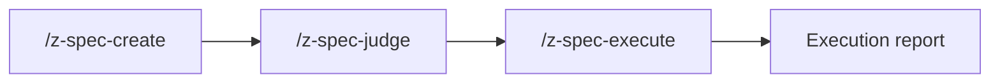

# Spec System

**Decompose complex initiatives into reviewable specs, judge them independently, then execute with adversarial verification.**

The Spec System turns a fuzzy "we should do X" into a phased plan you can read in a PR — markdown specs, dependency-ordered subtasks, definitions of done, and an independent judge that scores it before you spend a token on execution. When you run, every deliverable is checked by an agent that did not write the code.

## When to use this vs Plan mode

Cursor's built-in **Plan mode** works well for focused, single-session tasks. Reach for the Spec System when work is too complex for a single session — when you need **durable spec files** you can review in PRs, share with teammates, and iterate on before execution. The judge provides an independent quality gate, and adversarial verification ensures every deliverable is checked by an agent that didn't write the code.

Spec files are designed to be **committed alongside the feature code they describe** — the spec directory (index, subtasks, assessment, execution report) becomes a permanent record of *why* something was built, not just what changed. With optional memory-tooling integration, learnings from completed specs can be extracted and surfaced in future sessions, so your project builds institutional knowledge over time.

If the task can be described in a sentence and done in one pass, use Plan mode. If it needs a design discussion, has dependencies between subtasks, or would benefit from a second opinion — create a spec.

## Installation

**From the Cursor plugin marketplace (recommended)**

```bash
cursor plugin install zoto-spec-system
```

**Manual install**

Copy this plugin folder into your project's Cursor plugins directory (for example `.cursor/plugins/zoto-spec-system/`), preserving the internal layout (`.cursor-plugin/`, `agents/`, `skills/`, `commands/`, `rules/`, `hooks/`, `scripts/`, `src/`, `templates/`, and so on). Restart Cursor or reload the window if needed.

## Quick start

1. At the repository root, run **`/z-spec-init`** once to scaffold `.zoto/spec-system/config.yml` (every key is commented out by default — uncomment lines to override).
2. Open the command palette or chat and run **`/z-spec-create`**.
3. Follow the guided flow or pass a design doc path or short description as arguments.
4. Optionally run **`/z-spec-judge`** on the new spec, then **`/z-spec-execute`** when you are ready to implement.

## How It Works

Specs live under your configured `{specsDir}` as markdown (index plus subtasks). **`/z-spec-create`** scaffolds the tree (including `status/` pairs when enabled); **`/z-spec-judge`** writes assessments; **`/z-spec-execute`** runs subtasks in dependency order with adversarial verification and surfaces progress via live status files. See **Workflow overview** below for a lifecycle diagram.

## Live Status & No-Restart Configuration

During **`/z-spec-execute`**, every spawned subagent **owns** a paired execution-status file under `{specsDir}/<spec>/status/` (`subtask-NN-….status.yml` for machines; `subtask-NN-….status.md` for humans). While the run is active, the executor backgrounds **`tsx scripts/spec-aggregator.ts --watch`** for that spec’s lifetime: it polls `status/*.status.yml`, debounces, and rebuilds the spec-root **`status.md`** and **`status.yml`** whenever inputs change—without rewriting subtask-owned pairs.

**Token budget changes apply to the next spawned subagent without restarting the executor.** Live reload uses an **mtime-aware** config loader on **`.zoto/spec-system/config.yml`** so edits picked up before the next spawn or aggregator iteration apply without restarting the whole coordinator process.

Typical layout (filenames vary by date and feature slug):

```text
{specsDir}/
└── 20260506-feature-name/
    ├── status.md                      # Aggregator output (human)
    ├── status.yml                     # Aggregator output (machine)
    ├── status/
    │   ├── subtask-01-feature-task-20260506.status.md
    │   ├── subtask-01-feature-task-20260506.status.yml
    │   └── …
    ├── spec-feature-name-20260506.md
    ├── subtask-01-feature-name-setup-20260506.md
    └── …
```

### Editing the Token Budget Without Restarting

1. Open **`.zoto/spec-system/config.yml`** at the repo root.
2. Under `subagents`, raise or lower `tokenBudget` for `default` or a specific role (`generator`, `executor`, `judge`, `subtask`), or set `subagents.<role>.model`.
3. Save the file. **Token budget changes apply to the next spawned subagent without restarting the executor.**
4. Watch the next subtask’s `Token budget:` line in its paired **`status/*.status.yml`** `token_budget` field after the subagent starts— it reflects the resolved budget for that spawn.

Resolution follows **`subagents.<role>.tokenBudget ?? subagents.default.tokenBudget`** when a role omits its own budget.

### Live-Reloadable vs Fresh-Invocation Keys

- **Live-reloadable**: `subagents.*.tokenBudget`, `subagents.*.model`, `aggregator.pollIntervalMs`, `aggregator.debounceMs`, `aggregator.enabled`, `spec.parallelLimit`
- **Fresh-invocation-required**: `unitOfWork`, `specsDir`, `workDir`, `hooks.*`, `extensions.*`

### Standalone Aggregator CLI

From the repo root (substitute absolute `--spec-dir` / `--repo-root`):

```bash
pnpm --filter @zoto-agents/zoto-spec-system exec tsx scripts/spec-aggregator.ts --once --spec-dir /abs/path/to/spec --repo-root /abs/repo/root
pnpm --filter @zoto-agents/zoto-spec-system exec tsx scripts/spec-aggregator.ts --watch --spec-dir /abs/path/to/spec --repo-root /abs/repo/root
pnpm --filter @zoto-agents/zoto-spec-system exec tsx scripts/spec-aggregator.ts --validate-only --spec-dir /abs/path/to/spec --repo-root /abs/repo/root
```

Schema and binding details: [`docs/config-schema.md`](docs/config-schema.md), [`docs/status-schema.md`](docs/status-schema.md), [`docs/aggregator.md`](docs/aggregator.md).

## Configuration

Configuration lives at **`.zoto/spec-system/config.yml`** per the workspace-local plugin config directory convention (see [`.cursor/rules/zoto-plugin-conventions.mdc`](../../.cursor/rules/zoto-plugin-conventions.mdc)).

The Spec System reads its configuration from that path at the repo root. **No other path is supported.** Run `/z-spec-init` to scaffold the file; all other Spec System commands fail loudly when it is missing.

Full field reference, defaults, and path rules are in [`docs/config-schema.md`](docs/config-schema.md). Worked example: [`docs/example-config.yml`](docs/example-config.yml).

**Init template** (`templates/init-config.yml`) — every key is commented out, with the default value shown alongside:

```yaml
# unitOfWork: spec
# specsDir: specs
# workDir: specs/current

# spec:
#   maxSubtasks: 99
#   parallelLimit: 4
#   adversarialVerification: true

# subagents:
#   default:
#     tokenBudget: 200000
# ...
```

Uncomment any line to override. An empty file (or one with only commented lines) is valid: every setting has a documented default in the schema.

**Key fields**

| Field | Purpose |
|-------|---------|
| **`unitOfWork`** | Word used in prompts and hooks for a single work item (for example `spec`, `story`, `task`). Keeps messaging consistent with how your team talks about work. |
| **`specsDir`** | Root directory for spec folders, relative to the repo root. All spec indexes, subtasks, assessments, and execution reports live under here (unless you change it). |
| **`workDir`** | Directory the session-start hook watches for unprocessed items, relative to the repo root. Used for optional nudges when the backlog grows. |
| **`subagents.default.tokenBudget`** | Fallback token budget (integer) for spawned subagents when a role does not set its own. |
| **`subagents.<role>.tokenBudget`** | Per-role budget (`generator`, `executor`, `judge`, `subtask`); inherits from `default` when omitted. |
| **`subagents.<role>.model`** | Optional model slug override for that role; omit to use host routing. |
| **`aggregator.enabled`** | When true, `/z-spec-execute` may background the aggregator for specs with a `status/` directory. |
| **`aggregator.pollIntervalMs`** | Filesystem poll interval for `--watch` (live reload also consults config mtime). |
| **`aggregator.debounceMs`** | Debounce before recomputing aggregate status after changes. |
| **`aggregator.outputs.specStatusMd`** | Spec-root markdown filename for aggregate status (default `status.md`). |
| **`aggregator.outputs.specStatusYml`** | Spec-root YAML filename for aggregate status (default `status.yml`). |

## Commands

### `/z-spec-init`

Scaffold `.zoto/spec-system/config.yml` from the plugin's init template (`templates/init-config.yml`). Every key is commented out alongside the value the plugin would otherwise apply internally — uncomment lines to override.

- **No arguments** — Create the file. Aborts with a non-zero message if it already exists.
- **`--force`** — Overwrite an existing config (destructive; use with care).

### `/z-spec-create`

Create a structured engineering spec.

- **No arguments** — Interactive guided spec creation (clarifying questions, then file output).
- **`@path/to/design.md`** — Spec from one or more design or spec documents.
- **`"short description"`** — Spec from a free-text description.

Output is written under `{specsDir}/[yyyymmdd]-[feature-name]/` with a spec index and subtask files.

### `/z-spec-judge`

Independent assessment of the whole repository or of a specific spec.

- **No arguments** — Repository health assessment; report under `{specsDir}/assessment-repo-[yyyymmdd].md`.
- **Spec path** — Spec-focused assessment; report as `assessment-[feature-name]-[yyyymmdd].md` inside that spec directory.

**Verdicts** (from the assessment rubric):

| Verdict | Typical meaning |
|---------|------------------|
| **Approve** | Ready to proceed (for a spec: suitable for `/z-spec-execute`). |
| **Conditional** | Address listed findings before relying on the spec or repo state. |
| **Reject** | Rework required; major gaps or risks. |

After producing a spec assessment, the judge **offers to apply recommended fixes** directly to the spec files (index, subtasks, dependency graph). Accept to have issues resolved automatically, or decline to address them manually.

### `/z-spec-execute`

Runs the spec with phased subagent work, progress tracking, and **adversarial verification** (the dedicated `zoto-spec-judge` agent independently checks each subtask's deliverables). Supports targeting the latest spec, a spec directory, an index file path, and **`--resume`** after an interruption.

Produces `execution-report-[feature-name]-[yyyymmdd].md` in the spec directory.

## Agents

The plugin provides three specialized agents:

| Agent | Role |
|-------|------|
| **`zoto-spec-generator`** | Creates structured engineering specs from requirements, design docs, or free-text descriptions. |
| **`zoto-spec-executor`** | Executes specs by spawning subagents for each subtask, tracking progress, and coordinating adversarial verification. |
| **`zoto-spec-judge`** | Independent quality gate that performs adversarial verification, produces structured assessments, and offers to apply recommended fixes to spec files. |

## Components

| Path | Role |
|------|------|
| **`scripts/spec-status-roundtrip.ts`** | Validates and round-trips subtask `*.status.yml` ↔ `*.status.md` (including `heartbeat` for progress ticks). |
| **`scripts/spec-aggregator.ts`** | Reads `status/*.status.yml`, writes spec-root aggregate `status.{md,yml}`; supports `--once`, `--watch`, `--validate-only`. |

## Workflow overview

Typical lifecycle:

1. **Spec** — Decompose work, dependencies, and phases; write durable markdown under `{specsDir}`.
2. **Judge** — Get a second opinion on feasibility, risks, and completeness. Optionally apply fixes.
3. **Execute** — Run subtasks in order with verification and a final execution report.



You can loop back: a **Conditional** or **Reject** verdict usually means revising the spec or codebase before executing.

## Spec file structure

Specs are ordinary markdown in your repo. A feature spec directory usually looks like this:

```text
{specsDir}/
└── 20260403-feature-name/
    ├── spec-feature-name-20260403.md          # Index: phases, dependencies, definition of done
    ├── subtask-01-feature-name-setup-20260403.md
    ├── subtask-02-feature-name-impl-20260403.md
    ├── assessment-feature-name-20260403.md    # After /z-spec-judge (spec mode)
    └── execution-report-feature-name-20260403.md   # After /z-spec-execute
```

Repository-wide assessments (no spec path) are stored next to spec folders:

```text
{specsDir}/
└── assessment-repo-20260403.md
```

Naming patterns may vary slightly by date and feature slug; the commands and skills describe the exact conventions used when generating files.

## Extensions

### Memory system (optional)

The core Spec System plugin is **spec -> judge -> execute** only. An optional **memory** extension adds long-lived, structured facts extracted from completed work and recall in later sessions.

See **[Memory extension guide](docs/memory-extension-guide.md)** for concepts (`dream`, REM sleep, mindreader), suggested commands, and how to enable it via `extensions.memory` in config. The memory capability is delivered by a **separate plugin**, not bundled here.

## Development

### Build

Compile the hook script to JavaScript for distribution:

```bash
pnpm build
```

### Test

Run the test suite:

```bash
pnpm test
```

### Validate

Run pre-submission structural validation:

```bash
pnpm validate
```

### Local install

Install the plugin locally so Cursor discovers it:

```bash
pnpm install-local
```

## Uninstall and cleanup

1. **Remove the plugin** — Uninstall via Cursor's plugin UI, or delete the plugin folder from `.cursor/plugins/` if you installed manually.
2. **Remove local configuration** — Delete the `.zoto/spec-system/` directory at your repo root if you no longer want Spec System settings (including any `config.yml`).
3. **Spec data** — Directories under your configured `specsDir` (default `specs/`) are **your content**: keep them for history, archive them, or delete them as you prefer. Uninstalling the plugin does not remove them.

## License

This plugin is released under the [MIT License](LICENSE).
