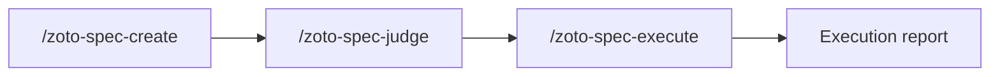

# Spec System

Structured engineering workflows for complex initiatives: turn ideas into specs, get an independent quality gate, then execute with adversarial verification.

## When to use this vs Plan mode

Cursor's built-in **Plan mode** works well for focused, single-session tasks. The Spec System is for work that's too complex for a single session — when you need **durable spec files** you can review in PRs, share with teammates, and iterate on before execution. The judge provides an independent quality gate, and adversarial verification ensures every deliverable is checked by an agent that didn't write the code.

Spec files are designed to be **committed alongside the feature code they describe** — the spec directory (index, subtasks, assessment, execution report) becomes a permanent record of *why* something was built, not just what changed. With the optional memory integration, learnings from completed specs are extracted and surfaced in future sessions, so your project builds institutional knowledge over time.

If the task can be described in a sentence and done in one pass, use Plan mode. If it needs a design discussion, has dependencies between subtasks, or would benefit from a second opinion — create a spec.

## Installation

**From the Cursor plugin marketplace (recommended)**

```bash
cursor plugin install zoto-spec-system
```

**Manual install**

Copy this plugin folder into your project's Cursor plugins directory (for example `.cursor/plugins/zoto-spec-system/`), preserving the internal layout (`.cursor-plugin/`, `agents/`, `skills/`, `commands/`, `rules/`, `hooks/`, and so on). Restart Cursor or reload the window if needed.

## Quick start

1. At the repository root, create `.zoto-spec-system/config.json` with a minimal configuration (see below).
2. Open the command palette or chat and run **`/zoto-spec-create`**.
3. Follow the guided flow or pass a design doc path or short description as arguments.
4. Optionally run **`/zoto-spec-judge`** on the new spec, then **`/zoto-spec-execute`** when you are ready to implement.

## Configuration

Full field reference, defaults, and path rules are in [`docs/config-schema.md`](docs/config-schema.md). A fuller example is in [`docs/example-config.json`](docs/example-config.json).

**Minimal template** (same as [`templates/config.json`](templates/config.json)):

```json
{
  "unitOfWork": "spec",
  "specsDir": "specs",
  "workDir": "specs/current"
}
```

**Key fields**

| Field | Purpose |
|-------|---------|
| **`unitOfWork`** | Word used in prompts and hooks for a single work item (for example `spec`, `story`, `task`). Keeps messaging consistent with how your team talks about work. |
| **`specsDir`** | Root directory for spec folders, relative to the repo root. All spec indexes, subtasks, assessments, and execution reports live under here (unless you change it). |
| **`workDir`** | Directory the session-start hook watches for unprocessed items, relative to the repo root. Used for optional nudges when the backlog grows. |
| **`spec.parallelLimit`** | Maximum execution subagents active at once during a phase. Defaults to `4`. |
| **`spec.preferredModel`** | Preferred model for spec agents and spawned subagents when supported. Defaults to `composer-2`. |

An empty `{}` is valid: every setting has a documented default in the schema.

## Commands

### `/zoto-spec-create`

Create a structured engineering spec.

- **No arguments** — Interactive guided spec creation (clarifying questions, then file output).
- **`@path/to/design.md`** — Spec from one or more design or spec documents.
- **`"short description"`** — Spec from a free-text description.

Output is written under `{specsDir}/[yyyymmdd]-[feature-name]/` with a spec index and subtask files.

### `/zoto-spec-judge`

Independent assessment of the whole repository or of a specific spec.

- **No arguments** — Repository health assessment; report under `{specsDir}/assessment-repo-[yyyymmdd].md`.
- **Spec path** — Spec-focused assessment; report as `assessment-[feature-name]-[yyyymmdd].md` inside that spec directory.

**Verdicts** (from the assessment rubric):

| Verdict | Typical meaning |
|---------|------------------|
| **Approve** | Ready to proceed (for a spec: suitable for `/zoto-spec-execute`). |
| **Conditional** | Address listed findings before relying on the spec or repo state. |
| **Reject** | Rework required; major gaps or risks. |

After producing a spec assessment, the judge **offers to apply recommended fixes** directly to the spec files (index, subtasks, dependency graph). Accept to have issues resolved automatically, or decline to address them manually.

### `/zoto-spec-execute`

Runs the spec with phased subagent work, progress tracking, and **adversarial verification** (the dedicated `zoto-spec-judge` agent independently checks each subtask's deliverables). Supports targeting the latest spec, a spec directory, an index file path, and **`--resume`** after an interruption.

Produces `execution-report-[feature-name]-[yyyymmdd].md` in the spec directory.

## Performance model

The Spec System optimizes complex work for end-to-end execution time with five rules:

1. **Minimize the critical path** — dependency edges are used only when a subtask needs another subtask's output.
2. **Right-size subtasks** — each subtask should have one ownership area, a small changed-file set, 2-5 deliverables, and a targeted test.
3. **Pack parallel phases** — independent subtasks are grouped up to `spec.parallelLimit` so execution slots stay useful.
4. **Use slot-filling execution** — `/zoto-spec-execute` starts the next ready subtask as soon as a slot opens instead of waiting for fixed batches.
5. **Prefer `composer-2` and focused checks** — spec agents default to `composer-2` and defer global test suites to final verification.

## Agents

The plugin provides three specialized agents:

| Agent | Role |
|-------|------|
| **`zoto-spec-generator`** | Creates structured engineering specs from requirements, design docs, or free-text descriptions. |
| **`zoto-spec-executor`** | Executes specs by spawning subagents for each subtask, tracking progress, and coordinating adversarial verification. |
| **`zoto-spec-judge`** | Independent quality gate that performs adversarial verification, produces structured assessments, and offers to apply recommended fixes to spec files. |

## Workflow overview

Typical lifecycle:

1. **Spec** — Decompose work, dependencies, and phases; write durable markdown under `{specsDir}`.
2. **Judge** — Get a second opinion on feasibility, risks, and completeness. Optionally apply fixes.
3. **Execute** — Run subtasks in order with verification and a final execution report.



You can loop back: a **Conditional** or **Reject** verdict usually means revising the spec or codebase before executing.

## Spec file structure

Specs are ordinary markdown in your repo. A feature spec directory usually looks like this:

```text
{specsDir}/
└── 20260403-feature-name/
    ├── spec-feature-name-20260403.md          # Index: phases, dependencies, definition of done
    ├── subtask-01-feature-name-setup-20260403.md
    ├── subtask-02-feature-name-impl-20260403.md
    ├── assessment-feature-name-20260403.md    # After /zoto-spec-judge (spec mode)
    └── execution-report-feature-name-20260403.md   # After /zoto-spec-execute
```

Repository-wide assessments (no spec path) are stored next to spec folders:

```text
{specsDir}/
└── assessment-repo-20260403.md
```

Naming patterns may vary slightly by date and feature slug; the commands and skills describe the exact conventions used when generating files.

## Extensions

### Memory system (optional)

The core Spec System plugin is **spec -> judge -> execute** only. An optional **memory** extension adds long-lived, structured facts extracted from completed work and recall in later sessions.

See **[Memory extension guide](docs/memory-extension-guide.md)** for concepts (`dream`, REM sleep, mindreader), suggested commands, and how to enable it via `extensions.memory` in config. The memory capability is delivered by a **separate plugin**, not bundled here.

## Development

### Build

Compile the hook script to JavaScript for distribution:

```bash
pnpm build
```

### Test

Run the test suite:

```bash
pnpm test
```

### Validate

Run pre-submission structural validation:

```bash
pnpm validate
```

### Local install

Install the plugin locally so Cursor discovers it:

```bash
pnpm install-local
```

## Uninstall and cleanup

1. **Remove the plugin** — Uninstall via Cursor's plugin UI, or delete the plugin folder from `.cursor/plugins/` if you installed manually.
2. **Remove local configuration** — Delete the `.zoto-spec-system/` directory at your repo root if you no longer want Spec System settings (including any `config.json`).
3. **Spec data** — Directories under your configured `specsDir` (default `specs/`) are **your content**: keep them for history, archive them, or delete them as you prefer. Uninstalling the plugin does not remove them.

## License

This plugin is released under the [MIT License](LICENSE).
