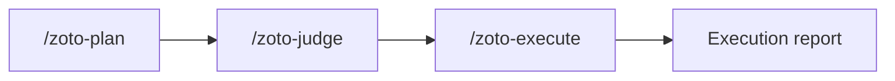

# Spec System

Structured engineering workflows for complex initiatives: turn ideas into plans, get an independent quality gate, then execute with adversarial verification.

## Installation

**From the Cursor plugin marketplace (recommended)**

```bash
cursor plugin install zoto-spec-system
```

**Manual install**

Copy this plugin folder into your project's Cursor plugins directory (for example `.cursor/plugins/zoto-spec-system/`), preserving the internal layout (`.cursor-plugin/`, `agents/`, `skills/`, `commands/`, `rules/`, `hooks/`, and so on). Restart Cursor or reload the window if needed.

## Quick start

1. At the repository root, create `.spec-system/config.json` with a minimal configuration (see below).
2. Open the command palette or chat and run **`/zoto-plan`**.
3. Follow the guided flow or pass a design doc path or short description as arguments.
4. Optionally run **`/zoto-judge`** on the new plan, then **`/zoto-execute`** when you are ready to implement.

## Configuration

Full field reference, defaults, and path rules are in [`docs/config-schema.md`](docs/config-schema.md). A fuller example is in [`docs/example-config.json`](docs/example-config.json).

**Minimal template** (same as [`templates/config.json`](templates/config.json)):

```json
{
  "unitOfWork": "spec",
  "plansDir": "plans",
  "workDir": "specs/current"
}
```

**Key fields**

| Field | Purpose |
|-------|---------|
| **`unitOfWork`** | Word used in prompts and hooks for a single work item (for example `spec`, `story`, `task`). Keeps messaging consistent with how your team talks about work. |
| **`plansDir`** | Root directory for plan folders, relative to the repo root. All plan indexes, subtasks, assessments, and execution reports live under here (unless you change it). |
| **`workDir`** | Directory the session-start hook watches for unprocessed items, relative to the repo root. Used for optional nudges when the backlog grows. |

An empty `{}` is valid: every setting has a documented default in the schema.

## Commands

### `/zoto-plan`

Create a structured engineering plan.

- **No arguments** — Interactive guided planning (clarifying questions, then file output).
- **`@path/to/design.md`** — Plan from one or more design or spec documents.
- **`"short description"`** — Plan from a free-text description.

Output is written under `{plansDir}/[yyyymmdd]-[feature-name]/` with a plan index and subtask files.

### `/zoto-judge`

Independent assessment of the whole repository or of a specific plan.

- **No arguments** — Repository health assessment; report under `{plansDir}/assessment-repo-[yyyymmdd].md`.
- **Plan path** — Plan-focused assessment; report as `assessment-[feature-name]-[yyyymmdd].md` inside that plan directory.

**Verdicts** (from the assessment rubric):

| Verdict | Typical meaning |
|---------|------------------|
| **Approve** | Ready to proceed (for a plan: suitable for `/zoto-execute`). |
| **Conditional** | Address listed findings before relying on the plan or repo state. |
| **Reject** | Rework required; major gaps or risks. |

### `/zoto-execute`

Runs the plan with phased subagent work, progress tracking, and **adversarial verification** (the dedicated `zoto-spec-judge` agent independently checks each subtask's deliverables). Supports targeting the latest plan, a plan directory, an index file path, and **`--resume`** after an interruption.

Produces `execution-report-[feature-name]-[yyyymmdd].md` in the plan directory.

## Workflow overview

Typical lifecycle:

1. **Plan** — Decompose work, dependencies, and phases; write durable markdown under `{plansDir}`.
2. **Judge** — Get a second opinion on feasibility, risks, and completeness.
3. **Execute** — Run subtasks in order with verification and a final execution report.



You can loop back: a **Conditional** or **Reject** verdict usually means revising the plan or codebase before executing.

## Plan file structure

Plans are ordinary markdown in your repo. A feature plan directory usually looks like this:

```text
{plansDir}/
└── 20260403-feature-name/
    ├── plan-feature-name-20260403.md          # Index: phases, dependencies, definition of done
    ├── subtask-01-feature-name-setup-20260403.md
    ├── subtask-02-feature-name-impl-20260403.md
    ├── assessment-feature-name-20260403.md    # After /zoto-judge (plan mode)
    └── execution-report-feature-name-20260403.md   # After /zoto-execute
```

Repository-wide assessments (no plan path) are stored next to plan folders:

```text
{plansDir}/
└── assessment-repo-20260403.md
```

Naming patterns may vary slightly by date and feature slug; the commands and skills describe the exact conventions used when generating files.

## Extensions

### Memory system (optional)

The core Spec System plugin is **plan -> judge -> execute** only. An optional **memory** extension adds long-lived, structured facts extracted from completed work and recall in later sessions.

See **[Memory extension guide](docs/memory-extension-guide.md)** for concepts (`dream`, REM sleep, mindreader), suggested commands, and how to enable it via `extensions.memory` in config. The memory capability is delivered by a **separate plugin**, not bundled here.

## Development

### Build

Compile the hook script to JavaScript for distribution:

```bash
pnpm build
```

### Test

Run the test suite:

```bash
pnpm test
```

### Validate

Run pre-submission structural validation:

```bash
pnpm validate
```

### Local install

Install the plugin locally so Cursor discovers it:

```bash
pnpm install-local
```

## Uninstall and cleanup

1. **Remove the plugin** — Uninstall via Cursor's plugin UI, or delete the plugin folder from `.cursor/plugins/` if you installed manually.
2. **Remove local configuration** — Delete the `.spec-system/` directory at your repo root if you no longer want Spec System settings (including any `config.json`).
3. **Plan data** — Directories under your configured `plansDir` (default `plans/`) are **your content**: keep them for history, archive them, or delete them as you prefer. Uninstalling the plugin does not remove them.

## License

This plugin is released under the [MIT License](LICENSE).
