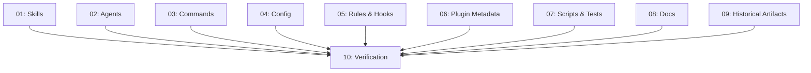

# Spec: Plan-to-Spec Rename

## Status
Ready for Review

## Overview
Globally rename the Spec System's internal terminology from "plan" to "spec". This covers skill IDs, agent names, command names, config keys, default directory names, artifact filename patterns, and all prose references across the plugin. Additionally, introduce a dedicated `zoto-spec-executor` agent to manage execution flow (currently handled by the planner agent). Historical plan artifacts under the plans directory are also renamed.

## Key Decisions
- **Commands**: `/zoto-plan` → `/zoto-spec-create`, `/zoto-execute` → `/zoto-spec-execute`, `/zoto-judge` → `/zoto-spec-judge`
- **Agents**: `zoto-spec-planner` → `zoto-spec-generator` (focuses on spec creation), NEW `zoto-spec-executor` (manages execution flow), `zoto-spec-judge` stays
- **Skills**: `zoto-create-plan` → `zoto-create-spec`, `zoto-execute-plan` → `zoto-execute-spec`, `zoto-judge-plan` → `zoto-judge-spec`
- **Config keys**: `plansDir` → `specsDir`, `plan.maxSubtasks` → `spec.maxSubtasks`, `plan.parallelLimit` → `spec.parallelLimit`, `plan.adversarialVerification` → `spec.adversarialVerification`
- **Default directory**: `plans` → `specs`
- **Artifact pattern**: `plan-[feature]-[date].md` → `spec-[feature]-[date].md`
- **Historical artifacts**: Rename files and update content in `specs/20260403-zoto-spec-system/` (directory moved from `plans/`)
- **Agent responsibility split**: `zoto-spec-generator` handles creation (zoto-create-spec skill), `zoto-spec-executor` handles execution (zoto-execute-spec skill), `zoto-spec-judge` handles assessment (zoto-judge-spec skill)

## Requirements
1. Every file and directory containing "plan" in its name within the plugin must be renamed to use "spec" (or the user-chosen equivalent)
2. All three commands renamed: `/zoto-spec-create`, `/zoto-spec-execute`, `/zoto-spec-judge`
3. Every reference to old identifiers in file contents must be updated to use new identifiers
4. New `zoto-spec-executor` agent created with execution expertise extracted from the current planner agent
5. `zoto-spec-generator` agent narrowed to focus on creation/planning only
6. Config schema keys must be renamed consistently
7. Tests and validation scripts must be updated to expect new names and new agent
8. All cross-references between files must remain valid after renaming
9. The existing test suite must pass after all changes
10. No linter errors introduced
11. The `zoto-create-spec` skill's final step automatically spawns a `zoto-spec-judge` subagent to review the spec before declaring it ready

## Rename Mapping (Canonical Reference)

### Identifiers
| Old | New |
|-----|-----|
| `zoto-create-plan` | `zoto-create-spec` |
| `zoto-execute-plan` | `zoto-execute-spec` |
| `zoto-judge-plan` | `zoto-judge-spec` |
| `zoto-spec-planner` | `zoto-spec-generator` |
| `/zoto-plan` | `/zoto-spec-create` |
| `/zoto-execute` | `/zoto-spec-execute` |
| `/zoto-judge` | `/zoto-spec-judge` |
| `plansDir` | `specsDir` |
| `plan.maxSubtasks` | `spec.maxSubtasks` |
| `plan.parallelLimit` | `spec.parallelLimit` |
| `plan.adversarialVerification` | `spec.adversarialVerification` |
| `plan-[feature]-[date].md` | `spec-[feature]-[date].md` |

### New Artifacts
| Artifact | Description |
|----------|-------------|
| `agents/zoto-spec-executor.md` | New agent for execution flow — extracts execution expertise from the former planner agent |

### File/Directory Renames
| Old Path | New Path |
|----------|----------|
| `skills/zoto-create-plan/` | `skills/zoto-create-spec/` |
| `skills/zoto-execute-plan/` | `skills/zoto-execute-spec/` |
| `skills/zoto-judge-plan/` | `skills/zoto-judge-spec/` |
| `commands/zoto-plan.md` | `commands/zoto-spec-create.md` |
| `commands/zoto-execute.md` | `commands/zoto-spec-execute.md` |
| `commands/zoto-judge.md` | `commands/zoto-spec-judge.md` |
| `agents/zoto-spec-planner.md` | `agents/zoto-spec-generator.md` |
| `plans/` (top-level) | `specs/` |
| `plans/.../plan-zoto-spec-system-20260403.md` | `specs/.../spec-zoto-spec-system-20260403.md` |
| `plans/.../subtask-04-spec-system-create-plan-skill-20260403.md` | `specs/.../subtask-04-spec-system-create-spec-skill-20260403.md` |
| `plans/.../subtask-05-spec-system-judge-plan-skill-20260403.md` | `specs/.../subtask-05-spec-system-judge-spec-skill-20260403.md` |
| `plans/.../subtask-06-spec-system-execute-plan-skill-20260403.md` | `specs/.../subtask-06-spec-system-execute-spec-skill-20260403.md` |

## Subtask Manifest

| ID | File | Subagent | Dependencies | Phase | Status |
|----|------|----------|-------------|-------|--------|
| 01 | `subtask-01-plan-to-spec-rename-skills-20260405.md` | generalPurpose | — | 1 | Done |
| 02 | `subtask-02-plan-to-spec-rename-agents-20260405.md` | generalPurpose | — | 1 | Done |
| 03 | `subtask-03-plan-to-spec-rename-commands-20260405.md` | generalPurpose | — | 1 | Done |
| 04 | `subtask-04-plan-to-spec-rename-config-20260405.md` | generalPurpose | — | 1 | Done |
| 05 | `subtask-05-plan-to-spec-rename-rules-hooks-20260405.md` | generalPurpose | — | 1 | Done |
| 06 | `subtask-06-plan-to-spec-rename-plugin-metadata-20260405.md` | generalPurpose | — | 1 | Done |
| 07 | `subtask-07-plan-to-spec-rename-scripts-tests-20260405.md` | generalPurpose | — | 1 | Done |
| 08 | `subtask-08-plan-to-spec-rename-docs-20260405.md` | generalPurpose | — | 1 | Done |
| 09 | `subtask-09-plan-to-spec-rename-historical-20260405.md` | generalPurpose | — | 1 | Done |
| 10 | `subtask-10-plan-to-spec-rename-verification-20260405.md` | generalPurpose | 01, 02, 03, 04, 05, 06, 07, 08, 09 | 2 | Done |

## Subtask Dependency Graph

## Execution Order

### Phase 1 (Parallel)
| ID | Subagent | Description |
|----|----------|-------------|
| 01 | generalPurpose | Rename skill directories and update skill file contents |
| 02 | generalPurpose | Rename agent file, create zoto-spec-executor agent, update all agent file contents |
| 03 | generalPurpose | Rename all three command files and update command file contents |
| 04 | generalPurpose | Update config schema, example config, and template config |
| 05 | generalPurpose | Update rules and hook scripts |
| 06 | generalPurpose | Update plugin.json and package.json |
| 07 | generalPurpose | Update validate-plugin.ts and plugin.test.ts |
| 08 | generalPurpose | Update README, CHANGELOG, marketplace.json, memory guide |
| 09 | generalPurpose | Rename plans/ directory to specs/ and update historical artifacts |

### Phase 2 (after Phase 1)
| ID | Subagent | Description |
|----|----------|-------------|
| 10 | shell | Run tests, check lints, verify all cross-references |

## Definition of Done
- [x] All subtasks completed
- [x] All tests passing (the project's test suite) — 28/28 tests pass
- [x] No linter errors in modified files
- [x] No remaining references to old identifiers in plugin source files
- [x] All cross-references between files are valid
- [x] New `zoto-spec-executor` agent exists and is properly wired
- [x] Documentation updated

## Execution Notes
- **Executed**: 2026-04-05
- **Phase 1**: 9 subtasks executed in 3 batches of 4/4/1 (parallel limit 4)
- **Phase 2**: 1 verification subtask — 28/28 tests pass, 47/47 validation checks pass
- **Adversarial verification**: All 10 subtasks verified by independent zoto-spec-judge instances
- **No issues found**: All judges returned "Verified" with no items requiring remediation
