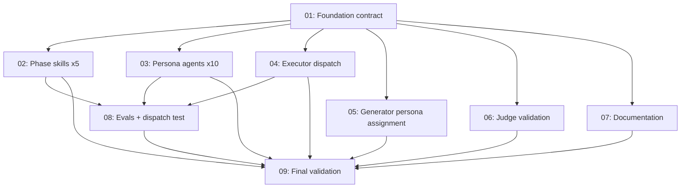

# Spec: zoto-spec-system SDLC Personas (Tier 1)

## Status
Draft

## Overview

Extend `plugins/zoto-spec-system/` with **10 Tier 1 SDLC persona subagents** so the
executor can dispatch each subtask to a domain specialist instead of a generic
`generalPurpose` worker. Today the plugin only ships three workflow agents
(`zoto-spec-generator`, `zoto-spec-executor`, `zoto-spec-judge`) which coordinate the
process but bring no domain expertise to individual subtasks.

The 10 personas are:

| Persona | Phase skill | One-line responsibility |
|---|---|---|
| `zoto-product-analyst` | `zoto-skill-sdlc-discovery` | Requirements, user stories, acceptance criteria |
| `zoto-software-architect` | `zoto-skill-sdlc-design` | High-level design, ADRs, threat-model framing |
| `zoto-backend-engineer` | `zoto-skill-sdlc-implementation` | Server-side code, APIs, data layer |
| `zoto-frontend-engineer` | `zoto-skill-sdlc-implementation` | Client-side code, UI, accessibility-aware markup |
| `zoto-test-engineer` | `zoto-skill-sdlc-quality` | Test plans, unit/integration/e2e tests, fixtures |
| `zoto-devops-engineer` | `zoto-skill-sdlc-operations` | CI/CD pipelines, build/release, infra-as-code |
| `zoto-technical-writer` | `zoto-skill-sdlc-operations` | README, runbooks, public docs, changelog framing |
| `zoto-security-engineer` | `zoto-skill-sdlc-design` (threat model) + `zoto-skill-sdlc-quality` (review) | Threat models, security reviews, secure-defaults |
| `zoto-sre` | `zoto-skill-sdlc-operations` | Reliability, observability, alerts, post-incident learnings |
| `zoto-code-reviewer` | `zoto-skill-sdlc-quality` | Style, correctness, design-review checklists |

Dispatch is driven by a new **required `persona:` frontmatter field** on every
subtask file. The `zoto-spec-generator` chooses the persona during `/z-spec-create`
based on subtask content (with user confirmation). The `zoto-spec-executor` reads
`persona:` and uses `persona-<name>` as the role key when calling the
`spec-spawn-prefix` CLI, so `subagents.persona-<name>.tokenBudget` /
`subagents.persona-<name>.model` from `.zoto/spec-system/config.yml` are honoured
automatically.

This is a **breaking change**: subtasks without `persona:` fail loudly with a
clear error naming the offending file. There is no migration script. The
plugin version bumps from `0.7.0` → `1.0.0`, marking the Spec System as
**stable** with persona dispatch as the headline feature.

The contract is anchored by a new JSON Schema at
`plugins/zoto-spec-system/templates/schema/subtask-spec.schema.json` that
defines the required `persona:` field (enum of the 10 Tier 1 ids) and any
other subtask-frontmatter invariants. The executor, judge, and
`spec-status-roundtrip scaffold` parsers all read this schema as the single
source of truth (parser-level enforcement remains; the schema is canonical).

## Key Decisions

- **D1: Tier 1 only.** Ship the 10 personas listed above. The 9 Tier 2 personas
  (data-engineer, ux-designer, a11y, performance, ml, migration, compliance,
  finops, release-manager) are explicitly **out of scope** and recorded in a new
  *Roadmap* section of the plugin README only.
- **D2: Required `persona:` frontmatter on every subtask.** Subtasks without it
  cause the executor to fail with a clear error naming the file. No migration
  script; CHANGELOG records this as a breaking change. (Existing subtask files
  in flight outside this spec are user-managed.)
- **D3: Dispatch via `spec-spawn-prefix` role key.** The executor maps
  `persona: zoto-backend-engineer` → `--role persona-zoto-backend-engineer` so
  `subagents.persona-<name>.tokenBudget` / `.model` flow through the existing
  config loader and live-reload pipeline without a parallel mechanism.
  - Implementation note: widen the role union in
    `src/spawn-prompt.ts` (`SpawnContext["role"]`), `src/config-loader.ts`
    (`resolveSubagentBudget`), and `scripts/spec-spawn-prefix.ts` (CLI
    `validRoles` whitelist) to accept `persona-*` keys. The config JSON
    Schema already permits arbitrary persona keys via
    `subagents.additionalProperties: true` — no change to
    `config.schema.json` is required. The subtask-frontmatter contract is
    instead anchored by a new schema (see D11).
- **D4: Five shared phase skills, not one-per-persona.** Personas are *small*
  by convention (target ~30–80 lines, **hard cap ≤ 200 lines**); all
  checklists, templates, deliverable formats, and step-by-step workflows live
  in the phase skills:
  - `zoto-skill-sdlc-discovery/`
  - `zoto-skill-sdlc-design/`
  - `zoto-skill-sdlc-implementation/`
  - `zoto-skill-sdlc-quality/`
  - `zoto-skill-sdlc-operations/`
  Each agent file is one paragraph of role identity + one paragraph of "stay in
  lane" guardrails + a pointer to its phase skill(s).
- **D5: Persona auto-assignment with user override.** During `/z-spec-create`,
  `zoto-spec-generator` proposes a persona per subtask using simple content +
  path heuristics (UI/`*.tsx` → `zoto-frontend-engineer`; tests-only → `zoto-test-engineer`;
  docs-only → `zoto-technical-writer`; CI/`workflow` → `zoto-devops-engineer`;
  default → `zoto-backend-engineer`). The user is then prompted (via
  `askQuestion` if interactive, `needs_user_input` if subagent) to confirm or
  override the full assignment table.
- **D6: Judge enforces the contract.** `zoto-spec-judge` (Mode 3 spec
  assessment, via the `zoto-judge-spec` skill) fails any spec whose subtasks
  are missing `persona:` or whose `persona:` is not one of the 10 known Tier 1
  values.
- **D7: `scaffold` script learns the contract.** The
  `scripts/spec-status-roundtrip.ts scaffold` subcommand parses YAML
  frontmatter from each subtask file and writes `assigned_agent: <persona>`
  into the paired `.status.yml`, falling back to the `**Assigned Subagent**`
  Metadata bullet only if frontmatter is absent (which now triggers a clear
  error before falling back).
- **D8: Eval harness — agent smoke + 1 dispatch integration test.** Per
  persona, ship a smoke test under `plugins/zoto-spec-system/agents/evals/<persona>.test.ts`
  asserting the agent file loads, has valid frontmatter (`name`,
  `description`), and references its phase skill(s) in the body. Add one
  dispatch integration test under `plugins/zoto-spec-system/tests/integration/persona-dispatch.test.ts`
  that loads a fixture subtask with `persona: zoto-backend-engineer` and
  verifies the executor's spawn call resolves `persona-zoto-backend-engineer`
  via the spawn-prefix CLI + config. Each phase skill ships
  `evals/evals.json` with ≥2 cases per `.cursor/rules/zoto-plugin-conventions.mdc`.
- **D9: Documentation footprint.** Update `plugins/zoto-spec-system/README.md`
  with a new *SDLC Personas* section + a *Roadmap* section listing Tier 2 as
  future work. Update `plugins/zoto-spec-system/docs/config-schema.md` with the
  10 `subagents.persona-<name>.tokenBudget` / `.model` keys. Update
  `plugins/zoto-spec-system/templates/init-config.yml` with commented examples
  for each persona. Update `plugins/zoto-spec-system/rules/zoto-spec-system.mdc`
  to reference the persona dispatch contract.
- **D10: Version bump → `1.0.0` (stability milestone).** Bump both
  `package.json` and `.cursor-plugin/plugin.json` in lockstep; record the
  breaking change in `plugins/zoto-spec-system/CHANGELOG.md` under a new
  `1.0.0` entry. The CHANGELOG narrative frames `v1.0.0` as the Spec System
  reaching stability, with SDLC persona dispatch as the headline feature, and
  retains a `### Breaking` subsection enumerating the required `persona:`
  frontmatter contract.
- **D11: New `subtask-spec.schema.json` as the canonical contract.** Add
  `plugins/zoto-spec-system/templates/schema/subtask-spec.schema.json`
  defining required `persona:` (enum of 10 Tier 1 ids) plus any other
  invariants discovered during exploration (e.g. optional `phase`, `depends_on`,
  `agent_overrides`). The executor, judge, and
  `spec-status-roundtrip scaffold` parsers read this schema as the single
  source of truth. Subtask 01 ships the schema; subtask 09 validates a fixture
  subtask markdown against it.

## Requirements

1. **Persona contract.** Every subtask file MUST declare a top-of-file YAML
   frontmatter with a `persona:` field whose value is one of the 10 Tier 1
   personas. Existing subtask Metadata bullet lists are preserved — frontmatter
   is additive.
2. **Spawn dispatch.** Calling `spec-spawn-prefix --role persona-<name>` with
   `subagents.persona-<name>.tokenBudget = N` in config MUST emit a prefix
   containing `Token budget: N.`. Falling back to `subagents.default` when the
   persona key is absent MUST also work.
3. **Generator UX.** During `/z-spec-create`, the generator MUST propose a
   persona for every drafted subtask and ask the user to confirm/override the
   full table before writing files.
4. **Judge enforcement.** During `/z-spec-judge` (or any Mode 3 invocation of
   `zoto-spec-judge`), any subtask missing `persona:` or carrying a non-Tier-1
   value MUST surface as a critical finding that blocks "Approve".
5. **Agent file size.** Each persona agent file under
   `plugins/zoto-spec-system/agents/` MUST be ≤ 200 lines (frontmatter
   included). Soft target is ~30–80 lines; the cap exists to give room for
   substantive role identity, scope guardrails, deliverable expectations, and
   one or two worked examples — but anything more belongs in the phase skill.
6. **Phase skill conventions.** Each phase skill MUST follow
   `.cursor/rules/zoto-plugin-conventions.mdc`: `SKILL.md` < 500 lines, valid
   `name` / `description` frontmatter, directory name == `name`, and
   `evals/evals.json` with ≥ 2 cases.
7. **Test gate.** `pnpm test`, `node scripts/validate-template.mjs`, and
   `node scripts/validate-skills.mjs` MUST all pass after the change.
8. **No Tier 2 leakage.** Tier 2 personas are mentioned only in the README
   *Roadmap* section. They MUST NOT appear in agents, skills, schemas,
   `init-config.yml`, the rule file, or anywhere else.

## Subtask Manifest

| ID | File | Subagent | Dependencies | Phase | Status |
|----|------|----------|--------------|-------|--------|
| 01 | `subtask-01-zoto-spec-system-sdlc-personas-foundation-contract-20260527.md` | generalPurpose | — | 1 | Pending |
| 02 | `subtask-02-zoto-spec-system-sdlc-personas-phase-skills-20260527.md` | generalPurpose | 01 | 2 | Pending |
| 03 | `subtask-03-zoto-spec-system-sdlc-personas-persona-agents-20260527.md` | generalPurpose | 01 | 2 | Pending |
| 04 | `subtask-04-zoto-spec-system-sdlc-personas-executor-dispatch-20260527.md` | generalPurpose | 01 | 2 | Pending |
| 05 | `subtask-05-zoto-spec-system-sdlc-personas-generator-persona-assignment-20260527.md` | generalPurpose | 01 | 2 | Pending |
| 06 | `subtask-06-zoto-spec-system-sdlc-personas-judge-validation-20260527.md` | generalPurpose | 01 | 2 | Pending |
| 07 | `subtask-07-zoto-spec-system-sdlc-personas-documentation-20260527.md` | generalPurpose | 01 | 2 | Pending |
| 08 | `subtask-08-zoto-spec-system-sdlc-personas-evals-20260527.md` | generalPurpose | 02, 03, 04 | 3 | Pending |
| 09 | `subtask-09-zoto-spec-system-sdlc-personas-final-validation-20260527.md` | generalPurpose | 02, 03, 04, 05, 06, 07, 08 | 4 | Pending |

## Subtask Dependency Graph

## Execution Order

### Phase 1
| ID | Subagent | Description |
|----|----------|-------------|
| 01 | generalPurpose | Foundation: introduce `persona:` frontmatter contract via new `subtask-spec.schema.json`, widen `spec-spawn-prefix` role union, update `scaffold` to parse frontmatter, update `init-config.yml` + JSON-schema docs, CHANGELOG `1.0.0` entry, version bump. |

### Phase 2 (parallel after Phase 1)
Note: `spec.parallelLimit` defaults to `4`; the executor will queue surplus subtasks and run them as slots free up.

| ID | Subagent | Description |
|----|----------|-------------|
| 02 | generalPurpose | Scaffold the 5 phase skills (`zoto-skill-sdlc-discovery|design|implementation|quality|operations`) with `SKILL.md` + `evals/evals.json` (≥2 cases each). |
| 03 | generalPurpose | Create the 10 persona agent files (target ~30–80 lines, hard cap ≤ 200 lines) under `plugins/zoto-spec-system/agents/`, each pointing to its phase skill(s). |
| 04 | generalPurpose | Update `zoto-spec-executor.md` to read `persona:` frontmatter and dispatch via `spec-spawn-prefix --role persona-<name>`; hard-error on missing/invalid frontmatter. |
| 05 | generalPurpose | Update `zoto-spec-generator.md` and `zoto-create-spec` skill to auto-assign personas with user confirmation/override. |
| 06 | generalPurpose | Update `zoto-spec-judge.md` and `zoto-judge-spec` skill to fail specs missing `persona:` or carrying non-Tier-1 values. |
| 07 | generalPurpose | Update `README.md` (SDLC Personas + Roadmap), `docs/config-schema.md` (10 persona keys), and `rules/zoto-spec-system.mdc` (persona dispatch row in TodoWrite table + invariants). |

### Phase 3 (after Phase 2 — needs skills, agents, executor)
| ID | Subagent | Description |
|----|----------|-------------|
| 08 | generalPurpose | Add per-persona smoke evals under `agents/evals/<persona>.test.ts` and one dispatch integration test under `tests/integration/persona-dispatch.test.ts`. |

### Phase 4 (after everything)
| ID | Subagent | Description |
|----|----------|-------------|
| 09 | generalPurpose | Run `pnpm test`, `node scripts/validate-template.mjs`, `node scripts/validate-skills.mjs` from the repo root and the plugin; fix anything that breaks; verify acceptance criteria; record outcomes in spec execution notes. |

## Definition of Done
- [ ] All 10 persona agent files exist under `plugins/zoto-spec-system/agents/` with valid frontmatter, ≤ 200 lines each (soft target ~30–80), and a pointer to their phase skill(s).
- [ ] All 5 phase skills exist under `plugins/zoto-spec-system/skills/` with valid `SKILL.md` (< 500 lines) and `evals/evals.json` (≥ 2 cases each).
- [ ] New `templates/schema/subtask-spec.schema.json` defines the required `persona:` enum and is consumed by the executor, judge, and `scaffold` parsers as the single source of truth.
- [ ] `zoto-spec-executor` reads `persona:` from subtask frontmatter (validated against the new schema), dispatches via `spec-spawn-prefix --role persona-<name>`, and fails loudly on missing/invalid frontmatter.
- [ ] `zoto-spec-generator` auto-assigns persona during `/z-spec-create` with user confirmation; `zoto-spec-judge` flags missing/invalid `persona:` as a critical finding.
- [ ] `spec-spawn-prefix` CLI accepts `persona-*` role keys; TS unions widened; JSON Schema docs updated; `init-config.yml` shows commented examples for the 10 persona keys.
- [ ] 10 persona smoke tests + 1 dispatch integration test + 1 subtask-spec schema validation test all pass.
- [ ] README documents SDLC Personas + Roadmap; CHANGELOG records the breaking change at `1.0.0` (framed as the stability milestone); both `package.json` and `.cursor-plugin/plugin.json` bumped to `1.0.0`.
- [ ] `pnpm test`, `node scripts/validate-template.mjs`, and `node scripts/validate-skills.mjs` all pass.
- [ ] No Tier 2 personas appear anywhere except the README Roadmap.
- [ ] No linter errors in modified files.

## Execution Notes
_(filled in during/after execution by the executor)_
