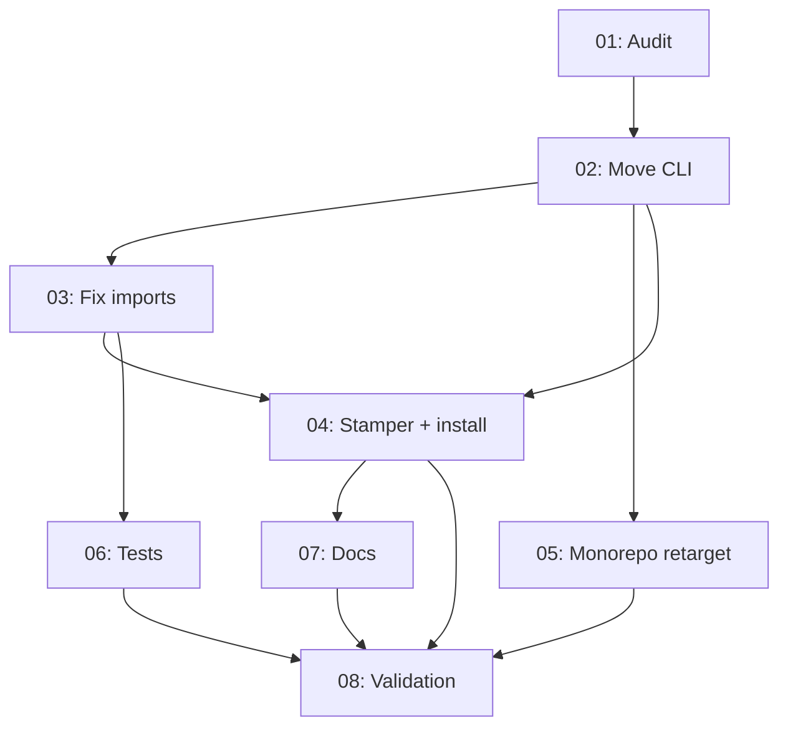

# Spec Assessment: Eval Plugin Self-Contained Scripts Consolidation

**Target**: `specs/20260531-eval-plugin-self-contained-scripts/spec-eval-plugin-self-contained-scripts-20260531.md`  
**Assessed**: 2026-05-31  
**Verdict**: Conditional

## Scores

| Dimension | Score | Notes |
|-----------|-------|-------|
| Completeness | 4/5 | Strong move/delete lists and KD decisions; gaps on pytest `evals/test_*.ts`, orphan `eval:bootstrap-llm-code`, `site/eval-system/`, and `tsconfig` engine coverage |
| Feasibility | 4/5 | Scope is large but realistic; circular-import and 2k-line script moves are tractable with subtask 03 guidance |
| Structure | 3/5 | Phase-3 parallel **03 + 05** can delete root scripts before `engine/update.ts` retargets; minor doc-phase coupling unstated |
| Specificity | 4/5 | Concrete grep gates, file lists, and smoke commands; `eval-ensure-host` and parity-path resolution remain slightly ambiguous |
| Risk Awareness | 3/5 | Circular imports noted; missing race on 03/05, dirty working tree, and broad pytest surface |
| Convention Compliance | 5/5 | Mirrors `zoto-spec-system` self-contained pattern; `.zoto/eval-system/` layout and plugin conventions respected |
| **Overall** | **3.8/5** | **Conditional** |

## Codebase Verification Summary

Independent inspection confirms the spec’s problem statement is accurate:

| Assumption | Verified state |
|------------|------------------|
| Host eval CLI at repo root | Present: `scripts/eval-analyse.ts` (2063 lines), `eval-stamp.ts`, `eval-orchestrate.ts`, `eval-discover.ts` (495 lines), `eval-gc.ts`, `eval-cleanup-vendored.ts`, `eval-cleanup-stale.ts`, `check-analyser-payload-parity.ts`, `test.py`, `eval-ensure-host.ts` |
| Stale plugin forks | Present: `plugins/zoto-eval-system/scripts/eval-discover.ts` (292 lines), `eval-update.ts` (593 lines) |
| Circular imports | `engine/update.ts` imports `../../../scripts/eval-analyse.ts` and `eval-stamp.ts`; root scripts import `../plugins/zoto-eval-system/src/…` |
| Stamper sources from monorepo root | `stamp-host-layout.ts` line 140: `join(agentsRoot, "scripts", name)` with default `ZOTO_AGENTS_ROOT = resolve(PLUGIN_ROOT, "../..")` |
| `install-local` omits `engine/` and `src/` | `PLUGIN_DIRS` lists `.cursor-plugin`, `agents`, `commands`, `docs`, `hooks`, `rules`, `skills`, `templates`, `scripts` only — unlike `zoto-spec-system` which includes `src` |
| Root `package.json` aliases | Most `eval:*` still point at `tsx scripts/…`; `eval:list`, `eval:update`, `eval:judge`, `eval:compare` already use plugin `engine/` |
| `validate-plugin.ts` guard target | Still greps `scripts/eval-update.ts`, not `engine/update.ts` |
| `evals/llm/_shared/` dogfood imports | `zoto-create-plugin-suite.ts` / `.test.ts` import `../../../scripts/eval-analyse.ts` and `eval-stamp.ts` |
| `HOST_SCRIPT_NAMES` vs parity | Stamper list omits `check-analyser-payload-parity.ts` and `eval-cleanup-stale.ts`; `engine/update.ts --check` expects parity script at `{repoRoot}/scripts/check-analyser-payload-parity.ts` |
| Audit artefacts (subtask 01) | `specs/…/audit/` directory does not exist yet |
| Spec execution status | All subtasks `Pending`; status pairs exist but checklist items are open |

### Git working tree conflict

The repository has **43 modified files** under `scripts/`, `plugins/zoto-eval-system/`, `evals/llm/_shared/`, and related paths — overlapping this spec’s scope but **not** driven by spec status pairs (subtask 01 audit not started). Changes are mostly small path/import edits; one unrelated diff in `engine/update.ts` sets `judgeModel` default to `"claude-opus-4-8[]"` (likely accidental). **Execute from a clean baseline or reconcile WIP before `/z-spec-execute`.**

## Findings

### Strengths

- Problem diagnosis is precise and matches disk: three divergent copies (root, plugin forks, stamped host) with bidirectional cross-imports.
- Key Decisions (KD-1–KD-10) give executors unambiguous authority (root `eval-discover.ts` wins; `engine/update.ts` is canonical updater).
- Subtask decomposition follows a sensible pipeline: audit → move → fix imports → stamper/install → monorepo retarget → tests → docs → validation.
- Validation gates in subtask 08 and spec DoD are concrete and runnable (`pnpm test`, grep gates, `install-local --dry-run`, stamper idempotency).
- Non-goals correctly exclude monorepo migration scripts and marketplace publishing.
- Subtask 02 explicitly defers root deletion, stamper changes, and `engine/update.ts` fixes — good boundary discipline.
- Assigned subagents are appropriate (`zoto-eval-engineer` for implementation, `zoto-eval-architect` for docs).

### Issues

| # | Severity | Subtask | Finding | Recommendation |
|---|----------|---------|---------|----------------|
| 1 | HIGH | 05 | Subtask 05 (Phase 3) deletes repo-root `scripts/eval-analyse.ts` / `eval-stamp.ts` but depends only on **02**, not **03**. It runs in parallel with subtask 03, which retargets `engine/update.ts` away from `../../../scripts/…`. Deleting root scripts before 03 completes breaks `engine/update.ts` and any dogfood path still importing root copies. | Add **03** to subtask 05 dependencies; update manifest, metadata, and mermaid graph. Alternatively, split deletion into a follow-on deliverable after 03. |
| 2 | MEDIUM | 05 | `package.json` defines `"eval:bootstrap-llm-code": "tsx scripts/bootstrap-llm-code-from-cache.ts"` but **that file does not exist** on disk (removed in prior work). Subtask 05 retarget checklist does not mention this orphan alias. | Add deliverable to remove or retarget `eval:bootstrap-llm-code` in subtask 05 (or spec requirements). |
| 3 | MEDIUM | 03, 06 | Dozens of pytest files under `evals/test_*.ts` reference `scripts/eval-analyse.ts` paths. Subtask 03 covers `evals/llm/_shared/*` only; subtask 06 lists `scripts/__tests__/*` only. | Extend subtask 03 or 06 with explicit deliverable to grep and retarget `evals/test_*.ts` and `evals/_llm/*.ts` imports, or add a note in subtask 08 gate. |
| 4 | MEDIUM | 07 | `site/eval-system/design.html` still describes `update.ts` as a mirror of `scripts/eval-update.ts`. Subtask 07 scope lists plugin skills/commands/agents but not `site/`. | Add `site/eval-system/` to subtask 07 deliverables or spec non-goals with rationale. |
| 5 | MEDIUM | 02, 03 | `plugins/zoto-eval-system/tsconfig.json` `include` covers `scripts/` and `tests/` but **not `engine/`**. Subtask DoD items reference `tsc --noEmit` for `engine/update.ts`. | Add tsconfig `include` for `engine/**/*.ts` in subtask 02 or 03, or narrow DoD to targeted `tsx` smoke only. |
| 6 | MEDIUM | — | No rollback plan if consolidation breaks dogfood mid-flight. | Add brief rollback notes to spec index (revert branch; keep root scripts until 08 passes). |
| 7 | LOW | 04 | `HOST_SCRIPT_NAMES` omits `eval-cleanup-stale.ts` (in move list KD-7) though KD-7 mentions parity script; host template `package.json` also omits `eval:cleanup-stale` / `eval:analyser-parity-check`. | Confirm whether stamper/host template should gain parity + cleanup-stale entries; document in subtask 04 if intentional. |
| 8 | LOW | 07 | Subtask 07 depends only on **04**; monorepo path docs in README/skills need final paths from **05**. Phase ordering (5 > 3) mitigates this if executor respects phases, but explicit **05 → 07** dependency would be safer. | Add dependency 05 → 07 or note in execution order that 05 must complete before 07 starts. |
| 9 | LOW | 01 | Audit folder and baseline artefacts do not exist; spec is `Draft` with parallel WIP on related files. | Run subtask 01 first on a clean tree; stash or commit unrelated WIP before execution. |
| 10 | LOW | 08 | Subtask 08 allows documenting “pre-existing unrelated drift” for `eval:update --check` without requiring separation of layout vs content drift in the report template. | Already partially noted in implementation notes — promote to a required execution-notes field. |

### Subtask Manifest Validation

| Check | Result |
|-------|--------|
| All 8 subtask files exist | Pass |
| Metadata subagent matches manifest | Pass |
| Metadata dependencies match manifest | Pass |
| No subtask depends on higher ID | Pass |
| Phase > all dependency phases | Pass (given manifest phases) |
| Assigned subagent appropriateness | Pass |

### Subtask Quality Notes

- **01**: Clear read-only scope; deliverables are verifiable audit artefacts.
- **02**: Large but single-responsibility; explicit deferrals reduce merge conflict risk.
- **03**: Good circular-import guidance; pytest surface under-specified (see issue #3).
- **04**: Aligns with KD-5/KD-7; stamper/host-template parity list needs explicit decision (issue #7).
- **05**: Strong retarget checklist; **missing dependency on 03** is the primary structural defect.
- **06**: Concrete test file list; includes `analyser-payload-schema.test.ts` (exists at `scripts/__tests__/`).
- **07**: Appropriate architect ownership; skill path grep DoD is measurable.
- **08**: Comprehensive final gates; good idempotency and standalone-install checks.

### Dependency Graph

**Issues identified:**

1. **Missing edge 03 → 05** (blocker for safe parallel Phase 3) — see issue #1.
2. **Optional edge 05 → 07** for doc accuracy — see issue #8.
3. Graph matches manifest rows; no circular dependencies.
4. Phase 3 parallelism (03 + 05) is otherwise reasonable; Phase 4 (04 + 06) is well structured once 03 completes.
5. No over-serialization: 04 and 06 correctly parallel after 03.

### Risk Summary

| Risk | Likelihood | Impact | Mitigation |
|------|-----------|--------|------------|
| Phase-3 race: 05 deletes root scripts before 03 retargets `engine/update.ts` | High | High | Add 03 → 05 dependency; serialize deletion after import fix |
| Circular init between `update.ts` ↔ moved `eval-analyse.ts` / `eval-stamp.ts` | Medium | High | Subtask 03 type-only extraction; smoke `update.ts --check` before 04 |
| Large-file move merge conflicts (`eval-analyse.ts`, `eval-stamp.ts`) | Medium | Medium | Complete subtask 01 audit; execute 02 in isolation; avoid parallel WIP |
| Dirty working tree / partial path migrations already in flight | Medium | Medium | Stash or branch cleanup before execution; re-run subtask 01 baseline |
| Pytest + LLM eval imports missed during relocation | Medium | Medium | Grep gate in subtask 08 for `evals/` importing repo-root `scripts/eval-` |
| Stamper missing parity script breaks CI `--check` on stamped hosts | Medium | Medium | KD-7 + subtask 04 deliverable; verify in subtask 08 |
| `install-local` without `engine/`/`src/` breaks skills referencing those paths | High (today) | High | Subtask 04 deliverable already specified |
| Accidental unrelated changes bundled (e.g. `judgeModel` default typo in WIP) | Low | Medium | Require clean diff review in subtask 08 |

## Recommendation

The spec correctly targets a real architectural defect and is **executable after minor structural fixes**. Address the **03 → 05 dependency** before `/z-spec-execute` to prevent a Phase-3 race that deletes root scripts while `engine/update.ts` still imports them. Extend scope slightly for pytest `evals/test_*.ts`, the orphan `eval:bootstrap-llm-code` alias, and `tsconfig` engine coverage. **Reconcile or stash the current 43-file WIP** on overlapping paths, then run subtask 01 audit on a clean baseline.

After applying recommended spec-file fixes, re-assess structure (expected **≥ 4.0** overall → Approve).

---

## Fixes Applied (2026-05-31)

All 10 actionable findings from this assessment were applied to spec files:

| # | Fix applied |
|---|-------------|
| 1 | Added dependency **03 → 05**; moved subtask 05 to Phase 4; updated mermaid graph |
| 2 | Subtask 05: deliverable to remove/retarget orphan `eval:bootstrap-llm-code` alias |
| 3 | Subtask 03: grep/retarget deliverable for `evals/test_*.ts`; subtask 06: verification grep gate |
| 4 | Subtask 07: `site/eval-system/` added to deliverables and DoD |
| 5 | Subtask 02: `tsconfig.json` include `engine/**/*.ts` deliverable |
| 6 | Spec index: **Rollback Plan** section added |
| 7 | Subtask 04: `eval-cleanup-stale.ts` + parity script stamper decision documented |
| 8 | Added dependency **05 → 07** in manifest, metadata, and mermaid graph |
| 9 | Subtask 01: clean-baseline precondition + `working-tree-baseline.md` deliverable |
| 10 | Subtask 08: required execution-notes fields for layout vs content drift separation |

**Revised expected verdict after fixes:** Approve (≥ 4.0/5).
