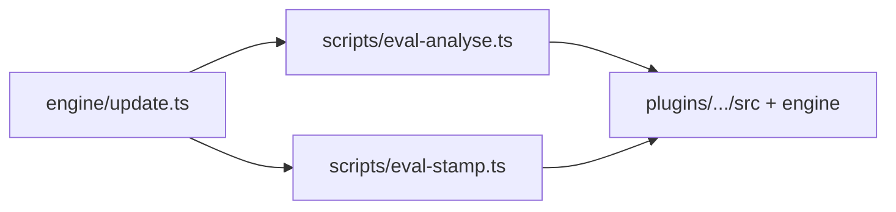

# Import graph baseline (2026-06-01)

Audit for spec **Eval Plugin — Self-Contained Scripts Consolidation** (subtask 01).  
Repo: `feat/site-updates` @ `fbfecad15cca5de07f40ec150555f1b8d2fff64c` (dirty tree — see `working-tree-baseline.md`).

## Grep baseline (KD-2 violations)

| Command | Exit | File count | Paths |
|---------|------|------------|-------|
| `rg -l 'plugins/zoto-eval-system' scripts/` | 0 | **18** | Listed in §Root → plugin imports |
| `rg '../plugins/zoto-eval-system' scripts/` | 0 | **9** import lines | §Cross-boundary import lines |
| `rg -l '\.\./\.\./\.\./scripts' plugins/zoto-eval-system/` | 0 | **2** | `engine/update.ts`, `scripts/stamp-host-layout.ts` (rewrite helper) |

### `rg '../plugins/zoto-eval-system' scripts/` (import lines)

| File | Line | Import target |
|------|------|---------------|
| `scripts/eval-analyse.ts` | 32 | `../plugins/zoto-eval-system/src/config-loader.js` |
| `scripts/eval-analyse.ts` | 1098 | `../plugins/zoto-eval-system/engine/analyser-payload.js` |
| `scripts/eval-stamp.ts` | 37 | `../plugins/zoto-eval-system/src/config-loader.js` |
| `scripts/eval-orchestrate.ts` | 74 | `../plugins/zoto-eval-system/src/config-loader.js` |
| `scripts/eval-discover.ts` | 36 | `../plugins/zoto-eval-system/src/config-loader.js` |
| `scripts/eval-gc.ts` | 28 | `../plugins/zoto-eval-system/src/config-loader.js` |
| `scripts/eval-cleanup-stale.ts` | 98–99 | `../plugins/zoto-eval-system/engine/_user-case-guards.ts`, `../plugins/zoto-eval-system/src/config-loader.js` |
| `scripts/eval-relocate-migration.ts` | 52 | `../plugins/zoto-eval-system/engine/_user-case-guards.ts` |
| `scripts/eval-ensure-host.ts` | 36 | Template path string `../plugins/zoto-eval-system/templates/scenarios/...` |

Tests under `scripts/__tests__/` also use `../../plugins/zoto-eval-system/...` (see `test-inventory.md`).

### `rg '../../../scripts' plugins/zoto-eval-system/`

| File | Line | Usage |
|------|------|-------|
| `plugins/zoto-eval-system/engine/update.ts` | 104, 114 | `from "../../../scripts/eval-analyse.ts"`, `from "../../../scripts/eval-stamp.ts"` |
| `plugins/zoto-eval-system/scripts/stamp-host-layout.ts` | 126 | `replaceAll("../../../scripts/", "../scripts/")` in `rewriteScriptBody` |

## Root `scripts/eval-*` and host-adjacent CLI

| Script | Lines | Primary cross-tree imports | Intra-`scripts/` imports |
|--------|------:|----------------------------|--------------------------|
| `eval-analyse.ts` | 2063 | `../plugins/zoto-eval-system/src/config-loader.js`, `../plugins/zoto-eval-system/engine/analyser-payload.js` | — |
| `eval-stamp.ts` | 2495 | `../plugins/zoto-eval-system/src/config-loader.js` | `./eval-analyse.ts` (values + types) |
| `eval-orchestrate.ts` | 747 | `../plugins/zoto-eval-system/src/config-loader.js` | — |
| `eval-discover.ts` | 495 | `../plugins/zoto-eval-system/src/config-loader.js` (`loadEvalPaths`) | — |
| `eval-gc.ts` | 196 | `../plugins/zoto-eval-system/src/config-loader.js` | — |
| `eval-cleanup-stale.ts` | 1283 | `../plugins/.../engine/_user-case-guards.ts`, `../plugins/.../src/config-loader.js` | `./eval-analyse.ts` |
| `eval-cleanup-vendored.ts` | 282 | — (comments reference plugin paths) | `./eval-analyse.ts` |
| `eval-ensure-host.ts` | 144 | Template path under `plugins/zoto-eval-system/templates/` | — |
| `eval-cleanup-sandboxes.ts` | 71 | — (node only) | — |
| `eval-migrate-legacy.ts` | 40 | — | — |
| `eval-migrate-ts-to-json.ts` | 910 | — (comments reference `engine/update.ts`) | — |
| `eval-relocate-migration.ts` | 1368 | `../plugins/zoto-eval-system/engine/_user-case-guards.ts` | — |
| `check-analyser-payload-parity.ts` | 253 | — | `./eval-analyse.ts` (`ANALYSER_PAYLOAD_PARITY_SPEC`) |

**KD-7 / KD-2 post-move target:** `from "../src/..."`, `from "../engine/..."`, `from "./eval-analyse.ts"` (sibling under plugin `scripts/`).

## `plugins/zoto-eval-system/scripts/*.ts`

| Script | Lines | Imports (relative to plugin) | Notes |
|--------|------:|------------------------------|-------|
| `eval-discover.ts` | 292 | `../src/config-loader.js` | **Stale fork** — delete per KD-3 |
| `eval-update.ts` | 593 | `./eval-discover.js`, `../src/`, `../engine/discovery-filters.js`, `../engine/manifest-snapshot.js` | **Superseded** — delete per KD-4; canonical `engine/update.ts` (2347 lines) |
| `stamp-host-layout.ts` | 335 | node only; copies from `zotoAgentsRoot/scripts/` today | KD-5: source `PLUGIN_ROOT/scripts/` |
| `install-local.ts` | 136 | node only | **Missing `engine/`, `src/`** in `PLUGIN_DIRS` |
| `validate-plugin.ts` | 501 | node, Ajv | Greps `engine/update.ts` for guard string |
| `migrate-host-layout-v3.ts` | 176 | `./stamp-host-layout.js` | — |
| `migrate-legacy.ts` | 48 | node, YAML | Mirror of root `eval-migrate-legacy.ts` |
| `ensure-host-env-and-gitignore.ts` | 205 | node | — |
| `package-json-merger.ts` | 74 | node | — |
| `install-local.ts` / `uninstall-local.ts` | 136 / 111 | node | Marketplace layout |

## `plugins/zoto-eval-system/engine/update.ts`

| Import | Target | Post-KD-2 target |
|--------|--------|------------------|
| L104 | `../../../scripts/eval-analyse.ts` | `../scripts/eval-analyse.ts` |
| L114 | `../../../scripts/eval-stamp.ts` | `../scripts/eval-stamp.ts` |
| (runtime) | `scripts/check-analyser-payload-parity.ts` via `ANALYSER_PARITY_SCRIPT_REL` | `../scripts/check-analyser-payload-parity.ts` after KD-7 move |

## `evals/llm/_shared/` → root scripts

| File | Import |
|------|--------|
| `evals/llm/_shared/zoto-create-plugin-suite.ts` | `../../../scripts/eval-analyse.ts`, `../../../scripts/eval-stamp.ts` |
| `evals/llm/_shared/zoto-create-plugin-suite.test.ts` | `../../../scripts/eval-analyse.ts` |

**Subtask 02+ retarget (KD-8 / spec req 7):** `../../../plugins/zoto-eval-system/scripts/eval-analyse.ts` (or stable export).

## Circular dependency (current)

Consolidation breaks the cycle by colocating scripts under the plugin and using `../scripts/` from `engine/`.
