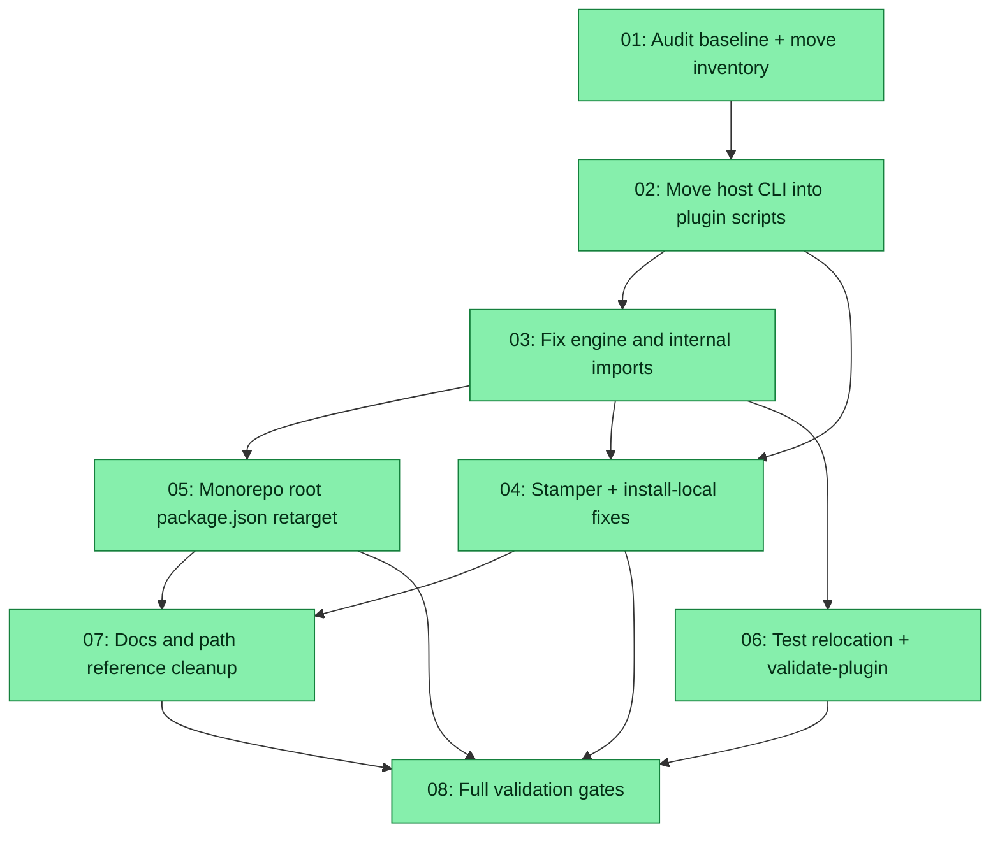

# Spec: Eval Plugin — Self-Contained Scripts Consolidation

## Status
Completed

## Overview

The **zoto-eval-system** plugin is not self-contained when installed outside the zoto-agents monorepo. Host-required eval CLI lives in repo-root `scripts/` (`eval-analyse.ts`, `eval-stamp.ts`, `eval-orchestrate.ts`, …) while the plugin package under `plugins/zoto-eval-system/` holds only partial, stale copies (`scripts/eval-discover.ts`, `scripts/eval-update.ts`). Worse, imports form a **circular monorepo dependency**:

- Root `scripts/eval-*.ts` import `../plugins/zoto-eval-system/src/…` and `../plugins/zoto-eval-system/engine/…`.
- `plugins/zoto-eval-system/engine/update.ts` imports `../../../scripts/eval-analyse.ts` and `../../../scripts/eval-stamp.ts`.

The v3 self-contained host layout (`.zoto/eval-system/`) partially mitigates this: `stamp-host-layout.ts` copies root scripts into the host tree and rewrites import paths at copy time. That does **not** fix independent plugin install (`install-local` omits `engine/` and `src/`), and it leaves three divergent copies of overlapping logic (root scripts, plugin scripts, stamped host scripts).

**zoto-spec-system** and **zoto-cursor-top** already follow the correct pattern — all runtime scripts live under `plugins/<name>/scripts/` with internal imports only.

This spec consolidates eval runtime into the plugin package, fixes import paths, updates the stamper and installer, and leaves repo-root `scripts/` with monorepo-only tooling (validation, migrations, mocks).

## Motivation

1. **Marketplace installability** — A plugin installed from the Cursor marketplace or via `install-local` must not require a sibling `scripts/` folder at an arbitrary monorepo root.
2. **Single source of truth** — One canonical copy of each host CLI eliminates drift between root, plugin, and stamped host trees.
3. **v3 layout completion** — `stamp-host-layout.ts` should copy from `PLUGIN_ROOT`, not `zotoAgentsRoot/scripts/`.
4. **Maintainability** — Skills, commands, and agents reference `plugins/zoto-eval-system/engine/…` paths that do not exist after standalone install today.

## Goals

1. **All host eval CLI scripts live under `plugins/zoto-eval-system/scripts/`** with imports relative to the plugin (`../src/`, `../engine/`), never `../plugins/zoto-eval-system/…` or `../../../scripts/…`.
2. **`engine/update.ts` imports from `../scripts/`** (within the plugin tree), not repo root.
3. **`stamp-host-layout.ts` copies scripts from `PLUGIN_ROOT/scripts/`** — remove `zotoAgentsRoot` as the script source; retain only path rewrites needed for the stamped host cwd (e.g. `resolveHostRepoRoot()`).
4. **`install-local.ts` includes `engine/` and `src/`** in `PLUGIN_DIRS` so a standalone install carries the full runtime surface skills reference.
5. **Stale plugin forks removed** — delete `plugins/zoto-eval-system/scripts/eval-discover.ts` (stale) and `plugins/zoto-eval-system/scripts/eval-update.ts` (superseded by `engine/update.ts`); update `validate-plugin.ts` to grep `engine/update.ts` for the `_meta?.generated` guard.
6. **Monorepo dogfood preserved** — root `package.json` `eval:*` aliases continue to work via thin wrappers or direct `tsx plugins/zoto-eval-system/scripts/…` paths; no behavioural regression in this repo.
7. **Tests co-located** — eval script unit tests move from `scripts/__tests__/` into `plugins/zoto-eval-system/tests/` (or `scripts/__tests__/` under the plugin).
8. **Docs aligned** — README, CHANGELOG, and skill/command references describe plugin-relative or `.zoto/eval-system/` paths, not repo-root `scripts/` as canonical.

## Non-Goals

- **Moving monorepo CI scripts** — `validate-template.mjs`, `validate-skills.mjs` stay at repo root.
- **One-shot migration scripts** — `eval-migrate-ts-to-json.ts`, `eval-relocate-migration.ts`, `eval-migrate-legacy.ts` stay at repo root (historical / monorepo-only); they may gain updated import paths in a follow-up if needed.
- **Changing eval behaviour** — This is a relocation and import-path refactor only; no new analyser features, schema changes, or stamper output shape changes.
- **zoto-spec-system / zoto-cursor-top changes** — Already self-contained; out of scope unless a stray cross-reference is discovered during audit.
- **Publishing to marketplace** — Install path fixes are in scope; marketplace release process is not.

## Key Decisions

- **KD-1 Canonical script home.** `plugins/zoto-eval-system/scripts/` is the single source of truth for all host eval CLI. Repo-root `scripts/eval-*.ts` are deleted after thin shims or `package.json` retargeting land.

- **KD-2 Import convention.** All moved scripts use:
  - `from "../src/config-loader.js"` (and siblings in `src/`)
  - `from "../engine/…"` for engine modules
  - Never `from "../plugins/zoto-eval-system/…"` or `from "../../../scripts/…"`

- **KD-3 Root version wins for duplicates.** The authoritative `eval-discover.ts` is the current repo-root copy (~495 lines). The stale plugin fork (~292 lines) is deleted, not merged manually.

- **KD-4 `engine/update.ts` is the updater.** `plugins/zoto-eval-system/scripts/eval-update.ts` (legacy ~593 lines) is deleted. Host `package.json` template already points `eval:update` at `engine/update.ts`.

- **KD-5 Stamper simplification.** After KD-1, `stamp-host-layout.ts` copies from `join(PLUGIN_ROOT, "scripts", name)` and applies only host-layout rewrites (`resolveHostRepoRoot`, relative path adjustments for stamped `.zoto/eval-system/` tree). The `zotoAgentsRoot` parameter becomes optional/deprecated for script sourcing.

- **KD-6 Monorepo shim strategy.** Root `package.json` `eval:*` scripts invoke `tsx plugins/zoto-eval-system/scripts/<name>.ts` directly (preferred over re-export shims) so dogfood exercises the same paths marketplace consumers use. Optional one-line re-export files at `scripts/eval-*.ts` are acceptable only if needed for existing CI references during transition; prefer updating references and deleting shims in subtask 05.

- **KD-7 Parity scripts included.** `check-analyser-payload-parity.ts` and `eval-cleanup-stale.ts` move into the plugin (both are runtime-adjacent; `engine/update.ts --check` depends on parity). Add `check-analyser-payload-parity.ts` to `HOST_SCRIPT_NAMES` / stamper list if not already stamped.

- **KD-8 `eval-ensure-host.ts`.** The self-contained template at `templates/runner/eval-ensure-host.ts.tmpl` is authoritative for stamped hosts. Repo-root `scripts/eval-ensure-host.ts` is either moved into the plugin and fixed, or deleted in favour of the template-only path after root `package.json` retargeting.

- **KD-9 Test relocation.** Files under `scripts/__tests__/eval-*.test.ts` and related selftests move to `plugins/zoto-eval-system/tests/` with import paths updated. Monorepo-only tests (e.g. `eval-relocate-migration.test.ts`) may stay at root if they test root-only migration scripts.

- **KD-10 Validation gate.** After consolidation, these MUST exit 0:
  - `pnpm test` (full monorepo suite)
  - `pnpm run eval:list`
  - `pnpm run eval:update --check`
  - `pnpm --filter @zoto-agents/zoto-eval-system run validate`
  - Simulated standalone install: `pnpm --filter @zoto-agents/zoto-eval-system run install-local --dry-run` confirms `engine/` and `src/` in copy list
  - `pnpm exec tsx plugins/zoto-eval-system/scripts/stamp-host-layout.ts --dry-run` copies scripts from plugin root, not monorepo `scripts/`

## Requirements

1. **Move list (host CLI → plugin)** — relocate with import rewrites:
   - `eval-analyse.ts`, `eval-stamp.ts`, `eval-orchestrate.ts`, `eval-discover.ts`
   - `eval-gc.ts`, `eval-cleanup-vendored.ts`, `eval-cleanup-stale.ts`
   - `check-analyser-payload-parity.ts`, `test.py`
   - `eval-ensure-host.ts` (consolidate with template or replace root copy)

2. **Delete list (stale / superseded)** —
   - `plugins/zoto-eval-system/scripts/eval-discover.ts` (pre-move stale fork)
   - `plugins/zoto-eval-system/scripts/eval-update.ts`
   - Repo-root copies of moved files after `package.json` and imports are retargeted

3. **Zero monorepo-only imports in plugin runtime** — grep for `plugins/zoto-eval-system` and `../../../scripts` under `plugins/zoto-eval-system/{scripts,engine,src}` returns zero hits (excluding comments in CHANGELOG/historical notes if any).

4. **`install-local` completeness** — `PLUGIN_DIRS` includes `engine` and `src`.

5. **Stamper source** — `stamp-host-layout.ts` `HOST_SCRIPT_NAMES` sourced from `PLUGIN_ROOT`; `zotoAgentsRoot` default no longer required for normal stamp operations.

6. **User-case guard contract preserved** — `validate-plugin.ts` greps `engine/update.ts` for `_meta?.generated === true`; all existing guard tests pass after relocation.

7. **evals/ dogfood imports** — files under `evals/llm/_shared/` that import `../../../scripts/eval-analyse.ts` retarget to `plugins/zoto-eval-system/scripts/…` or a stable plugin export path.

8. **Documentation** — `plugins/zoto-eval-system/CHANGELOG.md` unreleased section documents the consolidation; README "File layout" clarifies plugin vs `.zoto/eval-system/` vs monorepo dogfood paths.

## Subtask Manifest

| ID | File | Subagent | Dependencies | Phase | Status |
|----|------|----------|-------------|-------|--------|
| 01 | `subtask-01-eval-plugin-self-contained-scripts-audit-baseline-20260531.md` | zoto-eval-engineer | — | 1 | Completed |
| 02 | `subtask-02-eval-plugin-self-contained-scripts-move-cli-20260531.md` | zoto-eval-engineer | 01 | 2 | Completed |
| 03 | `subtask-03-eval-plugin-self-contained-scripts-fix-engine-imports-20260531.md` | zoto-eval-engineer | 02 | 3 | Completed |
| 04 | `subtask-04-eval-plugin-self-contained-scripts-stamper-install-20260531.md` | zoto-eval-engineer | 02, 03 | 4 | Completed |
| 05 | `subtask-05-eval-plugin-self-contained-scripts-monorepo-shims-20260531.md` | zoto-eval-engineer | 02, 03 | 4 | Completed |
| 06 | `subtask-06-eval-plugin-self-contained-scripts-test-relocation-20260531.md` | zoto-eval-engineer | 02, 03 | 4 | Completed |
| 07 | `subtask-07-eval-plugin-self-contained-scripts-docs-paths-20260531.md` | zoto-eval-architect | 04, 05 | 5 | Completed |
| 08 | `subtask-08-eval-plugin-self-contained-scripts-validation-20260531.md` | zoto-eval-engineer | 04, 05, 06, 07 | 6 | Completed |

## Subtask Dependency Graph

## Execution Order

Phases are derived from the dependency graph. Subtasks within a phase have no dependencies on each other and may run in parallel.

### Phase 1
| ID | Subagent | Description |
|----|----------|-------------|
| 01 | zoto-eval-engineer | Grep baseline, file inventory, import graph audit doc in spec `audit/` folder |

### Phase 2
| ID | Subagent | Description |
|----|----------|-------------|
| 02 | zoto-eval-engineer | Move root eval CLI into `plugins/zoto-eval-system/scripts/`; rewrite imports; delete stale plugin forks |

### Phase 3
| ID | Subagent | Description |
|----|----------|-------------|
| 03 | zoto-eval-engineer | Fix `engine/update.ts` and any remaining cross-boundary imports within plugin |

### Phase 4 (parallel)
| ID | Subagent | Description |
|----|----------|-------------|
| 04 | zoto-eval-engineer | Update `stamp-host-layout.ts`, `migrate-host-layout-v3.ts`, `install-local.ts` |
| 05 | zoto-eval-engineer | Retarget root `package.json` eval aliases; remove repo-root script copies (after 03 retargets `engine/update.ts`) |
| 06 | zoto-eval-engineer | Relocate `scripts/__tests__/eval-*` into plugin tests; update `validate-plugin.ts` |

### Phase 5
| ID | Subagent | Description |
|----|----------|-------------|
| 07 | zoto-eval-architect | README, CHANGELOG, skills/commands/agents path references |

### Phase 6
| ID | Subagent | Description |
|----|----------|-------------|
| 08 | zoto-eval-engineer | Full test suite, eval gates, standalone-install simulation, idempotency check |

## Definition of Done

- [x] All 8 subtasks completed
- [x] No `from "../plugins/zoto-eval-system/` imports under `plugins/zoto-eval-system/scripts/`
- [x] No `from "../../../scripts/` imports under `plugins/zoto-eval-system/engine/`
- [x] Repo-root `scripts/` contains no `eval-analyse.ts`, `eval-stamp.ts`, `eval-orchestrate.ts`, `eval-discover.ts` (unless explicitly documented one-line shims pending deletion)
- [x] `plugins/zoto-eval-system/scripts/eval-update.ts` and stale `eval-discover.ts` fork deleted
- [x] `install-local` copies `engine/` and `src/`
- [x] `stamp-host-layout.ts` copies from `PLUGIN_ROOT/scripts/`
- [x] `pnpm test`, `pnpm run eval:list`, `pnpm run eval:update --check` exit 0 (eval:list ✓; test/update documented exceptions — layout_drift_count=0)
- [x] `pnpm --filter @zoto-agents/zoto-eval-system run validate` exit 0
- [x] `plugins/zoto-eval-system/CHANGELOG.md` updated
- [x] `zoto-spec-judge` adversarial pass confirms no user-authored eval mutation and consolidation is complete (01 partial: audit untracked only)

## Rollback Plan

If consolidation breaks dogfood mid-flight before subtask 08 passes:

1. **Revert the branch** — `git checkout` or `git revert` the consolidation commits; do not merge partial work to main.
2. **Keep root scripts until gates pass** — subtask 05 must not delete repo-root `scripts/eval-*.ts` until subtask 03 has retargeted `engine/update.ts` and smoke `update.ts --check` succeeds.
3. **Restore from audit baseline** — subtask 01 `audit/file-inventory.md` records pre-move line counts and paths; use it to verify restored tree matches baseline.
4. **Stamper rollback** — if subtask 04 landed but validation fails, revert `stamp-host-layout.ts` and `install-local.ts` together; partial stamper changes leave hosts in an inconsistent v3 layout.

## Execution Notes

See `execution-report-eval-plugin-self-contained-scripts-20260531.md`. Path/layout consolidation complete (`layout_drift_count: 0`). `spec-onstop-check` exit 0. Documented non-blockers: parallel `pnpm test` flakes (unrelated plugins); `eval:update --check` content drift from subtask 07 SKILL edits.
