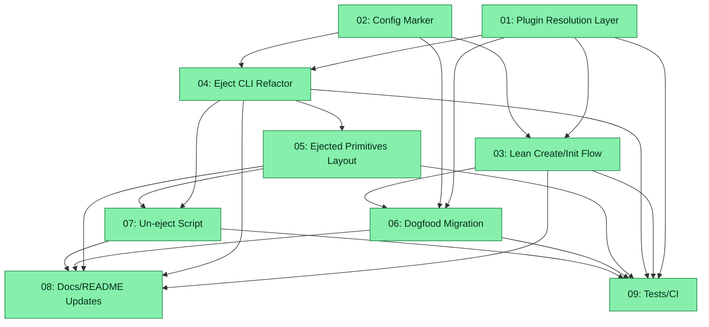

# Spec: Eval Dual Host Layout

## Status
Completed

## Overview

Introduce a dual-mode host layout for the eval-system plugin: **lean (plugin-dependent)** and **ejected (self-contained)**. Today, `/z-eval-create` always stamps the full runtime (src/, engine/, templates/, scripts/, agents/) into `.zoto/eval-system/`, creating a self-contained copy. This spec splits that into:

1. **Lean mode (default)**: Only repo-specific assets (config.yml, manifest.yml, evals/, _runs/, cache) live under `.zoto/eval-system/`. Engine, scripts, templates, and primitives resolve from the installed plugin at runtime via a resolution function with a defined precedence chain.
2. **Ejected mode (opt-in via CLI)**: Full runtime copy to `.zoto/eval-system/` (src/, engine/, templates/, scripts/) plus eval primitives (agents, skills, commands) under `.cursor/*/eval-sys/`.

This also migrates the zoto-agents monorepo from its current full-ejected state to lean plugin-dependent mode.

## Key Decisions

- **KD-1**: Plugin resolution precedence: (1) monorepo `plugins/zoto-eval-system/` relative to repo root, (2) `ZOTO_EVAL_PLUGIN_ROOT` env override, (3) Cursor plugin install dir (`~/.cursor/plugins/…/zoto-eval-system/`). Single function, well-tested, documented.
- **KD-2**: Config marker `hostLayout: "plugin" | "ejected"` in config.yml records the active mode. Scripts branch on this value.
- **KD-3**: Eject is CLI-only (`pnpm run eval:stamp-host-layout`). No new slash command. Un-eject is also CLI-only (`pnpm run eval:un-eject`).
- **KD-4**: On eject, primitives (agents, skills, commands) go to `.cursor/agents/eval-sys/`, `.cursor/skills/eval-sys/`, `.cursor/commands/eval-sys/` — NOT under `.zoto/eval-system/agents/`.
- **KD-5**: Lean mode dependencies: root `package.json` gets eval aliases + minimal devDeps (`@cursor/sdk`, `tsx`, `yaml`, etc.) via `/z-eval-create`. No nested `.zoto/eval-system/package.json` until eject.
- **KD-6**: `/z-eval-init` must run `pnpm install` at repo root as part of its init flow for lean mode deps.
- **KD-7**: The existing `.zoto/eval-system/agents/zoto-eval-analyser-subagent.md` is incorrect for lean mode — analyser stays with other eval agents in the plugin or (on eject) under `.cursor/agents/eval-sys/` (or flat-prefix fallback if Cursor does not recurse subdirs).
- **KD-8**: Lean-mode eval aliases use a stamped `scripts/eval-bridge.ts` wrapper (no shell interpolation) that calls `resolvePluginRoot()` then execs the target plugin script via `tsx`.

## Judge Review

Assessment: `zoto-judge-assessment-eval-dual-host-layout-20260601.md` — **Conditional (3.7/5)**. Judge fixes applied: S05 Phase 0 Cursor discovery validation + flat-prefix fallback; S03 committed to `eval-bridge.ts`; S06 explicit S02 dep + rollback plan; S09 explicit S05 dep; S01 cross-platform + semver selection; S08 external-repo upgrade path.

## Requirements

1. Fresh `/z-eval-create` on a normal host repo materializes only repo-specific assets under `.zoto/eval-system/`
2. Engine, scripts, templates resolve from installed plugin at runtime in lean mode
3. Eject via CLI (`pnpm run eval:stamp-host-layout`) copies full runtime to `.zoto/eval-system/`
4. Un-eject script reverses ejection — removes vendored runtime, restores lean layout
5. Plugin resolution function with documented precedence chain
6. Ejected primitives go under `.cursor/*/eval-sys/` not `.zoto/eval-system/agents/`
7. Config marker `hostLayout` records mode
8. zoto-agents monorepo migrates from ejected to lean
9. All existing eval scripts continue to work post-migration

## Subtask Manifest

| ID | File | Subagent | Dependencies | Phase | Status |
|----|------|----------|-------------|-------|--------|
| 01 | `subtask-01-eval-dual-host-layout-plugin-resolution-20260601.md` | generalPurpose | — | 1 | Done |
| 02 | `subtask-02-eval-dual-host-layout-config-marker-20260601.md` | generalPurpose | — | 1 | Done |
| 03 | `subtask-03-eval-dual-host-layout-lean-create-init-20260601.md` | generalPurpose | 01, 02 | 2 | Done |
| 04 | `subtask-04-eval-dual-host-layout-eject-cli-refactor-20260601.md` | generalPurpose | 01, 02 | 2 | Done |
| 05 | `subtask-05-eval-dual-host-layout-ejected-primitives-20260601.md` | generalPurpose | 04 | 3 | Done |
| 06 | `subtask-06-eval-dual-host-layout-dogfood-migration-20260601.md` | generalPurpose | 01, 02, 03 | 3 | Done |
| 07 | `subtask-07-eval-dual-host-layout-un-eject-script-20260601.md` | generalPurpose | 04, 05 | 4 | Done |
| 08 | `subtask-08-eval-dual-host-layout-docs-readme-20260601.md` | generalPurpose | 03, 04, 05, 06, 07 | 5 | Done |
| 09 | `subtask-09-eval-dual-host-layout-tests-ci-20260601.md` | generalPurpose | 01, 03, 04, 05, 06, 07 | 5 | Done |

## Subtask Dependency Graph

## Execution Order

### Phase 1 (Parallel)
| ID | Subagent | Description |
|----|----------|-------------|
| 01 | generalPurpose | Plugin resolution function with precedence chain |
| 02 | generalPurpose | Add `hostLayout` config marker to schema and loader |

### Phase 2 (after Phase 1)
| ID | Subagent | Description |
|----|----------|-------------|
| 03 | generalPurpose | Refactor `/z-eval-create` and `/z-eval-init` for lean mode |
| 04 | generalPurpose | Refactor `stamp-host-layout.ts` as explicit eject CLI |

### Phase 3 (after Phase 2)
| ID | Subagent | Description |
|----|----------|-------------|
| 05 | generalPurpose | Ejected primitives layout under `.cursor/*/eval-sys/` |
| 06 | generalPurpose | Migrate zoto-agents monorepo from ejected to lean |

### Phase 4 (after Phase 3)
| ID | Subagent | Description |
|----|----------|-------------|
| 07 | generalPurpose | Create un-eject script and CLI alias |

### Phase 5 (after Phase 4)
| ID | Subagent | Description |
|----|----------|-------------|
| 08 | generalPurpose | Update README, skill docs, and command docs |
| 09 | generalPurpose | Unit/integration tests and CI validation |

## Definition of Done
- [x] All subtasks completed
- [x] All tests passing (the project's test suite)
- [x] No linter errors in modified files
- [x] Plugin resolution works across all three precedence levels
- [x] Lean mode is the default for new repos
- [x] Eject/un-eject round-trips cleanly
- [x] zoto-agents monorepo uses lean mode with monorepo resolution
- [x] Documentation updated

## Execution Notes
Executed 2026-06-01. All 9 subtasks completed and adversarially verified. Fix round on S08 (stale doc refs) and S09 (`eval:update:check` drift). Final `pnpm test` 331/331 pass; `eval:update:check` clean. User approved completion 2026-06-01. See `execution-report-eval-dual-host-layout-20260601.md`.
