# `/z-eval-update` — Layer Catalogue, Ownership, and Abstraction Review

**Scope:** Narrow architecture review of the diff-aware eval updater path only.  
**Posture:** Read-only analysis — no plugin or host mutations proposed here.  
**Date:** 2026-06-01  
**Case id:** `architecture-review-layers-blur-smells-scoring`

---

## Scoring rubric

Each finding uses three axes (1–5 / H·M·L), then a **composite** = severity × user reach × maintenance cost.

| Axis | Scale |
|------|-------|
| **Severity** | blocker=5 · high=4 · medium=3 · low=2 · info=1 |
| **User reach** | all operators=5 · CI/orchestrator=4 · apply-mode=3 · targeted=2 · maintainers=1 |
| **Maintenance cost** | high=3 · medium=2 · low=1 |

**Guidance verbs:** **keep** (intentional boundary) · **collapse** (merge duplicate surfaces) · **split** (separate concerns that are tangled) · **deprecate** (retire stale surface without deleting behaviour yet).

---

## 1. Layer catalogue (command → agent → skill → engine → templates)

```mermaid
flowchart TB
  subgraph intent["Intent routing"]
    CMD["/z-eval-update<br/>commands/z-eval-update.md"]
  end
  subgraph orch["Orchestration"]
    AGT["zoto-eval-updater<br/>agents/zoto-eval-updater.md"]
  end
  subgraph workflow["Workflow prose"]
    SKL["zoto-update-evals<br/>skills/zoto-update-evals/SKILL.md"]
  end
  subgraph runtime["Runtime"]
    BRIDGE["eval-bridge.ts.tmpl → engine/update.ts"]
    ENG["engine/update.ts"]
    STAMP["scripts/eval-stamp.ts"]
    DISC["scripts/eval-discover.ts"]
    ANAL["scripts/eval-analyse.ts"]
  end
  subgraph tmpl["Templates"]
    CMDT["templates/command-evals/evals.json.tmpl"]
    AGTT["templates/agent-evals/evals.json.tmpl"]
    HOOKT["templates/hook-evals/evals.json.tmpl"]
    SKLT["templates/skill-evals/evals.json.tmpl"]
    STAT["templates/static/{pytest,vitest,jest}/per-primitive-test.*.tmpl"]
    SCH["templates/schema/{config,manifest,eval-file}.schema.json"]
  end
  CMD -->|"spawn + resume + askQuestion"| AGT
  AGT --> SKL
  SKL -.->|"documents; does not execute"| ENG
  CMD -->|"pnpm run eval:update"| BRIDGE
  BRIDGE --> ENG
  ENG --> DISC
  ENG --> ANAL
  ENG --> STAMP
  STAMP --> CMDT & AGTT & HOOKT & SKLT & STAT
  ENG --> SCH
```



### 1.1 Command — intent, flags, interaction contract

`/z-eval-update` owns precondition checks, flag semantics, subagent spawn, and the **resume + askQuestion** loop for apply modes. It explicitly does not implement drift math or stamping.

```33:75:plugins/zoto-eval-system/commands/z-eval-update.md
### Precondition
...
### Spawn subagent
Spawn a `zoto-eval-updater` subagent that uses the `zoto-update-evals` skill.
### Resume loop
...
### What happens (apply modes)
1. Load `.zoto/eval-system/config.yml`, `.zoto/eval-system/manifest.yml`, ...
2. **Full-catalog** rediscover ... **`--target`** modes use the current `config.yml` ...
3. Classify each delta against `config.update.criticalChangeRules`.
4. For each `added` / `modified` target: ... `regeneratePytest` / `regenerateVitest` / `regenerateJest` ... `regenerateLlm` ...
5. Command presents each change via `askQuestion` ...
6. Write accepted patches, refresh manifest ...
```

Flag table and CI parity ordering are also command-owned prose:

```21:29:plugins/zoto-eval-system/commands/z-eval-update.md
| `--check` (default for CI) | Drift report only. Runs the analyser payload parity gate first ...
| `--apply` | Per-primitive regeneration. Each drifted primitive triggers `runAnalyser({ invalidate: true })` ...
| `--target <glob>` | Restrict scope ...
| `--no-analyser` | Reuse cached payloads ...
| `--with-analyser` | Forces `runAnalyser` even under `CI=true` ...
```

### 1.2 Agent — orchestration mirror + escalation

`zoto-eval-updater` repeats mode semantics and routes regeneration helpers; it must return `needs_user_input` instead of calling `askQuestion`.

```14:37:plugins/zoto-eval-system/agents/zoto-eval-updater.md
### Check Mode — `/z-eval-update --check`
Non-interactive. First runs the analyser payload parity gate ...
### Rediscovery Apply — `/z-eval-update --apply`
The **command** runs `askQuestion` per change. ...
1. **Refresh analyser payload** — call `runAnalyser({ target, invalidate: true })` ...
2. **Read manifest snapshot** — `readManifestSnapshot()` ...
3. **Dispatch per-framework static regeneration plus the single unified LLM regeneration**:
   - `static.framework === "pytest"` → `regeneratePytest()` → `stampPytestPerPrimitive()`.
   ...
4. **Update manifest** — refresh `targets[]` ...
```

### 1.3 Skill — workflow specification (third copy)

`zoto-update-evals` is a step-by-step duplicate of command + agent + engine behaviour, including discovery-source rules and surgical-diff invariants.

```48:112:plugins/zoto-eval-system/skills/zoto-update-evals/SKILL.md
### Step 1: Load manifest, config, and snapshot
...
### Step 2: Rediscover
Run discovery using **`manifest.discovery_config`** for full-catalog modes ...
### Step 3: Classify manifest deltas
...
### Step 4: Per-primitive analyser refresh
...
### Step 5: Dispatch regeneration
| `static.framework` | helper |
| `pytest` | `regeneratePytest()` → `stampPytestPerPrimitive()` |
...
| LLM (every target) | `regenerateLlm()` → re-stamps the co-located `<kind>/evals/<name>.json` ...
### Step 6: Write
...
### Step 7: Summary
```

### 1.4 Engine — canonical runtime

`engine/update.ts` is the **single executable owner** for CLI `pnpm run eval:update` (lean bridge → `engine/update.ts`; ejected host → `tsx engine/update.ts`).

Architecture header documents the collapsed LLM path and guard funnel:

```17:47:plugins/zoto-eval-system/engine/update.ts
 * Architecture (post single-backend collapse — KD-2 / KD-3 ...
 *   parseArgs ─► main() ─► dispatchRegeneration() ─► regenerate{Pytest,Vitest,Jest,Llm}
 ...
 * Each helper:
 *   - Resolves an `AnalyserPayload` ...
 *   - Calls `isGeneratedFile(path)` ...
 *   - Calls `isGeneratedCase(c)` ...
 *   - Returns a structured report; the dispatcher aggregates and updates the manifest ...
```

Host script wiring (ejected layout):

```23:24:plugins/zoto-eval-system/templates/host-package/package.json
    "eval:update": "tsx engine/update.ts",
    "eval:update:check": "tsx engine/update.ts --check",
```

Lean layout resolves the same engine via bridge:

```103:106:plugins/zoto-eval-system/templates/runner/eval-bridge.ts.tmpl
function resolveScriptPath(pluginRoot: string, scriptBase: string): string {
  if (scriptBase.startsWith("engine/")) {
    return join(pluginRoot, `${scriptBase}.ts`);
```

Subtask-12 orchestrator drift hook also targets `--check` on that engine:

```711:740:plugins/zoto-eval-system/scripts/eval-orchestrate.ts
  /* --------- Drift hook (warn-only) ---------- */
  const driftFn = opts.spawnDrift ?? ((env) => spawnDriftHook(hostRepoRoot, cfg.hostLayout, env));
  ...
  reportDoc.drift = driftBlock;
```

### 1.5 Templates — stamping inputs

| Target kind | Template | Stamped by |
|-------------|----------|------------|
| command | `templates/command-evals/evals.json.tmpl` | `renderLlmJsonTemplate` / `buildStampedLlmCaseRow` in `eval-stamp.ts`, called from `regenerateLlm` |
| agent | `templates/agent-evals/evals.json.tmpl` | same |
| hook | `templates/hook-evals/evals.json.tmpl` | same |
| skill | `templates/skill-evals/evals.json.tmpl` | `regenerateSkillEvalsJson` + inline `buildSkillStampedCase` |
| static TS/py | `templates/static/*/per-primitive-test.*.tmpl` | `stamp{Vitest,Jest,Pytest}PerPrimitive` |

Co-located JSON path contract (post JSON-first migration):

```2112:2135:plugins/zoto-eval-system/scripts/eval-stamp.ts
 * Resolve the co-located eval file path for a non-skill primitive
 * (JSON-first migration — spec evals-json-first-migration-20260527):
 *   <kind-dir>/evals/<name>.json
 ...
export function resolveLlmTargetPath(
  resolved: { kind: string; sourcePath: string; name: string },
): string | null {
```

Config schema confirms **no** `llm.strategy` axis (stale prose elsewhere is a smell — see F-06):

```41:44:plugins/zoto-eval-system/templates/schema/config.schema.json
    "llm": {
      ...
      "description": "... There is no `strategy` or `codeFramework` knob: the runtime branch ... is decided per case by the analyser's `requiresInteraction` flag.",
```

---

## 2. Drift detection vs stamping — ownership map

| Concern | Owner | Entry points | Notes |
|---------|-------|--------------|-------|
| **Manifest content-hash drift** | `engine/update.ts` | `computeDeltas`, `classify` | Compares manifest snapshot targets vs live discovery |
| **Criticality rules** | `engine/update.ts` + `config.update.criticalChangeRules` | `classify()` | Skill/command/agent only document; engine enforces |
| **Analyser payload parity drift** | `engine/update.ts` → `check-analyser-payload-parity.ts` | `runParityCheck`, `--check` first | Surfaces as `parity_drift` |
| **Layout / legacy-path drift** | `engine/update.ts` | `detectLayoutDrift`, `warnCoLocatedTsEvals` | `--check` only in `main()` path |
| **User-case preservation gates** | `engine/_user-case-guards.ts` | `isGeneratedCase`, `isGeneratedFile` | Consumed by updater + stampers; not reimplemented |
| **Static backend stamping** | `scripts/eval-stamp.ts` via `regenerate{Pytest,Vitest,Jest}` | `dispatchRegeneration` | File-level guard before overwrite |
| **LLM JSON stamping** | `scripts/eval-stamp.ts` via `regenerateLlm` | `buildStampedLlmCaseRow`, `renderLlmJsonTemplate`, `surgicallyReplaceGeneratedCases` | Skills use parallel inline stamper |
| **Discovery enumeration** | **Split** — see F-02 | `discover()` in `eval-discover.ts` vs inline `discoverTargets()` in `update.ts` `main()` | Behavioural fork |
| **Per-change human approval** | **Command only** | `askQuestion` + resume | **Not** enforced by `engine/update.ts --apply` |
| **Manifest write + history append** | `engine/update.ts` | `appendManifestHistorySnapshot`, apply tail of `main()` | Append-only contract |

### 2.1 Drift detection (read/compare)

Delta computation:

```656:727:plugins/zoto-eval-system/engine/update.ts
export function computeDeltas(
  manifest: Record<string, unknown>,
  current: TargetSnapshot[],
  config: Record<string, unknown>,
  repoRoot: string = REPO_ROOT,
): Delta[] {
  ...
  for (const id of new Set([...Object.keys(oldTargets), ...Object.keys(newTargets)])) {
    ...
    if (oldT.content_hash !== newT.content_hash) {
      deltas.push(classify(...));
```

Classification against config rules:

```576:654:plugins/zoto-eval-system/engine/update.ts
function classify(
  config: Record<string, unknown>,
  d: Omit<Delta, "critical" | "reason">,
  ...
): Delta {
  const rules = ((config.update ?? {}) as Record<string, unknown>)
    .criticalChangeRules as Record<string, boolean> | undefined;
  ...
```

Parity gate runs **before** manifest drift in `--check`:

```2206:2228:plugins/zoto-eval-system/engine/update.ts
  if (args.mode === "check") {
    const parity = runParityCheck(REPO_ROOT);
    if (parity.status !== "ok") {
      ...
      return exitCodeOnCriticalDrift;
    }
  }
```

Layout drift (legacy central paths vs co-located):

```1875:1925:plugins/zoto-eval-system/engine/update.ts
export function detectLayoutDrift(
  hostRepoRoot: string,
  targets: TargetSnapshot[],
): LayoutDrift[] {
  ...
  const newPath = llmTestPathForTarget(hostRepoRoot, t.id);
```

### 2.2 Stamping (write/regenerate)

Top-level dispatch:

```1719:1734:plugins/zoto-eval-system/engine/update.ts
export async function dispatchRegeneration(
  opts: RegenerationCommonOpts,
): Promise<RegenerationReport[]> {
  ...
  if (fw === "pytest") reports.push(regeneratePytest(opts));
  else if (fw === "vitest") reports.push(regenerateVitest(opts));
  else if (fw === "jest") reports.push(regenerateJest(opts));
  reports.push(await regenerateLlm(opts));
  return reports;
}
```

File-level guard wrapper (stamping gate):

```864:881:plugins/zoto-eval-system/engine/update.ts
function guardedFileWrite(
  report: RegenerationReport,
  path: string,
  op: () => string[],
  context: string,
  overwrite: boolean,
): void {
  if (existsAlready && !overwrite && !isGeneratedFile(path)) {
    report.files_preserved.push(path);
    report.notes.push(`manual_merge_required: ...`);
    return;
  }
```

Canonical guards (single source of truth):

```139:144:plugins/zoto-eval-system/engine/_user-case-guards.ts
export function isGeneratedCase(c: CaseMetaLike | null | undefined): boolean {
  ...
  return meta.generated === true;
}
```

---

## 3. Findings (scored)

Sorted by composite score (desc). Implementation routing: **zoto-eval-engineer** for engine/schema collapse; **zoto-plugin-manager** for command/agent/skill prose dedup.

### F-01 · Dual apply contracts (palette vs CLI) — **split**

| Severity | Reach | Maint. | **Composite** | **Guidance** |
|----------|-------|--------|---------------|--------------|
| high (4) | apply-mode (3) | high (3) | **36** | **split** |

**Claim:** `/z-eval-update --apply` promises per-change `askQuestion` at the command layer, but `engine/update.ts --apply` regenerates all drifted targets and writes the manifest with **no per-target approval gate**.

Command contract:

```26:27:plugins/zoto-eval-system/commands/z-eval-update.md
| `--apply` | Per-primitive regeneration. ... The command runs `askQuestion` per critical drift; ...
```

Engine apply path (bulk regen + manifest write):

```2409:2518:plugins/zoto-eval-system/engine/update.ts
  // Apply mode — actual regeneration (per drifted target: invalidated analyser refresh ...
  const driftedTargets = (() => { ... })();
  ...
  for (const target of driftedTargets) {
    ...
    const reports = await dispatchRegeneration({ ... dryRun: false ... });
  ...
  writeFileSync(manifestPath, YAML.stringify(newSnapshot), "utf-8");
  appendManifestHistorySnapshot(historyPath, newSnapshot);
```

**Impact:** Operators using `pnpm run eval:update -- --apply` bypass the conscious-confirmation model documented for the slash command. LLM subagent path relies on honour-system resume, not engine enforcement.

**Recommendation:** Split into `update-check.ts` (read-only) + `update-apply.ts` with explicit `--accept-target` / patch list, **or** make engine apply default `dryRun: true` unless `--force-apply`. Command layer should pass accepted target ids into engine.

---

### F-02 · Discovery implemented twice in `update.ts` — **collapse**

| Severity | Reach | Maint. | **Composite** | **Guidance** |
|----------|-------|--------|---------------|--------------|
| high (4) | all operators (5) | high (3) | **60** | **collapse** |

**Claim:** `main()` re-implements ~200 lines of discovery (`discoverSkills`, `discoverPluginAssets`, cursor trees) while `runUpdate()` and create flows use `discover()` from `eval-discover.ts` (which adds upstream-vendor, cursor namespacing, richer ignore handling).

Import of canonical discover:

```105:105:plugins/zoto-eval-system/engine/update.ts
import { discover as discoverTargetsAtRepo } from "../scripts/eval-discover.js";
```

Used in `runUpdate()`:

```2148:2150:plugins/zoto-eval-system/engine/update.ts
  const current = filterTargetsByDiscoveryIgnores(
    discoverTargetsAtRepo(opts.repoRoot, discoveryForEnumerate),
    ignorePatterns,
```

But `main()` calls local duplicate:

```2310:2311:plugins/zoto-eval-system/engine/update.ts
  let current = discoverTargets(discoveryForEnumerate);
  current = filterTargetsByDiscoveryIgnores(current, ignorePatterns);
```

Local skill discovery (simpler than `eval-discover.ts`):

```392:420:plugins/zoto-eval-system/engine/update.ts
function discoverSkills(config: Record<string, unknown>): TargetSnapshot[] {
  const roots = ((config.skillsRoots as string[]) ?? [
    ".cursor/skills", "skills", "plugins/*/skills",
  ]).flatMap(expandRoot);
  ...
```

Canonical discover export:

```503:514:plugins/zoto-eval-system/scripts/eval-discover.ts
export function discover(
  repoRoot: string,
  config: Record<string, unknown>,
): TargetSnapshot[] {
  ...
  return discoverTargets(config).targets;
```

**Impact:** Full-catalog `/z-eval-update --check` via CLI can disagree with test harness / programmatic `runUpdate()` on target sets, hashes, and ignore behaviour — silent CI false positives/negatives.

**Recommendation:** Delete inline discover* from `update.ts`; route both `main()` and `runUpdate()` through `discover()`.

---

### F-03 · `runUpdate()` vs `main()` feature skew — **collapse**

| Severity | Reach | Maint. | **Composite** | **Guidance** |
|----------|-------|--------|---------------|--------------|
| high (4) | CI (4) | high (3) | **48** | **collapse** |

**Claim:** Two public entry shapes diverge on check semantics and apply behaviour.

| Capability | `main()` (CLI) | `runUpdate()` (tests/programmatic) |
|------------|----------------|-------------------------------------|
| Parity gate on `--check` | yes | yes |
| Layout drift in check | yes (`detectLayoutDrift`, colocated TS warnings) | **no** — only critical hash deltas |
| Apply regeneration | full `dispatchRegeneration` | **manifest rewrite only**, no stamping |
| Discovery source | inline `discoverTargets` | `discover()` |

Check summary in `runUpdate()` omits layout/colocated signals:

```2161:2170:plugins/zoto-eval-system/engine/update.ts
  if (opts.mode === "check") {
    const driftBad = critical.length > 0;
    const summary = {
      status: driftBad ? "drift" : "clean",
      checked: current.length,
      critical_count: critical.length,
      parity_drift: null,
    };
```

Apply in `runUpdate()` writes manifest without regeneration:

```2177:2196:plugins/zoto-eval-system/engine/update.ts
  const newManifest = { ... generated_by: "zoto-update-evals", targets: current };
  writeFileSync(manifestPath, YAML.stringify(newManifest), "utf-8");
  appendManifestHistorySnapshot(historyPath, newManifest);
  const summary = { applied: critical.length, ... };
  return { code: 0, deltas, summary };
```

**Recommendation:** Collapse to one orchestrator function; `main()` becomes argv + stdout adapter; `runUpdate()` calls the same core.

---

### F-04 · Triplicate workflow prose (command / agent / skill) — **collapse**

| Severity | Reach | Maint. | **Composite** | **Guidance** |
|----------|-------|--------|---------------|--------------|
| medium (3) | all operators (5) | high (3) | **45** | **collapse** |

**Claim:** Three Markdown layers restate the same seven-step pipeline (load → rediscover → classify → analyser → dispatch → write → summarise), including identical mode tables and discovery-source rules.

Examples of near-verbatim duplication:

- Command modes + discovery split: ```64:67:plugins/zoto-eval-system/commands/z-eval-update.md```
- Agent modes: ```28:37:plugins/zoto-eval-system/agents/zoto-eval-updater.md```
- Skill steps 1–7: ```48:112:plugins/zoto-eval-system/skills/zoto-update-evals/SKILL.md```

**Impact:** Doc drift already visible (see F-06). Every behavioural change requires three edits; eval cases test agent/skill wording independently.

**Recommendation:** **Keep** command as operator-facing surface. **Collapse** agent to thin persona + escalation rules. **Collapse** skill to: (a) link command flags, (b) link `engine/update.ts` exports, (c) operator invariants only (`manifest.discovery_config`, surgical merge, no askQuestion).

---

### F-05 · Layout drift still targets `.test.ts` while stamper emits `.json` — **deprecate / fix**

| Severity | Reach | Maint. | **Composite** | **Guidance** |
|----------|-------|--------|---------------|--------------|
| medium (3) | CI (4) | medium (2) | **24** | **deprecate** stale paths; align detector |

**Claim:** `detectLayoutDrift` / `llmTestPathForTarget` describe co-located **`.test.ts`** targets, but `resolveLlmTargetPath` stamps **`.json`** (JSON-first migration complete in stamper).

Drift helper comment (stale):

```1762:1768:plugins/zoto-eval-system/engine/update.ts
 * Returns the absolute path to the new co-located emitter target —
 * `<kind-dir>/evals/<name>.test.ts` — produced by
 * `resolveLlmTargetPath()` in `scripts/eval-stamp.ts`.
```

Actual stamper path:

```2112:2135:plugins/zoto-eval-system/scripts/eval-stamp.ts
 *   <kind-dir>/evals/<name>.json
export function resolveLlmTargetPath(...) {
  ...
  return join(dirname(resolved.sourcePath), "evals", `${resolved.name}.json`);
```

Legacy LLM central tree still checked:

```1814:1831:plugins/zoto-eval-system/engine/update.ts
function legacyLlmTestPathForTarget(...) {
  ...
  return join(hostRepoRoot, "evals", "llm", `test_${slug}.test.ts`);
```

**Impact:** `--check` may flag/warn on wrong “expected new path”; migration operators get misleading stderr.

**Recommendation:** Point layout drift at `.json` co-located paths; **deprecate** `findCoLocatedTsEvals` warnings once migration completes (already marked non-fatal).

---

### F-06 · Stale `llm.strategy` / per-strategy dispatch in prompts and agent bodies — **deprecate**

| Severity | Reach | Maint. | **Composite** | **Guidance** |
|----------|-------|--------|---------------|--------------|
| medium (3) | apply-mode (3) | medium (2) | **18** | **deprecate** prose |

**Claim:** Post-collapse engine exposes a single `regenerateLlm` path (no strategy axis), and config schema rejects `llm.strategy`, but generated eval prompts and architect agent domain knowledge still describe `declarative` vs `code` dispatch.

Engine dispatch (no strategy branch):

```1713:1717:plugins/zoto-eval-system/engine/update.ts
 *   - The unified `regenerateLlm` helper (always invoked) — there is no
 *     longer a strategy split.
```

Stale eval case prompt (tests agent answers):

```35:37:plugins/zoto-eval-system/agents/evals/zoto-eval-updater.json
"prompt": "... how `static.framework` and `llm.strategy` steer regeneration ..."
```

Architect agent still lists strategy split in anatomy table (`.cursor/agents/zoto-eval-architect.md` — outside plugin tree but affects reviews).

**Recommendation:** **Deprecate** strategy vocabulary in command/agent/skill/eval JSON; align eval cases with JSON-first + unified harness wording.

---

### F-07 · Inlined `buildSkillStampedCase` mirrors `eval-stamp.ts` — **collapse**

| Severity | Reach | Maint. | **Composite** | **Guidance** |
|----------|-------|--------|---------------|--------------|
| medium (3) | maintainers (1) | high (3) | **9** | **collapse** |

**Claim:** Skill row stamping is duplicated inside `update.ts` to avoid retired imports — comment admits mirror of historical stamper shape.

```1242:1250:plugins/zoto-eval-system/engine/update.ts
 * Inlined locally so `regenerateSkillEvalsJson` does not depend on
 * symbols that the single-backend collapse retired from the central
 * stamper. Mirrors the historical
 * `eval-stamp.ts#buildDeclarativeStampedCase` shape ...
```

Non-skill rows use shared helper:

```1057:1058:plugins/zoto-eval-system/engine/update.ts
  const stampedRows = opts.payload.cases.map((_, i) =>
    buildStampedLlmCaseRow(opts.payload, i, nowIso),
```

**Recommendation:** Export `buildSkillStampedCaseRow` (or generalise `buildStampedLlmCaseRow`) from `eval-stamp.ts`; **collapse** to one stamper module.

---

### F-08 · `RegenerationReport.llm_strategy` ghost field — **deprecate**

| Severity | Reach | Maint. | **Composite** | **Guidance** |
|----------|-------|--------|---------------|--------------|
| low (2) | maintainers (1) | low (1) | **2** | **deprecate** |

```807:811:plugins/zoto-eval-system/engine/update.ts
export interface RegenerationReport {
  ...
  llm_strategy: string | null;
```

Populated as literal `"llm"`:

```1017:1017:plugins/zoto-eval-system/engine/update.ts
  const report = newRegenerationReport(opts.target.id, null, "llm");
```

**Recommendation:** Remove field in next schema bump or mark deprecated in JSON summary docs.

---

### F-09 · `manifest.discovery_config` vs live `config.yml` split — **keep** (document)

| Severity | Reach | Maint. | **Composite** | **Guidance** |
|----------|-------|--------|---------------|--------------|
| low (2) | targeted (2) | medium (2) | **8** | **keep** |

**Claim:** Full-catalog modes pin to manifest snapshot; `--target` uses live config — intentional but easy to misconfigure.

```300:314:plugins/zoto-eval-system/engine/update.ts
 * Full-catalog modes ... pin discovery ignores to
 * `manifest.discovery_config` only — ... live `config.yml` is not consulted).
function discoveryIgnoreForUpdate(..., fullCatalog: boolean): string[] {
  if (fullCatalog) {
    const dc = manifest.discovery_config;
    return isPlainObject(dc) ? loadIgnorePatterns(dc) : [];
  }
  return loadIgnorePatterns(liveConfig);
```

Skill explicit warning:

```144:146:plugins/zoto-eval-system/skills/zoto-update-evals/SKILL.md
- Do not use the current `config.yml` discovery fields for **full-catalog** rediscovery ...
- Targeted `--target` flows use live `config.yml`.
```

**Recommendation:** **Keep** semantics (prevents silent catalogue expansion). Reduce reach confusion via single “discovery source matrix” in command doc only (part of F-04 collapse).

---

### F-10 · Guard module boundary — **keep**

| Severity | Reach | Maint. | **Composite** | **Guidance** |
|----------|-------|--------|---------------|--------------|
| info (1) | all operators (5) | low (1) | **5** | **keep** |

**Claim:** `_user-case-guards.ts` is correctly centralised; engine consumes without reimplementing predicates.

```12:15:plugins/zoto-eval-system/engine/update.ts
 * Both invariants funnel through the canonical guards at
 * `plugins/zoto-eval-system/engine/_user-case-guards.ts`
 * (`isGeneratedCase` / `isGeneratedFile`). This file is a CONSUMER and
 * never re-implements the predicates.
```

Compile-time validator searches same literal in `update.ts`:

```56:57:plugins/zoto-eval-system/engine/update.ts
 * This file is parsed as a string by the plugin validator, which searches
 * for the literal guard expression: `_meta?.generated === true`.
```

**Recommendation:** **Keep** — exemplar boundary. Extend validator to reject duplicate guard regexes elsewhere.

---

### F-11 · Dual host entry (lean bridge vs ejected copy) — **keep**

| Severity | Reach | Maint. | **Composite** | **Guidance** |
|----------|-------|--------|---------------|--------------|
| info (1) | maintainers (1) | medium (2) | **2** | **keep** |

Lean operators hit plugin `engine/update.ts` through bridge; ejected hosts run vendored copy under `.zoto/eval-system/engine/update.ts`. Same source, two resolution paths — documented in command:

```25:25:plugins/zoto-eval-system/commands/z-eval-update.md
... `engine/update.ts` — plugin script in lean mode, vendored copy when ejected ...
```

**Recommendation:** **Keep** dual layout; ensure parity tests (`dual-host-layout.integration.test.ts`) stay mandatory on engine changes.

---

## 4. Summary matrix

| ID | Title | Composite | Guidance |
|----|-------|-----------|----------|
| F-02 | Discovery fork in `update.ts` | 60 | collapse |
| F-03 | `runUpdate` vs `main` skew | 48 | collapse |
| F-04 | Triplicate workflow prose | 45 | collapse |
| F-01 | Dual apply contracts | 36 | split |
| F-05 | Layout drift vs JSON stamper | 24 | deprecate/fix |
| F-06 | Stale `llm.strategy` prose | 18 | deprecate |
| F-07 | Inlined skill stamper | 9 | collapse |
| F-09 | Discovery config split | 8 | keep |
| F-10 | Guard module | 5 | keep |
| F-11 | Dual host entry | 2 | keep |
| F-08 | Ghost `llm_strategy` field | 2 | deprecate |

---

## 5. Recommended sequencing (for downstream engineers)

1. **F-02 + F-03** — single discovery + single orchestration core (unblocks trustworthy `--check`).
2. **F-05** — align layout drift with JSON co-location (cheap CI signal fix).
3. **F-01** — separate read-only check from apply confirmation contract.
4. **F-04 + F-06** — doc/eval-case dedup (plugin-manager + engineer pair).
5. **F-07 + F-08** — stamper hygiene.

---

## 6. Explicit non-goals (this review)

- No edits to `plugins/zoto-eval-system/` or `.zoto/` performed.
- No recommendation to disable `preserveUserAuthoredCases` / `writeMetaMarker` hard contracts (`config.yml` comments at ```85:86:.zoto/eval-system/config.yml``` in host fixtures).
- Strategy-deprecation rubric (`declarative` vs `code`) treated as **closed** in engine; remaining work is prose cleanup (F-06).

---

*Generated by zoto-eval-architect — read-only spec artefact.*
