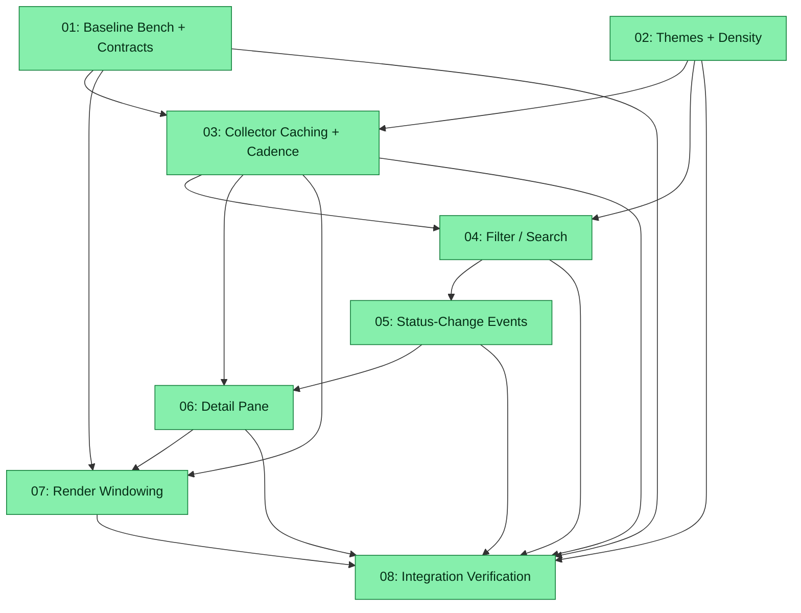

# Spec: cursor-top UX, Features & Performance Optimisation

## Status
Completed

## Overview

Optimise and perfect the `zoto-cursor-top` plugin (`plugins/zoto-cursor-top/`) across three balanced dimensions:

- **UX** — colour themes, layout density options, and htop-style viewport behaviour so the TUI stays pleasant and navigable at any scale.
- **Features** — interactive filtering/search (repo, model, status, free text), a per-agent detail pane with an expanded on-demand log view, and status-change highlights with an event strip (agent finished / blocked / failed).
- **Performance (scaling)** — the collector currently rebuilds the world every tick: a fresh collector per tick (`loadSnapshot` calls `createCollector` on every refresh), a full `ps -axww` scan, a recursive re-read + re-parse of every session JSON, a `stat` + windowed re-read of every log file, and a `sqlite3` spawn for model lookups. The Ink UI renders every visible row regardless of terminal height and re-renders all rows every second on the wall-clock tick. This spec establishes a measured baseline first, then introduces mtime-gated caching, a two-lane refresh cadence, and viewport windowing — each optimisation proving its gain against the baseline numbers.

The plugin is TypeScript + Ink 7 / React 19, built with tsup, tested with vitest (`ink-testing-library` for TUI tests). Entry: `src/cli.ts`; discovery pipeline in `src/discovery/` (collector, processes, sessions, logs, hierarchy, paths, composer-models, repo-url, fs, demo); UI in `src/ui/` (App, Tree, Row, format, render-text).

## Key Decisions

- **Decision 1 — Baseline before optimisation**: Subtask 01 locks in (a) benchmark numbers for collector ticks and rendering at 3 scale tiers and (b) behavioural contract tests for default `--once` / `--json` / `--demo` output, before any production change. Every later performance subtask must publish a measured delta against `bench/BASELINE.md`, and every subtask must keep the contract tests green.
- **Decision 2 — Two work chains, serialised where files overlap**: a UI chain (02 themes/density → 04 filter → 05 events → 06 detail pane → 07 windowing) and a perf chain (01 baseline → 03 collector caching → 07 windowing). All UI subtasks touch `src/ui/App.tsx`, and 02/03/04/05/06 each touch `src/cli.ts` (flags), so phases are mostly sequential by design — conflict-free single-worktree execution is preferred over speculative parallelism. Phase 1 file ownership: subtask 02 owns all `README.md` edits in Phase 1 plus `src/ui/`, `src/cli.ts`, docs, and every `tests/` file **except** `tests/contracts.test.ts`; subtask 01 touches `bench/`, `tests/contracts.test.ts`, and `package.json` only and defers its README "Benchmarks" note to subtask 03's docs pass.
- **Decision 3 — Persistent collector + mtime-gated polling caches, not watchers**: one collector instance lives across ticks and keeps per-path `{mtimeMs, size}`-gated caches (session JSON parse results, log tails, composer-model results, directory listings). `fs.watch` is rejected for cross-platform reliability reasons; native watcher/file-monitor deps are forbidden by constraint. `stat()` remains the per-tick truth probe; file *reads* happen only on change.
- **Decision 4 — Theme engine first in the UI chain**: `src/ui/theme.ts` introduces named themes + density levels and replaces hard-coded colours (`statusColor` in `format.ts`), so filter bar, event strip, highlights, and detail pane consume theme tokens instead of re-hard-coding colours.
- **Decision 5 — Filtering as a pure snapshot transform**: `filterSnapshot()` mirrors the existing prune-pass pattern in `collector.ts` (survives-set + ancestor-chain preservation + children rewrite), so the same function serves the interactive TUI and `--filter` on `--once` / `--json`.
- **Decision 6 — Stable default outputs; additive-only changes**: default (flag-less) `--once`, `--json`, and `--demo` output stays byte/shape-identical. New behaviour is opt-in via new flags (`--theme`, `--density`, `--filter`, `--detail-lines`, `--bell`). The JSON snapshot shape changes additively at most; status-change events stay TUI-only (deliberately not added to `--json` in this spec).
- **Decision 7 — Render scaling via viewport windowing**: htop-style scroll window bounded by terminal height (selection-follow scrolling, overflow indicators), `React.memo` on `Row`, and bounded clock-driven re-renders — rather than swapping renderers or relying on Ink `<Static>`.
- **Decision 8 — All subagents on Composer 2.5**: per explicit user directive, every subtask agent and every judge spawned for this spec runs on `composer-2.5-fast` (see Subagent Assignment Guidance). Switched from Fable after user stop on 2026-06-10.
- **Decision 9 — Docs travel with behaviour**: every behaviour-changing subtask updates README/CHANGELOG and the affected command/skill/rule/agent docs in the same subtask (monorepo convention), and runs the eval drift check (`pnpm run eval:update --check`) because `skill:zoto-cursor-top-monitor`, `command:zoto-cursor-top`, and `agent:zoto-cursor-top-troubleshooter` are covered eval targets. A single version bump to 0.2.0 happens in subtask 08. (Deliberate exception: subtask 01 defers its README "Benchmarks" note to subtask 03 so Phase 1 stays conflict-free — see Decision 2.)
- **Decision 10 — Rollback story**: every behaviour change is opt-in behind new flags with defaults preserved, and subtask 01's contract tests freeze today's default `--once`/`--json`/`--demo` behaviour — so rollback at any phase boundary is "revert that subtask's commits"; no data migrations, no config changes, no persisted state.

## Requirements

1. **Filtering / search across agents** — by repo, model, status, and free text; interactive (`/` input) and via a `--filter` flag usable with `--once` / `--json`.
2. **Per-agent detail pane / expanded log view** — on demand for the selected agent, showing full metadata and substantially more than the default 3 tail lines.
3. **Status-change highlights / notifications** — detect and surface agent finished / blocked (waiting) / failed transitions via row highlights and an event strip; opt-in terminal bell.
4. **Colour themes and layout density options** — named themes (including a no-colour/mono theme honouring `NO_COLOR`) and density levels, switchable interactively and via flags.
5. **Performance at scale** — measurable improvements for: discovery cost per tick (`ps` scans, fs walks/reads), log re-tailing efficiency, and render performance with many agents/subagents and large log files. A profiling/benchmark baseline lands first so optimisation subtasks have numbers to beat.
6. **Balanced delivery** — UX, features, and performance receive comparable weight (see manifest: 4 feature/UX subtasks, 3 performance subtasks, 1 integration subtask).

### Hard Constraints (every subtask must preserve)

- **No native dependencies** — `ps` / PowerShell + Node stdlib only (existing `ink` / `react` runtime deps stay; no new runtime dependencies, and never native/compiled ones).
- **Full macOS / Linux / Windows parity** for every touched code path (`darwin` / `linux` / `win32` branches in `paths.ts`, `processes.ts`, terminal-size and colour handling).
- **`--once`, `--json`, and `--demo` output modes remain stable**; the JSON snapshot shape (`AgentSnapshot` / `AgentNode`) stays backward compatible (additive only; default output unchanged without new flags).

### Out of Scope (explicitly excluded by the user)

- Sortable columns.
- Row actions (open-log-file, copy path/PID, kill process).
- OS-level desktop notifications (would require native integration); SQLite-backed session readers (tracked separately in `paths.ts` notes / README upstream issues).

## Subtask Manifest

| ID | File | Subagent | Dependencies | Phase | Status |
|----|------|----------|-------------|-------|--------|
| 01 | `subtask-01-cursor-top-ux-perf-baseline-bench-contracts-20260610.md` | generalPurpose | — | 1 | Done |
| 02 | `subtask-02-cursor-top-ux-perf-theme-density-20260610.md` | generalPurpose | — | 1 | Done |
| 03 | `subtask-03-cursor-top-ux-perf-collector-caching-20260610.md` | generalPurpose | 01, 02 | 2 | Done |
| 04 | `subtask-04-cursor-top-ux-perf-filter-search-20260610.md` | generalPurpose | 02, 03 | 3 | Done |
| 05 | `subtask-05-cursor-top-ux-perf-status-events-20260610.md` | generalPurpose | 04 | 4 | Done |
| 06 | `subtask-06-cursor-top-ux-perf-detail-pane-20260610.md` | generalPurpose | 03, 05 | 5 | Done |
| 07 | `subtask-07-cursor-top-ux-perf-render-windowing-20260610.md` | generalPurpose | 01, 03, 06 | 6 | Done |
| 08 | `subtask-08-cursor-top-ux-perf-integration-verification-20260610.md` | generalPurpose | 01, 02, 03, 04, 05, 06, 07 | 7 | Done |

All subtasks are assigned `generalPurpose` because every one produces written file deliverables (read-only `explore` agents cannot persist files).

## Subtask Dependency Graph

## Execution Order

Phases are derived from the dependency graph. Subtasks within a phase have no dependencies on each other and may run in parallel. A phase starts only after all subtasks in prior phases are complete.

### Phase 1 (Parallel)
| ID | Subagent | Description |
|----|----------|-------------|
| 01 | generalPurpose | Benchmark harness + scale fixtures + baseline numbers + `--once`/`--json`/`--demo` contract tests (touches `bench/` + `tests/contracts.test.ts` + `package.json` only; no README edits — its "Benchmarks" note is deferred to subtask 03) |
| 02 | generalPurpose | Colour theme engine + layout density levels, flags, and interactive switching (touches `src/ui/` + `src/cli.ts` + docs + its own `tests/` files, never `tests/contracts.test.ts`; owns all README edits in Phase 1) |

### Phase 2 (after Phase 1)
| ID | Subagent | Description |
|----|----------|-------------|
| 03 | generalPurpose | Persistent collector across ticks, mtime-gated caching, two-lane cadence, bounded fs concurrency; measured vs baseline |

### Phase 3 (after Phase 2)
| ID | Subagent | Description |
|----|----------|-------------|
| 04 | generalPurpose | Filtering/search: pure `filterSnapshot` transform, interactive `/` input, `--filter` flag for all modes |

### Phase 4 (after Phase 3)
| ID | Subagent | Description |
|----|----------|-------------|
| 05 | generalPurpose | Status-change detection (`diffSnapshots`), row highlights, event strip, opt-in `--bell` |

### Phase 5 (after Phase 4)
| ID | Subagent | Description |
|----|----------|-------------|
| 06 | generalPurpose | Per-agent detail pane with on-demand deep log tail (`--detail-lines`) |

### Phase 6 (after Phase 5)
| ID | Subagent | Description |
|----|----------|-------------|
| 07 | generalPurpose | Viewport windowing, selection-follow scrolling, row memoisation; measured vs baseline |

### Phase 7 (after Phase 6)
| ID | Subagent | Description |
|----|----------|-------------|
| 08 | generalPurpose | Integration verification: full test/validation/eval gates, final bench comparison, parity audit, docs/version consolidation (0.2.0) |

## Subagent Assignment Guidance

> **Model directive (user-mandated):** The executor MUST spawn **every** subtask agent **and every judge** for this spec with the model **`composer-2.5-fast`**. This overrides any `subagents.*.model` defaults in `.zoto/spec-system/config.yml` for the duration of this spec. Record the model used in each subtask's Agent Session Info.

- All subtask agents: `generalPurpose` subagent type, model `composer-2.5-fast`.
- Adversarial verification judges: `zoto-spec-judge`, model `composer-2.5-fast`.
- Run subtasks strictly in phase order; Phase 1's two subtasks may run in parallel (disjoint file sets: `bench/` + `tests/contracts.test.ts` + `package.json` vs `src/ui/` + `src/cli.ts` + docs + the remaining `tests/` files — subtask 02 owns all README edits in Phase 1; see Decision 2).

## Definition of Done

- [x] All 8 subtasks completed and adversarially verified
- [x] All hard constraints preserved: no native deps, macOS/Linux/Windows parity, stable default `--once`/`--json`/`--demo` output, backward-compatible JSON snapshot shape
- [x] Contract tests from subtask 01 pass unchanged at spec completion
- [x] `bench/BASELINE.md` contains baseline + post-03 + post-07 + final (08) measurements demonstrating per-tick discovery and render improvements at the 1k-agent tier
- [x] Plugin test suite green: `pnpm --filter @zoto-agents/zoto-cursor-top test`
- [x] Monorepo gates green: `node scripts/validate-template.mjs`, `node scripts/validate-skills.mjs`, `pnpm test` (per-package signal), `pnpm run eval:update --check`
- [x] No linter errors in modified files
- [x] README, CHANGELOG (0.2.0), command/skill/rule/agent docs reflect all new flags, keys, and behaviour

## Execution Notes

- **2026-06-10 — Stopped by user; model switched to Composer 2.5.** Executor interrupted mid Phase 1. Subtask 01 completed (verified). Subtask 02 was `in_progress` (theme/density) — reset to `pending` for resume. Background spec-aggregator killed. Resume with `/z-spec-execute --resume` using `composer-2.5-fast` for all remaining subtasks and judges.
- **2026-06-10 13:52 UTC — execution started** (Phase 1 spawned on `claude-fable-5-thinking-max` per original Decision 8).
- **Subtask 01 — Done (judge: Verified, empty fix_list; ran on `claude-fable-5-thinking-max`).** Bench harness (S/M/L fixtures), collector/render benches, CountingFs instrumentation, `bench/BASELINE.md` with real numbers (collect() S 4.66 / M 40.6 / L 281 ms; tail fan-out ~73–92% of tick; FsLike ops S 79 / M 504 / L 4579), 17 contract tests. Zero `src/` changes; plugin suite 103/103. Files: `bench/fixtures.ts`, `bench/collector.bench.ts`, `bench/render.bench.ts`, `bench/BASELINE.md`, `tests/contracts.test.ts`, `package.json` (bench script).
- **Execution resumed** — aggregator restarted; subtask 02 re-spawned from `pending` on `composer-2.5-fast`; all remaining subtask agents and judges use `composer-2.5-fast` per the updated model directive.
- **Subtask 02 — Done (judge: Verified, empty fix_list; ran on `composer-2.5-fast`).** Theme engine (`default`/`mono`/`high-contrast`/`ocean`, `NO_COLOR`→mono), density levels (`compact`/`cozy`/`comfortable`), `--theme`/`--density` flags, interactive `t`/`y` keys. Contracts 17/17; plugin suite green; eval drift check exit 0. Files: `src/ui/theme.ts` (new), `App.tsx`, `Row.tsx`, `Tree.tsx`, `format.ts`, `render-text.ts`, `cli.ts`, `tests/theme.test.ts` (new), `tests/density.test.tsx` (new), `tests/cli.test.ts`, `tests/render-text.test.ts`, README, CHANGELOG, command + skill docs. **Phase 1 complete.**
- **Benchmark policy (user directive 2026-06-11):** Do not block on full `vitest bench` completing at tier L (can exceed several minutes). Use `bench/quick-warm-metrics.mjs` for fast warm-tick samples; record tier-S measured deltas in `BASELINE.md`; defer full M/L bench publication to subtask 08.
- **Subtask 03 — Done (judge: Verified, 2026-06-11).** Persistent collector, mtime caches, two-lane cadence, readWindow seam, concurrency limit. Tier-S warm: 2.19 ms (−53 %), warm reads = 0. M/L bench deferred to 08.
- **Subtask 04 — Done (judge: Verified).** `filter.ts`, interactive `/` bar, `--filter` flag.
- **Subtask 05 — Done (judge: Verified).** `events.ts`, event strip, row highlights, `--bell`.
- **Subtask 06 — Done (judge: Partial→fixed).** Detail pane `d`/`Esc`, `--detail-lines`; test fixes for selection refresh + filter-app viewport.
- **Subtask 07 — Done (agent complete; judge pending usage limit).** `viewport.ts`, windowed Tree, memoised Row; quick render bench in BASELINE.md.
- **Subtask 08 — Done (judge: Verified, 2026-06-11).** Integration gates: 231/231 plugin tests, validate-plugin 27/27, template/skills/eval clean. Version 0.2.0 across package.json, plugin.json, CLI_VERSION. Consolidated BASELINE table; troubleshooter updated. Execution report written. **Spec complete.**
